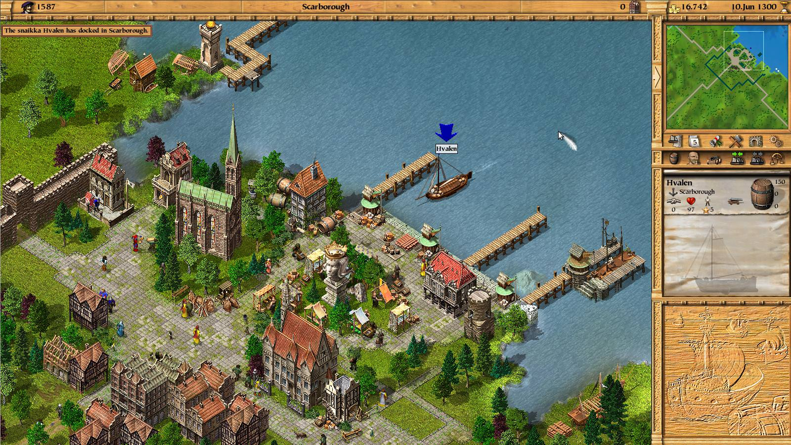

Am făcut cunoștință cu seria de jocuri Patrician grație LEVEL, _way back in the day_, cum s-ar spune. Al doilea joc din serie a fost oferit în versiune full împreună cu revista și încă am întipărită (pun... intended?) în minte imaginea coperții: roșu închis, cu „gajica” din Ground Control 2, oricine o fi fost ea, în rol principal.

Nu sunt mare amator de simulatoare economice, ba din contră — majoritatea mă plictisesc destul de repede. Am jucat însă cu mare plăcere Patrician 2, iar dacă fraza anterioară v-a oferit vreun indiciu, nu a fost datorită elementelor de simulator economic. Nu în mare parte. O să explic mai pe îndelete.

În articolul de față nu o să recomand Patrician 2, ci jocul imediat următor, Patrician 3. Dubios nume, deoarece nu este un sequel, ci pur și simplu Patrician 2 la un loc cu un expansion lansat oficial doar în Germania. Cu alte cuvinte, este Patrician 2 dar mai bun, iar eu habar n-am de ce Patrician 2 se vinde încă separat. În fine, nu cumpăra Patrician 2, sari direct la al treilea...

Patrician 3 își situează acțiunea în zona Mării Baltice în secolul XIV. După cum spuneam în introducere, este un simulator economic, iar când vorbești de Marea Baltică, secolul XIV și economie, nu te poți gândi decât la un lucru: Liga Hanseatică. Într-adevăr, jocul te pune în mijlocul acțiunii comerciale ale Hansei, și îți prezintă o hartă ce cuprinde principalele orașe Hanseatice.

Orașe ce sunt deosebit realizate, de ți-e mai mare dragul să te uiți la ele. Sprite-urile sunt desenate cu mare atenție la detalii iar stilul lor îmbătrânește foarte încet. Paleta de culori este potrivită pentru o zonă nordică dar este alcătuită în același timp din culori vii ce fac lumea să pară _welcoming_, în lipsă de alt termen. Chiar și în mijlocul iernii, un oraș acoperit de zăpadă te face să te simți binevenit și _warm inside_. Stilurile arhitecturale din regiunile diferite de pe hartă se reflectă în clădiri și este foarte plăcut să mergi din oraș în oraș doar că să observi diferențele.

Grafica este acompaniată de o coloană sonoră specifică perioadei, care variază în gen de la regiune la regiune. Nu o să auzi aceeași muzică în Cologne și Novgorod, spre exemplu. Track-urile individuale sunt scurte dar pline de personalitate, și complementează _welcoming_-ul de care am vorbit mai sus.

Chiar și în 2018, mi se pare că este unul din cele mai faine jocuri 2D izometrice. E greu să nu-ți placă un joc când ai în față o lume în care ți-ai dori să pășești în realitate, iar ăsta e motivul principal pentru care am petrecut atât timp cu el. Dar nu este singurul, deci să revenim...

La baza gameplay-ului se află comerțul. La începutul jocului iei rolul unui simplu vânzător, cu ceva bănuți și o corabie din cele mai ieftine. Fiecare oraș de pe hartă produce și consumă anumite bunuri, iar prețul pentru ele variază, astfel, de la oraș la oraș. Scopul tău imediat este să găsești rute profitabile între orașe. Cu alte cuvinte, să te folosești de corabie pentru a transporta bunuri pe care, pentru a ajunge undeva, trebuie să le cumperi ieftin, iar mai apoi să le vinzi scump. Imediat ce te pui pe picioare începi să te gândești la o a doua corabie. Încet-încet vei construi o adevărată flotă care să-ți susțină imperiul. Mecanicile de comerț sunt bine implementate și nu devin plictisitoare, mai ales că pot fi automatizate.

Pe lângă bani, va trebui să te preocupe și propria reputație, deoarece țelul tău final este de a avansa în rang social, lucru ce-ți va oferi din ce în ce mai multe beneficii. Aprovizionarea repetată a unui oraș cu bunurile de care are disperată nevoie îți va crește semnificativ reputația în acel oraș, dar ai și multe alte opțiuni, precum organizarea unor festivale sau sponsorizarea unor renovări sau extinderi ale bisericilor.

Pe lângă toate acestea jocul mai are și o mulțime de evenimente cu rol de diversiune sau _spice_: o hartă ce promite o comoară, un pirat care le face tuturor viața grea, un mariaj aranjat (foarte lucrativ, recomand!), un transport special etcetera. N-am zis nimic despre partea ce ține de construcții, sau că poți deveni primar în orașele din joc... Eh, nu vreau să divulg chiar tot :)



Sunt multe lucruri de plăcut când vine vorba de gameplay, și sunt sigur că inclusiv veteranii genului vor găsi ceva interesant în Patrician 3, chit că jocul se află undeva pe la mid-range ca complexitate. E un joc distractiv, îți oferă multă satisfacție când în sfârșit îți îndeplinești țelurile, iar promisiunile noilor posibilități și curiozitatea te fac să vrei mereu să ajungi la următorul nivel.

În final, pentru cei care vor ceva extra, romanul **Casa Buddenbrook** de Thomas Mann, premiat cu Nobel, descrie ultimele decenii de existență ale unei familii de negustori din Lübeck, principalul jucător atât în campania story-driven a jocului, cât și în Hansa reală. Acțiunea are loc în secolul XIX, perioadă în care Hansa prezentată în Patrician era de mult dispărută, dar este probabil cea mai apropiată lucrare literară de lumea din joc. [Cartea publicată de editura Rao](https://www.raobooks.com/product/casa-buddenbrook-3/) se poate găsi în toate librăriile, online sau nu.

Patrician 3 este disponibil atât pe [GOG](https://www.gog.com/game/patrician_3) cât și pe [Steam](https://store.steampowered.com/app/33570/Patrician_III/), iar comunitatea a lansat un [HD patch](https://steamcommunity.com/sharedfiles/filedetails/?id=382413909) pentru rezoluții mai mari decât suportă jocul original, inclusiv widescreen. ■