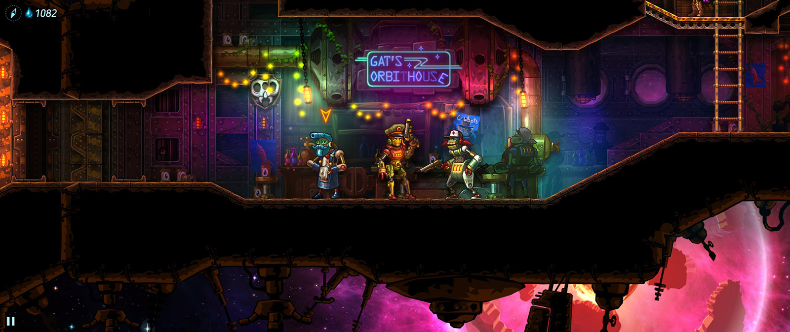

Inițial intenționam să scriu un review întreg despre **SteamWorld Heist**, dar am întrerupt jocul la un moment dat și n-am reușit să-l mai reiau. Aș vrea să revin la el odată, dar până atunci o să încerc să-l descriu într-un articol puțin mai scurt, pentru că merită jucat și recomandat.

Heist este al treilea joc **SteamWorld**, după **SteamWorld Dig** și **SteamWorld Dig 2**, dar nu are mare legătură cu acestea, dincolo de faptul că sunt plasate în același univers robo-steampunk, iar acțiunea se desfășoară după evenimentele din al doilea joc (plus câteva mici _easter eggs_ și referințe, dar care nu contează foarte mult). Se păstrează perspectiva 2D side-scrolling, stilul grafic și efectele sonore, însă avem o poveste nouă, personaje noi, acțiunea e plasată într-un setting diferit - în spațiu, nu în pseudo-vestul sălbatic de pe Pământ din primele jocuri - ba chiar și genul e diferit: acum avem de-a face cu un joc de tactică party-based pe ture, nu un platformer de minerit.

Acțiunea din Heist e centrată în jurul unui echipaj de roboți de pe o navă spațială (ÎN SPAȚIU), care trebuie să îndeplinească o serie de _heists_, să adune experiență și resurse pentru a învinge o facțiune adversă care are gânduri mari și deloc prietenoase. Apropo, „jafurile” din titlu nu înseamnă ceva _stealth_ sau planuri complicate gen Ocean’s Eleven. Sunt doar lupte și atât, acestea constituie miezul jocului, povestea fiind acolo doar pentru savoare și atmosferă. Practic, tot jocul e doar o înșiruire de misiuni pe care le deblochezi treptat, cu mici pauze pentru cumpărat echipament și recrutat personaje noi.

Luptele sunt așadar partea cea mai dezvoltată a jocului și folosesc un sistem foarte interesant, cu multe variabile ce deschid variate posibilități tactice. După cum veți vedea, jocul are o puternică sursă de inspirație în XCOM. Nava spațială servește rolul de „bază” în care locuiesc toate personajele pe care le recrutezi, din care îți formezi apoi câte o echipă înainte de fiecare misiune. Misiuni care încep prin andocarea la o navă inamică, ce constituie „nivelul” (a cărui configurație este generată aleatoriu), și în care avem de îndeplinit obiective diferite, cum ar fi, de exemplu, să găsim X unități de _loot_ sau să omorâm un anumit inamic (în practică, însă, asta înseamnă în general „omoară și culege tot ce poți”). Deplasarea se face pe rând cu fiecare robot, iar orice ușă deschisă poate dezvălui unul sau mai mulți inamici, moment în care începe lupta. Fiecare personaj are două puncte de acțiune care pot fi folosite pentru deplasare și/sau atac și există și un sistem de _cover_ (reprezentat grafic cu un scut plin pe jumătate sau în întregime) de care trebuie să ții seama atunci când îți închei tura.

La baza luptelor stă însă elementul cel mai original pe care îl aduce jocul, respectiv modul în care sunt funcționează armele. Modelul de damage este unul aproape în întregime matematic, nu există RNG pentru șansele de reușită, căci țintirea se face manual. Mai precis, atacul se execută controlând mâna robotului pentru a modifica unghiul de tragere (într-un mod asemănător, dacă vreți, cu un joc de biliard în care controlezi tacul pentru a stabili traiectoria bilei albe), astfel că reușita se bazează aproape exclusiv pe poziționarea personajelor și abilitatea de a estima traiectoria proiectilului. Acest sistem elimină frustrarea generată în XCOM de ratarea unei lovituri cu șanse mari de reușită și produce în schimb satisfacții mult mai mari atunci când îți reușește o lovitură la distanță mare.

La asta se adaugă o mulțime de modificatori care îmbogățesc substanțial oferta tactică. Există, cum scriam mai sus, un sistem de cover, iar personajele adăpostite complet sunt perfect în siguranță (cel puțin până este distrus adăpostul), căci suprafețele metalice resping proiectilele. Acest lucru poate fi folosit și în mod ofensiv: din moment ce proiectilele ricoșează fără să-și piardă din viteză, se pot executa lovituri complexe, cu două sau mai multe schimbări de direcție (din nou e validă comparația cu biliardul, unde avem loviturile cu mantinela). Există butoaie explozive aruncate prin nivel, care te pot ajuta sau te pot încurca. Plus abilitățile personajelor, care modifică suplimentar deplasarea și folosirea armelor. Plus zone de vulnerabilitate în construcția roboților, astfel că o împușcătură la picioare poate imobiliza un adversar, pe când una la cap mărește șansele de crit. Plus niveluri claustrofobice, care îți limitează zona de deplasare și te forțează să riști. Și tot așa.



Rezultatul luptelor e afectat și de armele folosite, care sunt fie găsite în niveluri, fie cumpărate de la unele magazine, sunt de mai multe categorii și pot avea, suplimentar, și unele atribute random. De exemplu, există arme cu lunetă, care au traiectoria marcată vizibil cu o rază laser, dar care necesită ambele puncte de acțiune pentru a fi folosite, sau lansatoare de rachete, cu traiectorie balistică, a căror explozie afectează o zonă mai mare. Avem și tipuri diferite de _damage_; de exemplu, cel de tip _piercing_ trece prin adversar și îl lovește și pe cel din spate. La acestea se adaugă și acele bonusuri random, care îți pot permite, de exemplu, să tragi încă o dată după ce ai omorât un inamic.

Sfârșitul misiunilor aduce puncte de experiență pentru roboții care au participat și diverse obiecte care pot fi vândute sau folosite (inclusiv multe pălării, care au strict rol cosmetic). Nu există _permadeath_, astfel că moartea unui personaj nu îl elimină din joc, dar experienţa şi loot-ul pe care le-a acumulat în misiunea respectivă sunt pierdute, ceea ce de multe ori e suficient de dureros.

Există și posibilitatea de a recruta personaje noi, cu abilități diferite, dar, din păcate, roboții pe care îi aduni pe parcurs sunt de nivel (mult) inferior celor pe care i-ai folosit până atunci. Ca atare, vei fi nevoit fie să-ți faci viața mai grea abordând misiuni noi cu personaje mai slabe, fie să rejoci niveluri din urmă pentru a le creşte şi pe acestea în nivel. Partea bună e că misiunile nu durează foarte mult şi poţi profita de ocazie şi pentru a testa mai multe arme sau alte obiecte. Între misiuni, poți discuta cu personajele pentru a mai afla mici bucățele din povestea lor, dar asta nu afectează în niciun fel gameplay-ul.



Pe lângă grafica foarte plăcută și detaliată și designul trăznit și plin de personalitate al roboților, pe care le puteți observa în imagini, un punct pozitiv îl primește și coloana sonoră. Pe lângă muzica plăcută din timpul luptelor, aceasta cuprinde și melodii de la formația Steam Powered Giraffe, dar care din păcate se aud doar în ecranul de start și în barurile din joc. Așa că vă recomand să ascultați [tot albumul pe YouTube](https://www.youtube.com/watch?v=RYkTgt5OSRw&list=PL5Z_Ad4LDKGS-14M-zuhWdXkUaqO-TejU&index=10).

Ca să nu mă mai lungesc foarte mult, avem un joc care excelează pe partea tactică, cu misiuni relativ scurte, bune de jucat inclusiv în pauzele dintre alte jocuri, niște roboți cu personalitate și muzică plăcută, ce compensează din plin povestea insuficient dezvoltată și repetitivitatea misiunilor. ■