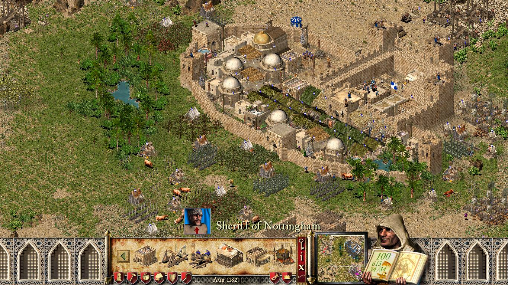

Firefly pregătesc de ceva vreme noul joc din seria Stronghold, iar dacă e să credem ce ne spun pe YouTube, așteptarea se apropie de final. Astfel că acum e un moment numai bun să aruncăm o privire asupra ultimului lor joc ce s-a bucurat, predominant, de succes: Stronghold Crusader.

Lansat imediat după originalul Stronghold, este un spin-off plasat în estul mijlociu, în perioada cruciadelor. Bineînțeles, asta înseamnă o gramadă de conflicte între liderii Europei și cei ai Estului Mijlociu, iar în joc sunt prezente inclusiv personaje autentice precum Richard Inimă de Leu și Saladin.

În timp ce Stronghold a pus construcția și management-ul unui castel în plan principal, Crusader a preluat elementele respective și le-a pus la baza unui gameplay mult mai alert, concentrat pe război în câmp deschis — sau după cum este numit de joc, skirmish mode. Și credeți-mă, veți avea parte de foarte mult război în Crusader. Un război rapid dar care, ajutat de mecanicile bine implementate, este foarte distractiv. Din această cauză, unul din modurile în care prefer să descriu Crusader este „Quake-ul RTS-urilor”. Totuși, dacă din ceva motiv nu vi se pare suficient de intens, în ziua de azi jocul vine la pachet cu expansion-ul Extreme. Printre altele, acesta mărește numărul maxim de unități ce pot fi recrutate în același timp și introduce _godlike_ powers — pentru și mai mult haos pe câmpul de luptă.

Dar nu poți sa porți războaie sau să ai un castel impozant fara o economie sănatoasă. Crusader îi pune la dispoziție jucătorului o varietate de industrii ce se folosesc ori de resursele naturale ale hărții, ori de produse rezultate în urma activității într-o altă industrie. Spre exemplu, fierul proaspăt extras de către mineri este folosit mai departe de meșteri producători de arme și armuri. O fermă de vaci îți va asigura atât alimente pentru cetățeni (brânzeturi) cât și un stoc de piei pentru armuri, presupunând că ai construit o tăbăcărie. Un han va fi foarte benefic în a-ți face supușii fericiți, dar pentru a-l aproviziona cu bere va trebui să construiești ferme de hamei, iar apoi câteva berării. Adevărate lanțuri industriale, ce mai.

Pentru partea de război, jucătorul are la dispoziție atât trupe europene (de la arcași până la cavaleri călăre) cât și mercenari specifici orientului mijlociu (de la sclavi înarmați cu torțe până la redutabilii arcași călăre). Mașinăriile de asediu variază de la aparent banalul dar foarte utilul scut anti-săgeți până la catapulte capabile să demoleze castelele inamice, ori sa împrăștie boli lansand cadavre de vaci. Trupele sunt bine echilibrate și oferă multe posibilități tactice, iar combat-ul în sine este, după cum am menționat și mai sus, extrem. Este greu să descrii senzația pe care o ai când vezi și auzi sute de soldați în luptă melee, mai ales dacă se strecoară printre ruine de ziduri. Jocul nu ia lucruri precum fizica prea în serios, spre beneficiul său. E o nebunie totală, ajutată și de soundtrack-ul antrenant.

Cast-ul din joc e reprezentat de un număr mare de lorzi controlați de AI, o parte specifici Europei, ceilalți Estului Mijlociu. Fiecare are propriul portret animat, propria voce, și propria personalitate ce influențează atât modul în care își va construi castelul, cât și agresivitatea față de inamici, sau dispoziția de a ajuta un aliat. Neobișnuit pentru un astfel de joc, AI-ul pare a fi reprezentat de personaje reale, care își îndeplinesc rolul de înlocuitor al jucătorilor în single-player cu brio.

Iar pentru jucătorii ce vor o mică pauză, pe lângă mai sus menționatul „skirmish mode”, Crusader vine la pachet atât cu o campanie istorică scriptată cât și cu un build mode în care ești liber să-ți construiești castelul perfect fără grija asediilor.

Pentru critici și jucători, Crusader a fost la vremea lui ceva mai puțin apreciat decât predecesorul. Pentru mine însă, Crusader este Stronghold în forma cea mai șlefuită, și nici un alt joc Firefly nu a reușit să se apropie de el — nici măcar sequel-ul Stronghold Crusader 2, de altfel un joc bun, dar prea „clunky” comparativ cu primul, și cu personaje prea anemice.

Stronghold Crusader, împreună cu celelalte jocuri din serie, poate fi cumpărat atât de pe [GOG](https://www.gog.com/game/stronghold_crusader) cât și de pe [Steam](https://store.steampowered.com/app/40970/Stronghold_Crusader_HD/). ■

