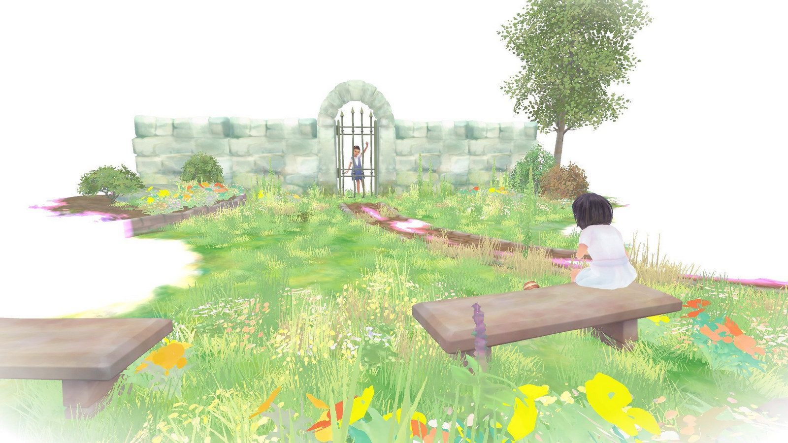

Ai încercat vreodată să mergi cu ochii închişi? E terifiant! Încerci să te agăți de fiecare sunet, cauți să detectezi cu mâinile posibilele obstacole din cale și, oricât ai încerca, e imposibil să nu te alegi cu câteva lovituri. Dar dacă ai fi lipsit de vedere cu adevărat? Beyond Eyes explorează această premisă inconfortabilă şi te poartă într-o călătorie inițiatică în care fiecare pas este, la propriu, un pas în necunoscut.

Jocul este, în esență, un walking simulator, ce atrage mai ales prin originala grafică în acuarelă, şi care te ţine conectat la poveste făcându-te să trăieşti bucuriile, temerile, reuşitele sau dezamăgirile fetiţei oarbe pe care trebuie să o ghidezi. Este adevărat că există momente când te gândeşti că povestea ar fi putut fi mai ramificată sau cu mai multe provocări, dar, cum jocul este scurt, iar finalul emoţionant şi satisfăcător, ajungi să apreciezi simplitatea şi sensibilitatea abordării. Cumva, mesajul său a fost mai bine transmis prin intermediul acestei formule liniare şi minimaliste. Chiar și ritmul lent (uneori chiar frustrant de lent) contribuie la experiență - totuşi, cât de repede se poate deplasa un orb, care se teme de orice pas făcut în afara zonei de confort?

<iframe width="560" height="315" src="https://www.youtube-nocookie.com/embed/xTVXH3VTV5w" frameborder="0" allow="accelerometer; autoplay; encrypted-media; gyroscope; picture-in-picture" allowfullscreen></iframe>

Personajul rămas fără vedere, în urma unui accident, este micuţa Rae. După o perioadă tristă, de acomodare cu noua ei situaţie, fetiţa găsește în pisica Nani, care hoinărește ocazional în jurul casei ei, o alinare pentru zilele terne pe care a ajuns să le petreacă doar în spaţiul cunoscut şi sigur şi care o face să uite de handicapul său, ajutând-o să se folosească cât mai mult de celelalte simţuri atunci când cercetează grădina în căutarea ei.

Astfel că, atunci când Nani lipseşte o perioadă mult prea lungă, Rae îi duce dorul şi, neputându-se împăca cu ideea că ar putea s-o piardă, îşi ia inima-n dinţi şi porneşte în căutarea ei. Odată trecută de poarta casei, i se deschide în faţă o lume a necunoscutului şi a pericolelor.

Grafica este fermecătoare şi contribuie semnificativ la atmosfera jocului. Lipsa de vedere a fetei nu este redată ca o noapte continuă, ci dimpotrivă, ca o pânză albă, imaculată, în care fiecare cadru este un tablou în acuarelă ce prinde contur sub ochii tăi. Rae păseşte ca prin aer, căci mediul înconjurător se materializează pe măsură ce fetiţa identifică elementele componente ajutându-se, pe de o parte, de simțul auditiv, tactil și olfactiv, şi pe de altă parte de amintirile vizuale din vremea când putea vedea. Un ciripit face să apară în depărtare copacul pe care stau păsările, clipocitul unei ape dezvăluie marginea unui pârâu, mirosul de pâine proaspătă conduce spre magazinul din oraș, iar cel de gaze de eșapament o atenționează că în zonă sunt mașini. Rae înaintează încet, căci trebuie să fie atentă la tot, şi uneori pipăie obiectele de care se apropie, ce prind şi ele contur sub atingerea fetiţei.

Spre final, lucrurile se complică puţin, căci apariția ploii face ca punctele de reper fixate de fetiță să dispară mai repede și e absolut necesar un bun simț al orientării.

În plus, după cum vă puteți închipui, partea sonoră are un rol covârșitor în atmosfera jocului, iar pe lângă ciripitul păsărelelor, batăile de clopot sau huruitul motoarelor, intervin în desfăşurarea poveştii scurte și atractive pasaje instrumentale, cum sunt cele intercalate într-o piesă de teatru pentru a anunţa o scenă mai dramatică ori mai înduioşătoare.

Gameplay-ul – atât cât poate fi vorba despre „gameplay” în sensul tradițional - este redus la minimum. Nu există dialoguri în joc, iar puzzle-urile sunt și ele aproape absente. Parcursul lui Rae este o versiune foarte simplificată a unei realități posibile. Ajungi uneori să rătăcești pe câmp sau pe străduțe și nu ai idee ce trebuie să faci mai departe, iar asta îţi spune, de fapt, că nu ai acordat suficientă importanță unor puncte de reper şi unor secvenţe declanşate în anumite părţi ale jocului (scurte amintiri), ce îi sugerează lui Rae că Nani ar fi trecut prin acele locuri.

Din când în când, fetiţa interacţionează cu unele personaje sau obiecte, iar acest lucru este, adesea, esenţial pentru a înainta în poveste. Uneori trebuie sa treacă de un gard ce delimitează o zonă, alteori îi stă în cale câte un câine de care trebuie să afle cum ar putea trece, ba chiar este nevoită să detecteze un camion cu pâine proaspătă într-un mic şi animat oraş.

Până și modul în care este realizat controlul are un rol important. Jucătorul nu o „controlează” propriu-zis pe Rae, ca pe un personaj dintr-un joc tradițional, ci mai degrabă o ghidează prin lumea jocului. Diferența e subtilă, dar importantă, căci personajul de pe ecran are propriile trăiri și emoții, care sunt transmise vizibil către jucător. Astfel, sunt momente în care Rae descoperă că pericolul pe care şi l-a imaginat bazându-se pe auz sau miros este, în realitate, ceva inofensiv, şi atunci râde sau scoate o exclamaţie de uşurare. Un cârâit de cioară sau lătratul unui câine o sperie, iar atunci tresare, oftează şi adoptă o poziţie defensivă – cu braţele încrucişate şi capul aplecat – şi nu se mai clinteşte din loc, refuzând să se mai supună indicațiilor jucătorului.

Jocul este scurt – poate fi terminat în 3-4 ore dacă ai răbdare să descoperi singur elementele ce compun călătoria aproape inițiatică a personajului. Povestea, continuată periodic prin câteva linii de text pe parcursul jocului, apelează permanent la emoţiile tale şi te face să îţi pese de Rae şi să trăieşti alături de ea fiecare tresărire, senzaţie, întâmplare.



Prin lentoare, construcția neobișnuită a graficii și simplitatea gameplay-ului, Beyond Eyes nu este un joc convențional. Te face să rupi puțin ritmul, să pășești într-o lume recreată pas cu pas (ce potențial ar avea o versiune VR!), în care personajul tău are un handicap, iar scopul jocului nu este în principal acela de a te distra, de a-ți testa reflexele, ci acela de a te face să te implici emoțional, de a-ți testa răbdarea, empatia și capacitatea de a te bucura de lucruri mărunte, precum atingerea unei flori ori ciripitul păsărelelor.

Mie finalul mi-a adus lacrimi în ochi şi am apreciat alegerea realizatorilor de a încheia călătoria într-un mod sugestiv, nu explicit. Dacă căutarea lui Rae are un final pozitiv sau nu, nici nu mai contează, pentru că fetiţa a învăţat ceea ce era important pentru ea – să îşi depăşească temerile și să înveţe să se descurce singură. Viața merge mai departe, pare să spună jocul, iar prietenii, indiferent că sunt oameni sau necuvântătoare, ne ajută să ne deschidem și să trecem peste momentele triste. Faptul că rămâi cu ceva după aventura lui Rae, așadar, este cel mai mare merit al lui Beyond Eyes.

Mai ales pentru pentru asta, dar şi pentru grafica deosebită şi povestea emoţionantă, este recomandat tuturor categoriilor de vârstă. ■

{}
Beyond Eyes, creaţie a game-designerului Sherida Halatoe, are o sursă de inspiraţie extrem de personală. Sherida şi-a pierdut tatăl la 10 ani, însă din dureroasa experienţă a avut şi de învăţat. Prin Rae (prescurtarea numelui său), povestea sa poartă şi un mesaj inspiraţional: _„Cam asta am vrut să transmit, faptul că în viaţă se întâmplă şi lucruri dramatice şi trebuie să concentrăm mai degrabă pe modul în care trecem peste ele, nu neapărat să încercăm să le prevenim. O astfel de poveste este Beyond Eyes, dar cu un decor ceva mai fantastic”_, a explicat ea.

Sherida şi-a dorit să trezească emoţiile jucătorului prin ceea ce exprimă personajul pe ecran, iar asta a putut fi realizat prin intermediul culorii, dar şi a ritmului lent de joc.

_„Deseori, într-un joc, nu te prea poţi identifica cu protagonistul. Multe personaje sunt insipide, nu le desluşeşti motivaţiile. Sunt făcute să se muleze pe mai multe tipuri de caractere. Pentru mine, protagonistul trebuie să fie precum o persoană reală, pentru a vedea clar ce impact emoţional au deciziile tale asupra acestuia şi să nu fii tentat pur si simplu să-l arunci într-o râpă şi să o iei de la capăt. De exemplu, dacă creezi o situaţie inconfortabilă pentru Rae, ea se va manifesta vizibil – oamenii se vor simţi vinovaţi într-o astfel de situaţie, pentru că în jocuri, în general, nu mai stai să te gândeşti ce s-ar întâmpla dacă ai face aşa ceva unei persoane reale. Însă dacă te identifici cu personajul, experienţa de joc este mai bogată”_, a mai spus creatoarea jocului.
{}
