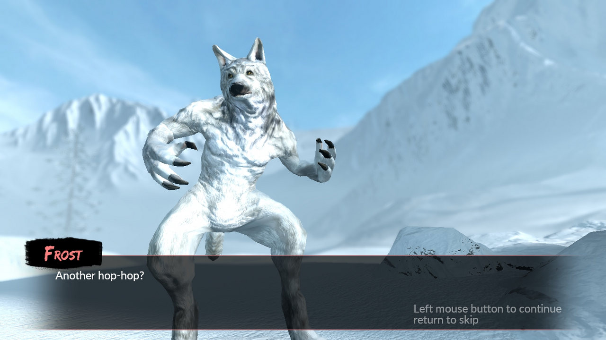
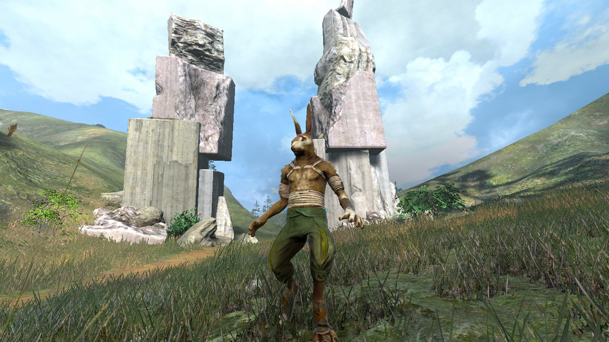

"Bottom, be strength and warning and speed for ever and save the life of your master. Be it so!” And as he spoke, El-ahrairah’s tail grew shining white and flashed like a star; and his back legs grew long and powerful and he thumped the hillside until the very beetles fell off the grass-stems. He came out of the hole and tore across the hill faster than any creature in the world. And Firth called after him: „El-ahrairah, your people cannot rule the world, for I will not have it so. All the world will be your enemy, Prince with a Thousand Enemies, and whenever they catch you, they will kill you. But first they must catch you, digger, listener, runner, prince with the swift warning. Be cunning and full of tricks and your people shall never be destroyed."

Am urmărit progresul lui Overgrowth pe parcursul mai multor ani, devenind într-o vreme un obicei să vizitez blogul și să văd adaosurile, îmbunătățirile și ideile ce prindeau contur și viață în fiecare săptămână, dar, cum se întâmplă cu majoritatea lucrurilor care-mi prezintă interes, mi-am pierdut treptat entuziasmul – o deficiență personală de altfel – scăpându-l din vedere până l-am văzut pe lista lui Cristan.

Nu știam mare lucru despre predecesorul său, **Lugaru**, doar că era un indie 3rd person action adventure cu iepuri antropoizi ce apărea din când în când în pachetele de pe Humble Bundle. Cei de la Wolfire au fost în schimb destul de generoși, highlight-urile campaniei din Lugaru fiind jucabile în Overgrowth ca o campanie separată față de cea din Overgrowth, iar cum eu am văzut în asta o ocazie ideală de a mă pune la punct cu firul narativ, am început cu campania din Lugaru.

Voi aluneca cu patinele interpretării până pe tărâmul nădejdilor: la prima vedere, lumea din Lugaru ar putea fi parte a mitologiei lapine din [Watership Down](https://en.wikipedia.org/wiki/Watership_Down), înlocuindu-l pe El-ahrairah, cu iscusința și vicleniile sale, cu Turner, un iepure care, împins de hazardul evenimentelor desfășurate în absența sa, nu refuză să se implice în acțiuni ce escaladează treaptă cu treaptă violența. În sine, campania din Lugaru e simpluță - un drum lung spre răzbunare și gratificare imediată. Ce mi s-a părut oarecum interesant e modul fără rețineri în care se desfășoară evenimentele, Turner transformându-se într-un agent al Iepurelui Negru, neîngăduind niciunui responsabil să scape urgiei sale, fiind satisfăcut doar după încheierea definitivă a suveranității canidelor.



**Overgrowth** continuă povestea lui Turner. La câțiva ani după genocidul din Lugaru, căutându-și liniștea, nimerește în White Flags, un sat ce urma să fie luat ostatic de bandiți, răpindu-i locuitorii pentru scopuri oculte și descotorosindu-se de orice iepure care opunea rezistență. Mai mult silit de circumstanțe, Turner preia din nou frâiele tumultului în care fusese aruncat și începe o nouă aventură, puțin mai lungă decât precedenta.

Luptele sunt sarea și piperul din Overgrowth, în cele mai multe cazuri fiind scurte și intense. Elementele de platforming și explorare sunt, în cea mai mare parte a campaniei, undeva într-un plan secund. La fel ca-n reclama pentru Vytautas, există două moduri de a trece prin Overgrowth: lupte fățișe ca-n „Fists of Fury” sau mai elegant, prin vicleșuguri de nevăstuică, furișându-te de colo până colo prin toate cotloanele doar-doar nu ți-or vedea inamicii urechile ițindu-se de după stânci și bolovani și sucind gâturi sau împungând jugulare. E un sentiment de satisfacție aparte să te scapi de _elili_ pe ascuns ca un adevărat ninja, stil de joc chiar încurajat în anumite secțiuni pentru a evita corvoada luptelor cu mai mulți adversari deodată. Fragilitatea inamicilor își află reciproca în a lui Turner, găsindu-mă lesne în situații neplăcute, aruncat la pământ cu o schemă de judo și primind fără opreliști picioare-n mufă până la „press any key to restart”. La fel de lesne a fost să pic în păcatul încrederii de sine și mândriei, mai ales în bătăile cu felinele sau protectorii lor canini, îngâmfare care nu de puține ori m-a dus la un reload prematur.

Dificultatea luptelor nu variază foarte mult indiferent de actorii implicați și nici de echipamentul pe care-l dețin. Într-adevăr, un _broadsword_ constituie un argument foarte puternic în mai toate luptele, transformându-l pe Turner într-un „one hit wonder” dar, cum am menționat mai devreme, și reversul e adevărat. Să nu fiu înțeles greșit, nu e un joc tocmai facil, cu atât mai mult cu cât inamicii sunt de regulă concentrați în aceeași proximitate geografică - șansele de a te face simțit sau văzut cresc vertiginos oricât de tare te-ai strădui să rămâi nedetectat, iar când sar dârlăii pe tine poți să fii cât vrei de schemos, că nebătut tot nu scapi. De altfel, șifonarea fizică e singurul indiciu cu privire la nivelul de damage primit, jocul fiind lipsit de HUD.

Cu toate acestea, echilibrul ăsta de forțe și fragilitate este spulberat când apar lupii, care sunt o adevărată pacoste - bestii masive cu colți și gheare de oțel, cu o statură impunătoare, care eclipsează orice iepure. Alergători de anduranță ca niște adevărați maratoniști, sunt și mai rapizi ca oricare altă creatură. Neîndurători în tehnicile de luptă normale sunt aproape de neclintit chiar și la loviturile de sabie. Bașca, în afară de două situații clare, nici prin surprindere nu pot fi luați. Am descoperit un singur mod eficient de a-i omorî, în urma unui repetir al ultimului episod din Lugaru, care în mod surprinzător nu m-a dus la frustrare în ciuda numărului mare de încercări. Lupta cu Alfa a fost acerbă, lipsită de grație sau onoare, dar lucrul care m-a impresionat cel mai mult n-a fost nici victoria și nici loviturile căpeteniei, care erau atât de violente și puternice încât te aruncau în stâncile sau clădirile aflate hăt! la câțiva metri de confruntare, ci faptul că primeam damage de două ori: o dată de la lovituri, iar apoi de la izbituri.



Spuneam mai sus că elementele de explorare și platforming sunt lăsate într-un plan secund, dar aceasta e oarecum în beneficiul jocului. Platforming-ul e destul de ciudat, distanțele care pot fi străbătute într-un singur salt depinzând strict de cât de mult ții apăsat pe tasta de spațiu, astfel că e ușor să judeci greșit distanțele și să sari înainte sau după destinație. Dar asta nu e o problemă în sine, ci faptul că anumite secțiuni trebuie parcurse cu _wall jumping_, iar prima zonă de contact este aproape supusă hazardului, depinzând de unghiul de atac, viteza de deplasare, secvențialitatea săriturilor, noroc, etc, etc. Ce-i drept asta se întâmplă cu preponderență în doar două zone, care pot deveni enervante, dar care pot fi depășite cu un pic de preseverență, mai ales că jocul face un punct de salvare temporar în apropierea zonelor respective și nu trebuie reluată o secțiune mai mare a episodului. E totuși destul de enervant ca reușita unei secțiuni mai complicate să fie zădărnicită la final de un perete elastic din care Turner ricoșează către ecranul de loading. Un lucru demn de menționat ar fi faptul că zonele cu sărituri, demarcate de zgârieturi, au o anumită logică în spatele lor – Turner nu este un temerar, un prim explorator al unei zone, ci doar urmează căi deja cunoscute, marcate de trecerile altora dinaintea lui.

Explorarea, în schimb, e lăsată mai tare de izbeliște, deoarece, așa cum am menționat anterior, interesul e să te scapi de inamici, nu să te bucuri de floră, arhitectură sau formațiunile reliefului, dar nu te oprește nimeni dacă vrei s-o arzi aiurea în plimbări scenice până la confruntare. Din câte am observat, limitările engine-ului sunt destul de elegant mascate, neîntâlnind ziduri invizibile care să-mi blocheze avansul, cei de la Wolfire preferând să folosească o metodă mai naturală și au utilizat limitele geografice date de adâncimile apelor sau urcușurile prea abrupte.



Pe parcursul lui Overgrowth, Turner întâlnește fel de fel de personaje cu care interacționează doar în _cut-scenes_, unele ostile, altele prietenoase dar, fie din cauza timpului mult prea scurt petrecut în preajma lor, fie din cauză că nu au propria voce, ele dispar foarte repede din conștiință. În afară de fauna lapină, celelalte viețuitoare arată de-a dreptul înfiorător, cel mai probabil din cauza numărului redus de poligoane și a cozilor, prea rigide și prea groase, semănând mai degrabă cu cozile dinozaurilor. Cum spuneam mai sus, în absența HUD-ului, mi se pare o idee bună ca nivelul de damage să aibă o reprezentare vizibilă în aspectul fizic al personajelor, dar în practică arată destul de rău, par doar niște linii roșii desenate pe deasupra corpurilor.

În ce privește partea audio, în absența voice acting-ului sau a sunetelor ambientale cât de cât remarcabile, merită menționată muzica, care e plăcută, relaxantă, sporind senzația de lume necunoscută, dar e puțină și devine repetitivă în ciuda campaniilor destul de scurte.

## ***

Există o seamă de neajunsuri care însoțesc fiecare lucru bun pe care-l face jocul. Deși dă dovadă de idei foarte bune pe alocuri, ele sunt implementate amatoricește. De exemplu, acțiunea jocului se desfășoară într-o regiune foarte vastă, ce cuprinde atât o parte a insulei Lugaru, cât și continentul apropiat Preuwym. Engine-ul, din câte am văzut, e capabil să construiască zone de mari proporții, dar creatorii au preferat să așeze antagoniștii într-un areal restrâns pentru a facilita terminarea episoadelor (destul de scurte în anvergură), iar succesul și posibilitatea de a progresa în poveste depind, în mare parte, doar de masacrarea inamicilor, care n-am văzut să depășească un număr de 7-8 pe hartă. Astfel că, deși lumea e mare, structura episodică a nivelurilor ajunge să fragmenteze foarte mult narațiunea, iar spre sfârșitul jocului nici nu mai știi cum a ajuns Turner până în punctul respectiv și nici ce l-a motivat să continue.

Apoi, în ciuda încurajărilor jocului de a nimici inamicii în mod silențios, sistemul e implementat defectuos. Au fost cazuri în care, ciucit după o piatră cu urechile vizibile, am fost depistat înainte să pot schița vreun gest, momente care m-au bucurat – creatorii și-au dat silința, mi-am zis, ostenindu-se să intre într-un detaliu atât de mărunt încât să creeze un sistem de stealth cât de cât credibil, folosindu-se de trăsăturile morfologice ale protagonistului în detrimentul player-ului. Dar speranțele mi-au fost năruite ulterior, când nu de puține ori m-am furișat într-o tabără mergând perpendicular pe ruta gărzilor, omorându-le camarazii ce se aflau la câțiva pași distanță de ele.



În aceeași notă, un alt lucru care mi-a plăcut a fost faptul că, atunci când se apropie de moarte în timpul luptelor, unii antagoniști vor fugi din calea loviturilor, întorcându-se doar dacă au suportul camarazilor sau încrederea dată de o armă. Dezamăgitor e însă că, dacă se găsesc în proximitatea unei arme căzute din mâinile cuiva, vor ignora orice altceva și vor încerca s-o recupereze, chiar dacă Turner e la un strănut distanță de brațele morții.

Ca o paranteză, e foarte ușor să faci antijoc dacă deții un pumnal, chiar și în prezența mai multor inamici - fiind o armă ușoară, viteza cu care lovești e mult superioară oricărei alte arme, chiar și pumnilor goi, așa că nu te oprește nimeni să alergi și să clicăi ca bezmeticul până ce-i împachetezi pe ceilalți.

Voiam să mai fac o remarcă aici și să spun că ultima luptă e pe principiul altor jocuri care te trec prin ciur și prin dârmon în penultima luptă, ca mai apoi să dezamăgească în confruntarea finală; personal am reușit să închei socotelile din prima încercare cu două lovituri: un picior bine plasat și o crestătură de sabie pe piept. Dar lucrurile au stat altfel după ultimul update, situația schimbându-se, iar eu m-am găsit în postura de receptor în același scenariu.

Am rămas nedumerit și puțin confuz și de ultimul episod și deciziile aferente de game design. Făcând abstracție de lumea ciudată în care se petrece jocul, sunt dispus să accept o mulțime de lucruri, dar cum poate fi explicată existența unei cascade pe o „insulă zburătoare” ce nu depășește câțiva ari ca suprafață? Cine sunt făuritorii imenselor lanțuri ce atârnă între stâlpii insulei, când lumea lui Overgrowth e la un nivel rudimentar de dezvoltare?

## ***

Overgrowth e un animal ciudat, care în forma actuală pare mai mult un _tech-demo_ dedicat modderilor. Implicarea terților pentru crearea de noi aventuri în lumea lui îmi dă speranță pentru viitorul jocului, chiar dacă niciodată nu va ajunge la anvergura unui **Mount & Blade**.

Dezvoltat pe un motor grafic construit de la zero, oferind oportunități comunitații de modderi, plasat într-o lume bizară încărcată de potențiale mituri, dar păstrate undeva pe fundal, combustibil pentru imaginație, cu bestii antropomorfe în rol de personaje ale căror caracteristici nu se limitează doar la estetică și lupte desprinse din „Way of the Dragon”, Overgrowth ar fi putut fi un joc foarte bun, dacă ar fi apărut în urmă cu un deceniu. Dar problemele, așa cum sunt, nu covârșesc o experiență de joc aproape unică, care m-a determinat să-i rejoc cu drag câteva episoade încercând fel de fel de abordări și pierzându-mă încet-încet în ciudata și originala lume pe care o creează. ■

{}
### Mods
În momentul de față au fost adăugate două campanii adiționale pe lângă cele ale lui Lugaru și Overgrowth: **Therium** și **Drika’s Story**. Am reușit să termin Therium – un mod mai lung, mai greu, plasat într-o zonă mult diferită de experiența din Overgrowth, care utilizează mituri și legende ale Preuwym-ului și te pune să pășești într-un tărâm intrat în negurile istoriei continentale. Ca biet pion, sub sceptrul unui adevăr închipuit, ești împins și manipulat de două facțiuni antagonice. Drumurile te duc către tărâmurile morții și înapoi cu ajutorul unor portaluri ce vor funcționa ca factori de decizie pentru alegerile jucătorului. Therium are cinci finaluri posibile și o structură narativă arborescentă potrivindu-se ca o mănușă lumii lui Overgrowth, dar scriitura e întortocheată și cam slăbuță, complicată în mod inutil să ducă în spinare toate finalurile.
{}