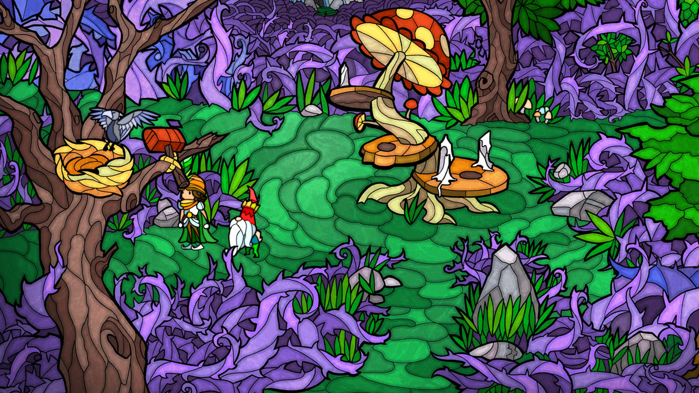
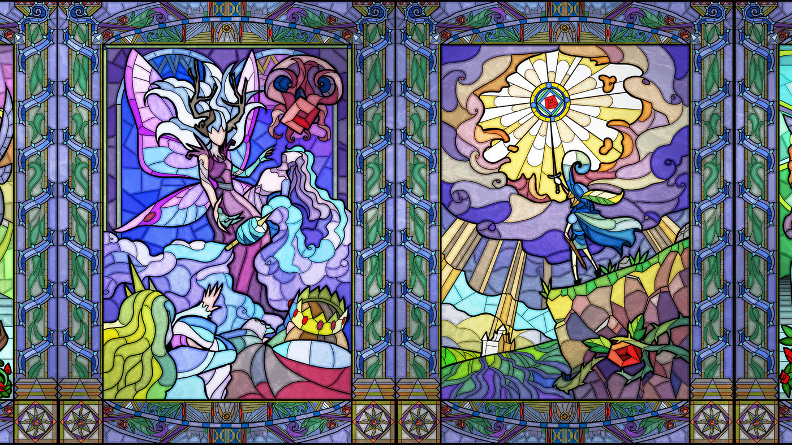

Mi se întâmplă de multe ori să încep un joc numai datorită graficii lui deosebite. Am făcut asta şi cu Little Briar Rose, pentru că, de când am dat cu ochii de culorile puternice şi stilul grafic de tip vitraliu, a fost dragoste la prima vedere. M-a atras însă şi ideea de a reveni în lumea basmelor, cu un prinţ curajos şi chipeş, gata să facă tot ce este nevoie pentru a salva prinţesa.

Intriga este binecunoscută: Frumoasa Adormită (Briar Rose în versiunea fraţilor Grimm) este blestemată de ursitoarea cea rea şi, la primul contact cu vârful unui ac, cade într-un somn adânc împreună cu toţi cei din castel. Vraja poate fi ridicată doar prin sărutul dragostei adevărate. Jocul începe cu o voce caldă, care-ţi face rezumatul poveştii, după care te trezeşti la intrarea într-o pădure de spini, controlându-l pe prinţul Stephen într-un adventure point and click clasic.

<iframe width="560" height="315" src="https://www.youtube-nocookie.com/embed/wFFKtb0OU_Q" frameborder="0" allow="accelerometer; autoplay; encrypted-media; gyroscope; picture-in-picture" allowfullscreen></iframe>

După ce primeşti câteva indicaţii de la o mică zână înaripată, intri în pădurea în mijlocul căreia tronează o ciupercă magică. Aceasta este poarta spre castel. Însă pentru a o activa, trebuie să duci la bun sfârşit o serie de sarcini date de năstruşnicele creaturi ale pădurii – pitici, sirene şi tritoni, goblini şi zâne.

Misiunile încredinţate de aceştia nu te vor pune prea tare la încercare, dar sunt variate şi distractive - o combinaţie de dialoguri, colectare de obiecte, puzzle-uri de logică, de imagine şi câteva puzzle-uri labirint. Trebuie însă să fii însă foarte atent la ce ţi se spune, să epuizezi toate liniile de dialog şi să combini toate elementele în mod corect, pentru că altfel, chiar dacă misiunea ţi s-a părut uşoară, ai mari şanse să o ratezi. Cu grafica ultra colorată, trebuie să ai grijă și să nu vezi unele obiecte din decor de care ai nevoie, însă de fiecare dată când te blochezi pe undeva ai posibilitatea de a reveni la ecranul de început pentru a primi un indiciu subtil de la zână.

Ce se întâmplă totuși dacă dai chix şi nu îndeplineşti dorinţele locuitorilor pădurii magice? Păi, nu mare lucru, doar că aventura prințului tău se termină pentru că este transformat într-una dintre creaturile ce populează pădurea, urmând să reîncepi jocul cu altcineva. Deci, dacă ai apucat cumva să te ataşezi de personajul tău, dacă ţi-au plăcut culoarea părului său, ori pana de la pălărie, ghinion! O vei lua capăt cu Philip, Selim, ori Charles, fiecare cu altă înfățișare și îmbrăcăminte. Din fericire, nu trebuie să reiei misiunile rezolvate deja. Vei continua de unde te-ai oprit cu nefericitul predecesor.

Acesta a fost unul dintre cele mai amuzante aspecte ale jocului pentru mine. La un moment dat, nu-mi mai făceam aşa multe griji dacă n-o să combin bine ingredientele pentru supa goblinilor, ori dacă n-am ales bine accesoriul pentru rochia zânei, pentru că mă distra să văd cum prinţul meu îngroaşă rândurile tritonilor sau ale goblinilor.

Gameplay-ul îţi dă ceva mai mult de furcă când vine vorba de pescuit, o activitate pe care nu o poţi ocoli dacă vrei sa treci de unele misiuni. Trebuie să muncești bine butoanele mouse-ului pentru a extrage din lac peştele sau obiectul dorit, iar acest lucru te va face de multe ori să exclami lucruri pe care prinţesa nu ar fi prea încântată să le audă (dar e în regulă, cât timp eşti încă pe malul lacului, iar ea e încă adormită).

Revenind la grafică, mi-a plăcut modul minimalist, dar expresiv, în care au fost desenate personajele. Prinţul are o faţă rotundă, ochi mici, picioare subţiri şi o pălărie supradimensionată, pe măsura curajului, probabil. De altfel, toate creaturile sunt compuse din detalii simpatice: piticii, de care se leagă cea mai haioasă dintre misiuni, au fesuri ascuţite şi lăsate pe ochi, zânele au coafuri extravagante, goblinii sunt verzi ca iarba, botoşi, deloc arătoşi şi nici foarte manieraţi.



Dialogurile nu sunt din cale-afară de amuzante, dar susţin în mod plăcut atmosfera de poveste, ferindu-se de cuvinte sau exprimări moderne. Avem chiar şi o poezie reuşită în scenariu, parte a unei combinaţii amoroase la care prinţul trebuie să contribuie înainte de a-şi găsi şi el fericirea. Plăcută şi jucăuşă este şi muzica, ce-şi schimbă în mod surprinzător tonul în scena de încheiere, devenind modernă şi antrenantă. Sfârşitul jocului îţi mai rezervă câteva momente distractive, pentru că, aşa cum vei putea constata lângă patul prinţesei, indiferent cu ce prinţ ai reuşit să treci peste toate obstacolele pentru a ajunge să o săruţi, doar unul singur va fi cel ale cărui buze vor rupe blestemul. Aşa că trebuie să îi iei în spinare pe toţi şi să-i arunci în „apa vie” a fântânii castelului, pentru a-i readuce la forma umană şi a vedea care din ei va putea oferi prinţesei sărutul dragostei adevărate.

Chiar dacă jocul nu a venit cu o perspectivă mai originală asupra poveştii clasice, am apreciat design-ul şi povestea amuzantă, deloc complicată, dar suficient de bogată în detalii pentru a te ţine în joc. Am petrecut, cred, mai mult timp decât era necesar în pădurea de spini mov-liliachii şi iarba în diferite nuanţe de verde. Şi chiar dacă pescuitul a fost, pe alocuri, iritant, am revenit cu plăcere pe marginea lacului cu valuri în diverse tonuri de albastru şi peşti cu solzi multicolori, dovadă că stilul grafic vibrant, plin de culoare, m-a atras cu succes în poveste.

Little Briar Rose este disponibil atât pe PC şi cât și pe Android şi merită cu siguranţă să-i acorzi trei-patru ore într-o după-amiază mai leneşă de week-end. ■

