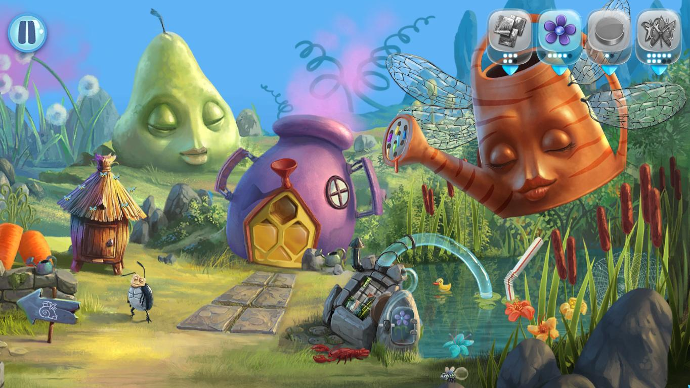

Ce s-ar întâmpla dacă un joc și-ar plasa fundamentul poveștii pe traumele psihologice ale unui copil? Pe mecanismele de _coping_ și construirea unei lumi fantastice unde respectivul copil poate schimba mersul lucrurilor?

Jocul începe cu un _slideshow_ de picturi în care este expusă premisa: sora mai mică a personajului principal se îmbolnăvește de ceva grav, nu ni se spune ce, și asistăm neputincioși la perindări cu ambulanța, prin spitale și clinici, în timp ce ea este dată pe mâinile doctorilor. Sau doar în aparență suntem neputincioși? Puși în pielea unui copil vom lupta cu boala într-un mod original, creând o lume alegorică centrată pe două personaje. Un iepure de pluș îl reprezintă pe fratele cel mare, pe care îl vom ghida prin niveluri, iar surioara lui apare sub forma unei flori pe cale să se ofilească din cauza bolii. Nu controlăm direct acțiunile fratelui, mai degrabă rezolvăm puzzle-uri pentru a elibera calea celor doi. De aceea jocul nu este un adventure tradițional, ci mai degrabă un hibrid de _point & click_ și _hidden object game_, în care trebuie să scrutăm fiecare scenă pentru obiectele necesare progresului.



Nu există nici un inventar în sensul clasic, ci doar mici chenare în partea superioară a ecranului unde ne sunt înșiruite imagini cu obiectele de care avem nevoie și numărul lor. Acele chenare devin albastre atunci când obiectele se află pe scena actuală, cenușii atunci când nu sunt, lucru care ne ușurează mult viața. Jocul nu este neapărat casual, având în vedere că nu oferă posibilitatea apăsării unui buton pentru afișarea unor _hint-uri_, dar puzzle-urile nu devin frustrante sau repetitive. De obicei se bazează pe mici joculețe de memorie, puzzle-uri tip _jigsaw_, de îndemânare cu mouse-ul, de potrivire a culorilor, etc.

Suntem puși în situații în care trebuie să strângem numărul X de stele de mare sau numărul Y de gândaci fără alt raționament decât acela de a prelungi durata, de altfel scurtă, a jocului. Unele dintre ele sunt pitite în locuri evidente, altele ascunse bine prin nivel, iar pentru unele trebuie să rezolvăm puzzle-uri. Nu putem lua ultima pană dacă nu strângem o cantitate de flori pentru a realiza un progres în scena respectivă și a avea acces la interacțiuni noi. Interacțiuni, în mare parte, limitate. Putem da click pe diferite elemente de mediu, pasări etc., dar fără a obține mai mult de o banală reacție. Sunt de părere, totuși, că asta adaugă viață nivelurilor și nu trecem doar prin niște locuri statice.

My Brother Rabbit este împărțit în cinci capitole, fiecare cu vreo 4-5 scene, toate pictate și încărcate cu simbolism profund. Primul capitol are loc într-o gradină îmbogățită cu diferite elemente ce îi dau viață: fluturi, albine, o stropitoare antropomorfizată și așa mai departe, doar că deja încep să apară primele elemente ale unui întuneric corupător, simbol pentru boală - buruienile sau, mai bine zis, spini care încolăcesc floarea surorii. Mai târziu ne vom perinda prin restul capitolelor presărate cu seringi, elemente marine, ajungând la ultimul nivel, preferatul meu de altfel, cu ceasuri topite inspirate din Dali.



Predomină o melancolie în lumea jocului, dată de muzica ambientală ce reunește naivitatea copilăriei cu tristețea cauzată de boală. Povestea nu este dezvoltată mai mult, doar urmărim cursul bolii, dialoguri vorbite nu există, mai degrabă o cacofonie a utilajelor pe care le asamblăm din loc în loc. Totul abundă în sensibilitate.

Cam asta este esența jocului. Sensibilitate. Boala surorii nu este prezentată într-un mod „kitschos”, ci finuț și elegant. Recomand **My Brother Rabbit** jucătorilor de toate vârstele care vor o experiență pură și umanizantă, cu note de tristețe. Deși ține doar trei ore, aș spune ca e suficient. Din măldarul de jocuri _hidden object_, **My Brother Rabbit** este o bijuterie. ■
