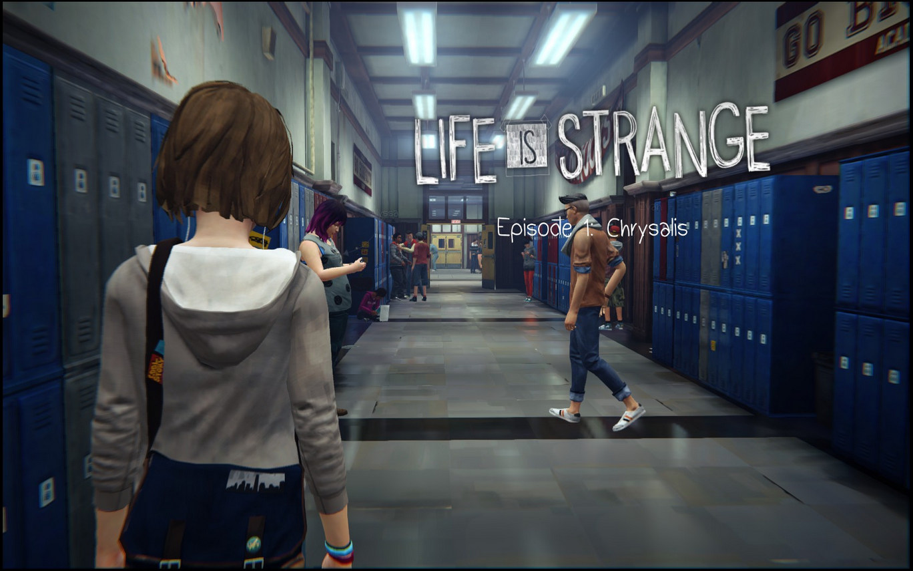
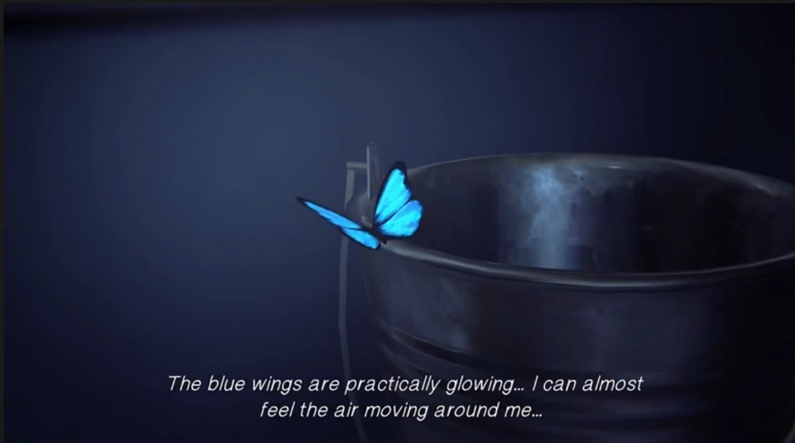
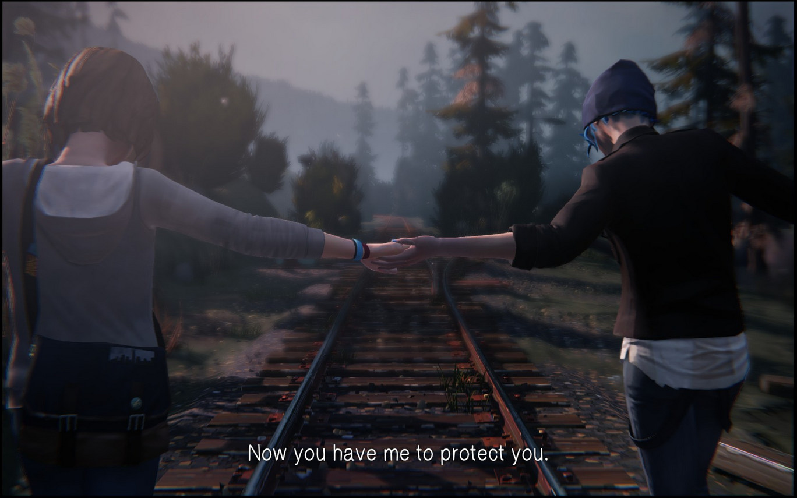
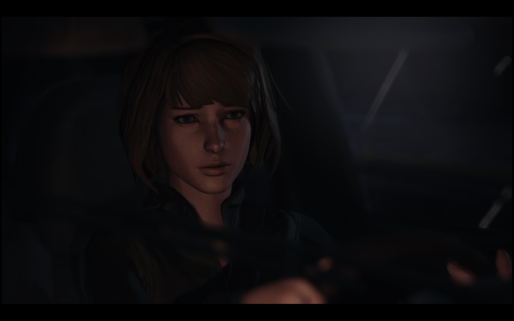

După recepția mediocră din 2013 a jocului **Remember Me**, cei de la Dontnod Entertainment nu s-au lăsat păgubași și iată că doi ani mai târziu ne-au livrat **Life is Strange**, cea mai cunoscută și populară creație a acestora făcându-i chiar să continue seria. Primul episod din **Life is Strange 2** și-a făcut apariția pe piață la sfârșitul lui 2018, iar eu, interesată de primul joc de mai mult timp și încurajată de apariția celui de-al doilea, am zis să îi dau o șansă.

Producătorii ne-au mai adus pe ecrane și **Vampyr**, iar momentan lucrează la un nou joc episodic de tip _choose your own adventure_ numit **Twin Mirror**. Întâmplarea face că, exact în aceeași perioadă în care am început să joc Life is Strange, m-am și uitat la Bandersnatch, cel mai nou episod din seria Black Mirror. Accentul se pune și aici pe importanța deciziilor pe care le luăm noi, jucătorii/privitorii, în cazul acestor tipuri de media în care avem libertate (aparent) nemărginită.

Ideea de _choose your own adventure_ (CYOA) a început din dorința de a implica cât mai mult consumatorul în povestea relatată, iar **Life is Strange** reușește să facă asta foarte bine, spre deosebire de alte jocuri de acest tip pe care le-am jucat (Telltale’s **The Walking Dead**). Se observă destul de ușor atenția la detalii pe care au dat-o scriitorii poveștii, la final aproape toate ițele împletindu-se una cu cealaltă (chiar dacă nu perfect).

**Life is Strange** te introduce într-o lume cât se poate de asemănătoare cu cea a ta și totuși nu una banală. Max Caufield se mută înapoi în Arcadia Bay, orașul său de baștină, pentru a urma cursuri de fotografie la Academia Blackwell, trăind momente de nostalgie datorită vechilor locuri vizitate și a întâlnirii prietenilor lăsați în urmă. Atmosfera este familiară și primitoare, lucrul pe care eu îl pun în deosebi pe seama muzicii. Trupele indie precum Alt-J și Mogwai ce au fost alese pentru a crea coloana sonoră a jocului te fac să te simți ca într-un orășel tipic american din Oregon, S.U.A.

Jocul este împărțit în cinci episoade, fiecare cu titluri sugestive. Primul episod, **_Chrysalis_**, o aduce în prim-plan pe Max, care descoperă că are puterea de a da timpul înapoi. Acest lucru se va dovedi util pentru jucători în numeroase situații de-a lungul poveștii, dar va și complica atât viața eroinei, cât și pe a noastră, deoarece orice schimbare vine cu consecințe ce trebuie asumate. Numele capitolului indică primordiul acțiunii, ideile din acest capitol reprezentând crisalida în care se dezvoltă cele ulterioare.

Următoarele două părți, **_Out of Time_** și **_Chaos Theory_**, vor continua evoluția întâmplărilor, alături de introducerea de noi personaje. Arcadia Bay este învăluit în mister, orașul fiind împărțit în două în urma dispariției lui Rachel Amber, o adolescentă aparent normală, dar poate puțin prea libertină. Despre ea vom afla mai multe de la alte personaje, cu precădere de la Chloe, cea mai bună prietenă a lui Max. Legătura dintre cele două s-a răcit atunci când protagonista s-a mutat în Seattle, dar prietenia lor se reia aproape imediat, iar Chloe îi mărturisește lui Max cât de mult își dorește să o găsească pe Rachel, nefiind convinsă (precum restul lumii) că aceasta a fugit la Los Angeles pentru a-și face o carieră în show business.



În ultimele capitole, **_Dark Room_** și **_Polarized_**, accentul este pus pe consecințele pe care le au întoarcerile în timp ale lui Max, precum și rezolvarea misterului dispariției lui Rachel și modul în care aceste întâmplări leagă numeroasele personaje. Eroina este pusă, împreună cu jucătorul, în situația de a lua niște decizii grele. Indiferent de cât de evidentă este calea cea mai bună, conștiința îți este încărcată până la finalul jocului, lucru ce se remarcă prin recurența urmărilor pe care aceste alegeri le-au avut asupra altor personaje.

Timpul, cu precădere trecutul, reprezintă o temă majoră pentru joc. Întreaga viață a lui Max se schimbă atunci când își descoperă puterea de a manipula fluxul normal al timpului, fapt care o aruncă într-o tornadă (no pun intended, pentru cei care au parcurs jocul) de aventuri mai mult sau mai puțin periculoase. Creatorii reușesc să ne convingă destul de rapid de absența liniarității pe care noi o percepem ca însușire de bază a timpului. Se fac diferite salturi între trecut, prezent și viitor, granițele dintre cele trei devenind din ce în ce mai estompate.

Teoria haosului, la care se face referire de mai multe ori în joc, și care este și numele unuia din episoade, este o idee conform căreia, într-un sistem cu variabile bine definite, orice schimbare cât de mică poate modifica complet atât rezultatul, cât și funcționarea sistemului respectiv. Fiecare alegere pe care o face personajul principal are o urmare aproape imediată, fiind astfel alcătuit un ansamblu de drumuri ce pot fi urmate de jucător până în etapele finale ale poveștii. De aceea, oricare decizie trebuie să fie bine gândită pentru că, deși în majoritatea cazurilor este oferită alternativa de a da timpul înapoi și a lua o altă decizie, în cazul unora, repercusiunile sunt evidente doar după o perioadă mai îndelungată de timp, când întoarcerea în timp nu mai este posibilă.

O aplicație a teoriei haosului este efectul fluturelui (_butterfly effect_), potrivit căruia bătaia aripilor unui fluture poate duce în viitor la apariția unei tornade. În incipitul jocului, înainte ca Max să își folosească pentru prima oară puterile, jucătorul va observa un fluture albastru pe care îl va putea chiar fotografia. Acest simbol va apărea de mai multe ori pe parcursul acțiunii, reprezentând chiar conceptul pe care este bazat întreg „scheletul” evenimentelor.

Un alt factor ce conferă sentimentul de familiaritate este personalitatea protagonistei. Maxine Caufield este o adolescentă normală până în momentul în care își dobândește capacitățile supranaturale, dar chiar și după aceasta, interacțiunile cu lumea din jurul ei rămân relativ neschimbate. Eroina este puțin timidă, iar mutarea înapoi în Arcadia Bay o face să se inhibe chiar și mai mult, fapt contracarat de situațiile în care este pusă ea, prin care își evidențiază curajul, intuiția și compasiunea. Max este o prietenă bună atât pentru Chloe, pe care o ajută în căutarea lui Rachel, cât și pentru alte personaje aflate în situații inconfortabile sau periculoase.

Chloe Price, pe care eu o consider adevărata eroină a poveștii în funcție de finalul la care ajungi (cue Sam in Lord of the Rings), este independentă și impulsivă, uneori punându-se în pericol atât pe ea, cât și pe cei din jurul ei. Atributele ei se pun în balanță cu cele ale lui Max, iar această potrivire este oglindită în funcționalitatea foarte bună a duoului în rezolvarea diferitelor mistere din Arcadia Bay.

Deoarece este un joc CYOA, accentul cade pe importanța deciziilor, printr-un gameplay relativ accesibil pentru jucător. Acțiunile sunt făcute printr-un sistem cam ciudat pe care eu nu l-am mai întâlnit până acum și care m-a pus în dificultate când am întâlnit bug-uri. Trebuie să dai click pe un obiect, îți apar acțiunile posibile, iar apoi trebuie să tragi cursorul către acțiunea dorită. Nu s-a întâmplat de foarte multe ori, însă este puțin enervant să continui să cauți ceva neștiind de fapt că nu e vina ta, ci a jocului care nu te lasă să interacționezi cu anumite obiecte. De asemenea, un element inutil este faptul că atunci când dai timpul înapoi într-o conversație și îți apare o altă variantă de răspuns derivată din noile informații aflate, aceasta e subliniată, făcând-o și mai evidentă decât e deja (pentru că din două variante devin trei șamd).

Majoritatea achievement-urilor din acest joc sunt date pe niște poze opționale pe care le poți face, iar cinci achievement-uri sunt pentru parcurgerea completă a fiecărui episod. Mi-a plăcut ideea cu pozele opționale, lucrul ăsta te îndeamnă să explorezi fiecare locație în parte să interacționezi cu lumea din jurul tău, dar și să descoperi niște priveliști cu adevărat încântătoare. Prin asta mi se pare mie că iese în evidență cel mai bine **Life is Strange**: este un joc superb, cu peisaje minunate, cărora le este complementară lumina ambientală. Această lumină trece de la tonuri calde și îmbietoare, la începutul poveștii, și evoluează o dată cu acțiunea, până când în momentele de climax ajung la roșu intens, iar la final devin reci.

În joc este posibilă accesarea jurnalului lui Max, în care putem înțelege întâmplările din perspectiva ei, dar și telefonul mobil al acesteia, cu tot cu schimburile de mesaje pe care le are cu diferite personaje. Inițial am crezut că este doar un alt mod prin care ni se transmit gândurile protagonistei și relațiile acesteia cu ceilalți, dar această agendă s-a dovedit mult mai importantă decât mă așteptam. Producătorii au dat foarte mare importanță detaliilor pe care le-au legat foarte bine, dintr-un capăt și până în celălalt, uneori scoțând în evidență lucruri pe care eu le trecusem cu vederea.

Singurul lucru care nu mi-a plăcut absolut deloc și care mi s-a părut mult inferior față de restul elementelor jocului a fost _lip-syncing_-ul defectuos, mai ales în primele episoade. Pe lângă asta, a fost o scenă în ultimul episod în care, fie era un bug, fie au uitat ei să animeze cu totul un personaj: vocea lui Max se auzea, dar buzele nu i se mișcau, deși celelalte personaje nu aveau astfel de probleme.

Unde alte jocuri CYOA au dat greș, **Life is Strange** s-a descurcat mult mai bine. Crearea unui astfel de joc este, de altfel, un lucru destul de complex, însă ceea ce face diferența este importanța alegerilor. În primul sezon din **The Walking Dead** deciziile aparent esențiale nu aduceau schimbări majore în defășurarea poveștii, dar în acest caz, alegerile tale și implicit cele ale lui Max vor duce la diferite deznodământuri, existând două finaluri de joc.

Evident că alegerile sunt și vor fi întotdeauna limitate. Există nenumărate moduri în care poți transimte o singură idee, iar asta poate duce la nenumărate reacții din partea celor cu care conversezi. De aceea, nu va exista niciodată un joc CYOA perfect; opțiunile sunt nelimitate și lăsarea pe dinafară a oricărora va conduce subit la o anume constrângere. Totuși, cred că e posibil să faci un joc să pară cât mai natural în astfel de alegeri prin diverse artificii, iar Dontnod au reușit într-o oarecare măsură să facă asta (și totodată să facă gameplay-ul mai puțin frustrant pentru mine decât cei de la Telltale).

**Life is Strange** este un joc bun, cu un subiect destul de întortocheat și interesant, care reușește să te țină în priză pe parcursul celor aproximativ douăsprezece ore de joc. Atmosfera, conferită atât de peisajele minunate, cât și de coloana sonoră potrivită, corespunde perfect personalității personajului principal și a sentimentelor acesteia, pe parcursul întregii povești. Pe de-o parte, jocul este o poveste de maturizare și de depășire a nivelului la care se găsește eroina la început, iar pe de altă parte, este un joc CYOA care te răscolește destul de tare, făcându-te să te întrebi ce înseamnă de fapt alegerea „corectă”.

Cu excepția câtorva părți din ultimul episod, care mi s-au părut inutile, nu m-am plictisit deloc. Acum vreau să încerc și continuarea seriei, deși îmi va fi greu să mă obișnuiesc cu personaje noi, după ce m-am atașat de Max, Chloe și mulți alții. Dacă aveți puțin timp liber la îndemână, vă recomand și vouă să-l încercați, fiind un joc antrenant și acaparant. Pentru că, într-adevăr, viața este destul de ciudată. ■
