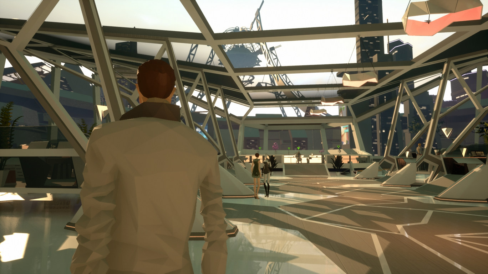
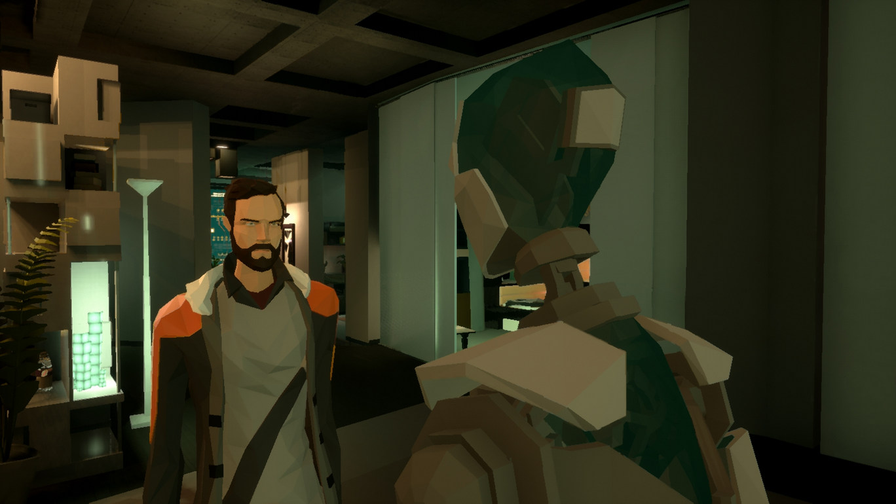
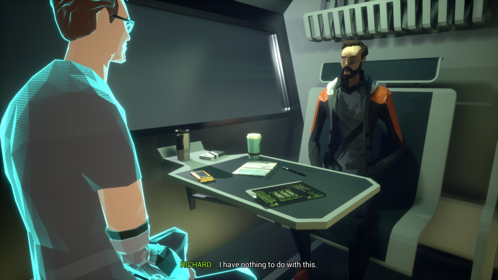

După ușoara dezamăgire apărută la finalul lui A New Beginning, credeam că va trece un pic mai mult timp până ce voi mai juca ceva din catalogul crescând al celor de la Daedalic. Atras însă de cele câteva cadre văzute, m-am apucat de State of Mind, dar un pic circumspect după experiența anterioară și mai prudent în așteptări, fără a-mi mai pune mari nădejdi înainte de a trece prin poveste.

Ne aflăm în viitorul lui 2048, când accidentele și inerent consecințele acestora deveniseră deja vestigii ale trecutului apropiat mulțumită tehnologiei tot mai avansate ce acoperă fiecare fațetă a cotidianului. În urma unui accident rutier, Richard Nolan, unul din jurnaliștii proeminenți ai publicației The Voice se trezește în spital cu câteva goluri în memoria recentă.

Primind instrucțiuni și indicații despre ce trebuie să facă în următoarele zile pentru a-și recăpăta amintirile, e trimis acasă pentru odihnă și reculegere. În sânul cutiei locative în schimb, în locul familiei sale îl găsește doar pe Simon — unul dintre ultimii roboți Base IV, scoși deja din producție de câțiva ani — „angajat” de soția Tracy să aibă grijă și să-i țină companie lui Richard în absența lor.

De partea cealaltă, Adam Newman, într-o simetrie aproape perfectă, trecând prin aceleași suplicii și suferind de aceleași lacune în memorie cauzate de un accident similar, se găsește în propriul apartament înconjurat de o aură idilică de căldură familială.

**SoM** se folosește la început de aceste două ițe narative, legând cei doi bărbați într-un amalgam inform, contopind și suprapunându-le existențele până când intriga se dezvăluie asemenea unui boboc de floare, petale ascunse sub alte petale, descoperite pe măsură ce fragmentele de memorie sunt recuperate.

Între celelalte jocuri ale Daedalic, **SoM** face o notă discordantă. Stilul lor consacrat a fost abandonat în favorea unei schimbări de perspectivă, renunțându-se în bună măsură la puzzle-uri, progresul în joc bazându-se pe linii de dialog și interacțiuni semiautomate, dar și pe diversificarea gameplay-ului cu câteva mini jocuri.

**SoM** e mai degrabă o experiență interactivă — un film în care jucătorul este factorul de decizie, iar povestea este spiritul motor — și nu un adventure în adevăratul sens al cuvântului, cele câteva puzzle-uri răzlețite de-a lungul jocului neputându-l califica nicidecum pentru această categorie. Modul de abordare nu contează, interacțiunea cu mediul înconjurător este bine delimitat, iar cele câteva puzzle-uri au rezolvarea în apropierea imediată, astfel că povestea este împinsă de scenariu și de actorii vocali (care fac o treabă mulțumitoare, dar departe de ce aș fi vrut personal).

Cum spuneam, pentru un pic mai mult din jumătatea poveștii, jucătorul va prelua pe rând controlul celor doi bărbați încercând să descâlcească nodul încurcat al propriilor vieți, aventura purtându-l din sterilitatea și curățenia utopică din orașul City5 către un Berlin distopic invadat de drogați, tehnoanarhiști, forțe de ordine mecanizate, supraveghere perpetuă și sanitari robotici, ce încearcă să mimeze cât mai tare empatia umană.



Într-o primă fază, **SoM** îndrăznește să pună câteva întrebări de ordin filozofic despre natura și conștiința umană, dar o face cu timiditate, de parcă s-ar teme ca să nu-și piardă jucătorul, și degenerează încet pe o pantă a clișeelor distopice. E puțin deconcertant ca începutul promițător să cadă pe căi deja știute, la fel cum este și reacția lui Adam care acceptă fără prea mari tulburări intestine natura propriei existențe.^[O abordare mai interesantă pentru Adam ar fi fost cea din _Chip Străin_ a lui Abe, în care, primind un transplant de față, protagonistul suferă transfigurări și la nivel emoțional, o alterare a percepției propriului fizic, chiar dacă nu una debilitantă sau conștientă – dar, pentru că nu o poate vedea decât în oglindiri, are un impact adânc asupra psihicului. E ciudat cum nu există o disociere între Adam și noul lui trup, noul lui chip, după ce fusese atâta amar de vreme altcineva.]

Apoi, mi s-a părut că, probabil debordând de idei pe care le voiau adăugate firului narativ, scenariștii au scindat cursul poveștii prin adaosul mai multor ițe narative, dar care, în loc să formeze o tapițerie complexă dar unitară, au făcut loc confuziei și anacronismului din cauza dezlânării.

De exemplu, sunt câteva secțiuni jucabile în care jucătorul reconstituie niște fragmente de memorie din City5. Deși acestea ar trebui să le aparțină lui Richard și Adam, sunt jucate din perspectiva altor persoane cu care cei doi au intrat în contact, ceea ce e contrar logicii și bunului-simț. Nu-ți poți forma o amintire din perspectiva altcuiva, mai ales când te faci părtaș la respectiva rememorare într-un moment tardiv din curgerea amintirii, chiar dacă ți-au fost povestite da capo al fine de nenumărate ori și ajungi să-ți însușești povestea de parcă ai fi trăit-o. Ca atare, dispararea aparentă a fragmentelor de cei doi protagoniști pare mai degrabă o implementare defectuoasă la nivelul narațiunii. Nu e neapărat un lucru rău, fragmentele găsite umplu golurile diegetice, dar parcă aș fi preferat să se facă în alt mod.

_En fin_, trecând peste umilul inconvenient de care m-am agățat, mai sunt câteva aspecte care ar fi putut fi șlefuite cu mai multă rigoare. Un exemplu ar fi relația dintre Richard și Simon. Bărbatul este un antitehnolog declarat, câștigător al unui Pulitzer pentru demascarea unor ilegalități săvârșite de Kurtz Robotics (ce au stârnit un întreg scandal denumit ulterior „Dronegate”). De cealaltă parte, îl avem pe Simon, robotul său casnic, programat să aibă o personalitate aproape ludă, nevinovată, o victimă aproape sigură a avansului tehnologic, destinat reciclării din cauza limitărilor tehnice, învechite. Astfel că evoluția relației lor mi s-a părut destul de interesantă, de la aprehensiunea inițială la acceptarea rezervată a acestuia în viața lui Richard, conform alegerilor personale consființite molcom, discret, care-l separă pe Simon de restul confraților săi. Asta ca mai apoi el să dispară complet din spectrul poveștii, doar pentru a fi readus într-un cut-scene aproape de final săvârșind o sarcină ce mi se pare de-a dreptul imposibilă, realizabilă doar din generozitatea scenariului.

Zvonul lansat de Breakpoint, organizația teroristă prezentă pe meridianele statelor vestice, despre moartea lui Richard, îl aduce pe acesta în contact cu liderul organizației. Care însă, în ciuda unor acțiuni care desfășurate în afara ecranului și una care periclitează câțiva cetățeni nevinovați doar pentru că se aflau în locul nepotrivit, e destul de stearpă în existența ei. E destul de ciudat ca o organizație care, chipurile, e de o anvergură vastă, să aibă doar doi-trei membri, dintre care unul este liderul. Iar acest absenteism devine dureros de evident către finalul jocului când, străbătând toate cotloanele întunecate ale subteranei în care, teoretic, s-ar fi retras sau în care rezidau membrii organizației, nu întâlnești pe nimeni până la stația de upload.

Asta ca să nu mai zic că în **SoM** răufăcătorii fac dovada unor abilități de precogniție ce pot rivaliza cu cele ale lui Leto al II-lea, stabilind cursul pe care-l vor urma personajele noastre fără greș sau abatere. E de-a dreptul aberant ca, pentru a-și îndeplini țelurile oculte, orchestrarea evenimentelor să se facă cu o precizie de bisturiu, la un nivel de mare artă, cursul fiind urmat întocmai, negreșit și neîntrerupt de aleator sau accidental. În cadrul poveștii, pare mai degrabă o succesiune de coincidențe favorabile, greu de crezut că s-ar putea întâmpla vreodată.

Mai departe, mi se pare că alegerile făcute de mine n-au avut un impact atât de mare pe cât am avut impresia inițial, nu a existat o miză reală în ciuda faptului că dispuneam de abordări conversaționale multiple. Altfel spus, degeaba am fost ostil sau rezervat, căci povestea și-a continuat ritmul indiferent de alegerea făcută, chiar dacă părea că mi-am antagonizat interlocutorii.

Spuneam mai sus că fluxul poveștii e „întrerupt” din când în când de câteva minijocuri sau de câte un puzzle. În mod normal, acestea ar fi fost binevenite, dacă nu ar fi fost de-a dreptul ilare în banalitatea lor, cu atât mai mult cu cât fiecare personaj din perspectiva căruia joci e predispus la comentarii care facilitează rezolvarea puzzle-urilor și așa ușoare, cel mai probabil construite astfel pentru a nu scinda foarte tare povestea. Iar implementarea lor e destul de dezamăgitoare – ca să iau un exemplu, undeva aproape de ultimul act, e un moment în care așteptările îți sunt înșelate și promisiunile ce ți-au fost făcute sunt încălcate. Cel cu pricina, care s-a folosit de bunătatea sufletului tău, se oferă chiar să te ajute să-ți curmi suferința, dar e întrerupt de un telefon oportun, primind astfel un scurt răgaz în care trebuie să culegi informațiile necesare pentru un anumit cocktail chimic care să-l zăpăcească pe scârbavnicul adversar. Dar nu există nici un inconvenient dacă vrei să tărăgănezi lucrurile, să rezolvi problema în ritm molcom, ardelenesc, antangonistul devenind parte a mediului înconjurător, repetând aceleași cinci-șase replici la nesfârșit până când te hotărăști să-l culci. Minijocurile există doar de dragul diversificării gameplay-ului, ca pentru a nu transforma jocul într-un walking simulator: o dronă trimisă în recunoaștere și distrusă în misiune va fi rematerializată în locul agresiunii; secvențele de hacking presupun suprapunerea a două-trei sfere; camerele de filmat care trebuie evitate sunt oportun așezate astfel încât să nu zădărnicească progresul; iar dacă există undeva un minim de liber arbitru pentru jucător, atunci personajul său e întors din drum pentru a fi reașezat pe traseul corect.

Vizual, **SoM** e un adevărat deliciu. Mi-au plăcut atât direcția artistică, cu personajele create cu un număr redus de poligoane (modă ce am văzut-o adoptată și în viitorul We, the Revolution), dar și design-ul minimalist al mediului înconjurător, care se potrivește excelent atât cu mizeria imundă a Berlinului veșnic întunecat, cât și cu asepticul și luminosul City5. Bineînțeles, în ton cu celelalte aspecte ale jocului, nici în acest caz avem uniformitate, întâmplându-se uneori ca anumite NPC-uri să zacă în nemișcare, asemenea unor manechine, parte a decorului prin care mi se perindă personajele^[Cred că doar într-un singur moment mi s-a întâmplat să conștientizez amorțirea aceea a NPC-urilor, iar asta s-a întâmplat în interiorul lui City5. Aici, veți vedea de ce, senzația de artificialitate e de apreciat, dar cred că a fost doar o întâmplare, un chix al engine-ului și nu o alegere a designer-ilor.].



Am menționat deja că o bună parte a jocului a depins foarte mult de scenariu și de actorii vocali, cei din urmă făcând o treabă… mulțumitoare: nici nu s-au întrecut în interpretări de dimensiuni shakespeariene, dar nici nu au trecut prin studioul de înregistrări doar pentru a primi un salariu. Se poate spune că, având în vedere modul în care se desfășoară povestea, și interpretarea e pe măsură, respectiv cea a unui film de categoria B.

De altfel, în felul ăsta ar putea fi catalogat **SoM**, ca echivalentul jucabil al unui film de categoria B. E o experiență mai mult decât modestă, dacă i se pot trece cu vederea neajunsurile, care preferă siguranța căilor deja știute în detrimentul unui fir narativ mai atipic, mai pretențios, mai stimulant pentru scoarță. ■
