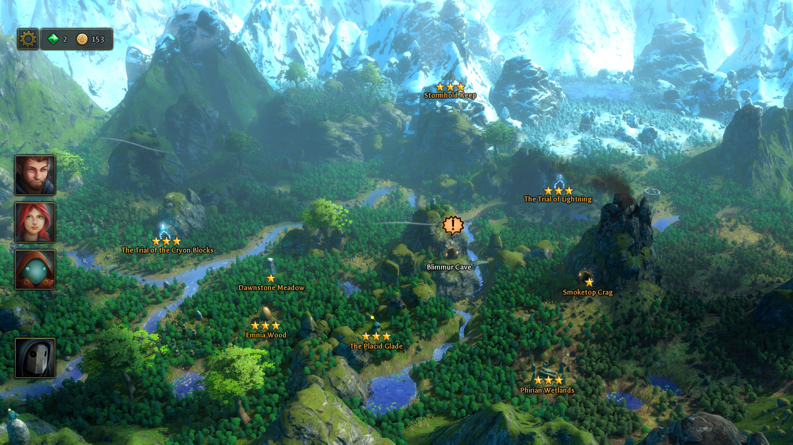
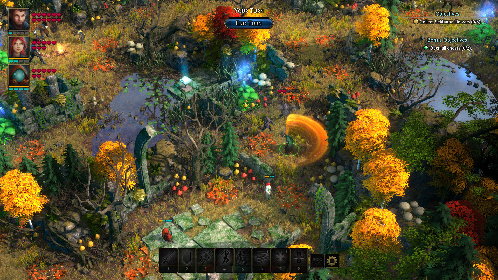
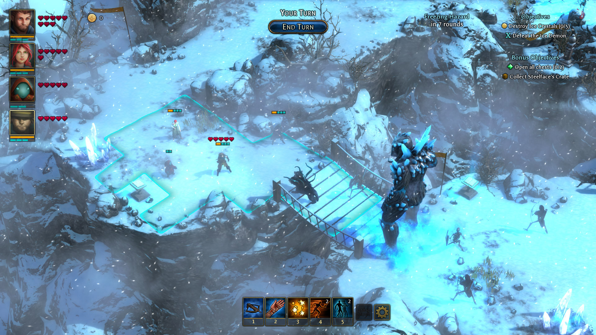
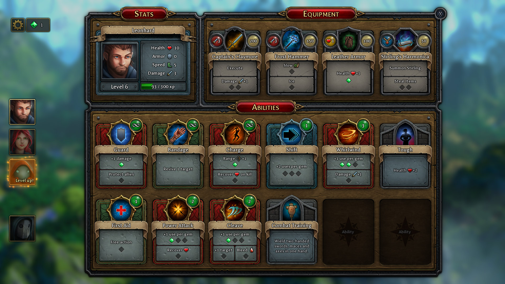
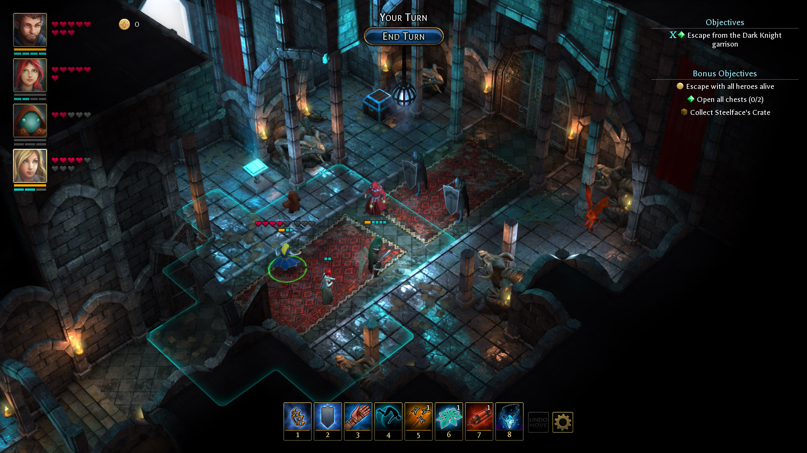

În 2012, înainte ca toate drumurile să fie pline de indie-uri și kickstartere care profită de nostalgia jucătorilor, Almost Human, un studio finlandez format din numai patru persoane, lansa Legend of Grimrock. Un blobber care s-a bucurat de un succes neașteptat de mare, ce avea să fie o adevărată premoniție pentru următoarele valuri de producători mici și mari care concurează astăzi pentru atenția noastră, pe scena independentă. Ce treabă are asta cu Druidstone: The Secret of the Menhir Forest? Între timp, o parte din Almost Human s-a desprins, formând un nou studio: "Ctrl Alt Ninja", și se face că s-au gândit să debuteze cu un hibrid RPG - TBS - Puzzle.

Ușor de remarcat că vorbim despre un indie veritabil aici: echipa de opt oameni, nume de studio amuzant și titlu de joc ales probabil după vreo șase beri, nu de un departament de marketing. Mai mult, cine și-ar forma o opinie despre joc doar pe baza pozelor sau informațiilor oferite de producători, ar putea fi puțin cam... nemotivați să-l încerce. La o adică, nu mai suntem în 2012, e foarte posibil să găsești și în mâncarea de la restaurant vreun indie cu elemente de puzzle și RPG. Eu unul, venind abia trecut prin Sekiro, eram pregătit pentru o experiență relaxantă în compania unui joc pe ture, frumos colorat.

### *I ain't in the business of being wrong*

Am nimerit două din trei. Druidstone e cu siguranță un joc pe ture, frumos colorat. Dar după primele misiuni parcă aș fi intrat puțin în Sekiro, să mă mai relaxez. Contrar aspectului casual, de joc mai degrabă făcut pentru telefoane mobile, începutul te lovește rapid și eficient în moalele capului. Ce, ai jucat zeci de strategii pe ture? Foloseai foarte inteligent poziționarea în avantajul tău? Știai de cum începi o misiune dacă vei câștiga sau nu? Vrei să faci și obiectivele alea bonus? Mai vedem...

Totul începe cu meniul principal și o melodie de fundal înduioșătoare. Nu, pe bune, nu există logouri sau vreun filmuleț introductiv, inițial am crescut că e un bug. Nu doar atât, dar și începutul efectiv de joc te cam bagă în ceață. Te trezești deodată într-un colț de pădure, în postura unui personaj simpatic, atacat de niște creaturi... drăguțe. Alte două personaje necunoscute întră în scenă și te scapă din necaz. Uite așa faci cunoștință cu cei trei protagoniști, dar asta numai după ce le dai un nume fiecăruia - o tradiție mai degrabă a JRPG-urilor, în Druidstone poți să-ți denumești personajele cum vrei. De dragul acestei recenzii vom merge pe numele implicit setate, dar pentru cei care apreciază customizările sau au vreun fetiș interesant, e bine de știut.

Așadar îl avem pe Oiko, personajul simpatic de care vă spuneam. Oiko e un ghemotoc a cărui apartenență la rasa umană îmi e neclară. Are un simț negru al umorului și e puțin mai psihopat. Spoiler alert! E și cel mai interesant dintre cei trei. Urmează Aava (pun intended), fiica druidului șef și Leonhard, pe care efectiv nu am mai rezistat și l-am botezat Leon. Leon este gardianul pădurii și aparent tocmai ce a fost scos dintr-un cocon de către Aava și Oiko, înainte să începem noi jocul. Îndrăzneț început! Mi-am zis eu înainte să știu că această introducere ad-hoc nu servește de fapt nici un scop narativ. De notat că inițial, când jocul se afla în stadiu pre-alpha, Leon era personajul principal al poveștii, dar până la lansarea finală jocul a suferit modificări foarte mari, atât ca design cât și narativ, iar acum toți trei sunt la fel de importanți Totuși, Leon e "alesul", gardianul pădurii, ultimul dintr-un lung șir de oameni (să zicem) care iau naștere când voiește pădurea și își sacrifică viața pentru a o proteja. Pe scurt, e un fel de Neo, pentru că pădurea Menhir și rasele care o populează reprezintă efectiv întreaga lume a jocului.

Aș vrea să detaliez, dar dacă fac asta voi ajunge să scriu mai mult despre poveste decât există de fapt în joc. Impresionează numai prin prezență și pentru că altfel nu existau scuze să te treacă producătorii prin foc și sabie în misiuni cu tot felul de obiective greu de atins.

### *"To lose patience is to win the battle."*

Răbdarea este o virtute, e importantă în jocuri și în viața de zi cu zi. Ne plac oamenii răbdători, unii poate încearcă să lucreze la acest capitol în timp ce alții s-au născut mai norocoși (un zar mai bun la crearea personajului). În misiunile din Druidstone, răbdarea e moartea. O regulă generală a mai tuturor TBS-urilor lansate vreodată, este că dacă stai cuminte și aștepți inamicii, ei vor veni la tine. În mare parte din confruntări, asta le induce un dezavantaj instant și te ajută pe tine să te simți ca un cuceritor când omori armata inamică condusă de dragoni, cu un batalion de țărani. Ei, aici să aștepți e cea mai mare greșeală pe care o poți face. Luptele din Druidstone nu stau după nimeni, ești aruncat în mijlocul acțiunii, la început ai niște inamici răspândiți prin jurul tău, apoi pe măsură ce se avansează cu turele, ți se aruncă noi adversari în față (câtedată la propriu).

De multe ori e frustrant, pentru că îți construiești o strategie bună, treci prind două valuri de întăriri ale adversarilor și când ai impresia că urmează să câștigi, te trezești cu încă un val și cu inamici poate prea puternici pentru a fi învinși. De aceea este mai bine să abandonezi așteptarea și aplicarea unei strategii pasive, în favoarea unor acțiuni ostile de la început. Cu cât te miști mai mult prin nivel, cu atât mai bine.

Practic, jocul se prezintă într-un mod extrem de rudimentar. Ai o hartă cu pădurea Menhir, de unde selectezi misiunile pe care vrei să le parcurgi, majoritatea aducând o contribuție și pe partea narativă (mai avansează povestea). Când începe o misiune se face tranziția și te trezești în situația descrisă mai devreme, pe tipica hartă împărțită în pătrate. Fiecare personaj are un număr de puncte dedicate mișcărilor pe hartă și altele pentru atacuri propriu-zise. Clasic.

Rar scopul unei misiuni va fi eliminarea adversarilor, cel mai des victoria are loc când se îndeplinește setul de obiective primite: poate trebuie salvat vreun NPC, găsit un obiect într-un anumit număr de ture sau învins un inamic specific. Obiectivele în sine sunt foarte variate, producătorii dând dovadă de game design exemplar în construirea lor. Ba chiar există și câteva misiuni cu obiective exclusiv puzzle, fără inamici. Toate banal de ușoare dar o bună pauză de la stresul confruntărilor.

Din păcate, această variație nu se extinde și la inamici sau companioni. Pe lângă cei trei menționați, pe parcurs grupul se mai extinde doar cu unul, poate doi dacă luam în considerare un mercenar ce poate fi chemat în ajutor în schimbul unui procent din câștigurile financiare de la sfârșitul misiunii. Apropo de asta, în caz de victorie, jocul te răsplătește cu bani, experiență și pietre prețioase, pe lângă deblocarea de noi misiuni pe hartă. Inamicii sunt cel mai des formați din bestii ale pădurii, nemorți sau oameni – mercenari care lucrează pentru Sephiroth. Stai, ce?

### *"...My sadness? What do I have to be sad about?"*

Dacă inițial influențele JRPG par mai mult niște trimiteri minore către acest gen, pe parcurs devine tot mai evident că Final Fantasy VII (și altele) au fost o sursă de inspirație poate prea mare pentru producători. Aici se observă și o fragmentare în dezvoltarea jocului, pentru că luptele și influențele RPG nu sunt așa strâns înrudite cu jocurile din est. În schimb, dialogurile și povestea constant par să fie un Final Fantasy de duzină, peste care se adaugă și muzica puternic inspirată  din jocurile japoneze.

Au existat niște mici controverse pe partea asta, aparent compozitorul s-a mai inspirat cu poftă și din alte jocuri (Octopath), și din motive de copyright piesele respective au fost înlocuite cam de la primul sau al doilea patch. În schimb, tot mai există secțiuni în care acordurile muzicale mi-au declanșat instant memoria și m-am trezit în cap cu imagini din FF VII, un joc în care am investit multe ore.  Personajul negativ de asemenea m-a dus de câteva ori cu gândul la Sephiroth, poate cel mai cunoscut baddie din jocurile Square. De data asta e vorba de o vrăjitoare antică, care corupe pădurea Menhir cu intenția de a dobândi puteri divine.

În fine, eu am ales să le acord prezumția de nevinovăție și să merg pe ideea că aceste influențe și trimiteri sunt mai mult un tribut adus unor jocuri foarte populare, cu atât mai mult pentru că în Druidstone reprezintă doar o scuză, un motoraș pentru declanșarea conflictului și generarea misiunilor.

### *"4 out of 3 people struggle with math"*

Fiind vorba de un studio mic, producătorii au jucat la siguranță când vine vorba de balansare. Întreg sistemul de numere din spate e de așa natură încât este foarte ușor să percepi luptele. Vorbim de numere mici, sub 20, cam în toate aspectele jocului. Și treaba e simplă – fiecare personaj are un anumit număr de puncte de viață, armură și damage. Când primești o lovitură, se scade din valoarea atacului primit armura, iar ce rămâne se deduce din punctele de viață.

Există evident mici complicații, inamici care pot ignora armura, diferite tipuri de atacuri (foc, otravă, gheață) și așa mai departe. Nimic însă care să iasă din spectrului jocurilor de gen. Balansarea e strâns făcută, astfel încât nu există foarte multe căi de a trece prin misiuni. Însă tocmai din acest motiv, simți că abordarea ta chiar contează. Sentimentul acesta e puternic augmentat de diferitele abilități pe care le au eroii și de faptul că poți să le schimbi înainte de fiecare luptă. Leo este luptătorul de aproape, Aava are abilități de suport și vindecare, iar Oiko e o bombă nucleară care aruncă cu vrăji în toate direcțiile. Se pot modifica totuși, pentru că mare parte din echipamentul din joc se poate folosi de toată lumea.  Singura problemă e, și de această dată, lipsa de varietate. Există un singur vendor în joc, cu stoc inițial limitat, care se dezvoltă doar prin îndeplinirea anumitor obiective bonus din misiuni.

Niște firmituri de originalitate se pot observa în sistemul de vrăji. Personajele pot să folosească o versiune normală a unei vrăji sau, folosind încă o abilitate („Focus”), pot să acceseze o versiune mult mai puternică. Spre exemplu, în loc de a da un plus de armură pe un personaj, se poate da pe toate deodată. Șmecheria este că toate abilitățile ofensive din joc au un număr limitat de folosiri per misiune. Dacă te apucă excitațiile și arunci cu bile de foc prea repede sau pe cine nu trebuie, te vei trezi în fața unor inamici puternici pe care trebuie să-i dobori cu săbiuțe și insulte. În schimb, numărul de folosiri e configurabil înainte de fiecare luptă, acele pietre prețioase pe care vă spuneam că le primiți în caz de victorie pot fi folosite pentru a îmbunătăți vrăji sau abilități. Prin investirea lor, crește numărul de folosiri, puterea, durata sau raza de acțiune.

Acesta e locul unde Druidstone strălucește, pentru că fiecare misiune se poate aborda în moduri radical diferite, în funcție de cum alegi să-ți distribui pietrele prețioase. Poți plusa pe flexibilitate și viteză, îmbunătățind abilitățile relevante, sau pe putere brută de atac. Un adevărat meta-puzzle. De menționat însă că începutul de joc nu e blând, ai foarte puține astfel de pietre și un număr limitat de abilități, ca atare primele misiuni sunt greu de făcut pe ultimul nivel de dificultate, cu toate obiectivele adiționale. Cel mai probabil va fi nevoie de parcurgeri suplimentare, cu personaje mai puternice.

### *"Less is less"*

Mi-a fost greu pentru o bună parte din timp să decid dacă chiar mi-a plăcut Druidstone sau nu. Sigur, m-a consumat pentru vreo 30 de ore, am făcut toate misiunile pe cea mai mare dificultate, toate obiectivele bonus și toate puzzle-urile. Nu știu exact ce spune asta, însă trăim într-o eră a jocurilor menite să stimuleze dependența noastră de colecționare și perfecționare. Vrei să ai trei din trei stele, vrei să vezi obiectivele colorate cu verde, nu cu roșu și câte și mai câte astfel de nimicuri. Nu? Ei bine, nu.

Anul trecut mă jucam ultimul Dragon Age apărut când paharul s-a umplut. În loc să fac toate aceste nimicuri, am ales să urmez firul principal al poveștii, apoi să dau o dezinstalare rapidă, urmată de un shift, delete și degetul mijlociu. Nu la mult timp după, am stat 130 de ore să explorez fiecare părticică din Divinity: Original Sin 2. Ce încerc să zic eu aici este că în ciuda unui puternic impuls de a avea 100% la toate în orice joc, dacă am impresia că mi se servește o mediocritate puturoasă, lipsită de pasiune, mă demotivez și nu fac asta. Cam acesta ar fi baremul meu pentru Druidstone.

Este un joc aproape bun, egal cu suma părților sale. Sistemul de luptă e excelent gândit, iar misiunile sunt bine realizate. Dincolo de asta, la toate aspectele i-aș da doar notă de trecere. Însă pasiunea producătorilor se vede constant, iar dificultatea și tensiunea de care poate da dovadă m-au țintuit în fața monitorului. Poate că are un stil grafic rudimentar (dar funcțional!) și îi lipsește varietatea, în schimb se observă ușor atenția la detaliu în lupte și cât de bine ar fi mers în contextul unui joc mai „mare”. E prima dată în ultimii ani când îmi doresc ca un joc să fi fost mai extins, e păcat că nu a existat un kickstarter sau o altă sursă de finanțare pentru Ctrl Alt Ninja. ■
