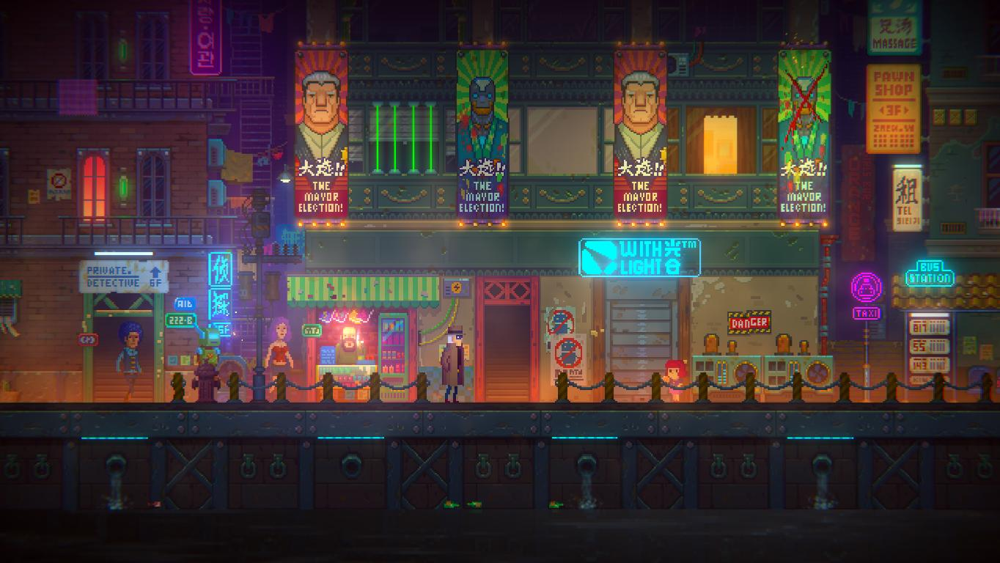
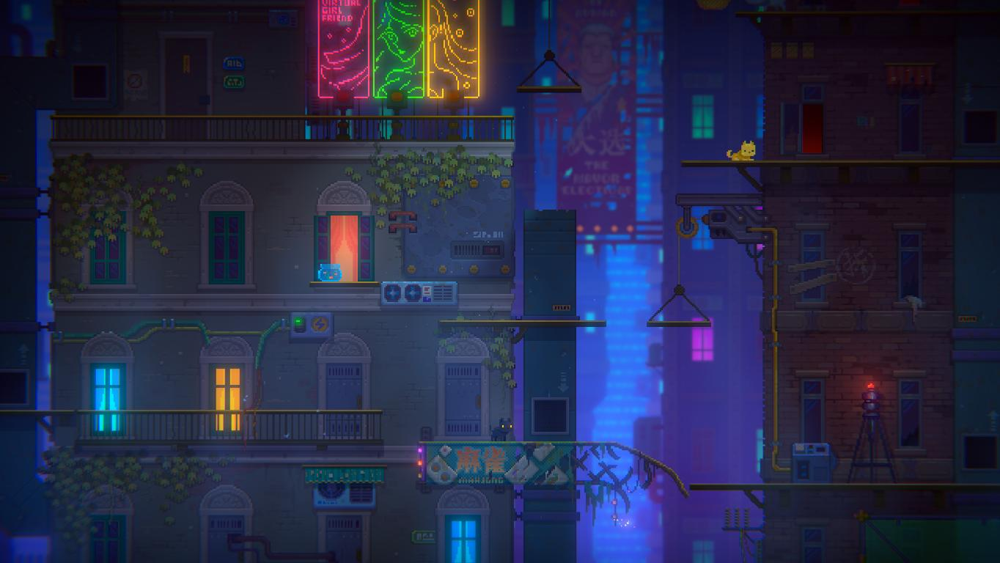
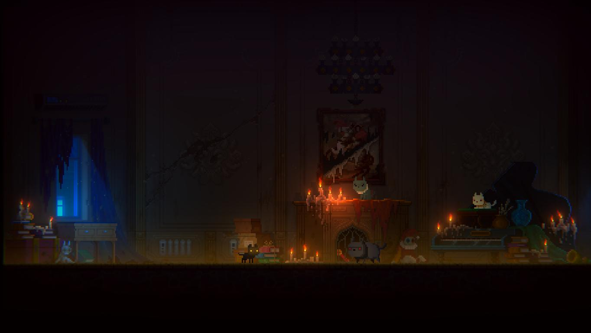
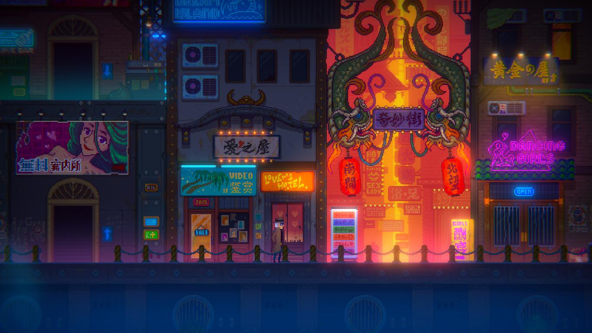
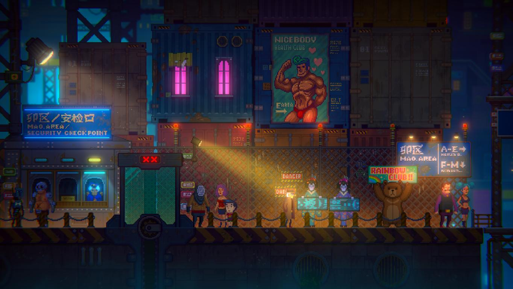
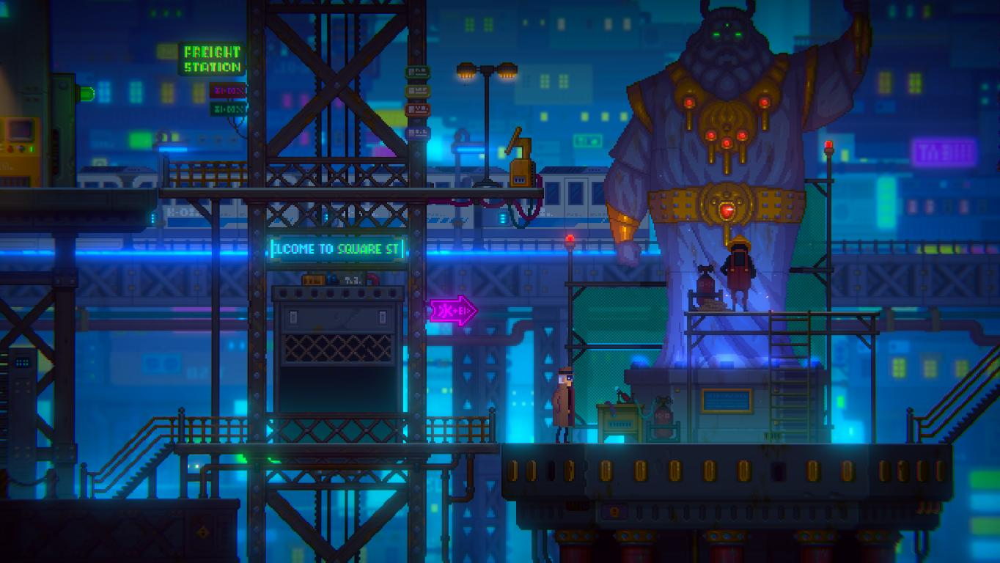

Tales of the Neon Sea a fost un joc despre care nu am știut mai nimic. Nu am urmărit dezvoltarea sa, nu am avut nici cea mai mică idee despre existența sa înainte sa văd trailerul de lansare. Trailer care a venit cu o idee interesantă. Un oraș de inspirație asiatică învăluit în neon? Referințe la filme SF vechi? Pisici? _Count me in_! Dezvoltat de către Palm Pioneer, un studio din China, momentan sunt disponibile doar primele trei capitole din joc, dar aceste trei capitole aduc peste zece ore de joacă.

Acțiunea din Tales of the Neon Sea (TotNS) se petrece într-un viitor nu prea îndepărtat, în care inteligența artificială este ceva la ordinea zilei și roboții sunt doar tolerați în societatea umană. Descoperim pe parcurs cum, cu mult înainte de începerea jocului, a avut loc un mare război între oameni și roboți, deoarece aceștia din urmă erau maltratați de către specia umană. După lungi ani de resentimente adunate, revolta a izbucnit. A urmat o lungă vreme de conflict și orori, dar războiul a fost oprit de un lider mesianic al roboților, numit „The Prophet”. Acesta a reușit să ajungă la un armistițiu cu oamenii și să stabilească o conviețuire relativ pașnică, deși roboții sunt tratați și în prezent ca niște cetățeni de mâna a doua. În momentul în care au loc evenimentele din joc există o luptă politică între reprezentanți ai oamenilor și cei ai roboților pentru controlul orașelor, dar sunt prezente și grupări teroriste de roboți care militează pentru libertate.

Suntem aruncați într-un oraș plin de viață și înecat în neon, în care locuitorii, oameni și roboți deopotrivă, își văd de treburile zilnice într-o perpetuă stare de mâhnire din cauza sărăciei și a lipsei de posibilități. Din păcate, lumea din *TotNS* una în care doar cei bogați își pot permite să viseze. Orașele luxoase sunt construite pentru ei, serviciile de lux sunt pentru ei, iar oamenilor sărmani și roboților nu le rămân decât ghetourile unde stau la mâna diverșilor infractori locali.

Impresia pe care mi-a facut-o primul contact cu lumea din *TotNS* a fost similară cu ce am trăit am atunci când am văzut lumea bogată în detalii din primul _Blade Runner_. Acest film a fost printre primele mele contacte cu genul cyberpunk, așa că m-am putut scufunda cu un sentiment de nostalgie în marea de neon (_pun intended_) pe care ne-o oferă *TotNS*. După cum vom vedea, jocul se inspiră din _Blade Runner_ în multe privințe, dar și din diverse creații de science fiction, precum _I, Robot_ sau _Star Trek_.

Povestea începe cu Rex, un personaj cu o aură de mister, căzut într-o canalizare și rănit. Nu stăm mult degeaba și trebuie să fugim de ceea ce pare o combinație ciudată de Grim Reaper cu o mască ciudată cu cioc de pasăre. Odată ce reușim să scăpăm, următorul nostru obiectiv este de a repara implanturile cibernetice ale lui Rex. Câteva puzzle-uri și mini-games mai târziu, ni se prezintă un concept care pare o glumă la început: putem juca cu William, un motan salvat de Rex acum ceva timp și care poate ieși din orice încurcătură. Desigur, acesta nu poate vorbi, doar mieuna, dar el înțelege ceea ce spun oamenii și îl scoate pe Rex din belele de multe ori. Așa că primul nostru obiectiv cu William este să omorâm niște cyber-șobolani pentru niște piese de care Rex are nevoie ca să își repare implanturile.

Până și partea animală este implementată în mecanica și mitologia jocului. Există un conflict între animalele normale și cele bionice, cele din urmă fiind îmbunătățite prin diverse mijloace tehnologice pentru a testa cipuri sau îmbunătățiri înainte de a fi aplicate pe subiecți umani. Acest conflict este reprezentat cel mai bine prin perspectiva lui William, care face parte dintr-o organizație criminală a pisicilor. Similară ca organizare cu mafia italiană, unul dintre obiectivele de mai târziu va fi să descoperim o pisica bionică infiltrată în organizație pentru a putea câștiga influența Don-ului pisicesc și a avansa în poveste.

După ce vom repara implanturile lui Rex vom fi trimiși printr-un flashback cu câteva zile în urmă, unde începe povestea propriu-zisă. Pare o dimineață relativ normală, aruncăm un ochi în apartamentul dezordonat al lui Rex, încărcat de suveniruri colecționate, și aflăm că acesta este un detectiv zdrobit de regrete, aflat într-o stare fizică precară și că depinde de părțile cibernetice pe care le repară din piese luate la mâna a doua. O zi ca oricare alta la început, după puțină explorare a apartamentului ieșim din bloc pentru a căuta niște piese de schimb ca să reparăm robotul menajer. Ziua se transformă rapid atunci când suntem conduși de către William la locul unei crime. Aici intră în funcțiune partea investigativă a jocului. Trebuie să adunăm indicii de la locul crimei, să analizăm atent cadavrul și apoi să punem totul cap la cap într-un mini-game. În acest joculeț, fiecare indiciu este o rotiță dintr-un ceas; pentru a face ceasul să meargă, rotițele de mărimi diferite trebuie potrivite. Fără să vrem, vom începe o aventură în care Rex se va găsi pe urmele misteriosului Noah. Acesta din urmă este un criminal în serie pe care Rex nu a reușit să îl prindă acum mulți ani, iar amintirile încă îl bântuie pe detectiv.

Noah în sine este un personaj enigmatic despre care nu primim prea multe informații. Aflăm că modul lui de acțiune constă în a realiza statui grotești în care îmbină organele și membrele luate de la victimele umane cu piese de la roboți dezmembrați. Elementul central, caracteristic, al acestui personaj, este masca cu cioc de pasăre specifică doctorilor din Evul Mediu. Personal, am interpretat această mască sinistră ca dorința lui Noah de a ieși în evidență și a-și exprima macabrul simț artistic. Ca argument pentru exprimarea artistică, masca în sine este un element caracteristic în comedia italiană, Commedia dell’arte, fiind purtată de către personajul clasic Medico della Peste. Poate, de asemenea, simboliza o detașare față de lumea exterioară. În perioadele cu boli, cum ar fi ciuma, medicii obișnuiau să pună substanțe plăcut mirositoare în cioc, pentru a se proteja de așa zișii vapori produși de pestă. Astfel, masca poate bloca mirosul îngrozitor atunci când Noah săvârșește o crimă. Aspectul înfricoșător al măștii este de asemenea un factor care îl separă de restul populației.

Cu excepția lui William, celelalte personaje secundare din *TotNS* sunt destul de slab conturate și nu reprezintă mai mult decât niște mijloace prin care avansezi în poveste. De fapt, cele mai memorabile personaje din joc mi s-au părut pisicile interlope cu care William are de-a face. Una dintre ele este dependentă de iarba mâței, alta are veleități artistice ș.a.m.d. Pe cât de absurd ar putea suna, luptele pentru teritoriu cu clanurile rivale de pisici au reușit să mă captiveze mult mai mult decât momentele petrecute cu prietenii lui Rex.

Din punct de vedere grafic, jocul arborează un stil retro-pixelat, iar aspectul învechit și vestimentația personajelor reprezintă omagii aduse anilor 80. Trenciul lui Rex, hainele suprasaturate în culori și combinațiile ieșite din comun aduc aminte de acești ani, dar nici frizurile îndrăznețe și îmbibate de vopsea nu se lasă mai prejos. De exemplu, tricoul purtat cu sacou, marcă a anilor 80 în seriale precum Miami Vice, se împletește cu îmbrăcămintea tradițională japoneză, kimonoul. Deși poate da impresia de kitsch, consider că toate aceste elemente reușesc să se îmbine natural în *TotNS*, fără să îți dea impresia că ceva nu se află la locul său. Estetic vorbind, pot să compar jocul cu stilul japonez Ukiyo-e. Această formă de artă reușește să capteze lumea aflată în mișcare, iar *TotNS* nu este o excepție. În lumea hiper-tehnologizată a acestui joc, totul se află în permanentă „curgere”. Locurile prin care ne perindăm sunt de asemenea demne de a fi menționate. Suntem purtați prin niveluri bogate în detalii, cum ar fi centre comerciale, periferii sărăcăcioase sau zone industriale pustii.

Ca gameplay, *TotNS* poate fi jucat fie ca un point&click, fie din tastele direcționale. Amândouă modalitățile funcționează satisfăcător. În trecerea mea prin joc am folosit tastele, iar de mouse am făcut uz doar la unele mini-games și puzzle-uri. Acestea din urmă erau foarte frustrante în primele zile de la apariția lui *TotNS*, dar producătorii au patch-uit jocul între timp și au eliminat multe dintre aceste provocări inutile care nu făceau decât să mănânce timp. Au rămas, pe alocuri, câteva momente enervante, dar nici pe departe ca la momentul lansării. Ca dificultate, nu mă pot plânge de faptul că fost un joc dificil, dar în același timp nici nu am dat de vreun puzzle memorabil.

Cel mai interesant aspect al gameplay-ului mi s-a părut cel de investigație, în care trebuia să adun indicii și să le pun cap la cap, numai că au fost prea puține cazuri de deslușit. Jocul prezintă o interfață aproape inexistentă, astfel că fiecare cadru este liber și fluid. Inventarul nu poate fi accesat decât atunci când întâlnim vreun puzzle, iar în acele momente este destul de evident ce avem de făcut. Dar, în schimb, merită explorat fiecare colțișor de ecran pentru a descoperi câte o bucățică de informație despre lumea în care se petrece acțiunea. Astfel aflăm câte ceva din ceea ce se petrece în sfera politică. Ziare aruncate prin canalizare, bârfe la colț de stradă, totul e interesant de descoperit.

Sunetul este ceea ce ne-am aștepta de la un joc cyberpunk, cu muzică ambientală menită să adauge la atmosfera deprimantă a jocului. Vreau să laud puțin melodia din meniul jocului, care reușeste să anticipeze aspectele tragice a ceea ce urmează prin notele sale melancolice dar și cele pline de acțiune. Efectele sonore nu sunt foarte variate, dar sunt utile la completarea imersiunii jucătorului. Sunetele de pași, troncănitul mecanic sau șoaptele digitale sunt doar câteva exemple care fac experiența mai captivantă. Personal, aș fi preferat o coloană sonoră ceva mai memorabilă, deoarece multe dintre melodii mi se par cam neinteresante.

Unul dintre momentele mele preferate din acest joc este undeva pe la final, când te afli pe o epavă și trebuie să ajungi în cabina unui vapor aflat în partea opusă. Cromatica tinde înspre un verde lovecraftian, singurătatea și sentimentul că ceva nu e în regulă încep să te cuprindă, iar jocul de lumini pe care trebuie să îl faci pentru a ilumina vaporul întăresc starea de disconfort. Toate aceste elemente reușesc să se îmbine într-o frumoasă poezie a disperării, într-o lume super industrializată, în care groaza de a fi deconectat de restul lumii este la un colț distanță.

Recomand Tales of the Neon Sea. La lansare nu aș fi putut face asta din cauza mini-jocurilor frustrante, dar acum îl consider o experiență fascinantă și a meritat să mai aștept cu review-ul. Mă bucur că scena de jocuri adventure din Asia vine cu astfel de creații. *TotNS* poate fi jucat de fanii Blade Runner, de amatorii de investigații sau de cineva care vrea un joc adventure în care să joace cu... pisici. Momentan sunt disponibile primele 3 capitole, următoarele fiind planificate să apară ca DLC-uri gratuite. Jocul ține vreo 15 ore, timp suficient pentru a experimenta acest tribut adus science fiction-ului. ■

