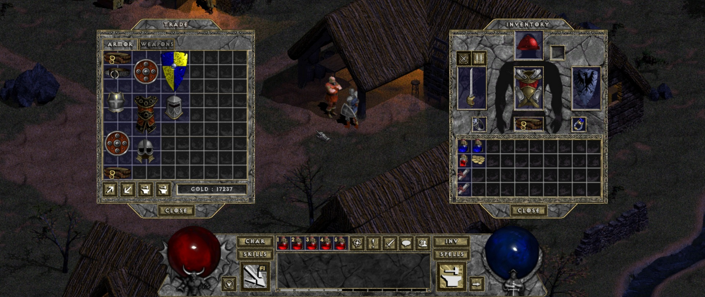

Tristram are nevoie de un salvator… din nou. Iar dacă tu ai nevoie de o scuză ca să-i mai faci o vizită bătrânului Diablo, stai o vreme și ascultă-mi povestea.

Belzebub, eroul poveștii, este de asemenea cunoscut ca **Diablo HD Mod**, deși nu este tocmai un MOD în adevăratul sens al cuvântului, și nici în totalitate Diablo. Este ce obții dacă iei Diablo, îl aduci la zi din punct de vedere tehnic, și îi adaugi cele mai bune feature-uri din Diablo 2. Plus alte modificări interesante. Și o creștere a dificultății. Și… multe altele. 

Încă din meniul principal observi noutăți și anume cele trei clase noi: barbar, asasin și necromancer. În plus, deși nu ai cum să-ți dai seama la început, chiar și clasele originale au fost reinventate. Fiecare personaj are acum multiple skill-uri unice pe care le va putea folosi pe măsură ce avansează în nivel.

Structura lumii este în mare parte neschimbată, dar conținutul ei este alterat cu gust. În oraș întâlnim câteva fețe noi, avem parte și de noi inamici, iar cei vechi se comportă uneori diferit. Quest-uri ce au fost eliminate din jocul original înainte de lansare își fac acum apariția, la pachet cu zone complet noi în care să se desfășoare. Jucătorii de Diablo 2 o să aibă o surpriză în timpul unui astfel de quest, nu spun mai mult :)

Călătoriile prin dungeon se vor simți ceva mai diferit acum, deoarece una dintre noutatăți o reprezintă waypoint-urile _à la_ Diablo 2, câte unul la fiecare două niveluri de dungeon. Astfel, se introduce o nouă dinamică interesantă între vechile scurtături, _town portals_ și _waypoints_ deoarece, mai ales în momentele critice, vei începe să-ți planifici traseul prin dungeon în funcție de waypoints. Te găsești într-o poziție proastă, fără town portals? Ce faci? Te întorci la un waypoint anterior, astfel pierzând mai mult timp, sau încerci un _rush_ până la următorul, mai apropiat, punându-ți încrederea în abilitățile defensive și/sau evazive?

Probabil cea mai importantă diferență adusă de Belzebub este la sistemul de loot. Sunt prezente o puzderie de item-uri noi, precum și de acum clasica categorie, _set items_. Mai avem și un sistem de crafting, prin care item-urile pot fi „sparte” în materiale folosibile în rețete, ce fac parte la rândul lor din loot-ul obținut de la inamici. Iar dacă ți-a plăcut mecanica de _gambling_ din Diablo 2, unul din cele două NPC-uri noi o aduce și în Belzebub. Important de menționat este faptul că acum găsești în oraș, pe lângă un stash propriu, și unul shared, la care au acces toate personajele create pe PC-ul tău. Per total, noul loot system este foarte similar cu cel din Diablo 2 — excelent din punct de vedere al rejucabilității.

La capitolul mecanică, Belzebub aduce îmbunătățiri importante. Trading-ul în oraș se face printr-o interfață similară cu cea din Diablo 2, personajul tău poate purta curele care funcționează, din nou, ca în Diablo 2, poți să te folosești de tasta Alt pentru a evidenția loot-ul din jurul tău, ai feedback detaliat pentru damage-ul pe care-l primești, dar și pentru cel pe care-l cauzezi, ai posibilitatea de a face zoom in/out, poți folosi cam orice rezoluție îți trece prin minte, etcetera. Belzebub este, fără doar și poate, mult mai plăcut de jucat decât originalul Diablo.

Belzebub este o oportunitate excelentă pentru a redescoperi Diablo, și cu noile item-uri, clase, crafting, dar și dificultatea crescută, este clar că-ți poate oferi sute de ore de _oldschool fun_.

În final, ce-mi mai rămâne să zic? Nimic altceva decât „spor la joacă”. Mă întorc la warrior-ul meu care a adunat deja loot serios în shared stash pentru viitorul rogue… sau necromancer. Sau amândoi. ■

{}
### Instalare
Cel mai ușor mod de a juca Belzebub este să cumperi Diablo pe [GOG.com](https://www.gog.com/game/diablo), apoi să downloadezi Diablo 1 HD mod de pe [pagina asta](https://mod.diablo.noktis.pl/download), după care să dezarhivezi .zip-ul in folder-ul jocului. Start via `Belzebub.exe`. Alternativ, ar trebui să poți dezarhiva Belzebub oriunde, cât timp copiezi `DIABDAT.MPQ` din folder-ul jocului in folderul Belzebub, dar nu am testat personal această metodă.
{}
