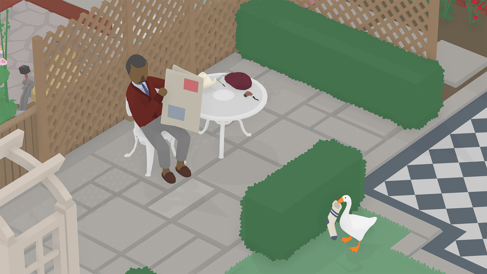
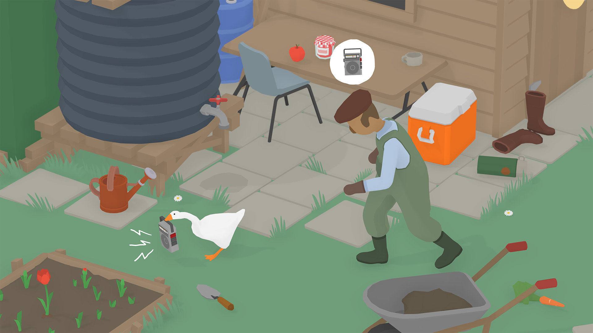

Jocul cu gâsca! Pacostea virală! Junghiul internetului! Jocul memă! L-am jucat și noi, ca să fim în rând cu lumea, astfel că acum puteți să aflați și voi cum este și de ce vorbește lumea despre el. Iar dacă încă nu aveți habar la ce mă refer, priviți trailerul de mai jos - veți înțelege imediat. 



Și… nu e rău deloc. Nu e un indie revoluționar, dar e original, amuzant și foarte accesibil, astfel încât e atractiv pentru mai multe categorii de jucători, inclusiv dintre cei care în mod normal nu s-ar prezenta drept „gameri”.

Chiar și premisa jocului, menționată chiar din primul ecran când începi jocul, este una pe cât de simplă, pe atât de plină de posibilități — ești o gâscă pusă pe stricăciuni și distracție într-un sat tihnit în care oamenii nu vor decât să-și vadă liniștiți de viața lor. Dar nu pentru multă vreme >:)

(Iar în caz că vă întrebați, numele jocului nu înseamnă nimic. Pur și simplu dezvoltatorii, o mică echipă din Australia, n-au găsit un nume mai potrivit și a rămas acest titlu temporar dat prototipului inițial ^[[How ‘Untitled Goose Game’ Got Its (Non) Name](https://www.forbes.com/sites/mattpaprocki/2019/09/24/how-untitled-goose-game-got-its-non-name)]. Ceea ce nu e deloc surprinzător, având în vedere inspirația de care au dat dovadă și când au avut de ales numele studioului: House House.)

## ***

La prima vedere, judecând după stilul grafic simplist și paleta de culori șterse, ați putea crede că avem de-a face cu un joc modest, făcut cu resurse puține. Animațiile și muzica reprezintă însă trei sferturi din ceea ce face acest joc ceva special — construite din tușe groase, teatrale, rezultatul este o comedie vizuală și sonoră cum nu găsim prea des în jocurile video, dar care sunt foarte prezente în epoca de început a filmelor și desenelor animate, bazate foarte mult pe comedie fizică, cu mișcări exagerate și punctuații melodice.

Fără aceste elemente, jocul n-ar fi cu nimic diferit de un Flash game inspirat din Hitman sau Metal Gear Solid. De fapt... o descriere mai potrivită a jocului ar fi că pare un prototip făcut de developerii lui Hitman într-un weekend de distracție cu băutură și fumat — o reinterpretare în registru comic a sistemelor din jocul cu asasinul chel, dar schimbând mecanicile stealth și țintele VIP cu gălăgia maximă și obiective mult mai mundane precum furtul unei perechi de ochelari sau ruperea unei mături.

După cum ziceam mai sus, jocul ne pune în penele unei gâște lăsată să-și facă mendrele într-un mic sat modelat după așezările rurale britanice. Gâsca e întruchiparea copilului neastâmpărat și pus pe rele pe care-l avem mai toți în noi, împielițatul acela care le face viața grea celor din jur pentru o măruntă clipă de amuzament sau pentru un premiu temporar. Acel copil care aruncă de la balcon cu coji de banane și pungi cu apă în capul trecătorilor. Cel care taie cablul TV de pe casa scării pentru a fura tubul de plastic, numai bun pentru țevi de cornete. Sau care îți taie trandafirul din gradină doar pentru ca e roșu, mare și atrage privirea. Sau rupe antenele de pe mașini ca să-și facă sabie. Sau care se cacă la ușa vecinului și sună la ușă să ceară hârtie. OK, poate pe asta ultima n-a făcut-o copilul Cristan, dar ați prins ideea. 

În mod similar, obiectivele noastre ca gâscă sunt la fel de mărunte și de supărătoare pentru cei din jur: fă cumva să-l uzi pe grădinar, blochează pe cineva în cabina de telefon, adună obiectele necesare pentru un picnic (în traducere: „fură de la oameni mancare, coș, tacâmuri etc, pe care să le așezi pe o pătură; apoi, odată adunate, **să nu mai faci nimic cu ele!**”), rupe o mătură, păcălește pe cineva să-și taie singur trandafirul premiat și așa mai departe. Lucruri amuzante.

Revenind la animații, personajul principal a primit cea mai multă atenție, fiind recreat cu toate mișcările naturale ale unei gâște reale. Mersul legănat, clătinatul cozii, mișcarea gâtului în toate direcțiile, lipăitul labelor în mers, postura corpului în diferite momente — asezonate cu un strop de exagerare pentru efect comic și expresivitate — toate acestea sunt redate fluid și transmit cu ușurință **_intenția_**, voința malefică din spatele ochilor ficși ca două mărgele. Puteți chiar să fluturați și din aripi, dacă vreți. Nu are niciun efect în joc, dar... așa fac gâștele.

Trebuie să remarc în mod special aici felul „adaptativ” în care gâsca e integrată în mediul înconjurător, mai precis felul în care își mișcă capul independent de direcția în care se deplasează pentru a privi obiectele din jur cu care poate interacționa sau personajele pe care le urmărește. E incredibil cât de multă personalitate (și șiretenie) poate conferi gâștei acest mic detaliu.



Naturalețea animațiilor se oprește aici, însă, căci în afară de gâsca noastră, celelalte personaje — adică oamenii — au mișcări mult mai limitate și rigide, arătând mai degrabă ca niște marionete mișcate cu sfori. Dar acest lucru nu deranjează, ci dimpotrivă, amplifică efectul de comedie bufă al scenelor.

Pe lângă animații, la atmosfera jocului participă din plin și coloana sonoră, celălalt pilon de construcție comică pe care se sprijină jocul. Bazată pe Preludiile lui Debussy, linia melodică e o compoziție dinamică de pian, care se adaptează la acțiunile gâștei în nivel — întețindu-se sau relaxându-se în funcție de intensitatea haosului sau pe care-l produce — ceea ce produce o coloană sonoră unică pentru fiecare jucător și un excelent efect de amplificare a comicului de situație din fiecare moment. 

Interesant e că această caracteristică atât de fundamentală a jocului s-a născut doar ca urmare a comentariilor apreciative la adresa muzicii din primul trailer, în care acordurile de pian ale lui Debussy erau sincronizate perfect cu agitația provocată de gâscă, astfel că producătorii s-au văzut „nevoiți” să găsească o modalitate de a extinde acest efect la întreg jocul. ^[[How Untitled Goose Game adapted Debussy for its dynamic soundtrack](https://www.theverge.com/2019/9/23/20879792/untitled-goose-game-nintendo-switch-debussy)]

A, și era să uit. _The Honk_! Sunetul scos de gâscă e genial, folosit cu mare efect atât în joc (poți speria oamenii pentru a obține reacții diverse), cât și în viața reală, pentru că... e pur și simplu al naibii de amuzant.

## ***

Strict ca gagameplay, jocul e un puzzle. Ai la dispoziție o lume semi-deschisă, cu niveluri de sine stătătoare, dar conectate între ele astfel încât te poți întoarce oricând la nivelurile anterioare. Fiecare nivel are unul sau mai multe personaje, care au o rutină simplă și fixă, și o serie de obiective care implică, de cele mai multe ori, să le faci viața amară într-un fel sau altul bieților oameni. Iar grosul distracției vine din explorarea posibilităților de interacțiune cu mediul înconjurător (ce obiecte poți fura sau activa, ce se întâmplă când apeși mânerul ăsta sau tragi de capacul ăla, și câte și mai câte) în încercarea de a întrerupe această rutină a personajelor, care are o inerție destul de mare, toți oamenii încercând să readucă nivelul la starea inițială.

Pentru asta vei folosi fie mecanici stealth, în care trebuie să te furișezi în afara câmpului vizual al oamenilor, fie abordarea „anti-stealth”, în care folosești gălăgia și haosul pentru a distrage atenția țintelor tale. Trebuie să ai grijă să nu fii văzut când furi un obiect (sau doar îl miști de la locul lui), altfel omul în zona căruia acționezi îl va căuta și îl va aduce la locul lui. De exemplu, fură pălăria grădinarului și va fugi după tine. Dacă nu reușești să ajungi într-un loc inaccesibil pentru el, te va prinde — oamenii aleargă mai repede decât tine — și ți-o va lua înapoi, ba chiar o să vadă și borcanul cu gem și radioul pe care i le-ai furat înainte și le va lua să le ducă înapoi, fix unde erau la început. Și tot așa; de aici și provocarea de a introduce permanent o schimbare în nivel.

Jocul e foarte distractiv la început, dar noutatea nu durează foarte mult. Distracția oferită apoi poate varia foarte mult în funcție de dispoziția fiecărui jucător de a-și crea propriul amuzament, pentru că mecanicile care stau la baza jocului sunt destul de simple și nu evoluează pentru a ține treaz interesul pentru un timp mai îndelungat.

Din fericire, jocul e scurt și nivelurile rămâne suficient de variat încât să nu te plictisești prea tare până la sfârșit. În plus, după terminarea ultimei scene se deblochează un fel de New Game Plus, în care reiei jocul de la început, dar *cu alte obiective*, ceva mai grele, care combină obiecte și personaje din mai multe zone pentru o provocare mai mare.

## ***

Jocurile de comedie sunt rare. Sigur, jocuri _cu umor_ sunt destule, dar cele de comedie se întâlnesc la fel de des precum glumele bune de pe forumul Level. Și, la fel ca orice altă comedie, se consumă cel mai bine în grup. Chiar dacă e un joc singleplayer, distracția cea mai mare va fi când sunt și alți privitori pentru a vă amuza împreună de gagagurile de pe ecran.

**Untitled Goose Game** e un joc simplu și amuzant, ceea ce-i conferă o atracție universală. Mecanicile și puzzle-urile, cu câteva excepții, nu vor pune mari probleme, dar nu ăsta e rolul lor, ci servesc mai mult ca pretext și motivație pentru explorarea nivelurilor și acțiunile cu efect cathartic ale gâștei. E ușor de înțeles de ce a devenit senzație pe internet, e perfect pentru streaming și pentru seri de distracție cu prietenii non-gameri.

O ultimă critică mai am, asta dacă și voi, citind articolul, ați avut cumva aceeași curiozitate pe care am avut-o și eu la început. Din păcate, simularea nu e perfectă — nu te poți și găinăța pe unde vrei. ■

{}
### „Că gâsca ne dă nouă lapte, brânză, unt şi ouă” (&copy; cioLAN)

O să vă prezint mai jos niște amănunte interesante despre gâște și câteva dintre foloasele pe care le aduce gâsca omului din cele mai vechi timpuri și până azi. ^[[Geese: the underestimated species](http://www.fao.org/3/V6200T/v6200T0n.htm)] ^[[Geese, A Brief History](https://www.purelypoultry.com/blog/geese/)] 

Gâștele se numără printre primele păsări domesticite, existând dovezi arheologice privind creșterea gâștelor încă de acum 5000 ani la vechii egipteni, care prindeau gâște sălbatice cu miile folosind năvoade și apoi le înmulțeau în captivitate.

Și romanii prețuiau foarte mult aceste păsări, oferindu-le ca ofrandă zeiței Iunona (Hera) și lăsându-ne moștenire multe rețete delicioase pentru mâncare cu carne de gâscă. Există și o legendă care spune că un cârd de gâște ar fi salvat Roma în timpul asediului galilor din 390 î.e.n, sunetele scoase de păsări alertând gărzile romane de atacul dușmanilor în timpul nopții.

În zilele noastre, creșterea gâștelor reprezintă o activitate economică importantă, îndeosebi pentru micii fermieri din Europa și Asia, fiind ușor de crescut și oferă numeroase produse: carnea plină de nutrienți și grăsime, ouă mari, precum și puf și pene. Unele specii de gâște produc între 20 și 40 de ouă pe an, iar o specie ajunge și până la 100 de ouă.

De asemenea, în cârd, la păscut, pot constitui și o formă de control a dăunătorilor pentru anumite culturi precum tutun, cartofi, fasole etc. Există chiar o specie de gâște denumită „Cotton Patch Geese” pentru ajutorul pe care îl dădeau la îngrijirea culturilor de bumbac și tutun.

Și nu în ultimul rând, gâștele sunt utile și pe post de animale de pază, datorită vederii foarte bune și sunetelor stridente pe care le scot. Lăsând la o parte legenda salvării Romei, gâștele sunt folosite și în zilele noastre în zone din Asia de Sud-Est sau Anzi pentru a păzi gospodăriile în locul câinilor, sau chiar pentru paza unor instalații militare din Europa.

De ce v-am spus toate astea? Absolut fără niciun motiv, nimic din cele de mai sus nu are vreo legătură cu gâsca din joc. Gâsca noastră e doar o jigodie. HONK!
{}
