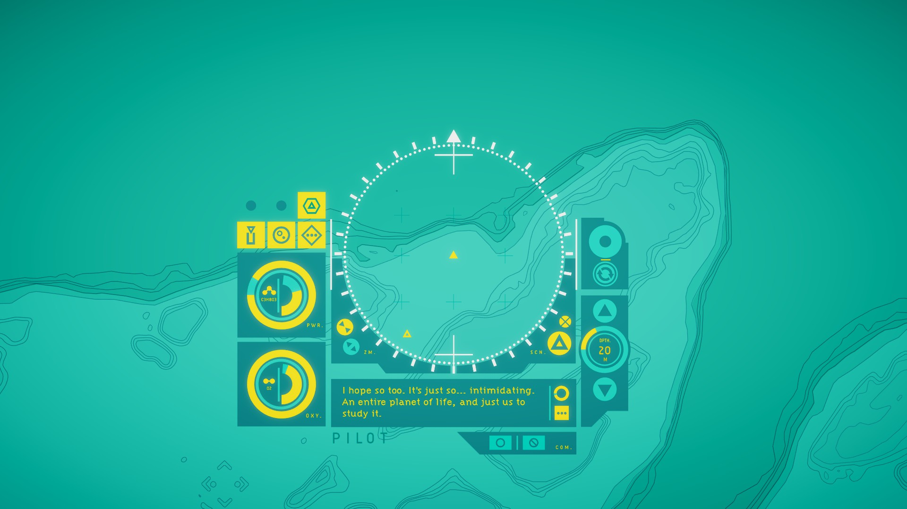
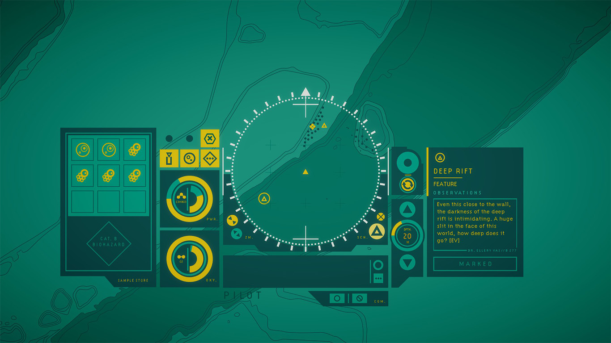
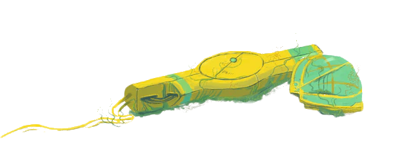

Imaginați-vă dacă Subnautica ar fi un joc text adventure, cu accentul pus pe explorare și descoperire științifică în loc de supraviețuire și tensiune, și vă veți apropia de ceea ce este **In Other Waters**.
 
Din descriere, In Other Waters pare că se adresează direct acelei părți a imaginației mele în care odată găseau teren fertil pasajele din seria Odyssey a lui Arthur C. Clarke, care prezentau viața oceanică primordială de sub gheața Europei, sau descrierile aventurilor din romanele lui Jules Verne, în care protagoniștii descoperă un ținut nou, plin de priveliști nemaivăzute. 
 
Cu acest gând, și primind jocul după ce am trecut recent prin alte două titluri oarecum complementare (**Subnautica**, cu a lui explorare subacvatică într-un ocean nepământean, și **Outer Wilds**, cu prețuirea adusă curiozității științifice), ba mai și citind înainte câteva review-uri elogioase, credeam că **In Other Waters** o să mi se potrivească mănușă. Din păcate, cum se întâmplă de multe ori când vii cu așteptări preconcepute, realitatea a fost ușor diferită. Departe de a fi un joc rău, **IOW** nu a reușit să-mi hrănească imaginația și să-mi trezească entuziasmul descoperirii așa cum au făcut-o înaintașii de mai sus.



## ***

Cum îi spune și numele, întreg jocul se desfășoară în apele oceanului de pe planeta Gliese 667Cc ^[Gliese 667Cc [este o exoplanetă reală](https://en.wikipedia.org/wiki/Gliese_667_Cc), plasată, la fel ca în joc, în constelația Scorpionul, [în zona locuibilă a unui sistem cu trei stele](https://www.space.com/21708-images-habitable-alien-planets-gliese-667c.html), dar din informațiile de până acum pare să fie departe de raiul tropical pe care-l găsim în joc.], la câteva sute de ani în viitor. Omenirea se află într-o epocă a explorărilor și exploatărilor spațiale multi-planetare, lăsând în urmă un Pământ epuizat de resurse și cu oceanele devastate. 
 
Răsturnând puțin așteptările cultivate de jocurile video de până acum, **IOW** nu ne atribuie rolul protagonistului, ci pe cel al asistentului digital al acestuia. Jocul începe cu sosirea lui Dr. Ellery Vas, un exobiolog marin, pornită în căutarea unei prietene ce i-a cerut ajutorul printr-un mesaj misterios. Ajunsă pe planeta oceanică, Ellery se trezește în posesia unui costum de scufundare cu un sistem AI neobișnuit, iar apoi face uluitoarea descoperire că oceanul pe care trebuie să-l străbată adăpostește, pentru prima dată în istoria spațială a omenirii, viață extraterestră. Drept urmare, deși obiectivul principal rămâne căutarea prietenei sale, Dr. Vas nu are cum să rateze epocala ocazie, astfel că pe parcursul călătoriei sale va studia și clasifica toate formele de viață întâlnite, iar noi îi vom oferi suport din postura AI-ului.

Să nu vă închipuiți însă că **IOW** vă oferă o simulare a condiției de „inteligență artificială” sau vreun comentariu pe tema naturii umane. Nu, e doar un artificiu narativ pentru ca protagonistul să vorbească _înspre_ noi, iar noi doar să executăm (bine, ocazional avem opțiunea să și răspundem, dar acestea sunt excepții). Astfel, forțând un detaliu al poveștii, jocul însărcinează acest „AI” cu putere de decizie și control asupra tuturor funcțiilor costumului, inclusiv **stabilirea destinației** și navigația propriu-zisă. Strict din acest punct de vedere, costumul funcționează mai mult ca un partener cu voință proprie, nu un mecanism ce primește comenzi.



Dar lăsând acest mic detaliu la o parte, simbioza jucător–Dr. Vas funcționează bine, astfel că pe tot parcursul jocului Ellery îți va comunica unde vrea să ajungă, în rest ocupându-se doar să descrie tot ce întâlnim pe drum și de studierea și catalogarea formelor noi de viață. Iar nouă, ca inteligență artificială, ne revine toată „munca manuală”, respectiv deplasarea, monitorizarea funcțiilor costumului, precum și colectarea și procesarea mostrelor biologice necesare pentru studiu.

Primul lucru care o să vă sară în ochi când porniți jocul e interfața minimalistă, foarte simplă, dar cu un design elegant și tactil. Aproape toată interacțiunea cu jocul se petrece în aceleași câteva panouri din mijlocul ecranului, care reprezintă instrumentele pe care costumul de scufundare i le pune la dispoziție lui Dr. Vas: un cadran pentru scanarea împrejurimilor și butoane pentru navigație, câteva chenare pentru senzori și unelte (colectarea de mostre, monitorizarea rezervelor de oxigen și energie etc.), o casetă pentru dialogurile lui Ellery și înca una unde vedem toate observațiile și descrierile făcute de Dr. Vas despre toate locurile pe care le vizităm. Aici, în aceste două mici dreptunghiuri, se desfășoară practic toată povestea jocului, bucățică cu bucățică.

Alegerea acestei interfețe austere și funcționale nu e (doar) expresia unui buget de producție redus ^[Jocul a fost finanțat prin Kickstarter, dar [suma cerută a fost foarte mică](https://www.kickstarter.com/projects/1771811584/in-other-waters); chiar și așa nu a fost depășită cu mult.], ci oferă și suportul narativ pentru a ne ajuta să intrăm mai bine în rolul mașinăriei pe care o întruchipăm. Căci dacă AI-ul operează doar cu o banală hartă, curbe de nivel, puncte mișcătoare și cifre seci privind adâncimea, prin observațiile pline de detalii (și un strop de lirism) ale lui Ellery lumea înconjurătoare prinde viață și astfel vom „vedea” și noi realitatea plină de păduri de alge, stânci ascuțite, depuneri sedimentare, recifuri pline de viață nouă și pânze diafane de lumină (spoiler - de fapt niște capcane mortale).

## ***

Dar să vă descriu pe scurt și cum se joacă jocul, pentru că e oarecum atipic față de alte jocuri. Lumea jocului e reprezentată de harta topografică a fundului oceanului (sau, ca să fim exacți, _harta batimetrică_), iar cea mai mare parte din „gameplay” se întâmplă în cadranul din mijloc, ce cuprinde teritoriul pe care îl putem observa direct și în care sunt reprezentate și formele de viață cu niște puncte mișcătoare, iar pe noi în mijloc, cu un punct mai mare. Aceasta e și zona pe care putem să o scanăm ca să descoperim puncte de interes (unde punct de interes poate însemna orice: o stâncă, o intrare de peșteră, o aglomerare de plante, un lac de apă sărată ^[Ca și alte elemente din joc, aceste lacuri de saramură au un [corespondent real](https://incredibilia.ro/lacurile-super-sarate-de-pe-fundul-oceanelor/) pe planeta noastră] și așa mai departe), iar deplasarea se face doar de la un astfel de punct la altul. Cum? Apăsăm un buton de lângă cadran pentru scanare, apoi alt buton pentru selectarea destinației — moment în care Ellery ne prezintă o descriere a obiectivului respectiv, ca o însemnare în jurnal — apoi al treilea buton inițiază deplasarea, ce durează câteva secunde.
 
Apoi ciclul se reia: _scanare – citit descriere – stabilire destinație – deplasare_. Și, pe scurt, acesta e aproape tot jocul. Desigur, nu e **tot** ce veți face — ocazional, rutina mai e întreruptă și de alte activități și butoane de apăsat (și niște forme rudimentare de puzzle-uri), iar pentru deplasare mai există o opțiune — dar ceea ce am descris e reprezentativ pentru majoritatea timpului pe care-l veți petrece în joc.
 

După cum vă puteți da seama, jocul are un ritm destul de lent și ați putea crede că e și cam plictisitor. Și sigur nu e pentru toată lumea, dar odată ce treci de părțile mai puțin șlefuite (detaliez mai târziu) și te lași prins de poveste, jocul devine chiar interesant și lumea capătă forme din ce în ce mai detaliate. Astfel că, dacă știți la ce să vă așteptați și intrați pregătiți pentru o experiență mai relaxată, în care activitatea principală e cititul, nu o să vă plictisiți cu acest joc.

## ***

Am tot menționat povestea, dar încă n-am zis mai nimic despre ea. Și nici n-o să vă spun, pentru că aici stă cam tot farmecul jocului și ar fi păcat să vă stric surprizele, fie ele și minore. Și nu pentru că ar fi cea mai originală poveste, dar prin modul în care abordează subiectul și prin calitatea peste medie a scriiturii, **IOW** se ridică deasupra impresiei inițiale de _indie făcut cu resurse modeste_, așa cum există deja cu sutele.
 
O să detaliez însă puțin structura jocului, ca să vă faceți o idee mai bună despre ce veți găsi sub apele oceanului de pe Gliese 667Cc. Odată terminată partea de început, timp în care veți învăța să folosiți toate elementele interfeței, veți avea acces la o bază care servește drept punct central pentru expedițiile următoare, și totodată locul unde vor fi centralizate toate informațiile despre speciile descoperite de Dr. Vas. Lumea jocului e semi-deschisă, împărțită în câteva zone măricele pe care le puteți explora în voie odată ce le deblocați, dar altfel povestea e liniară.
 
Deși oceanul e în general pașnic și nu veți întâlni prădători sau alte amenințări la viața lui Ellery, există după cum ziceam o componentă pseudo-survival reprezentată de nivelurile de oxigen și energie ale costumului. La început nu vă va interesa acest aspect, dar mai târziu veți ajunge în regiuni care îngreunează explorarea și pun presiune suplimentară pe aceste resurse. Ca atare, trebuie să abordați traseul cu ceva mai multă atenție, respectiv să grăbiți ritmul sau să aveți rezervă de materie organică (aceleași mostre care pot fi analizate în laborator), care poate fi convertită de costum în resursele de care aveți nevoie. Dar chiar și în lipsa acestor precauții nu există nicio penalitate pentru eșec, căci vei fi recuperat de o dronă și adus la cel mai apropiat avanpost. Drept urmare, singurul efect real al unei astfel de zone e că vei fi mai puțin atent la textele descriptive ale punctelor de interes pentru a încerca să treci mai repede prin zona periculoasă și a evita să reiei secțiunea.
 


O parte semnificativă a jocului — dar complet opțională, dacă vă interesează doar povestea — o reprezintă studierea formelor de viață întâlnite în ocean. Pentru a le cunoaște pe fiecare trebuie urmate mai multe etape: să observăm specia respectivă în mai multe locuri, să recoltăm și să analizăm în laborator probe biologice și, eventual, să culegem mostre suplimentare (sub forma unor obiective opționale). Treptat, catalogul speciilor disponibil în bază se va umple cu informații și, dacă ați aflat tot ce se putea despre o anumită specie, chiar și o schiță desenată de Ellery.
 
In Other Waters este în mare parte opera unui singur om, Gareth Damian Martin, un tip cu un trecut multidisciplinar în domeniul artelor creative (artă, design, arhitectură, teatru, literatura experimentală, a scris și despre jocuri la Eurogamer și Edge și a fondat site-ul de arhitectură virtuală [Heterotopias](http://www.heterotopiaszine.com/)) și care a petrecut o lungă perioadă de timp ^[[An Interview with In Other Waters Developer Gareth Damian Martin](https://www.pastemagazine.com/games/in-other-waters/in-other-waters-developer-interview/)] doar pentru documentare în domeniul biologiei marine. Rezultatul este o lume credibilă, un întreg ecosistem interconectat pe care îl putem întrezări din însemnările lui Ellery, dar care are în spate mai multe elemente și legături decât putem vedea la o simplă trecere prin joc. Așadar aveți ce citi dacă vă pasionează chiar și în treacăt domeniul biologiei speculative, ba chiar vă recomand și DLC-ul [A Study of Gliese 667Cc](https://store.steampowered.com/app/1278300/In_Other_Waters_A_Study_of_Gliese_667Cc/), care completează cu informații suplimentare și numeroase ilustrații descrierea speciilor de pe planetă.

{{< gallery "gallery-3-laborator" "Exobiologie marină" 
    "iow-laborator-1.jpg|Mostrele recoltate sunt analizate în laboratorul din bază.|"
    "iow-laborator-2.jpg|Informațiile despre o specie sunt împărțite pe categorii, începând cu primele observații...|"
    "iow-laborator-3.jpg|Obiective secundare pentru culegerea de date suplimentare.|"
    "iow-laborator-4.jpg|Un set complet de date înseamnă și formularea unei teorii despre o anumită specie.|"
    "iow-laborator-5.jpg|Care vine la pachet și cu o schiță. E puțin ilogic ca schița să fie deblocată abia la sfârșit, dar puteți privi acest lucru și ca pe o mică recompensă pentru „studiul” speciei respective.|"
    "iow-laborator-6.jpg|Privire mai detaliată asupra schiței întocmite de Dr. Ellery.|"
>}}

## ***

Spuneam mai sus că stabilirea destinației și deplasarea în lumea jocului stă în controlul jucătorului. O alegere care, pe de o parte, adaugă ceva mai mult „joc” în joc, ca să avem și altceva de făcut pe lângă citit, dar pe de altă parte, prin modul în care a fost implementată, reprezintă și aspectul care trage cel mai mult jocul în jos.
 
Am descris deja felul cam laborios în care se desfășoară deplasarea — scanare, destinație, mișcare — care în sine nu e atât de plictisitor cum sună, ci simulează într-un mod simplu și tangibil procesul de navigație în mediul submarin. Dar în combinație cu alte câteva de alegeri de design tot acest proces devine mai greoi decât ar fi putut fi, efect amplificat și de necesitatea de a repeta acest ciclu încontinuu pentru a avansa în joc. Drept urmare, experiența de deplasare variază de la „funcțional”, în cel mai bun caz, până la „frustrant” în anumite momente.
 
Pentru un joc bazat pe explorare, e destul de dificil să te orientezi în spațiu pentru că nu există prea multe puncte de reper care să te ajute. Da, avem pe fundal harta reliefului submarin, dar punctele vizitabile nu rămân marcate pe hartă, ci sunt vizibile doar în cadranul de navigație din mijlocul ecranului, astfel că e aproape imposibil să-ți stabilești o direcție mai departe de următorul punct din cadran. Și nu se poate schimba scara hărții, nu există minimap sau alte marcaje, nici posibilitatea să pui o etichetă pe undeva.

Dar să zicem că problema aceasta e una neglijabilă, de bine de rău, câtă vreme urmezi firul poveștii, deoarece noile puncte vizitabile ne delimitează „înaintele” și, neavând multe opțiuni, nu e nevoie să deviem foarte mult. În schimb explorarea liberă — disponibilă după terminarea unei zone și care ne oferă ocazia de a îndeplini sarcini opționale (culegerea de mostre suplimentare) pentru a suplimenta informațiile din catalogul speciilor — suferă mai tare în lipsa unui ghidaj mai clar.



 
Chiar și așa, nici explorarea în cadrul poveștii nu e lipsită de unele asperități, care se nasc dintr-un detaliu pe cât de mic, pe atât de enervant — faptul că nu știi ce puncte de interes ai vizitat. Singurul indiciu pentru a le deosebi e culoarea triunghiurilor cu care sunt marcate, dar aceasta se schimbă chiar și după un simplu clic pentru a citi descrierea. Și astfel, într-o zonă cu mai multe opțiuni de deplasare, nu vei mai ști după câteva minute (nu mai zic de altă zi, în altă sesiune de joc) ce puncte sunt vizitate și care nu, astfel că uneori o vei lua pur și simplu la întâmplare până găsești niște triunghiuri noi, nevizitate. (Și apropo de sesiuni de joc — jurnalul conversațiilor cu Dr. Vas nu se păstrează după ce ieși din joc, așa că e posibil să uiți și ce aveai de făcut, nu doar încotro te îndreptai.)

## ***

Poate am insistat mai mult decât trebuia pe aceste câteva probleme, dar nu lăsați asta să vă descurajeze. Da, are părți care puteau fi șlefuite mai bine, dar vorbim de un joc indie cu un buget minuscul, care totuși vine cu un concept original, o poveste bine scrisă și un subiect atrăgător pentru fanii de literatură SF.
 
Și n-am menționat nimic de muzica plăcută și liniștită, care completează foarte bine explorarea de pe fundul oceanului, nici de mesajul conservaționist care răzbate printre rânduri și care îndeamnă la protejarea oceanelor și a biodiversității de pe Pământ.
 
Personal, după primele ore cu jocul, în care am fost cam dezamăgit după așteptările cu care îl pornisem, probabil aș fi renunțat dacă nu trebuia să-i fac review. Dar mă bucur că n-am făcut-o pentru că, după ce m-am hotărât să mă concentrez doar pe obiectivele principale, abandonând ideea de a mai completa 100% atlasul speciilor, povestea m-a captivat și mi-a oferit o experiență foarte plăcută și relaxantă. Da, poate fi o experiență lentă și ocazional monotonă, dar repet, impresia cu care rămâneți va depinde în bună măsură de așteptările și de starea de spirit cu care intrați în joc. Puteți să-l priviți și ca pe o carte SF interactivă și nu veți greși foarte mult. Acestea fiind spuse, pot să recomand jocul fără alte rezerve. ■

