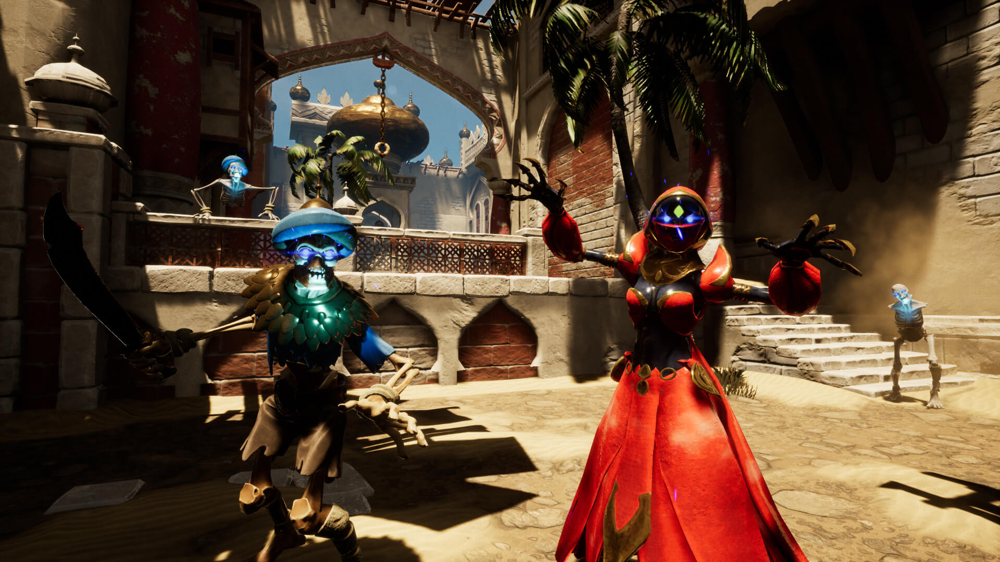
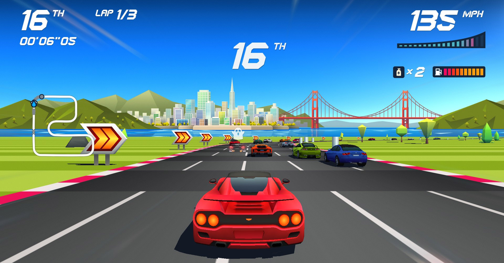
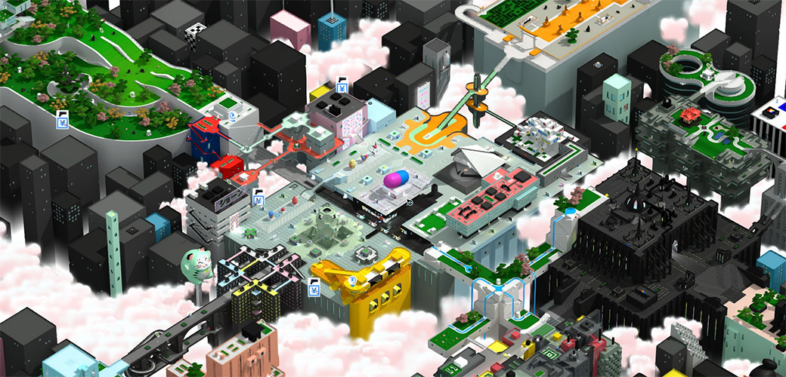

De data aceasta avem nu unul, ci trei jocuri. Trei titluri complet diferite, fiecare cu problemele lui, dar care are, fiecare, ceva prin care iese în evidență, fie că e tematică, atmosferă sau stil. S-ar putea să nu fie toate pentru oricine, dar aproape sigur veți găsi ceva care să vă capteze atenția aici.

## City of Brass

Am încercat și un joc gratis de la Epic, de ce nu (dar îl găsiți și pe Steam). Bine, îl aveam pe wishlist mai de mult, pentru că mă atrăgea tematica și cântărea și echipa din spatele jocului, ce are în componență mai mulți dintre veteranii de la 2K care au lucrat la seria Bioshock. 

**City of Brass** e un shooter roguelike/roguelite/whatever (la fel ca și **Ziggurat** sau **Immortal Redneck**), știți tiparul: niveluri generate aleatoriu, permadeath, experiență adunată la fiecare _playthrough_ care îți deblochează chestii (alte personaje, nu știu dacă și altceva), inamici, capcane, poțiuni, diverse obiecte care îți dau bonusuri și așa mai departe.

Elementul distinctiv al jocului e tematica inspirată din mitologia arabă — un oraș blestemat în mijlocul deșertului, plin de capcane, lămpi cu duhuri, vrăji. Am jucat cam o oră, dar tot prea puțin ca să spun dacă e bun, n-am reușit să trec nici de primul nivel. Mi-a plăcut ca prezentare, decorurile plăcut de arăbești, muzica, atmosfera, felul în care sunt integrate elementele mitologice în gameplay (de exemplu, poți cumpăra _buffs_ sau arme de la lămpi cu duhuri).

Practic, mi-a plăcut cam totul, mai puțin ce ține de combat — e ceva la sistemul de luptă și la felul în care se mișcă personajul care mi-a displăcut de la început, sentiment care nu s-a disipat nici după ce am jucat de mai multe ori. N-aș putea spune exact **ce**, dar totul e puțin cam greoi — aproape ca și când ai purta un costum de scafandru din Bioshock — nu ai un sentiment prea plăcut nici când te miști, nici când lovești inamicii cu armele. Chiar și biciul inspirat de Indiana Jones, care ar fi trebuit să fie un deliciu și pe care îl vedeți și în trailer, în realitate e lipsit de greutate, abia se simte ca o unealtă. A, și sunt și niște capcane cu țepi (precum cele din Prince of Persia) foarte greu de evitat când mișcarea e atât de neplăcută, mai ales când sunt puse în dreptul unei uși. 



Sau poate că nu sunt eu suficient de bun, nu m-am obișnuit cu jocul, sau poate se deblochează chestii mai târziu care fac totul mai plăcut. Nu știu. Dar nici nu m-a prins suficient de tare ca să insist și să revin.

**Mai vreau să joc?** Mă îndoiesc că voi ajunge să-i mai dau o șansă. Nu pot să zic cu fermitate că e un joc rău — poate doar am nimerit eu o zi proastă — dar având atâtea alte jocuri la dispoziție, **City of Brass** nu mai prezintă prea mult interes. Poate doar să am chef vreodată de tematică arabă și să nu am vreun Prince of Persia la îndemână. ■

{{< info-box
  data="4 mai 2018"
  gen="FPS, roguelike"
  producator="Uppercut Games"
  platforme="PC,XBOX, PS4"
  metacritic="https://www.metacritic.com/game/pc/city-of-brass"
  opencritic="https://opencritic.com/game/5984/city-of-brass"
  cumpara="Steam,https://store.steampowered.com/app/301840/City_of_Brass/|Epic Store,https://www.epicgames.com/store/en-US/product/city-of-brass/|Microsoft Store,https://www.microsoft.com/en-gb/p/city-of-brass/c4kwwrbwc5np|PS Store,https://store.playstation.com/en-gb/product/EP8914-CUSA09526_00-CITYOFBRASS00001"
>}}

## Horizon Chase Turbo

Ce nume mișto are, nu?

Nu sunt foarte multe de spus despre **Horizon Chase Turbo**. E un arcade racer „neo-retro”, făcut să evoce stilul colorat și pixelat care se întâlnea odinioară peste tot în sălile de „jocuri mecanice”. Până și paleta de culori și designul de nivel sunt alese pentru a reda atmosfera anilor '80, cu neoane și culori aprinse.

Jocul în sine e foarte simplu, un „joc cu mașini” tipic, cu o structură de progresie cât se poate de liniară. Ai câteva mașini și trasee de început, pe care concurezi pentru puncte cu care să deblochezi alte mașini și trasee, toate grupate în regiuni din mai multe părți ale lumii. Controlul e la fel de simplu, accelerație, frână și ocazional „nitro”, doar să-i dai pedală și să ajungi la final.

Senzația de viteză e mare și jocul se simte destul de plăcut în general, dar are și momente frustrante. Viteza, combinată cu vizibilitatea destul de redusă asupra traseului, va face ca unele curbe să apară brusc și să necesite niște timpi de reacție rapizi pentru a nu ieși în decor. Iar controlul, deși destul de iertător în general (jocul te și ghidează puțin în curbe), nu ajută chiar atât mult, așa că unele curse vor trebui reluate de câteva ori până înveți traseul și vei putea să termini pe un loc care să-ți dea puncte.



**Mai vreau să joc?** Mmm, greu de spus. Jocul e nișat și astâmpără o poftă destul de specifică. E potrivit pentru reprize scurte, dacă aș avea o pauză de umplut, sau dacă am chef de un racer simplu, fără fasoane, dar altfel nu m-a prins cu ceva anume. ■

{{< info-box
  data="4 septembrie 2018"
  gen="platformer, action, "
  producator="Planet Alpha ApS"
  platforme="PC,XBOX, PS4, Switch"
  metacritic="https://www.metacritic.com/game/pc/horizon-chase-turbo"
  opencritic="https://opencritic.com/game/6057/horizon-chase-turbo"
  cumpara="Steam,https://store.steampowered.com/app/389140/Horizon_Chase_Turbo/|Microsoft Store,https://www.microsoft.com/en-gb/p/horizon-chase-turbo/bv3fzp8hc2t5|PS Store,https://store.playstation.com/en-us/product/UP0040-CUSA11275_00-HORIZONTURBOGAME|Nintendo Store,https://www.nintendo.com/games/detail/horizon-chase-turbo-switch/"
>}}

## Tokyo 42

**Tokyo 42** e un joc „gratuit” prin Humble Trove care mi-a atras privirea instantaneu prin nivelurile izometrice stilizate pe care le-am văzut în trailer și în screenshoturi. Nici nu a mai contat ce gen e, am vrut să mă joc în lumea aceea frumos colorată.

Premisa jocului e în același timp clișeică și absurdă: ți s-a înscenat o crimă și ai fost acuzat pe nedrept, așa că trebuie să fugi de poliție și să-ți dovedești nevinovăția... devenind un asasin și omorând alți oameni. Perfect normal. (Dar nu vă faceți griji, suntem în viitor, moartea oamenilor nu mai e permanentă.)

Ca stil de joc avem de-a face cu un Syndicate adus la zi, cu straie moderne și minimaliste, trecute prin filtrul stilistic al lui Mirror’s Edge. Are și o componentă de stealth, pe care încă n-am ajuns s-o folosesc prea mult, dar gameplay-ul e bazat în mare parte pe acțiune.

Acțiune care, din păcate, e și punctul slab al jocului. Dar nu din lipsă de opțiuni, nu — avem catane, mitraliere, uzi-uri, minigun-uri, grenade și câte și mai câte (iar din trailer se pare că există și vehicule în joc, dar încă n-am ajuns să le folosesc). Însă shooting-ul, cu orice armă, e greoi pentru că perspectiva izometrică face țintirea dificilă (iar diferențele de nivel cresc și mai mult dificultatea). Și asta n-ar fi o problemă mare când tragi primul, sau când folosești o armă cu lunetă de la distanță, când ai timp să poziționezi ținta. Dar odată ce ai dat alarma, proiectilele inamicilor (și inamicii) sunt rapide, astfel că un schimb de focuri cu paznicii sau bodyguarzii capului interlop proaspăt ucis devine rapid un bullet hell în care cu greu răzbești.



Dar să revenim la ce mi-a atras inițial atenția. Orașul Tokyo e adevăratul punct de atracție al jocului: grafica și cromatica sunt foarte plăcute ochiului, la fel și designul minimalist al orașului în miniatură și e un adevărat deliciu doar să te plimbi prin oraș între misiuni sau în drum către un obiectiv. La aceasta contribuie și mișcarea personajului, foarte bine realizată și plăcută, iar salturile par a fi scoase din Matrix, deoarece poți sări niște lungimi enorme, iar căzăturile de la înălțime nu par a avea vreun efect. Și încă un detaliu încântător e schimbarea de focus care scoate și mai mult în evidență diferențele de nivel față de poziția personajului nostru și care accentuează și mai mult impresia de dioramă a micului Tokyo. 

**Mai vreau să joc?** Din păcate, deși orașul e un adevărat festin vizual, progresia în joc se bazează pe terminarea de misiuni, care pot deveni frustrante dacă nu investești timp să te obișnuiești cu sistemul deficitar de țintire sau să repeți misiunile până îți ies. Prefer să văd orașul urmărind un Let’s Play pe YouTube. ■

