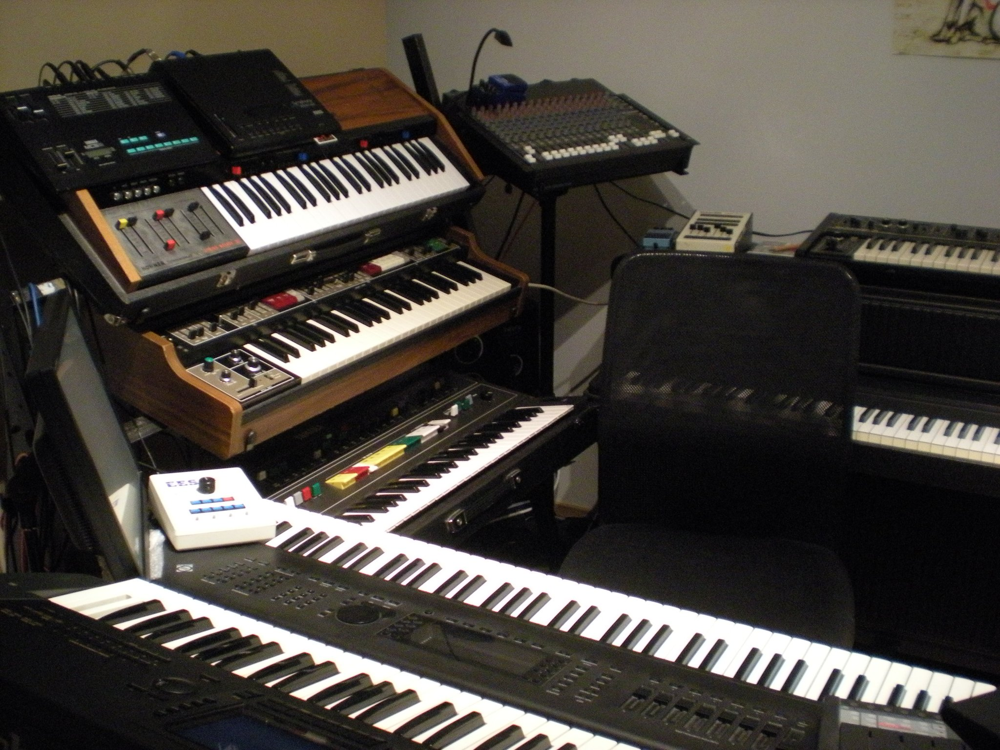
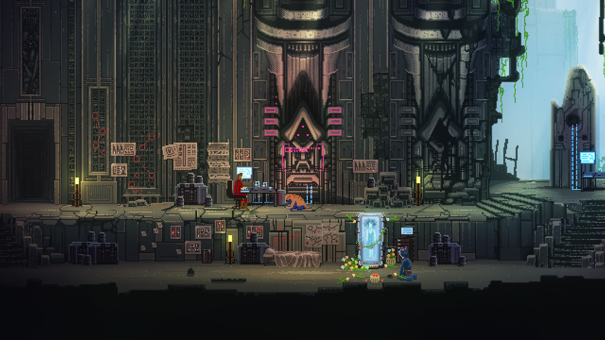
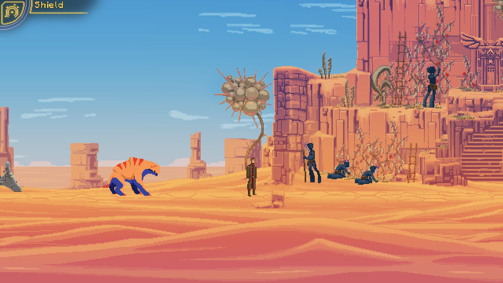
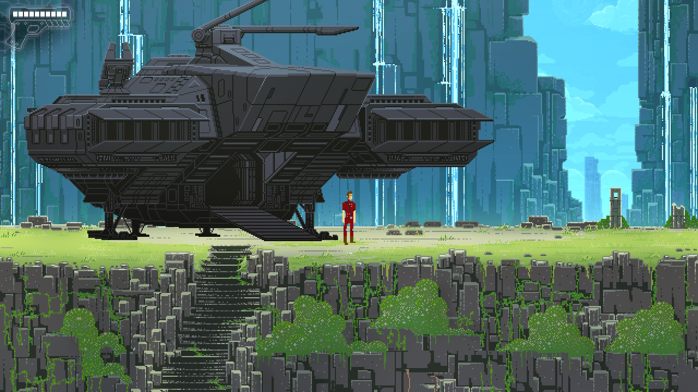
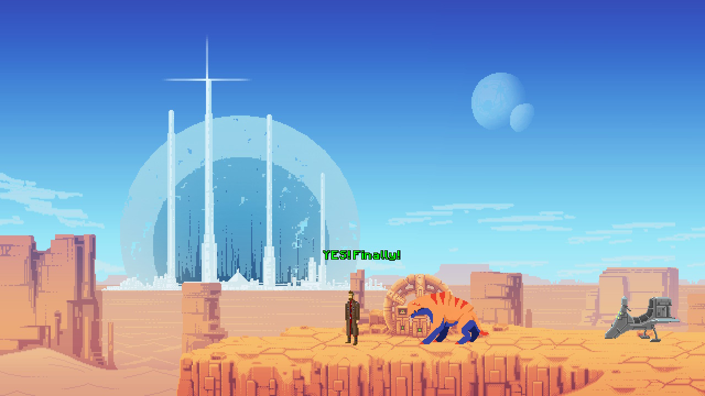

Recent am dat peste un joc care m-a surprins, așa că hai să vă povestesc ce s-a întâmplat. Obișnuiesc destul de des să răsfoiesc magazinele online de jocuri în căutare de reduceri și să văd ce mai e nou. The Way e un joc pe care l-am mai văzut, dar despre care nu știam mare lucru. Îmi amintesc că am citit pe undeva că ar fi un joc dificil și că nu ar avea controlul foarte prietenos (vorbesc despre versiunea de Nintendo Switch), în schimb screenshot-urile erau foarte faine. Se vedea că s-a depus multă muncă în pixel art și asta m-a lovit direct în nostalgie.

Prima impresie a fost că am de a face cu încă un retro side scroller. Dar m-am înșelat, și încă cum! Nu doar că nu e un side scroller așa cum mă așteptam, e un puzzle game foarte inspirat, care arată mult mai bine în mișcare decât în screenshots. Și, cireașa de pe tort, muzica din joc e minunată și creează o atmosferă specială. Mi-a adus aminte instant de jocuri precum Another World sau Flashback.

Nu o să divulg informații despre poveste, vă las să o descoperiți voi, dar o să vă spun de ce am ajuns totuși să scriu acest articol. După ce am terminat jocul eram așa de încântat de experiență încât a trebuit să împărtășesc vestea pe Twitter. Acolo nu am tare mulți followeri, nu-s influencer de ăla, deci îmi cunosc destul de bine auditoriul (salut, joonior). Totuși - minunea internetului! - din noroc tweet-ul meu a ajuns la tipul care s-a ocupat cu muzica din joc, Panu Talus. Am schimbat niște impresii despre joc și-apoi m-am gândit că poate ați fi și voi curioși să aflați mai multe despre experiența lui, iar el a fost destul de amabil încât să răspundă unor întrebări.



***Cine este Panu Talus și cu ce se ocupă el?***

Sunt un muzician și compozitor auto-didact. Nu am studii de specialitate în domeniul muzicii. Asta înseamnă că nu știu să citesc partituri și îmi lipsesc cunoștințele de teorie a muzicii, așa că mă bazez doar pe experiențe și trăiri personale. Țelul meu principal este sunetul, expresia sunetului și emoția pe care o trezește în mine. Consider că metoda mea de a compune muzică e unică, pentru că în principiu se bazează pe improvizație și inspirație de moment, iar modul acesta de a lucra necesită niște intrumente speciale.

Momentan sunt șomer. Chiar dacă am aboslvit de peste 10 ani școala tehnică „Vocational Qualification in Business Information Technology”, nu m-am specializat destul încât să profesez în domeniu. Mereu am fost interesat de calculatoare încă de când eram mic, iar în afară de studioul meu alte hobby-uri ar fi calculatoarele vechi din anii 80-90 care folosesc MS-DOS.

***Care a fost rolul tău în dezvoltarea jocului The Way și cum ai ajuns să cunoști echipa și să lucrezi cu ei?***

Unul dintre prietenii mei de pe Skype cu care am păstrat legătura de-a lungul anilor știa că compun muzică pentru jocuri indie și aprecia ceea ce fac, așa ca m-a invitat să mă alătur proiectului la care lucra. Prin urmare a fost foarte simplu, deci mă consider norocos.

Am fost implicat în proiect chiar de la început, deci am reușit să urmăresc tot procesul de dezvoltare. Mă consider o persoană destul de receptivă când vine vorba de stimulii vizuali ceea ce mă ajută să transpun mai bine emoțiile din imagini în muzică. M-a ajutat foarte mult în procesul de creație a soundtrack-ului faptul că am avut ocazia să testez jocul din faza incipientă. Presupun că am fost și unul dintre primii beta testeri, așadar am reușit să vin cu sugestii despre joc destul de devreme. În afară de coloana sonoră am creat și unele efecte audio.



***Ce experiență profesională ai avut înainte de acest proiect?***

Înainte de jocul The Way eram destul de activ în comunitatea AGS începând cu anul 2010. AGS vine de la „Adventure Game Studio”, un program gratuit care îți permite să creezi jocuri adventure fără să deții cunoștințe avansate de programare. În acea perioadă am compus muzică pentru câteva jocuri indie mai mici create cu AGS. Prima dată când am creat ceva „serios” a fost pentru un joc numit Retina în 2012. Temele pe care le aborda erau foarte serioase așa că a fost destul de interesant să compun muzică pentru un astfel de joc, chiar dacă timpul de muncă a fost limitat. Soundtrack-ul pentru jocul Retina puteți să îl găsiți pe pagina mea de Bandcamp.

Cred totuși că The Way a fost prima mea experiență cu adevărat profesională, debutul meu în lumea jocurilor indie comerciale. A fost pentru prima oară când m-am implicat complet într-un proces compleșitor de creație.

***Cât timp petreci în afara orelor de muncă pentru a te perfecționa?***

Depinde destul de mult. Uneori petrec zile în șir producând muzică, dar alteori pot să treacă chiar și ani fără să produc nimic. De exemplu, după ce am terminat munca la Retina în 2012 nu am mai compus nimic până în 2014, când am început munca la The Way. Bineînțeles că acesta nu e un lucru benefic, pentru că e nevoie de repetiții și muncă susținută pentru a te menține în formă, iar pe lângă asta unele instrumente din studioul meu sunt atât de complexe încât mi se întâmplă să și uit cum funcționează după pauze așa lungi.

***Câți oameni au luat parte la crearea acestui joc? Este totul făcut „in-house” sau s-a apelat și la ajutorul altor studiouri?***

Echipa a fost formată din doar 3 persoane: „șeful” meu, care era regizor, scenarist și programator, un artist grafic și animator (care a creat tot pixelart-ul acela superb manual), iar apoi eram eu responsabil pentru soundtrack și unele efecte sonore. Nu au existat alte persoane implicate în proiect. Playway a fost studioul care s-a ocupat de marketing și de promovarea jocului.

***Ce fel de dificultăți ai întâmpinat în timpul acestui proces și ce fel de compromisuri a trebuit să faci pentru a livra munca la timp?***

Niciodată nu am lucrat după un program fix. Procesul creativ e dificil de obținut atunci când există limitări legate de timp și nu aș putea să estimez cât durează să compun o anumită piesă. Uneori reușeam să improvizez melodii întregi pe loc, în 10 minute, alteori dura 3 săptămâni de muncă minuțioasă, adăugând fragmente mici în încercarea de a obține aranjamentul muzical dorit. S-a întâmplat să nu îmi ajungă nici o lună de muncă, așa că am grăbit unele melodii ceea ce a dus la publicarea unor versiuni „schelet” a ceea ce intenționam să fac de fapt și asta doar pentru că trebuia să trec la urmatoarea piesă.

Sunt un perfecționist, iar dacă rezultatul obținut nu e cel la care mă așteptam, mă simt dezamăgit, chiar dacă cei din jur sunt foarte încântați de ceea ce a ieșit. Probabil că am așteptări prea mari de la mine.

Lucratul de acasă a fost dificil, pentru că dacă nu te poți deconecta de la lucru ajungi să te stresezi mai mult, iar aceasta fiind prima mea experiență cu un proiect comercial, simțeam presiunea de a da tot ce am mai bun. Deoarece nu aveam experiență anterioară, nu știam cât de bine o să pot să lucrez pe termen lung, cât de creativ pot să fiu și cât de inspirat pot să folosesc toate instrumentele din studio, testam așadar apele pentru prima oară. Era greu uneori să îmi dau seama cât de bine mă descurc. Jocul în sine a necesitat atât de multă muncă încât a fost amânat cu un an, deci nu doar eu simțeam stresul.

***Menționam că jocul îmi amintește de niște jocuri clasice de origine franceză care au un soundtrack aparte. Ce te-a influențat în crearea melodiilor? Te-ai inspirat din alte jocuri, filme sau melodii?***

Urmăresc cu plăcere multe filme, anime-uri și documentare și mereu mi-am dorit să pot să compun un soundtrack pentru un film sau un documentar, dar cum asta pare aproape imposibil de obținut, faptul că am reușit să compun muzică pentru jocuri o oportunitate la fel de mare de a îmi împărtăși pasiunea și emoția cu publicul.

Nu vreau să se înțeleagă ca aș considera filmele superioare jocurilor, pentru că eu le consider complet diferite și obișnuiesc să mă joc mai mult decât să vizionez filme, dar pasiunea pentru a crea muzică vine de la TV.

Principala mea influență muzicală va fi întotdeauna Vangelis, dar nu e și singura. Mulți oameni afirmă că jocul The Way le dă o senzație de Blade Runner. Chiar am folosit în joc efectul original Reverb 224, același efect folosit și în muzica din Blade Runner!

Într-adevăr am iubit jocul Another World și a fost o influență majoră, dar recunosc că încă nu am încercat Flashback sau altele. În coloana sonoră pentru The Way am avut influențe din multe alte jocuri de PC sau consolă. De exemplu pentru melodiile din „Underground Temple” m-am inspirat dintr-o piesă din jocul de SNES Jurassic Park 2, pentru starea de groază, stranie și senzația de frică pe care o oferă, în timp ce pentru melodia „Desert” m-am inspirat din Okami (cântecul numit „Cursed Shinshu Field”, ca să fiu mai precis) pentru sentimentul de singurătate, izolare și de frumusețe austeră.

***Ce intrumente folosești pentru a compune muzică?***

De obicei mă folosesc doar de instrumente hardware. Sintetizatoare digitale și analog, claviaturi electronice, samplere, procesoare pentru efecte audio, clape MIDI, pedale pentru volum și pian acustic. Laptop-ul din studio este folosit doar pentru înregistrare, iar software-ul pentru înregistrare e gratis și se numește Audacity.

Pot să spun că iubesc sunetul sintetizatoarelor analog vintage și ale celor cu corzi folosite în anii '70-’80, dar sunt foarte scumpe și necesită o întreținere aparte pentru a le menține funcționale.



***Ce lucruri noi crezi că a adus acest joc și cu ce te mândrești cel mai mult?***

Inițial a fost creat din dorința de a avea un platformer cu o experiență cinematică asemănătoare cu Another World, pentru că sunt foarte puține jocuri moderne din această categorie, ceea ce e surprinzător și simt că a ocupat această nișă. Personal sunt absolut uluit de pixel art-ul din joc. E superb și incredibil de detaliat.

***Fără a da prea multe detalii despre povestea principală, spune-ne despre puzzle-ul tău preferat din joc.***

Cred că preferatul meu e așa numitul puzzle „MABEC”. Ți se cere să programezi un mic obiect pentru a ajunge la un întrerupător. E un puzzle cu un ritm destul de lent și necesită răbdare, dar pentru mine e relaxant și interesant. Din păcate acesta a fost exclus (aproape) complet din ediția remasterizată pentru că mulți jucători l-au considerat prea plictisitor.

Un alt segment preferat apare într-o secțiune din nivelul anterior, unde era necesar să iei o foaie de hârtie și un pix și să îți notezi niște lucruri pe care să le ții minte și personal îmi place metoda asta de a participa într-un joc. Însă din nou acest lucru a fost schimbat în versiunea remasterizată și jocul ține minte totul automat, ceea ce mi s-a părut că nu era necesar, mai ales ca Switch-ul te lasă să faci screenshot-uri. Din păcate această schimbare a dus și la eliminarea unui „easter egg” amuzant.

***Legat de produsul final, ce anume ți-a întrecut așteptările și ce crezi că ca ai fi putut face diferit?***

Grafica și animația mi-au întrecut cu siguranță așteptările când am văzut jocul pentru prima oară. Mereu e interesant de văzut cum mici detalii pot să aibă un efect așa de mare, făcând jocul mai bogat și mai spectaculos.

Majoritatea puzzle-urilor au fost excelente și variate, dar sunt și unele care mă fac să-mi dau ochii peste cap, cum ar fi tehnologie extraterestră străveche care se rezolvă cu… un puzzle de tip Simon says. Bineînțeles, nu e ușor să fii inspirat tot timpul. Cred că și modul de control putea să fie mai finisat, dar te obișnuiești cu el destul de repede (cel puțin pe PC. Nu am testat varianta pentru Nintendo Switch, am văzut doar niște video-uri).

Legat de muzică, cred că mi-am întrecut propriile așteptări și majoritatea celor care o ascultă o apreciază. Trebuie să fi făcut o treabă bună, pentru că până și cei care au lăsat recenzii negative laudă muzica!
Ca un reproș personal, nu am apucat să creez la timp o temă unică pentru finalul jocului, ceea ce eu consideram a fi cea mai importantă parte. În cele din urmă am pus la final o improvizație pe care o aveam de prin 2011, dar doar ambițiile mele personale și mândria au fost rănite de asta. Dacă o să reușesc vreodată să remasterizez soundtrack-ul și să îl lansez pe CD, cred că aș încerca să compun o piesă pentru final, așa cum era în planul original.

***Au existat provocări noi când s-a portat jocul pe console?***

Dacă bine îmi amintesc, nici unul dintre noi nu a fost implicat in remasterizarea jocului. De asta s-a ocupat un alt studio, Sonka. Din cauza unor întâmplări nefericite, versiunea remasterizată a ajuns să conțină mai multe bug-uri decât cea originală de pe PC deși au muncit destul de mult să le rezolve și poate că muncesc în continuare.

E păcat că nu am știut de noua versiune decât după ce a fost lansată, pentru că ar fi fost un prilej bun să repar unele fragmente de melodii.

***Povestește-ne despre experința ta cu jocurile – care a fost primul contact, care sunt preferatele tale și ce te mai joci zilele astea.***

La noi în familie am avut doar NES și am împrumutat SNES pentru scurte perioade de timp. Am avut ocazia să încerc multe console si PC-uri acasă la prieteni, dar noi am avut doar NES până când am făcut upgrade la PS1 la început de mileniu, iar mai apoi am avut un computer cu Windows XP. Dar fascinația mea pentru jocuri vechi în MS-DOS a rămas neschimbată, jocuri care nu erau compatibile cu noile sisteme de operare, așa că am început să vânez sisteme mai vechi unde să pot să le rulez fără probleme.

Încă de când a apărut PS2 mi-am pierdut interesul în jocuri noi, dar mult mai târziu am dat peste ceea ce avea să devină jocul meu preferat de PS2: Okami. Mai târziu am descoperit o comunitate creată în jurul jocurilor indie care încă îmi menține interesul chiar și azi. Se pare că cele mai bune jocuri single player axate pe poveste sunt în lumea indie, deoarece în zilele astea e mai profitabil să creezi jocuri multiplayer și clone de FPS-uri.

Jocurile mele preferate sunt cele retro de pe PC și console sau indie-urile moderne. În principiu îmi plac cele în genul Myst sau puzzle games, dar și jocuri simple retro și cam orice fel de platformer. Câteva dintre preferatele mele din anii '90, pe care le și recomand, ar fi Morpheus, The Last Express, Dark Eye, Zork The Nemesis si Beneath a Steel Sky. Sunt prea multe titluri NES și SNES pe care le-aș putea menționa, în schimb jocul meu preferat pentru Sega Mega Drive e World of Illusion. Jocurile indie preferate sunt Undertale, Machinarium, Baba is You, Cave Story si Stanley Parable.

***Finlanda nu e printre destinațiile de top pentru români atunci când vine vorba de călătorii sau muncă. Ce lucruri bune ai putea să ne împărtășești despre acest loc „exotic”, cum îți petreci timpul liber și cum sunt oamenii de acolo?***

Finlanda este o țară frumoasă și nu foarte dens populată, așa că este destul spațiu liber, multe păduri și multe lacuri. E destul de verde chiar și în marile orașe, așa că îmi face plăcere să mă plimb cu bicicleta și sunt multe locuri pentru plimbări și cățărări în parcuri naționale și păduri. În rest petrec destul de mult timp singur cu calculatoarele sau în sesiuni cu prietenii pe console vechi sau calculatoare cu MS-DOS. Îmi place să gătesc mâncare asiatică, în special thailandeză.

***Ești implicat momentan și în alte proiecte? Cât de greu e să gasești proiecte noi?***

De când am terminat munca la The Way în 2016 nu am mai participat la nici un alt proiect. Am avut nevoie de o perioadă foarte lungă de odihnă, dar nici nu am mai primit oferte noi de atunci. În 2018 am avut o reprezentație live și plănuiam să am și altele, dar două dintre instrumentele de bază s-au defectat și a durat mult până am reușit să le repar. Dar plănuiesc să mă apuc în curând din nou de repetiții și o să caut și proiecte noi. Poate dă iar norocul peste mine?

***Îți mulțumim foarte mult pentru timpul acordat și pentru toate detaliile împartășite. Ca ultimă întrebare, unde putem să îți găsim muzica online?***

Cu foarte multă plăcere. O puteți găsi pe pagina mea de bandcamp: https://panutalus.bandcamp.com/

* Soundcloud: https://soundcloud.com/panu-talus
* Twitter: https://twitter.com/MusicFurLife
* Youtube: https://www.youtube.com/channel/UCIo89549JxJOvs2kqW5nlAA

