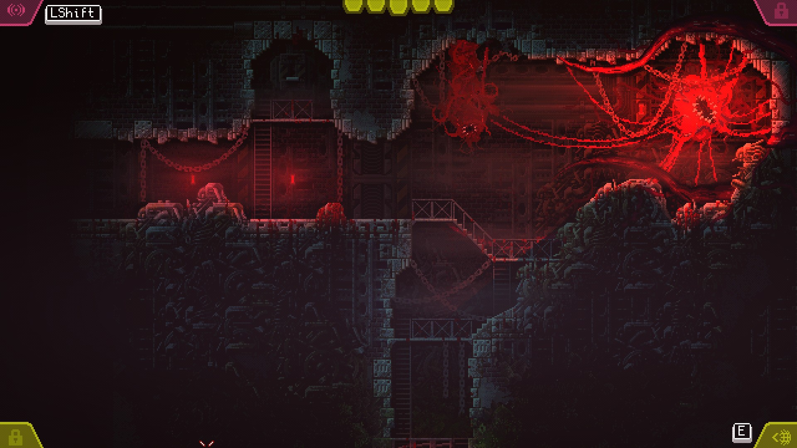
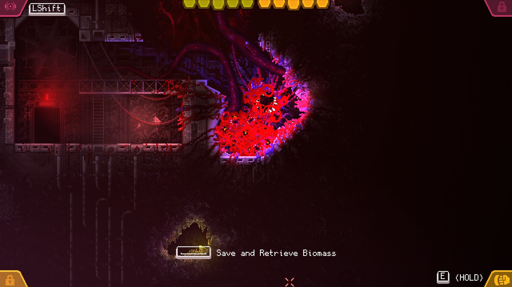

În genul horror, creaturile complet străine nouă, care vânează bieți oameni pe varii stații spațiale sau nave intergalactice au nișa lor bine definită, dar ce e atât de înfricoșător la ele? Da, capul ăla lung și dubla gură a lu' Alien e ceva de coșmar, pentru care îi mulțumim domnului Giger, la fel și gura aia patrulateră a lu' Predator (de ce mereu e gură?). Dar nu sunt doar elementele de fizionomie sau faptul că posedă varii tentacule sau gheare imense. Dacă teroarea ar veni doar de la aspect, ar fi doar simple animale sau insecte mai ciudate care pot fi omorâte cu sutele. Nu, horror-ul adevărat vine când vezi că extraterestrul ăla cu cinșpe guri, care se prelinge cu un sunet umed prin gurile de ventilație, se oprește din sălbăticia lui cu puțin înainte să activeze o rază laser și, în loc de asta, deschide o ușă ușor, apăsând pe clanță, ca să ia prin surprindere o echipă de soldați care erau siguri că era o misiune de rutină.

Când acea ființă prezintă autonomie, inteligență, sapiență, și în mod special viclenie, e momentul să caci pantalonii. Că doar atunci îți dai seama că nu mai ești singurul capabil de a manipula situația. Creatura gândește. Și într-adevăr, în Carrion, indiferent de cât de brutală sau haotică ar fi execuția genocidului de către creatura principală - tentacule supurânde de sânge lăsând dâre pe pereți, rupând corpuri încă țipătoare în bucăți într-o goană grotescă prin coridoare metalice - totuși există vicleșug.

După doi ani de apariție anuală în show-ul Devolver Digital, avem ocazia să intrăm în... carnea... creaturii amorfe grotești din Carrion. Un 2D metroidvania fără grăsime, cu sprite-uri și animații line și bine punctate, tehnic *retro*, dar dintr-o epocă a gaming-ului în care sprite-urile nu au arătat niciodată atât de bine. Ca în orice horror bun, luăm contact cu ființa noastră scăpând din ghearele unui laborator cu oameni de știință care ziceau și ei că sunt în controlul situației, dar care nu erau, și apoi suntem trași ușor-ușor de-a lungul unor nivele foarte metroidvania, corupând mediul înconjurător cu carnea, fostă a rezidenților umani, acum a noastră, prin consumarea lor cu una din multele guri ale creaturii noastre (ce-am zis eu de guri mai înainte?). Din capul locului trebuie să zic că jocul este incredibil de atmosferic. Muzica e mereu apăsătoare și neliniștitoare, nivelurile prin care trecem niciodată nu devin însorite și nici nu se îndepărtează prea mult de claustrofobie. Iar țipetele oamenilor delicioși, a căror viață a fost curmată prea din timp de către creatura mereu flămândă, reușesc întotdeauna să stârnească un sentiment primar, care mă face să mă simt puțin în afara zonei de confort atunci când rup oamenii în două și îi devorez cu gurile ființei noastre.

Ajutând să vândă frumos pachetul de *ce plm tocmai joc*, premenționata ființă cărnoasă formată din tentacule și guri pe care o controlăm se agață lejer de toți pereții, asigurându-ne că putem aproape să „zburăm” prin nivel, fără să ne intereseze ce e în calea noastră. Doar click-and-hold și mica noastră monstruozitate se va târî, încovoia, înota și strânge prin toate locurile unde avem nevoie să ajungem. Deși poate crește în dimensiuni în funcție de cât mănâncă, și poate deveni chiar puțin prea „cărnoasă” pentru a fi ușor manevrabilă prin coridoarele strâmte, totuși își păstrează o agilitate și o nenaturalețe care îi menține caracterul tulburător, și face ca controlul ei să nu fie niciodată „încet” sau plictisitor. În contextul ăsta nu există platforming de nici un fel, asta dacă nu considerăm trasul de manete, deschisul de uși și varii puzzleuri ca bucăți de platforming. Dar jocul totuși oferă destule provocări de traversare a nivelurilor.



Am menționat metroidvania pentru că harta e oarecum deschisă și poate fi deblocată bucată cu bucată, cu ajutorul unor abilități noi, pe care le găsim cu ființa noastră. Dar pus cap la cap, jocul e relativ liniar și foarte light din punct de vedere al navigării. Nu avem hartă per se, dar nu avem nevoie, pentru că jocul are grijă ca noi să ajungem unde trebuie să fim, necontând cât de mult ne pierdem pe drum sau cât backtracking facem. Nici nu trebuie să ținem minte zonele pe unde să ne întoarcem când avem abilitățile de care avem nevoie, pentru că jocul o să aibă grijă să ne ducă înapoi acolo după ce le luăm. Asta face din Carrion o experiență nestresantă, aproape adventure, dacă nu ar fi varii elemente problematice, gen oameni înarmați cu pistoale, androizi înarmați cu aruncătoare de flăcări, roboți înarmați cu mitraliere și turele înarmate cu "Reload Game from Save Point", care să introducă o doză sănătoasă de gameplay în liniaritatea point-and-click-ului de colo colo.

Și pentru asta Carrion se întoarce înapoi la tematică. În funcție de cantitatea de carne care întrupează corpul creaturii, nivel care poate crește sau să scadă de-a lungul jocului în funcție de nevoi, avem diferite abilități ofensive și defensive. Dacă la cea mai mică dimensiune putem să ne facem invizibili ca un cameleon și facem cosplay de Spiderman cu trasul unei pânze de păianjen care lipește inamicii de pereți, la cea mai mare dimensiune, care acoperă o bună parte din ecran, aruncăm cu harpoane de os și ne putem îmbrăca cu un strat cheratinos de protecție. Întotdeauna avem disponibil și un tentacul care poate să tragă oameni într-una din gurile tale, dar și să arunce cutii sau drone, des unele într-altele, cauzând dezastru cu un simplu click dreapta și tras de mouse. Dar același tentacul cu putere destructivă poate fi folosit și într-un mod mai insidios, deschizând o ușă cu o plăpândețe necaracteristică unui monstru de ligamente și mușchi, sau trăgând ușor o manetă. Putem și urla sălbatic, lucru la care oamenii reacționează fugind bezmetici de colo colo, iar soldații activându-și scuturile și intrând în poziție de luptă. Mereu amuzant. Sau mă rog, amuzant atunci când îți iese planul, și rapiditatea și exactitatea mișcărilor și folosirea abilităților merge ca la carte. Căci atunci când asta nu se întâmplă, îți dai seama că totuși ești din carne și oase, și gloanțele dor, iar focul doare și mai tare, și te obligă să fugi repejor la o baltă de apă să te stingi. Combat-ul în Carrion e rapid și decisiv, iar orice deviație de la un atac bine plănuit te poate duce înapoi la respawn. Pe cât de puternică e creatura ta, are nevoie să fie vicleană și are nevoie să își aleagă când și ce atacă, sau chiar să facă o retragere tactică într-un cotlon întunecat, plănuind următorul atac sau diversiune. Faptul că după jumătatea jocului avem ocazia să și controlăm oameni cu ajutorul unui tentacul special infiltrat în creierul lor, și să-i facem să tragă asupra camarazilor doar adaugă încă o dimensiune de horror la toată treaba asta cu jucatul de-a monstrul.

Dar background-ul contextual pentru jucatul ăsta de-a monstrul pentru o bună parte din joc rămâne undeva în afara cadrului. Câteva elemente de storytelling umplu niște goluri, destule doar cât să aibă sens ce se întâmplă, dar care niciodată nu împing motivația jucătorului. E interesant cum progresia creaturii și scopul final reies doar din acțiunile directe ale jucătorului, folosindu-se de acea linearitate a poveștii. Nu avem nici o voce în cască sau obiectiv pe ecran care să ne zică ce să facem. Noi facem, și consecința acțiunii care reiese era ce se voia. Mi se pare un mod de a spune povestea foarte bine gândit pentru ceva în care controlezi o creatură inteligentă, dar totuși primordială.

În orice caz, Carrion o să fie alături de noi pentru aproximativ patru ore în care traversăm zone, mâncăm oameni, distrugem aparatură militară și mâncăm mai mulți oameni, și este o experiență fluidă și cu o progresie care te trage frumușel de mână prin coridoarele pline de intestine și sânge de la început până la final, având grijă să nu te piardă la jumătatea drumului. Jocul știe ce vrea să facă și știe cum să facă asta, și asta este complet de aplaudat pentru un titlu indie. E un pachet întreg și dens, fără tentacule în plus sau lipsuri care se simt în mod special, și de departe una dintre cele mai bune sinergii de tematică și gameplay pe care le-am văzut în ultimul timp. Dacă nu e clar, recomand. ■
