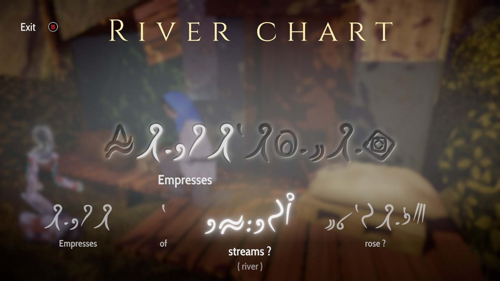

Pe vremuri eram un mare fan al filmelor Indiana Jones și, de altfel, al oricărui film, joc sau carte care avea oricât de puține elemente de arheologie și reușea să mă transporte în lumi de mult dispărute și civilizații înghițite de fălcile istoriei. Evident, din acestea nu lipsea „împrumutul” unor artefacte prețioase, pentru că trebuie să trăiască și protagoniștii din ceva, nu-i așa? Din păcate, odată cu avansarea în vârstă, puține au mai fost creațiile care au reușit să îmbine pentru mine sentimentul acela de curiozitate copilărească amestecată cu mister și o ușoară neliniște în fața necunoscutului. De obicei se optează pentru scene spectaculoase de acțiune, dar care calcă în picioare orice fărâmă de rigoare științifică sau de respect pentru obiecte vechi de mii de ani. De la periplurile Larei Croft prin ruine exotice la exploziile bombastice din Uncharted, toate aceste aventuri sunt complet opuse fascinației și respectului pentru culturi străvechi pe care le-ar manifesta un anume căpitan Picard din Star Trek. Ei bine, Heaven’s Vault reușește să satisfacă această dorință mereu flămândă pentru cunoaștere și explorare.

Realizat de meșterii de la inkle, dezvoltatorii din spatele cunoscutelor **80 Days** și **Sorcery!**, **Heaven’s Vault** a apărut ca o gură de aer proaspăt printre jocurile adventure recente, aducând, prin intermediul trusei sale de arheologie, povești scoase parcă din legendele mesopotamiene străvechi, un limbaj antic realizat de la zero de dezvoltatori, precum și mecanici de joc menite să scoată lingviștii și etimologii din noi toți.



Acțiunea din joc are loc într-o nebuloasă cu planete populate de ființe umane care trăiesc în armonie cu roboți despre care nu se cunosc multe lucruri, doar că au fost dezgropați în diverse situri arheologice. Iar ceea ce face deosebit acest leagăn al civilizației umane sunt „râurile” care fac legătura între planete, practic un fel de zone de navigație formate din gaze precum hidrogenul și oxigenul. Adică adevărate ape înghețate care permit trecerea navelor spațiale. Este știut că nebuloasele spațiale reprezintă adevărate „maternități” ale planetelor născânde, fiind formate la rândul lor din diverse elemente chimice rezultate în urma morții unei stele. În ciuda acestui lucru, aș spune că râurile din joc reprezintă mai mult metafore ce ne trimit la trecutul omenirii și anticii săi exploratori, cum ar fi navigatorii fenicieni.

Secretele acestei nebuloase le vom dezgropa prin intermediul Aliyei Ersala, o arheoloagă plină de personalitate cu prostul obicei de a pierde roboții care îi sunt desemnați pentru diferite misiuni. Alături de ea îl avem pe Six, cel mai recent robot-asistent, numit astfel pentru că este al șaselea robot al ei. Ceilalți au sfârșit în diferite moduri tragi-comice care ne sunt menționate în treacăt pe parcursul jocului.

Misiunea primită de Aliya la început este de a-l localiza pe profesorul Janniqi Renba, un specialist în robotică dispărut în circumstanțe din cele mai suspecte. Astfel, prima planetă cu care facem cunoștință este Iox, capitala nebuloasei, cu un trecut imperial glorios încă din cele mai vechi timpuri. În cele aproape douăzeci de ore pe care le vom petrece în joc, vom călători pe planete dintre cele mai variate. Printre ele se numără Elboreth, planeta de baștină a Aliyei, considerată a fi un fel de planetă-mahala, dar cu indicii ale unei istorii chiar mai străvechi decât Iox-ul. Altă destinație remarcabilă este Renaki, planetă comercială care aduce a bazar din Samarkand unde fiecare persoană are câte ceva de vândut sau de dat la schimb.



Vom naviga între planete în nava spațială a Aliyei, numită Nightingale, aceasta fiind ea însăși un artefact găsit de Aliya, a cărui origine o putem descoperi pe parcurs. Inspirată dintr-un concept ceva mai vechi din science fiction, nava este una „cu pânze”, care de regulă ajută la propulsie prin intermediul vânturilor solare, deși în jocul de față nava se mișcă cu ajutorul curenților din „râuri”. Deși această componentă de navigație este interesantă la început, mai ales pentru că este acompaniată de o muzică melancolică ce ne trimite spre contemplație și introspecție, călătoria spațială se poate transforma după câteva ore de joc într-o corvoadă. Nu sunt prea multe peisaje de văzut pe timpul călătoriei în nebuloasă, așa că funcția de fast travel implementată de Inkle după un patch este binevenită. Nightingale se poate direcționa spre stânga sau dreapta din taste și îi putem da un boost de viteză apăsând click dreapta, dar dincolo de asta noi doar ne lăsăm purtați de curenți și avem de ales între ocazionalele bifurcații.

Odată ajunși pe planeta sau luna dorită, o putem controla pe Aliya din clasicele WASD și cu câte un click de mouse pentru a interacționa cu anumite obiecte sau persoane. Pe lângă acestea, apăsând Q sau R la momentul potrivit, ne putem delecta cu ocazionale gânduri ale Aliyei. Acestea pot fi remarci sau întrebări adresate robotului, dar cu un timp limitat în care le putem alege, fiind apoi înlocuite de altele. Interacțiunea cu personajele este realizată relativ simplu, dar ne sunt oferite diferite metode de răspuns. Aliya poate flirta, poate răspunde autoritar și tot așa, astfel fiind diferită și reacția pe care o vom obține de la celelalte personaje. Aceste dialoguri vor putea avea efecte mai mult sau mai puțin importante pentru desfășurarea jocului, unele blocându-ne căi pe care am fi putut să le urmăm, altele deschizându-ne noi portițe. Dacă tot am menționat personajele, aș vrea să adaug că fiecare dintre acestea se potrivește ca o mănușă planetei sale de proveniență și îi poate fi de folos Aliyei în moduri diferite. Evident, cum nimic nu este gratis, unele favoruri le putem obține doar oferind la schimb vreun artefact găsit înainte. Sau un pomello dat la schimb pentru o șopârlă gecko, dar asta vă las pe voi să descoperiți.

De asemenea, putem lua unele decizii mai mult sau mai puțin etice pe parcursul jocului, care, deși nu vor influența povestea în mod important, adaugă sare și piper experienței. Abandonăm pe o planetă pustie două persoane care au încercat să ne atace, condamnându-le astfel la moarte? Facem cunoștință cu o împărăteasă? De menționat este și dialogul din joc, cu înflorituri lirice pe ici pe colo, scoase parcă din Epopeea lui Ghilgameș.

Elementul principal al jocului, care ne va ocupa cea mai mare parte a timpului, este cel de traducere. În diferitele situri prin care vom călători vom găsi diverse obiecte inscripționate în Antică, o limbă considerată moartă și pierdută. Componenta lingvistică este creația dezvoltatorilor jocului și se observă atenția la detalii pentru că aduce aminte de formele străvechi de proto-scriere ale omenirii, cu simboluri menite să reprezinte anumite lucruri sau fenomene naturale, dar și o întreagă gramatică care așteaptă să fie descoperită. Atunci când dăm peste o asemenea inscripție, protagonista noastră încearcă să o traducă și sub fiecare cuvânt din Antică ne sunt oferite trei variante de traducere, iar noi va trebui să alegem cuvântul care pare cel mai aproape de o tălmăcire exactă. Putem face asta analizând fiecare glifă și simbolistica sa, sau încercând să intuim sensul corect al cuvântului în funcție de restul propoziției. Nu vom afla dacă un cuvânt este tradus corect până ce nu îl vom mai întâlni și în alte obiecte sau artefacte, de-abia apoi Aliya având certitudinea dacă ceea ce am tradus este bine. Din fericire, putem reveni oricând asupra unei traduceri accesând meniul jocului, iar acuratețea interpretărilor pe care le facem nu este esențială progresului în joc. În schimb recompensa unei traduceri bune constă în frânturi de istorie care ne ajută să punem cap la cap faptele petrecute în trecut, lucru pentru care ne sare în ajutor și bara cronologică din interfața jocului. Acolo putem revedea toate evenimentele trecute, la care adăugăm întâmplări noi, cu fiecare descoperire făcută.

Grafic vorbind, Aliya ne este prezentată sub formă bidimensională, ca o ilustrație desenată pe fundaluri tridimensionale, realiste. Aliya este ușor transparentă pe ecran, ca și cum ar fi ea însăși o fantomă care se plimbă printre ruine. Ultima sa poziție ne apare mereu pe ecran, aproape ca un simbol al trecutul atât de apropiat, dar tragic de îndepărtat. De altfel, clădirile și palatele abandonate din joc par scoase din poemul Ozymandias al lui Shelley — mărturii ale măreției umane înghițite de nisip. Pe lângă aceasta, arhitectura clădirilor prezintă influențe din cele mai variate, atât islamice, cât și mediteraneene. Chiar și o simplă plimbare printr-un amplasament comercial de mult abandonat ne va face să ne simțim ca niște turiști în Maroc, doar că lipsa oricărei ființe umane ne va da un ușor sentiment de neliniște. De altfel, puțin timp din joc îl vom petrece împreună cu alți oameni. De cele mai multe ori ne vom afla singuri, doar noi și robotul, prin cimitirele istoriei. Dar singurătatea acestui joc nu este una sfâșietoare, ci mai degrabă serenă, simțindu-ne ca și cum am face parte din rotițele omenirii, doar umbre trecătoare peste deșertul suveran.



Deși ne îmbie cu melodii liniștitoare în voiajele noastre prin nebuloasă, aș spune că adevărata muzică din **Heaven’s Vault** este formată din sunetele cotidiene date de viața de pe planetele pe care le vizităm. Liniștea din biblioteca de pe Iox, grohăiturile porcilor din fermele de pe Maersi, larma comercianților din piețele de pe Renaki, toate acestea reprezintă motive ale unei teme foarte importante într-un joc pe care îl petrecem printre ruinele civilizațiilor moarte, mai exact motive aparținând vieții. Iar aceasta face parte din temele profunde pe care le abordează jocul, cum ar fi transumanismul prin trecerea conștiințelor umane în roboți și fragilitatea existenței umane și a monumentelor sale. Nici religia nu lipsește din această experiență. Foarte mulți indivizi sunt adepți ai Buclei, adică unirea sufletelor după moarte cu râurile nebuloasei, o interpretare puțin diferită a mitului egiptean în care sufletele morților călătoresc pe barca zeului Ra.

Nu știu ce concluzie aș putea scrie care să facă cinste jocului. Da, are micile sale probleme, cum ar fi durata prea lungă, finalul cam sec sau corvoada în care se pot transforma călătoria spațială și traducerile. Dar dincolo de toate astea, **Heaven’s Vault** reprezintă mai mult decât orice o epopee adresată continuității vieții și a omenirii, indiferent câte imperii s-au ridicat și au căzut, precum și un elogiu adresat precarității umane, dar și capacității sale de a ajunge cândva printre stele. ■
