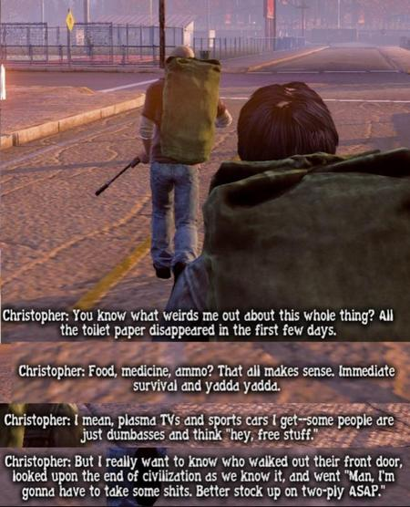
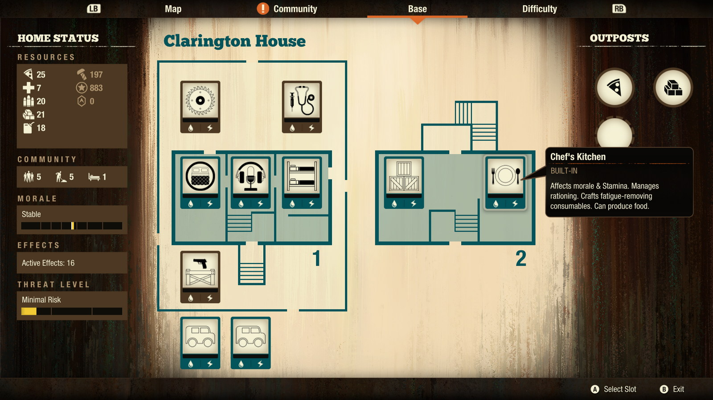
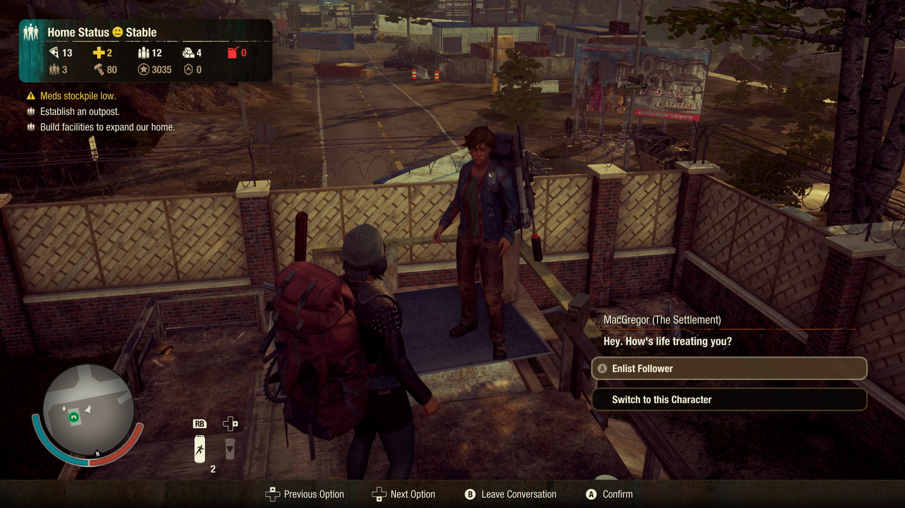
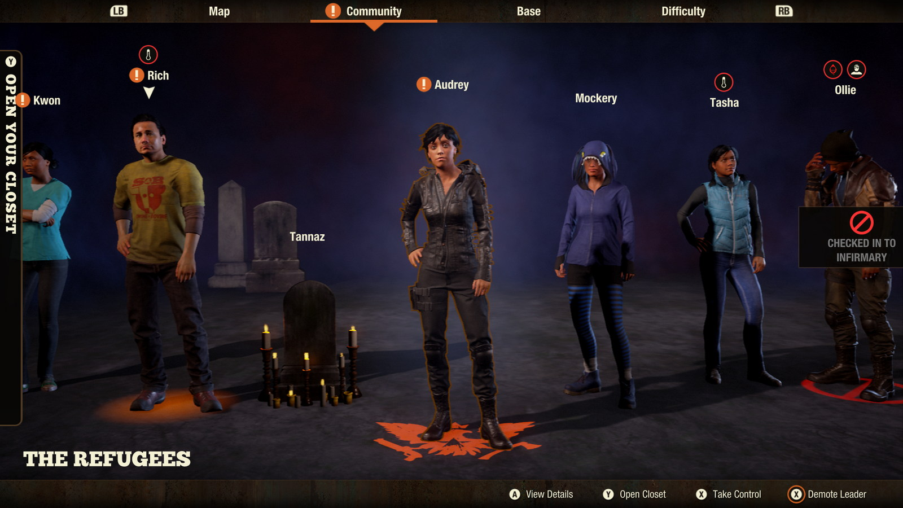
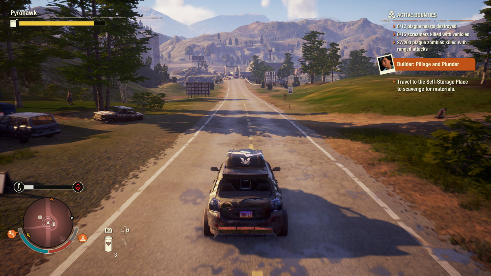
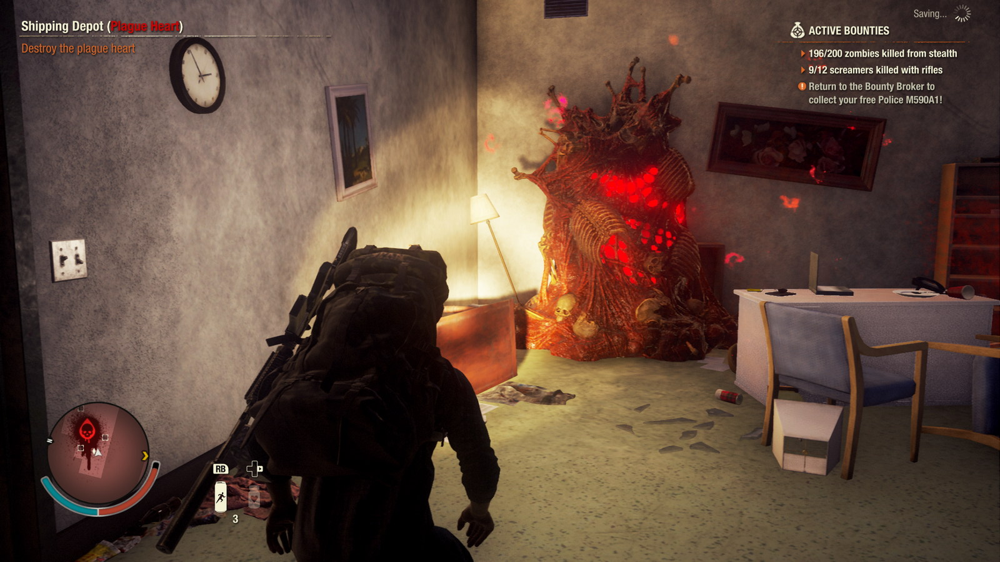
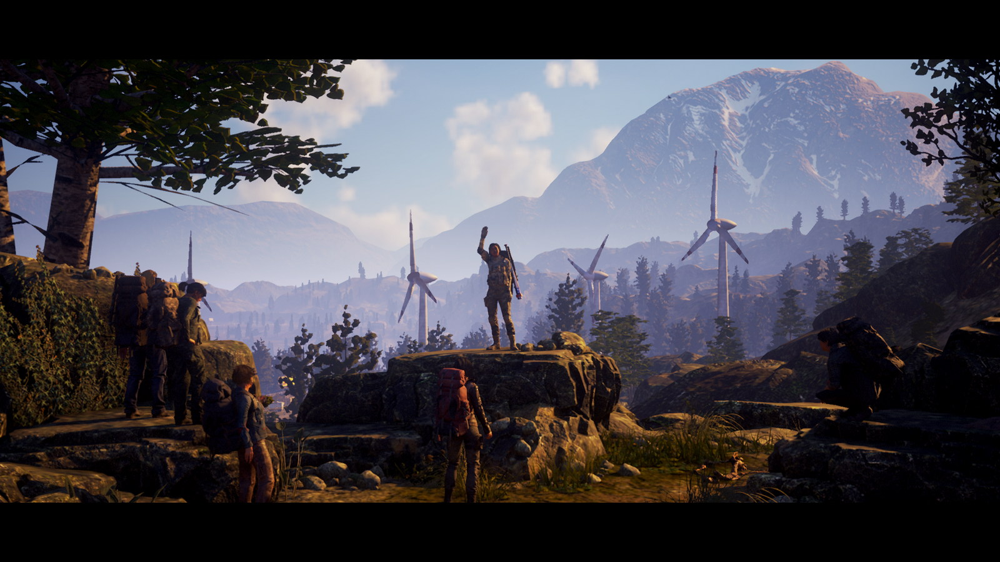

Seria State of Decay este pentru mine încadrată într-un gen aparte, pe care mai în glumă, mai în serios, îl denumesc _Simulator de Zombie Apocalypse_. Simt că trebuie să fac această precizare pentru că în anii 2000 am fost asaltați de nenumărate titluri în care activitatea principală a jucătorului era eliminarea valurilor de zombies livrate furios și iute de developeri, bucuroși ca nu au practic de programat nicio rutina AI mai complexă decât „runForwardAndAttack();”. 

Acest trend are efectul de a trivializa în mintea multor jucători orice titlu care conține zombies, ceea ce afectează pe nedrept unele titluri ca **State of Decay**, în care accentul principal se pune pe experiența de supraviețuire și dezvoltare a unui grup și are multe aspecte legate de management social sau al resurselor, dincolo de elementul banal de combat. De asemenea, și _trope_-uri pe care le vedem în seriale ca The Walking Dead sunt foarte bine surprinse și încadrate în secvențe de gameplay pline de tensiune și alegeri dificile.

Primul joc al seriei, apărut în 2013, a fost un _cult classic_, foarte neșlefuit pe partea tehnică (bug-uri, _framerate_ scăzut), dar extrem de satisfăcător pentru cei care pot vedea dincolo de ambalaj. Anul 2020 ne-a demonstrat că a avut chiar și [momente profetice](https://www.reddit.com/r/StateOfDecay/comments/fjjzte/state_of_decay_1_called_it_back_in_2013):

L-am jucat cu mare plăcere la vremea lui, iar de la sequel așteptam o evoluție majoră spre un standard de calitate ridicat, care să aducă seria și studioul Undead Labs în mainstream. Din păcate, la lansarea din 2018, și State of Decay 2 s-a dovedit a fi destul de șubred din punct de vedere tehnic și lipsit în mare măsură de șlefuirea la care speram. Review-urile pozitive, dar nu tocmai entuziaste, și mai ales promisiunile de actualizări din partea dezvoltatorilor m-au făcut sa evit acest sequel la lansare și să îl pun pe lista de așteptare spre a fi experimentat într-o stare mai bună.

Ca o paranteză, dacă vreodată v-a încercat acest sentiment, nu sunteți singuri — aruncați un ochi pe subbreddit-ul [/r/patientgamers/](https://www.reddit.com/r/patientgamers/), care se prezintă cu următoarea descriere:

> A gaming sub free from the hype and oversaturation of current releases, catering to gamers who wait at least 6 months after release to play a game. Whether it's price, waiting for bugs/issues to be patched, DLC to be released, don't meet the system requirements, or just haven't had the time to keep up with the latest releases.

## ***

Decizia de a aștepta s-a dovedit a fi una inspirată, pentru că la începutul anului 2020 Undead Labs au anunțat un update major al jocului, denumit Juggernaut Edition (după cel mai masiv și periculos tip de zombie din joc), care promitea nu doar nenumărate bugfix-uri și îmbunătățiri vizuale, ci și conținut nou și includerea DLC-urilor deja lansate într-o versiune unică a jocului, care urma să fie distribuită inclusiv prin abonamentul Game Pass (Xbox si/sau PC). Jos pălăria pentru suportul post-lansare!

Am început așadar jocul cu pași timizi, pe cea mai nouă dintre cele 4 hărți disponibile. Providence Ridge prezintă un relief variat, cu zone rurale orientate spre turism montan, restaurante la marginea drumului, exploatări forestiere, ferme, șantiere și o zonă urbană cu densitate mai mare a clădirilor.

Există câteva arhetipuri de supraviețuitori cu care poți începe jocul, sau poți lăsa crearea personajelor inițiale în seama lui RNGesus. De altfel, dincolo de punctul de start, toate personajele (jucabile sau NPCs) pe care le vei întâlni sunt generate de joc, de la nume, până la înfățișare, stats, traits și echipament.

Primele ore au constat în explorarea foarte precaută a împrejurimilor bazei de start (un _firewatch tower_ de la marginea pădurii) și asigurarea unor stocuri decente din fiecare resursă de bază: mâncare, combustibil, medicamente, muniție, materiale de construcție. Denumirile sunt destul de descriptive — unele resurse se consumă pasiv de membrii grupului, altele sunt necesare pentru reparații, dezvoltare, deplasare sau luptă.

Cu timpul, baza se poate extinde, oferind mai multe facilități de cazare, crafting sau bonusuri, iar atunci când spațiul devine insuficient, tot grupul poate alege o alta locație din cele descoperite pentru a muta baza cu totul. Spațiul disponibil, poziția pe hartă și consumul de resurse sunt factorii care decid necesitatea acestei acțiuni. Sau poate doar nevoia de noi provocări și de a schimba rutina.

Schimbarea personajului activ se poate face în orice moment, asta și pentru că _stamina drain_ și oboseala sunt simulate destul de agresiv, astfel că rotația personajelor disponibile devine o obișnuință.

O mecanică pe care am apreciat-o mult este cea de AI companion. Nu e obligatoriu, dar jocul permite înrolarea unui membru din grup pentru a te asista în raiduri și misiuni. Asta scade un pic dificultatea („two crowbars are better than one”), cu prețul unui consum mai ridicat de resurse. Dar confortul psihologic de a mai avea un tovarăș alături, în timpul apocalipsei, e neprețuit.

Acțiunile întreprinse cu fiecare personaj în parte determină creșterea stat-urilor aferente acțiunii respective (_cardio, wits, fighting, shooting_). La anumite praguri, există posibilitatea de alegere a unor skill-uri pasive, care permit conturarea unor „clase”, în funcție de ce tip de personaj dorești să ai în grup. De exemplu, de la nivelul maxim de _cardio_ poți evolua într-un sprinter neobosit, sau un cal de povara care poate duce in spate cantități impresionante de loot. Iar de la _wits_ maxim poți alege să fii super stealth sau să ai un ochi mai bun în găsirea resurselor.

Există și niște trait-uri de personalitate care modifică de obicei dinamica personajului în grup, în bine sau, mai des întâlnit, în rău (certuri în grup care afectează moralul și implicit eficiența). Numele trait-urilor sunt foarte creative și comice — favorita mea e _„All out of fu**s. I have none left to give.”_



Așa cum e de așteptat, combatul permite abordări diferite. Stealth-ul e de departe cea mai sigură (dar lentă) variantă. Zombies sunt aproape orbi și cât timp te furișezi, poți ajunge lângă ei fără probleme, pentru un _takedown_ visceral și foarte eficient. Si melee-ul classic merge bine, dar face mai mult zgomot și are dezavantajul de a degrada armele, care vor avea nevoie de reparații sau de înlocuire.

Shootingul e mai degrabă o soluție de rezervă, pentru a scăpa dintr-o situație disperată. Gloanțele nu sunt tocmai abundente, iar zgomotul făcut de arme (dacă nu au amortizor) atrage mai mulți zombies, într-o spirală a violenței care de obicei se termina cu un sprint eroic spre cel mai apropiat vehicul, iar în cel mai rău caz cu un astfel de ecran:

Dacă mai era nevoie s-o spun, moartea unui personaj e permanentă. Tot progresul făcut în _skill tree_ se pierde, iar grupul primește o importantă penalitate de moral pentru o vreme. Răsucind cuțitul în rană, jocul te îndeamnă să revii la locul în care un personaj a cazul la datorie pentru a recupera echipamentul și loot-ul.  Asta n-ar fi mare lucru, dar ai toate șansele sa fii nevoit sa îl mai omori o dată pe fostul coechipier, de data aceasta reanimat sub formă de zombie. E devastator, dacă îți permiți să te atașezi emoțional de omuleții virtuali și ai pus suflet și efort în evoluția lor. _I’m sorry, Tannaz_...

Totuși, astfel de momente te întăresc și te obligă să fii mult mai calculat în planificarea raidurilor viitoare. Nu vei mai pleca niciodată din bază fără să fii odihnit și cu buzunarele pline de medicamente, gloanțe, grenade și momeli de zombie (petarde, artificii, sau chiar un Boombox pe baterii, demn de anii 80). Și evident, cu plinul făcut la mașina cu care pleci în misiune.

Apropo de asta, partea de driving e destul de arcade, dar excursiile la volan printre hoardele de zombies sunt foarte distractive oricum. Lipsește din păcate un radio in-game la care sa cânte „Take Me Home, Country Roads”, dar Spotify poate suplini. Sau dacă ascultați, ca mine, podcasturi pe fundalul jocurilor open world, **SoD2** se pretează de minune.

Revenind la o imagine de ansamblu, cea mai mare schimbare la acest joc, față de primul din serie, este cea legată de elementul principal de progresie al jocului. Dacă la SoD1 aveam NPC-uri predefinite și un lanț clar de misiuni, la **SoD2** jocul generează evenimente pseudo-random care te obligă să reacționezi și să muți starea jocului spre un anume deznodământ. De exemplu, grupuri străine de supraviețuitori îți pot cere ajutorul, și în funcție de răspuns, sau de lipsa lui, poți avea beneficii precum posibilitatea de recrutare de membri noi în comunitare, sau, din contră, îți poți face inamici, de data asta umani, mult mai periculosi decat zombies.

Probabil cea mai inflexibilă parte a jocului e cea legată de condiția care îți permite să declanșezi finalul. Pe hartă există inițial 9 _plague hearts_ care trebuie eliminate. Ele sunt de fapt niște conglomerate de biomasă infestată, aflate în diverse clădiri, și care dau naștere acelor _plague zombies_ roșii, care sunt mai agresivi și contagioși.

Deplasarea în aceste zone necesită atenție sporită, pentru că zombies sunt mai sensibili în jurul lor. Aici, armele incendiare sau explozibilii se vor dovedi de mare ajutor. Distrugerea acestor _plague hearts_ va declanșa o misiune majoră care, odată îndeplinită, declanșează cutscene-ul final.

Ca ultim pas, jocul permite „stocarea” supraviețuitorilor din grupul curent (cu tot cu echipament și stats) pentru a fi folosiți în _playthrough_-uri ulterioare.

Am fost surprins să observ că, după ce am terminat jocul prima oară, aveam în continuare un chef nebun de încă un playthough. Nu îmi stă în fire. De obicei când termin un titlu trec rapid la altul; nici măcar DLC-urile nu mă țin lipit de un joc, după ce am văzut genericul de final.

Totuși, **SoD2** a reușit sa facă asta. Probabil faptul că există 4 hărți total diferite ca relief si configurație, iar apoi sunt 4 arhetipuri de lider de grup pe care le poți folosi (Builder, Trader, Sheriff, Warlord) și care determină atmosfera și obiectivele generale ale grupului.

Sau poate e doar sentimentul de forță a naturii pe care îl dobândești după ce înțelegi regulile lumii noi și după ce omori 4330 de zombies, așa cum îmi spune contorul din sistemul de _achievements_ al consolei.

## ***

Da, am jucat destul de mult **State of Decay 2**. Sunt deja la al 4-lea (!) _playthrough_ acum — ăsta chiar ar trebui sa fie ultimul — și pot spune că, în ciuda câtorva probleme tehnice (animații cam țepene, ceva bug-uri de fizică în interiorul clădirilor), m-am distrat de minune și recomand acest titlu. Și nu doar fanilor de ficțiune cu zombies. Combinația de action, management și open world e foarte reușită, la modul general, iar dificultatea pe modul Standard e relativ redusă cât timp se aplica un minim de precauție. Pentru provocare suplimentară sunt disponibile cele două niveluri superioare de dificultate: Dread Zone și Nightmare Zone. Sau dimpotrivă, puteți încerca recent adăugatul Green Zone pentru o experiență relaxantă.

Merită menționat că există și un mod co-op. Eu nu l-am încercat, dar îmi imaginez ca ar fi foarte distractiv alături de un prieten care împărtășește pasiunea pentru astfel de jocuri.

De curând, Microsoft a prezentat și un [CGI trailer](https://www.youtube.com/watch?v=0mJQqTzDp28) pentru State of Decay 3. Probabil vor mai trece ani buni până la lansare pentru că **SoD2** încă primește conținut și actualizări. Sper să folosească bine timpul rămas, iar următorul titlu să fie încă o evoluție, cel puțin la fel de mare. Cine știe, poate chiar până la nivelul AAA de calitate.

Până atunci, jucați-l pe acesta. E disponibil la un preț absolut rezonabil pe Xbox One, Steam, Windows Store și va fi mereu inclus în abonamentul Game Pass, care e o propunere greu de refuzat pentru orice gamer. ■