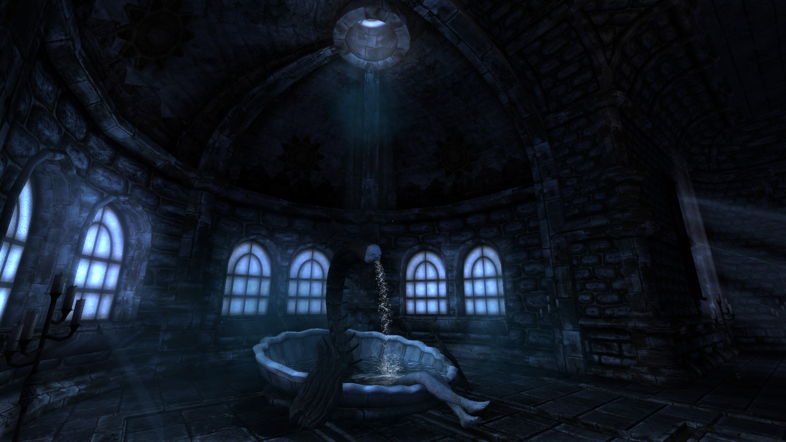
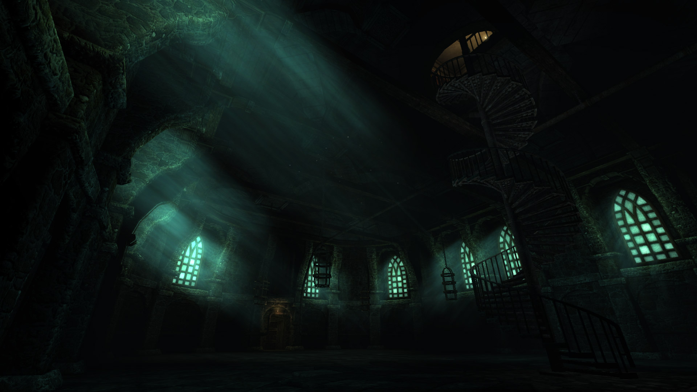
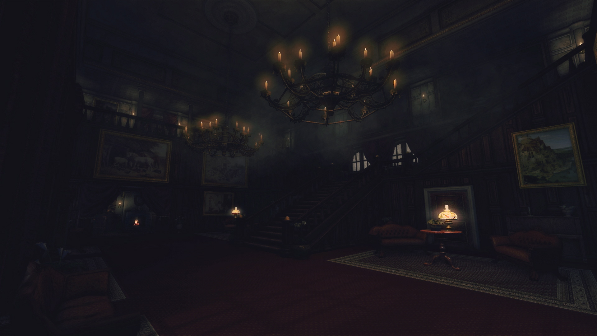
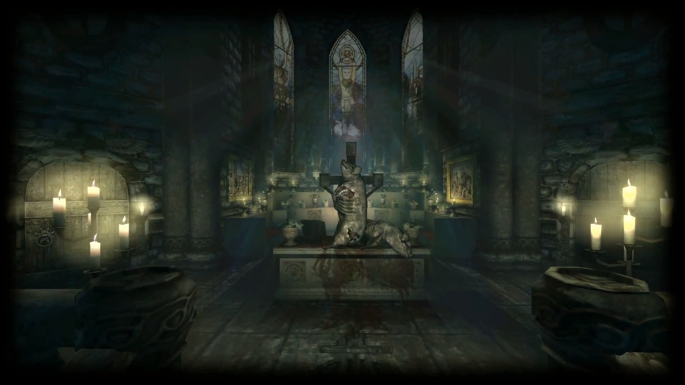
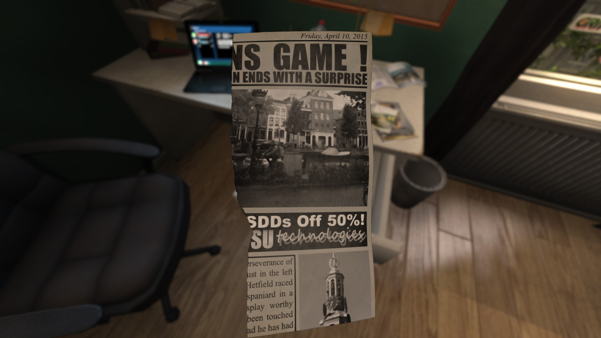
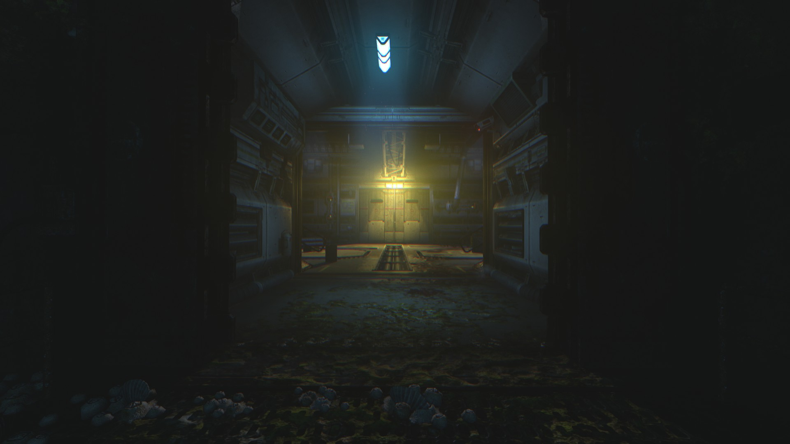
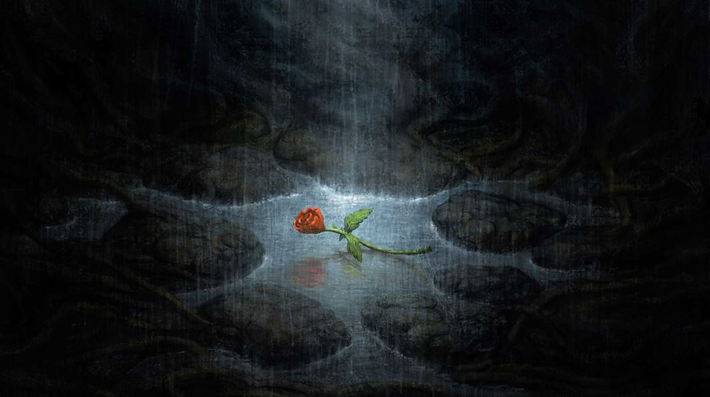

### *God of Terror, very low dost thou brings us. Very low hast thou brought us.*

Străbunii amatori de măsline și geometrie sintetică trasă cu bățul pe nisip au inventat un concept pentru pasiunea de a căsca gura la minunile întunericului, numit simplu mersul-în-jos, sau *katabasis*. În domeniul mitologic, face referire la pogorîrea în lumea subpămînteană, fie din partea unor zeități supraterane ce își exercită puterea asupra morții (Afrodita, Dionis), fie de către eroi muritori pentru care posibilitatea trecerii în neființă nu pare totuși să fie un mijloc de intimidare suficient de dur în calea problemelor care îi frămîntă (Orfeu, Heracle).  

Într-o notă similară, deși nu vom insista prea mult pe cunoștințele noastre în domeniul metalelor ezoterice, altfel destul de precare și complet inutile, totuși vom recomanda curioșilor creația din 2007 a colectivului Deathspell Omega: *Fas – Ite, Maledicti, in Ignem Aeternum*. Asta pentru că tema centrală a albumului, pe care o considerăm foarte potrivită pentru lectura de față, este căderea omului în dizgrația divinității. Nu este un subiect interesant numai în sensurile disperării și damnării, ambele inseparabile de o asemenea regresie a condiției sale, cît mai ales în șansa poate paradoxală a eliberării. O astfel de cădere în abis are întotdeauna și o dimensiune interioară; răscolind întunericul lăuntric, există speranța înțelepțirii și a cuprinderii acelor mistere ale ființei altfel ascunse în lumină. Desigur, nimic nu garantează că dezgolirea adevărului va și fi pe placul celui astfel întunecat, chiar din contră. Mai mult, totul depinde de cerința destul de restrictivă de a nu sărăci în materie de bună judecată de-a lungul prăbușirii.

Motivul pentru care ne-am apucat de acest articol ține de o veste care ne-a luat prin surprindere acum cîteva luni, anume că în toamna lui 2020, Frictional Games (FG) va lansa cel mai nou titlu al seriei Amnesia, intitulat Rebirth, de altfel primul succesor „cinstit” al originalului. Considerăm că este un moment prielnic pentru o retrospectivă a jocului care a creat un subgen al survival horrorului modern și a cîtorva titluri legate strîns de acesta, cu următoarele precizări. În primul rînd, vom discuta numai atît cît ne permite dorința de a nu trînti prea tare din tainele jocurilor. Este o restricție dificilă care face imposibilă o analiză reală, dar considerăm că merită impusă. În al doilea rînd, cu riscul de a părea cam pretențioși, recomandăm oricărui cititor care a ratat aceste jocuri sau care poate nici nu este pasionat de joacă virtuală să pună mînuțele pe ele. Sunt experiențe care îmbogățesc spiritul în sensul discutat în paragrafele anterioare. În ultimul rînd, știm că se va găsi cel puțin un cititor care ne va lua superficialitatea în derîdere și ne va trimite spre seria Penumbra, unde este înfăptuită adevărata meserie. Răspunsul nostru este că, atîta vreme cît implică trasarea cu șoarecul a lemniscatei lui Bernoulli și altor bazaconii ale analizei reale, vom lăsa temerarilor sarcina de a supraviețui ororilor mutante de sub Groenlanda. Suntem jucători de rit nou, apreciem simplitatea filozofică a crăpatului de țeste prin actul sfînt al clickului stîng. Acestea fiind spuse, stingeți lumina, strîngeți dinții și fesierii. Intrăm în ele.

### *Thou art not dead to the devoration of sin*

Lansat în 2010, **Amnesia: The Dark  Descent** (TDD) este un joc ale cărui idei au devenit standarde în domeniu. Ce trebuie remarcat de la bun început e că, pentru un joc ce nu se sfiește să arate fața dură a ororii, cea răsărită din izvorul sadismului, producătorii se îngrijesc să introducă jucătorul în univers cu o atenție aproape părintească. La prima lansare, ni se spune că TDD nu trebuie jucat pentru „a cîștiga”, ci pentru a ne imersa în experiența oferită. Ni se atrage atenția că nu trebuie să ducem grija salvărilor și că deși urmează să fim aruncați într-un univers ostil, nu avem cum să ne apărăm. În final, ni se recomandă căști, o cameră întunecată și calibrarea luminozității monitorului pînă se îngroașă bezna de ne dăm cu stîngul în dreptul, sfaturi credem încă destul de noi la nivelul anului 2010. Mai departe, meniul principal arată ca o scenă extrasă direct din joc, expunînd contrastul dintre lumina caldă a unei torțe și cuprinsul tenebrelor deasupra unui tunel de rău augur, înspre care ne îndeamnă o dîră de lichid sîngeriu. Odată pătrunși în acel tunel, perspectiva se schimbă în vederea tulbure, respectiv împleticirea pașilor și limbii unui cetățean care cu greu își rostește numele, Daniel, și adresa dintr-un district londonez, împreună cu cîteva lămuriri criptice: e urmărit de o *umbră*, trebuie să-l oprească pe *el*. Imediat după, Daniel se paralelizează cu podeaua și bezna îi înghite mintea. Cam asta este tot ce primim în materie de introduceri. Cînd Daniel își revine în simțiri și începe să se scuture din ghearele buimăcelii, ne trezim singuri-singurei în castelul Brennenburg, undeva în codrii Prusiei și cu încă un deceniu rămas pînă la jumătatea secolului XIX. Că a venit vorba de un deceniu, frumusețea castelului nu e cu nimic mai prejos la zece ani de la prima vizită, ambianța oscilînd încă din primele săli între un primitor călduros și un vag ostil. După ce își parcurge ultimii pași în sens invers, Daniel descoperă un bilet pe care aparent și l-a scris el însuși mai devreme și care aduce niște lămuriri la limita obscurului. Aflăm că a considerat a fi în avantajul lui să-și bubuie memoria și că ar trebui să se folosească de beatitudinea ignoranței pentru a găsi un sanctuar în castel. În acest sanctuar s-ar afla un anume Alexander, care trebuie ucis. Nota amintește și de *umbră*, îndemnul lui Daniel către sine fiind să facă joc de glezne și să se miște iute, căci nu are cum să se apere de ea. În mod suspect, documentul trece sub tăcere o serie de puncte pe care le considerăm a fi destul de importante. Acest sanctuar, ca toate destinațiile finale din jocurile Amnesia, se află departe de tot într-o direcție care în cel mai bun caz e certată numai cu Soarele, iar în cel mai rău și cu nivelul mării. Totodată, nota nu menționează că umbra este un fenomen supranatural în spumele turbării și, poate cel mai grav, uită să puncteze faptul că, în ciuda aparențelor, nu suntem chiar singuri-singurei în castel. Cotloanele lui încă sunt bîntuite de slujitorii lui Alexander, ce par genul care ar devora copii prin basme.

Chestiunile de prezentare audiovizuală sunt la un nivel înalt de calitate, lucru valabil pentru toate jocurile discutate în această retrospectivă. TDD este extrem de frumos și variat, castelul și domeniul de sub acesta alternînd cu secțiuni care fie sunt cufundate în întuneric, fie sunt pictate în culori vibrante: săli uitate în colbul evului mediu, aripi mai apropiate de epoca modernă sau de o frumusețe abstractă, ateliere, temnițe, temple închinate misterelor lui Mithras și o bună bucată de tîrît prin tuneluri și conducte. Componenta muzicală este în general destul de discretă în părțile liniștite, dar ne aruncă toate tromboanele în cap în segmentele tensionate, iar efectele sonore au parte de o realizare excelentă, de la apăsarea pașilor care scîrțîie tavanul, la diversele oftări și tînguieli ale unui castel obosit și bîntuit. Săracul Daniel are un accent cam dezgustător de britanic, dar măcar de i-ar fi asta marea problemă.

Poate că cea mai interesantă mecanică de joc ține de interacția lui Daniel cu mediul, moștenită din Penumbra. Obiecte pot fi ridicate și rotite, trase sau împinse, uși sau sertare sunt manevrate printr-o apăsare de buton și mișcarea șoarecului în direcția dorită, valve și alte vrăjeli cu aburi sunt manipulate similar. Uneori, aruncatul cu pietre ca-n bancul cu prostul și balta constituie cheia progresului. E o idee foarte drăguță și imersivă care aduce un suflu nou aventurii, dar vine și cu o chestiune greu de înțeles. Nu că ar încurca experiența de joc; cei de la FG au fost suficient de înțelepți încît să renunțe la construirea unui sistem de luptă care să necesite virtuozități șoricărești. Însă, ce nu putem pricepe este de ce are Daniel puterea ursului. Omul e flămînd și însetat de cine știe cînd și are capul făcut praf de o băutură care i-a spulberat memoria. Mai mult, foarte devreme în joc, în timp ce cotrobăie printr-o pivniță după cele trebuincioase unei alchimii cam anacronice, de pe-un căprior i se prăvălește omega-butoiul de bucurie spirtoasă în frunte și-l lasă morcov. Cînd își revine din a doua tură de obliterare, Daniel constată că tavanul s-a surpat și cîteva sute de kilograme depozitate sub forma unor bolovani și grinzi blocheză ieșirea din cămăruță. Este acesta sfîrșitul  aventurii? Ei bine, nu. Eroul pur și simplu își suflecă mînecile și se pune pe tras-împinsul unei pîrtii prin congestionarea bazaltică. Ne amintim vremurile cînd juca marele Kevin Sorbo în Legendarele călătorii ale lui Hercule și făcea gard din piatră de rîu la terenul lui maică-sa. Ar pocni invidia în el văzînd ce megaliți joacă Daniel pe degete. Și mai greu de înțeles în acest caz de ce Daniel nu se poate lua la trîntă cu monstruleții. Am paria pe el fără rețineri.

În ceea ce privește celelalte sisteme de joc, nimic nu e din cale afară de complex. Există o descriere sumară a stării de sănătate fizică a lui Daniel, care desigur că se degradează dacă acesta se aruncă în cap sau încasează lovituri sălbatice de la inamici. Tratamentul vine sub forma unor sticluțe cu opioid risipite cu mare zgîrcenie prin niveluri, dar care pot fi cărate în buzunare pentru momente grele. În aceleași buzunare încap diverse obiecte care sunt necesare pentru a progresa, dar obstacolele în general pot fi depășite prin rezolvarea unor enigme ce țin mai mult de manipularea mediului. Echipamentul din inventar este folosit strict în feluri intuitive, precum  găurit un butoi cu tirbușonul  pentru a putea colecta o substanță într-un borcan sau plimbat o vergea din sertarul în care a fost uitată la mașinăria care trebuie pornită. În inventar sunt păstrate totodată și resursele necesare lui Daniel pentru a lupta cu întunericul. Dacă stă prea mult în beznă sau este expus la imagini șocante (incluzînd priveliștea monștrilor), psihicul lui începe să se erodeze. Vederea i se tulbură, mișcările îi devin nesigure, aude voci, scrîșnetul dinților și rosul unghiilor, carcalaci încep să-i alerge pe sub priviri. O cădere nervoasă îl poate ucide, iar spre deosebire de starea sa fizică, psihicul nu poate fi tratat în mod direct. Daniel își redobîndește mințile atunci cînd rezolvă probleme și progresează în aventură. Pentru a nega efectele întunericului, e suficient să fie în prezența unei surse de lumină. În acest scop, ascunse cu mînă largă prin niveluri sunt cutiuțe cu iască ce pot fi folosite pentru a aprinde torțe și lumînări. Sunt mai mult decît suficiente pentru a acoperi întreaga aventură, grija principală cînd decidem ce anume să aprindem fiind cea de a nu ne expune către vreun monstruleț care ar putea sosi la un moment inoportun. În plus, există și o lampă cu ulei în al cărei uz trebuie să fim ceva mai cumpătați. Uleiul este o resursă prețioasă și nu se găsește chiar pe sub toate mesele. Atenție la rezervoarele care mai pot fi folosite prin niveluri, de regulă conțin cîteva picături care pot fi scurse în lampă. Precum și în cazul cutiuțelor cu iască, trebuie puțină chibzuință cu lampa, deoarece nu dorim să fim văzuți de monstruleți cînd cotrobăim prin unghere.



Alături de interacțiunea cu mediul și întunericul, povestea constituie un alt aspect interesant al lui TDD. Toate jocurile tratate în această retrospectivă folosesc o tehnică similară, a mai multor fire narative care se împletesc din trecut și prezent, din diferite perspective și prin diverse mijloace. În TDD, trecutul lui Daniel este expus bucată cu bucată în ecranele de încărcare dintre nivelurile jocului. Mai departe, pagini din jurnalul său sunt risipite peste tot, alături cu note ale lui Alexander sau lăsate de alte personaje. În general sunt foarte bine scrise, de la instrucțiuni seci privind funcționarea unei mașinării și pînă la visele unui prizonier lipsit de speranță. Neavînd nicio șansă reală de a se elibera, acesta decide să evadeze în propriiile sale fantasme, imaginîndu-se călare împreună cu toți haiducii tărîmului, gonind spre castel cu toate pistoalele și toate pumnalele, precum într-o mare baladă mioritică. În caz că ne lovim de o problemă prea dificilă, Daniel își poate consemna observațiile pentru mai tîrziu. Aceste note au rolul vădit de a ne indica ce anume trebuie să facem pentru a progresa, dar uneori contribuie frumos la atmosferă. Mare bucurie să coborîm în cel mai sinistru beci, iar Daniel să constate că întunericul de acolo pare sufocant și nenatural. Pe lîngă toate acestea, cînd trecem prin locuri familiare, lui Daniel îi pot reveni în minte evenimente la care a fost martor, sub forma unor dialoguri ce conțin indicii utile. E adevărat că povestea are un început șovăielnic, forțînd un ocult lovecraftian cam nelalocul lui, cu geometrii imposibile și vaiere de dincolo de stele. Lucrurile acestea sunt însă rapid temperate, lăsînd loc unei orori cu elemente fantastice mai discrete și mai mult accent pus pe descoperirea misterelor din trecutul castelului și a evenimentelor la care personajul principal a luat parte. Există mai multe finaluri posibile, și toate au o dimensiune foarte personală, fiind restrînse la existența lui Daniel. Indiferent de deznodămîntul de sub Brennenburg, dincolo de zidurile acestuia lumea își urmează cursul ca și cum nimic nu s-ar fi întîmplat.

Chestiunea neplăcută e că Daniel rămîne un personaj destul de antipatic. Ușor egoist, ușor meschin, cumva reușește să rateze toate oportunitățile pentru a crește cu adevărat și pentru a cîștiga simpatia jucătorului. Uneori mai că ne dorim să leșine prin vreun colț și să putem continua aventura ca un protagonist tăcut și indiferent, deși tocmai implicarea lui în evenimentele din joc ar trebui să livreze la sentiment.    

Monstruleții ar fi punctul cel mai slab al lui TDD. Sunt terifianți, dar numai de vreo două feluri, au un comportament identic și cer mereu aceleași strategii. Mai tot timpul tot ce avem de făcut e să ne ascundem în întuneric, în vreun colț sau după vreo piesă de mobilier, să așteptăm cuminți să-și termine mormăielile și mojmondelile și să plece. Sunt puține situații în care trebuie să fugim cu inima în dinți, hăituiți pe coridoare, lucru care nici nu prea ar ține în afara unor secvențe gîndite special în acest scop, căci inamicii sunt mai rapizi ca Daniel. Spre cinstea lui TDD, jocul nu se transformă totuși într-un simulator de tremurat prin dulapuri. E un singur punct în întreaga aventură unde acest lucru este necesar. Pentru cît de repetitive sunt întîlnirile cu inamicii, aceștia apar cam des și uneori nu lasă impresia unui moment de tensiune, cît mai degrabă a unui obstacol plicticos în calea următoarei revelații sau a unei enigme interesante.

Am spune că marele merit al jocului ține de felul în care toate elementele prezentate aici sunt temporizate. După cum am menționat, există o alternanță între lumină și întuneric. Niveluri extrem de întunecate și ostile, în care Daniel își poate pierde ușor mințile și chiar viața, sunt separate de secțiuni în care ne putem reculege, răsuflînd liniștiți în timp ce ne destindem cu problema care ne eliberează calea mai departe. Diferența dintre aceste două stări, de tensiune și relaxare, nu rămîne însă constantă. Jocul devine tot mai tulburător pe măsură ce călătorim mai adînc sub castel, expunîndu-ne la scene și revelații de un macabru uneori fin, alteori visceral. De o simbolistică aparte și chintesențial pentru mesajul jocului este momentul coborîrii cu ascensorul, reimaginat în fiecare titlu. În TDD, după ce este pusă în funcțiune (o aventură în sine), mașinăria ne duce departe de tot sub castel și ne lasă la umbra unor paralei ce păzesc o temniță uitată. E cufundată în beznă, cu niște holuri descurajant de lungi în care încă răsună lanțuri fantomatice și ecourile unor tînguieli. Daniel este singurul suflet care le traversează, iar senzațiile de amărăciune și mizerie sunt apăsătoare, mai ales cînd începem să explorăm celulele. Pe lîngă amintiri triste și note scrijelite în lacrimi, găsim și gălețile pentru nevoile prizonierilor. Ce să mai, imaginați-vă culmea bucuriei de a ne face ghem lîngă un morman de fecale stătute, dacă deodată se aud niște pași tîrîți și mîrîieli din întunericul de afară. Și asta este departe de a fi o experiență cruntă în The Dark Descent, un joc ce nu este din cale afară de subtil și care își exploatează numele cît se poate direct.

Înainte de a trece la următorul titlu, credem că merită o mențiune în treacăt și **Justine**, singura extensie oficială de care a avut parte TDD. Fără să aibă anvergura celorlalte creații FG, este un exercițiu de fantezie prilejuit de lansarea lui Portal 2 în 2011. Justine începe tot cu un protagonist amnezic, care se trezește de data aceasta într-un castel franțuzesc, într-o situație mai precară ca a lui Daniel. Povestea lui începe direct în temniță; o voce feminină izvorînd de pe discul unui patefon îl informează că are de trecut prin trei încercări dacă dorește să-și recapete libertatea. Cele trei teste au fiecare cîte două soluții de dificultate disproporționată. Dacă jucătorul alege calea cea mai evidentă și mai lipsită de efort, un personaj nevinovat va muri în chinuri. Dacă se încumetă în schimb să caute soluția care să le cruțe viața nefericiților, riscă să ajungă pe mîinile așa-numiților pețitori, niște degenerați lipsiți de vedere și mînați de o violență extremă.

Este evident din felul în care e structurată acțiunea că Justine pastișează Portal, un alt joc în care progresul printr-o succesiune de teste absurde e comentat sarcastic de o voce feminină. Ceea ce testează Justine nu este însă inventivitatea, ci moralitatea jucătorului. Vom fugi cu coada între picioare din temnița cu orori, sau îi vom scăpa și pe ceilalți năpăstuiți? E interesant că jocul nu recompensează sau pedepsește alegerile făcute, consecințele fiind strict asupra conștiinței jucătorului. O idee fascinantă, dar care nu e explorată cum ar merita date fiind dimensiunile restrînse ale joculețului. În cele din urmă, Justine rămîne doar o curiozitate în panoplia FG: o neobișnuită întrepătrundere între jocul celor de la Valve și o istorioară a Marchizului de Sade.

### *„You knew, didn't you? I'm part of you? Close, close, close! I'm the reason why it's no go? Why things are the way they are?”* - Lord of the Flies, William Golding

**Amnesia: A Machine for Pigs** (MFP) a fost lansat în 2013; inițial trebuia să fie un mod pentru TDD, dar întrucît cei de la FG doreau să extindă seria și nu aveau timp să facă asta, sarcina de a realiza un joc întreg a picat în cîrca producătorilor de la The Chinese Room (TCR). Dacă numele acesta nu vă spune nimic dincolo de trimiterea la celebrul experiment mental legat de conștiință, aflați că TCR e studioul din spatele ușor controversatului Dear Esther, aventura minimalistă care a deschis o nouă nișă de jocuri, peiorativ numite simulatoare de plimbăreală. Aplecarea lor spre experiențe de intensitate emoțională ridicată poate fi văzută și în MFP. La fel ca Dear Esther, MFP forțează noțiunea general acceptată de joc. Mai precis, MFP este redus la un coridor ce poate fi străbătut în vreo cîteva ore, peste el fiind suprapusă o poveste ușor interactivă și extrem de ingenioasă în abordarea sa alegorică. Nu putem spune prea multe, dar fără dubii merită trăită. Imaginați-vă ultimele zile ale Imperiului Aztec văzute din perspectiva unei suburbii londoneze la cumpăna secolului XIX. Veți întreba ce au săracii purceluși de-a face cu toată treaba asta. Păi tocmai aici e farmecul narațiunii, și nu degeaba am deschis subiectul cu un pasaj din romanul lui William Golding, foarte potrivit de altfel cînd vine vorba de moralitate, natura răului și purcei, temele centrale ale lui MFP. Din păcate, povestea e cam singurul aspect relevant pentru acest joc, astfel că merită insistat puțin aici și trecut prin cîteva îmbunătățiri față de TDD în ceea ce privește metodele de expunere. Există acum niște stații de transmisie-recepție care îi permit protagonistului să discute cu un străin misterios, ce-i servește drept ghid pentru o bună parte din călătorie, iar istoria recentă a protagonistului poate fi retrăită dintr-un șir de patefoane. Totodată, notele scrise urmează o structură similară cu a predecesorului, dar scumpe vultur fruct de cactus, unele forțează bine de tot limitele delirului. Rar ne-au căzut ochii pe atît de penetrante mijlociri ale cuvintelor.

Introducerea jocului este cam la fel de minimalistă, dar ceva mai obscură decît în TDD. Medievalul ocult este înlocuit cu un industrial tenebros, anatomia inimii de porc și mașinării care uruie nervoase sub cețuri roșii. Plus vocea fantomatică a unui copil, implorînd un *daddy, daddy, please don't kill me*. Semne bune anul are. Suntem astfel puși în privirea buimacă a numitului Oswald Mandus căzut blană. Ar părea că a prins vîrful beției puțin înaintea Anului Nou, deși o posibilitate mai sinistră este că a încercat fără succes să-și ia viața. De profesie măcelar, are în grijă doi gemeni, soția fiind pierdută la naștere. După o excursie în Mexic unde l-a lovit o febră care aproape l-a răpus, a reușit să pună pe picioare o afacere de succes în domeniul prelucrării cărnii de porc, după care lucrurile au părut să o ia pe o pantă ascendentă. Ajunul Anului Nou îl prinde însă într-o stare de angoasă, preocupat să-și găsească băieții ce deretică prin conac.

Din punct de vedere vizual, jocul nu se ridică întru totul la nivelul originalului. Conacul lui Oswald este foarte frumos, tușat cu umbre vîscoase și culori adînci, dar dincolo de primele locații, MFP este extrem de monoton atît sub structura nivelurilor cît și a cromaticii. Arată plăcut, dar mare lucru în afara unui interminabil coridor plin de fierătanii nu e de văzut. Muzica este bună, înscriindu-se cu succes atît in registre lugubre cît și în unele de un sentimentalism dramatic, și se împletește excelent cu dialoguri acolo unde este cazul. Oswald este un protagonist simpatic, și dacă ar fi să-i reproșăm ceva pe partea sonoră, ar fi că e totuși cam rigid în interpretare. Îi sare suflul de la guițături stinghere în noapte, dar altfel pare cam străin de dureri sufletești în ciuda a tot ce îl apasă.

Sistemele de joc ale lui TDD sunt aproape complet tranșate. Dusă-i sănătatea, dus e psihicul instabil, inventarul a dispărut cu totul, la fel ca și efectele întunericului. Există însă o lanternă electrică și-i cam sare filamentul cînd mișună suinele. Mai departe, la nivelul interacției cu mediul lucrurile sunt golite de conținut și idei interesante. Sub acest aspect, MFP este un  simulator de tras manete și apăsat butoane, cu ocazionala plimbare a unui obiect doi metri mai încolo sau orientarea unei lămpi, să bată lumina adevărului înspre calea progresului.

Dat fiind trecutul celor de la TCR, înțelegem de ce au mers în continuare pe rețeta la care se pricep, aceea a unor mecanici de joc minimaliste, dar ne mirăm că totuși nu i-a tras nimeni de la FG de urechi în timpul proiectului. Nu inventarul, gestionarea celor cîteva resurse și problemele care necesitau un minim de gîndire și manipulare a mediului detractau din experiența lui TDD, cît întîlnirile destul de plicticoase cu monstruleți înfiorători, dar cam lipsiți de substanță. Per total, în MFP există mult mai puține segmente de joc unde avem de-a face cu inamici, dar oponenții respectivi sunt foarte ușor de evitat și moartea oricum nu are nicio miză, de multe ori soldîndu-se cu învierea imediată a lui Oswald și considerarea momentului ca fiind „rezolvat”, lăsînd cale liberă pentru continuarea aventurii. În TDD, la anihilarea lui Daniel primeam niște indicii mai mult sau mai puțin criptice referitoare la ce-am făcut greșit și cum anume ne-am putea îndrepta, dar aici nu e cazul.

Asta nu înseamnă că lipsesc cu desăvîrșire tensiunea și suspansul de-a lungul jocului. Oroarea se insinuează lent, cam cu aceleași procedee specifice seriei. Fără să intrăm în amănunte, MFP e jocul din cauza căruia la orice discuție pe marginea centrifugării încă ne stă inima si privim morcoviți peste umăr. Dar, dincolo de ocazionalele momente de excelență horror, ceea ce face din MFP o experiență inferioară lui TDD e lipsa unei viziuni de ansamblu mai coerente. TDD s-a construit pe o idee de bun simț – coborîrea în infern echivalează cu o depășire constantă a limitelor ororii. Cînd credem că nu are cum să ni se întîmple ceva mai rău, jocul ne arată că în hăul pierzaniei e mereu loc de mult mai mult. În MFP limitele suspansului se ating destul de repede, în ciuda poveștii care devine tot mai captivantă. În scurt timp jocul se transformă într-o plimbare pe șine în timp ce cuvinte interesante sunt rostite cu mult talent. Considerăm că tocmai tot talentul și grija ce au fost puse în expunerea poveștii ar fi meritat ceva mai multă consistență pe partea de mecanici și sisteme de joc și un mod mai inteligent de a susține tensiunea. Altfel, rămîne o idee excepțională ce lasă un gust amar dincolo de reverberațiile emoționale. Și călătoria cu ascensorul este extrem de seacă, aventura pornirii mașinăriei din TDD fiind înlocuită cu uimitoarea tragere a unei manete. E adevărat că ne-am dori o liturghie ca-n MFP în orice ascensor în care vom mai păși vreodată. În joc avem parte de o interpretare scurtă, dar de-un baroc furtunos pînă la măduvă, a lui Kyrie eleison. Bogdaproste și Doamne-ajută, dar la capătul călătoriei ne-am fi imaginat că vom da peste altceva în afară de alte mormane de fierătanii identice cu mormanele prin care am tot trecut.

Spre deosebire de TDD, jocul are un singur final. E absolut blăznitor, dar în același timp face tot periplul să se simtă ușor inutil. O buclă terifiantă a istoriei, fără însemnătate și din care nimeni nu învață nimic. Rămînem cu gura căscată, privirea năucită și regrete răscolind adîncurile, dar apăsarea vine dinspre pagini ale istoriei care deja au fost parcurse și peste care colbul s-a așternut. A Machine for Pigs măcar are purceluși Tesla, cea mai drăguță realizare virtuală a suinelor de la purcelușii în uniformă de polițist. Și poate că ar mai fi un lucru de zis. Nu putem garanta, dar bănuim că dacă veți duce acest joc la capăt, vreme de cel puțin cîteva zile veți întîmpina dificultăți în a vă privi semenii în ochi fără să vedeți purceii guițînd din spatele chipului.

### *„Reality is that which, when you stop believing in it, doesn't go away.”* – I hope I shall arrive soon, Phillip K. Dick

Lansat în 2015, **SOMA** este jocul care ne face să privim cu ușoară teamă și uimire spre planurile de viitor ale celor de la FG. După ce suntem expuși unui meniu cu o atmosferă smulsă parcă din System Shock, jocul ne răstoarnă complet așteptările și ne dă fiori prin banalitatea mediului în care suntem introduși. Totul începe cu un coșmar febril din care protagonistul este trezit de către vibrațiile celui mai satanic telefon. Da, SOMA distruge jucătorul în numai cîteva secunde, cu o noptieră vibrînd în feluri ce ar trebui scoase în afara legii. Îl cunoaștem astfel pe Simon Jarrett, un tînăr de douăzeci și șase de ani. Locuiește într-o garsonieră în Toronto și lucrează la The Grimoire, un magazin ce se ocupă de nevoile specifice ale celor pe care îi vom numi, cu afecțiune, nerzi. Garsoniera este neliniștitoare tocmai din cauza aspectului comun (sigur ceva nu e în regulă aici, gîndim după numai cîteva clipe) și evidențiază că Simon însuși este un mare nerd, pasionat de genul științifico-fantastic prin intermediul literaturii, filmelor și jocurilor video. Din conversația telefonică și o mică investigație a locuinței mai aflăm cîteva lucruri importante. Într-o seară în care își conducea acasă colega Ashley (evident că o place, dar nu are curajul să aducă subiectul în discuție), o zmeoaică a șoselelor la volanul unui bolid îi trage un Șerban Huidu mașinii lui Jarrett. Zmeoaica nu pățește nimic, Ashley se sufocă în cîteva minute, înecată în propriul sînge, iar Simon se alege cu un traumatism cranio-cerebral care îl lasă într-o relativă bună funcțiune, dar tocmai ce i-a scurtat speranța de viață la cel mult cîteva luni. Fără nicio perspectivă reală, Simon este contactat de un grup de cercetători aflați la un început interesant de carieră. Un doctorand pe nume David Munshi îi propune următoarea posibilitate: grupul lui lucrează la o tehnică revoluționară de tomografiere, ce le-ar permite să construiască un model virtual al creierului său. Pe acel model, ei ar urma să-i joace sănătatea la ruletă prin metoda Monte Carlo: vor folosi puterea unui supercalculator pentru a rula într-un timp scurt milioane de posibile tratamente, îl vor identifica și optimiza pe cel potrivit, după care îl vor aplica pe Simon. Telefonul are rolul de a-i aminti că e programat pentru tomografie în acea zi, și că ar fi bine să bea un marker biochimic ce va îmbunătăți acuratețea modelului virtual. Înainte să plece, Simon are posibilitatea să mute o draperie și să privească înspre o zi însorită, exprimîndu-și speranța că va urma o vară placută. SOMA este diabolic în felul în care răstălmăcește sensuri și intenții, iar această remarcă de o umanitate banală nu face excepție. Dacă ar ști ce-l așteaptă, Simon ar trage draperia la loc, s-ar băga sub pat și ar urma la literă povețele din străvechime ale vericului Xan. După altă scenă cotidiană, a drumului parcurs cu metroul, și un moment cu privire la care bănuim că producătorii rîd și azi pentru spaimele produse din nimic, prologul se încheie în camera unde are loc tomografierea. Simon se așează pe un scaun, Munshi îi pune ditai cașcheta pe cap, îi spune să zîmbească și să nu își facă griji. Durează un moment și este practic o poză. În ultima clipă, Simon rostește un gînd venit din neant, amintindu-și cum amerindienii se temeau de faptul că aparatele de fotografiat le vor fura sufletele. Munshi e distrat de idee, speră că indigenii se înșelau și declanșează procesul, iar cîmpul vizual al lui Simon este inundat de lumină.

Sub aspect grafic, SOMA este un joc plăcut și cu multă diversitate în expunere. Priveliști din Toronto la apropierea verii, mai tîrziu locații de o frumusețe tot mai trecută și, spre final, peisaje atît de străine existenței lui Simon încît ar putea să fie extraterestre, toate parcurse de un gradient de lumină ce pornește dintr-o zi însorită și se încheie într-un întuneric abisal. Muzica este foarte discretă, venind în prim plan numai la momentele importante, iar efectele sonore sunt excelente atît pe partea de interacție cu mediul cît și a vocilor. În materie de gameplay, tehnica de bază în SOMA este Esc -> Exit, eventual Alt+F4 pentru cei rapizi de mînă. Cînd nu încearcă să îl ucidă pe Simon în cele mai oribile feluri, jocul prezintă idei, posibilități și dileme care stîrnesc la intervale regulate,  atît în personaj cît și în jucător, reacții în tot spectrul de la zăpăceală senină la teroare incisivă. Cu sistemele de joc și problemele propuse, se află undeva între TDD și MFP. Există un inventar minimalist, cam de-un buzunar și jumătate, unde sunt stocate cîteva obiecte. Există puncte de viață ce pot fi restaurate prin intermediul unor, să le spunem, truse de prim ajutor (de uimirea colectivă a minților cîtă poveste se află în spatele acestor truse) și o lanternă similară în funcționalitate cu cea din MFP. Problemele sunt foarte intuitive și de o diversitate remarcabilă, practic nefiind două similare în întregul joc. Soluțiile sunt imediate, dar distractive și construite într-un așa fel încît să curgă natural în sensul investigațiilor lui Simon.

Povestea este expusă prin același tipar al firelor care se întrepătrund din diverse perspective ale trecutului și prezentului. În cazul lui SOMA, este mult îmbogățită metoda de prezentare. Avem  parte de note scrise de mînă sau stocate electronic pe diverse medii (calculatoare, tablete), și uneori simple schițe copilărești prevestesc evenimente viitoare. Există și mult dialog, purtat fie direct de Simon sau extras din vreun buffer electronic sau cotlon de harddisk. Chestia interesantă e că  SOMA are foarte multe personaje, un număr mult mai ridicat decît în celelalte jocuri discutate aici, și nu prea ajungem în contact direct cu ele. Totuși, este remarcabil cît de mult reușim să le cunoaștem și cît de aproape le simțim numai din înregistrări, documente, jurnaluri de activități sau ilustrații căzute sub un colț de masă. Le considerăm prieteni și trăim împreună cu ele toate momentele de euforie sau cădere, cum rar se întîmplă în jocuri în care avem parte de o apropiere fizică mai însemnată. În ceea ce privește temele propriu-zise care sunt abordate, pe filiera filozofică foarte multă inspirație a fost în mod direct preluată din opera lui Phillip K. Dick. În chestiunile cu pretenții mai reduse în dimensiunea metafizică există un omagiu strălucit în direcția lui John Carpenter's The Thing. O posibilă sursă merită amintită datorită caracterului său ambivalent. Aluziile în această direcție pot părea totodată trîntite în mod absolut nesimțit, cît și destul de obscur datorită unor posibile inversiuni tematice. Este vorba despre Delenda Est a lui Poul Anderson, o povestioară ce tratează ideea unei civilizații moderne construite pe un fundament puno-celtic în locul celui greco-roman.



Cît despre plîngerile la adresa jocului, foarte multă lume s-a smiorcăit din cauza inamicilor. Noi am fi strigat mai degrabă din cauza sfertodoctului care a mîzgălit niște echivalențe bizare pe o serie de fotografii, de exemplu punînd semnul egal între constanta lui Boltzmann și lărgimea de dezintegrare. Doar ambele au litera T în formulă. Prin venerabilul Half-Life am mai văzut tîmpenii din acestea, cu titanii fizicii cuantice care încă-și frîngeau mințile în cîmpul gravitației lui Newton. Din punctul nostru de vedere, inamicii sunt de fapt un mare plus al lui SOMA și un hotărît pas înainte față de TDD. În puține jocuri se recurge voluntar la atîta mers tîrîș-grăpiș, cu inima făcută purice, ochii căscați și urechile sărind la orice foșnet, neștiind la ce să ne așteptăm. Inamicii sunt complet diferiți de la un contact la altul, sub aspect, comportament și posibile soluții. Sunt integrați cu grijă în tematica respectivului nivel, existența lor putînd fi uneori intuită cu mult înainte de către cei atenți, și constituie obstacole cît se poate de interesante, cu multiple abordări. Sunt totodată soli ai viselor rele, atît de amenințători și ostili încît nici la treceri ulterioare prin joc nu sunt semnificativ mai lejeri cu pulsul nostru. Pititul la coteț nu mai ajută cu nimic, dar cu puțină receptivitate la adresa indiciilor oferite de joc, curaj nutrit din disperare și un minim de tupileală, nimic nu e imposibil.

Tema recurentă a plimbării cu ascensorul revine și aici, iar de această dată depășește cu mult experiența lui TDD. Bietul Simon coboară direct în inima întunericului, într-o lume practic paralelă, în care este atît de mic încît nici nu merită uitat. Poate cea mai mare reușită a abordării stilistice ține tocmai de talentul cu care a fost jonglată tensiunea (sau presiunea, hehe), jocul reușind cumva să crească permanent apăsarea, punîndu-ne în fața unei noi experiențe atît de îngrozitoare încît aventura anterioară, la rîndul ei altar al anxietăților, se transformă subit într-o amintire plăcută. Inamicii nu sunt decît o piesă în acest mecanism, jocul folosindu-se de multe mijloace subtile și evitînd să puncteze cu șocuri ieftine. Cu privire la Simon, trebuie puțină grijă în caracterizare. Noi spunem de pe acum că îi admirăm curajul și că ne pare rău pentru suferința lui. Mulți jucători nu au înțeles totuși cum reușește să rămînă atît de ignorant față de esența aventurilor lui. La capătul drumului, unele lucruri le pricepe cu o claritate dureroasă, în vreme ce altele îi sunt complet necunoscute. Permiteți-ne să lămurim acest aspect. Pentru cei la fel de uituci precum protagoniștii acestor jocuri, amintim accidentul lui Simon și traumatismul care i-a afectat parțial funcțiile cognitive. Jocul nu este explicit în acest sens, considerînd probabil că e o chestiune de bun simț, dar pentru cine totuși nu se prinde, subliniază acest lucru într-un mod ingenios: chiar la începutul aventurii, imediat după conversația telefonică, Simon se întreabă unde o fi lăsat sticluța ce conține markerul. Dacă jocul ne-a plăcut atît de mult încît îl vom relua, în noua aventură sticluța nu va mai fi în sertarul unde o găsisem data trecută...

Chestiunea care ni se pare cea mai interesantă ține de felul în care s-au maturizat ideile jocului. De-a lungul său, avem șansa de a face cinci acțiuni, unele apropiate unui fel de iron man mode (nu avem voie să utilizăm trusele de prim ajutor), altele de un absurd incomprehensibil. Ca un exemplu, prima astfel de acțiune are loc în garsoniera lui Simon și necesită apucarea unei figurine de pe biroul său, aruncarea ei în wc, coborîrea capacului și trasul apei. La fiecare astfel de reușită, ne este comunicat un fragment de cod. Cele cinci fragmente constituie parola unei arhive din directorul jocului numită _supersecret, ce conține un sumar al dezvoltării sale timpurii. Printre materiale, găsim o înregistrare din primele niveluri ale proiectului pe cînd se afla încă în etapa beta, unde elementele poveștii erau mult mai tradiționale și expuse într-o manieră transparentă: facțiuni cu ideologii distincte, contact direct cu personaje avînd o personalitate șlefuită complet, fără prea multe nuanțe obscure. Este fascinantă tranziția de la această fază la rezultatul final, împreună cu felul în care active dezvoltate pentru mediul timpuriu au putut fi refolosite fără să producă note discordante. Cumva, pornind de la acea abordare stîngace și ușor naivă, SOMA a devenit o experiență de un nihilism feroce din care decurg angoase existențiale, paradoxuri ontologice și o foarte amară depresie. Dimensiunea ororii depășește cu mult în implicații destinul lui Simon. Unde TDD și MFP au parte de concluzii pînă la urmă în firea lucrurilor și conținute într-o sferă măcar la limita (extremă a) normalului sau a previzibilului, SOMA este în întreg cuprinsul său o lungă privire într-un abis tăcut, iar senzația prevalentă pe care o oferă este cea de chenoză, de risipire a ființei.

Iată-ne astfel la cinci ani de la SOMA și un deceniu după TDD, cu **Amnesia: Rebirth** urmînd să fie lansat cîndva în această toamnă. E de prisos să menționăm că vestea ne-a adus într-o stare de entuziasm și neliniște, dovadă fiind rîndurile retrospectivei. În aceste vremuri, jocuri horror produse de studiouri independente apar ca ciupercile după ploaie, iar un titlu din 2010 precum TDD poate părea desuet. Dar dincolo de aparențele ușor învechite, TDD rămîne o capodoperă care nu a fost egalată decît de foarte puține alte exerciții în teroare. Iar felul în care formula este rafinată în SOMA, împingînd oroarea în apele turbulente ale existențialismului, arată că la FG nu lucrează niște împiedicați care au scăpat din întîmplare fulgerul în borcan, ci suflete care întrezăresc substanța neliniștii și a gîndurilor incomode. E adevărat că o bună parte din atracția pe care a stîrnit-o acum zece ani începutul seriei, care a asigurat o rampă de lansare atît pentru succesul său cît și al multor cariere pe youtube, a stat în momentele simple de spaimă produsă prin manifestarea monstruleților, momente excelente de altfel pentru cei talentați în domeniul scălîmbăielilor și al reacțiilor exagerate. Epigonii - printre care Outlast și chiar Alien: Isolation - s-au străduit să exploateze această nișă, oferind senzații tari la volumul comerțului cu ridicata. Popularitatea lor nu poate fi contestată, dar de asemenea nici lipsa lor de substanță.

Pe [blogul Frictional](https://frictionalgames.blogspot.com/), printre anunțuri de angajări și materiale promoționale, creatorii lui Amnesia au publicat de-a lungul anilor numeroase texte în care și-au prezentat pe larg conceptele care au stat la baza jocurilor, precum și lecțiile învățate din greșelile lor (sau ale altora). Este o valoroasă arhivă pe care o recomandăm nu doar pasionaților de game design, ci și celor care vor să exploreze genul horror din cealaltă perspectivă, cea a creatorilor. Atenția și premeditarea cu care și-au construit suedezii de la FG experiențele ne fac încrezători, curioși și ușor temători în legătură cu viitorul seriei Amnesia.

Acestea fiind spuse, ca o încheiere a retrospectivei pe care o considerăm potrivită și avînd înțeles într-un fel sau altul pentru toate jocurile, vă lăsăm în compania cuvintelor lui Mark Twain din The Mysterious Stranger, cuvinte cu atît mai nimerite cu cît sunt scrise în vremuri cînd diagrama de fază a electromagnetismului încă nu era complet cunoscută:

*“It is true, that which I have revealed to you; there is no God, no universe, no human race, no earthly life, no heaven, no hell. It is all a dream—a grotesque and foolish dream. Nothing exists but you. And you are but a thought—a vagrant thought, a useless thought, a homeless thought, wandering forlorn among the empty eternities!”* ■

