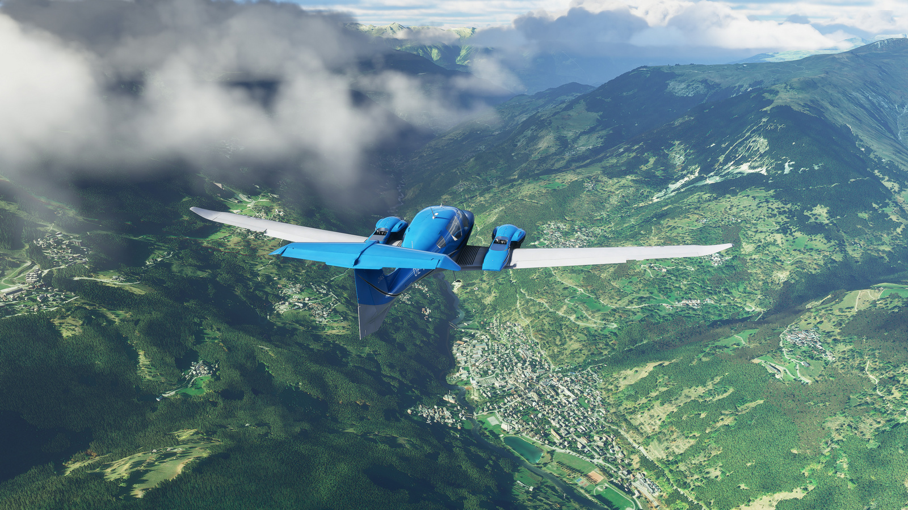
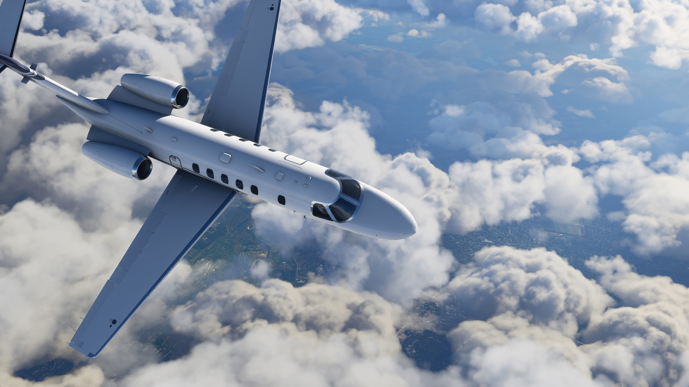
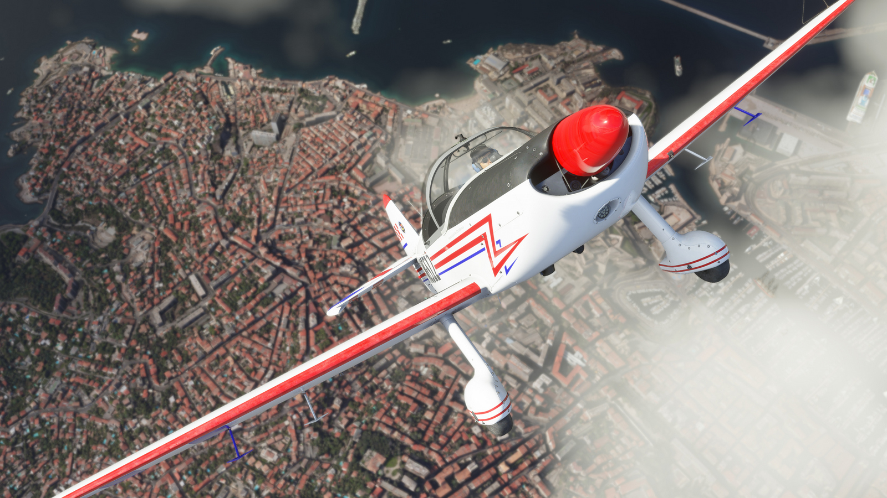
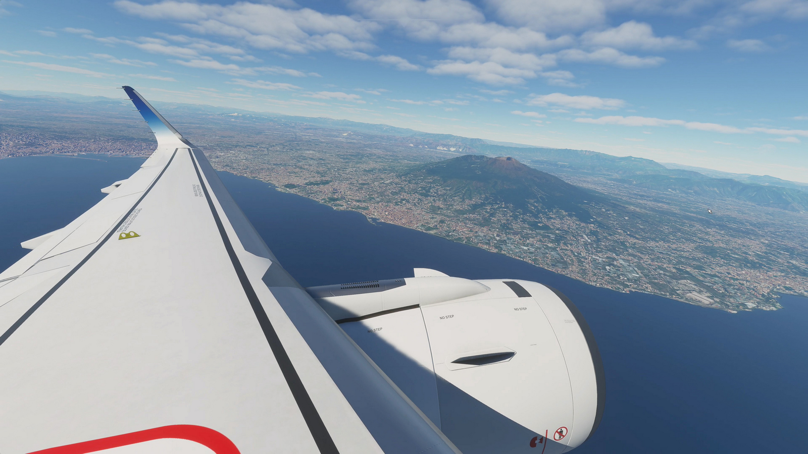

Luna august a acestui an a marcat lansarea celei mai recente iterații, cea cu numărul 13, din legendara serie Microsoft Flight Simulator, care a debutat în 1982, fiind cu 3 ani mai veche chiar decât prima versiune de Windows. Precedentul titlu din serie, **Microsoft Flight Simulator X**, s-a lansat în 2006 și a fost foarte apreciat la vremea lui, fiind jucat chiar și până în timpurile noastre, dar nevoia de o actualizare se simțea de mult. 

Microsoft a făcut o mișcare îndrăzneață, încredințând dezvoltarea noului joc unui studio fără experiență în domeniul simulatoarelor. Asobo Studio au lansat în 2019 un joc narativ primit bine de public și critici, **Innocence: A Plague Tale**, iar dacă mergem și mai în spate în CV-ul lor găsim multe jocuri mai degrabă simpliste, destinate copiilor, bazate pe licențe din familia Disney. Din fericire pentru fanii simulatoarelor de zbor, studioul s-a achitat cu brio de sarcină și a dus bătrâna serie la un nou nivel. 



Definitoriu pentru MSFS e realismul, care guvernează fiecare aspect al jocului, de la grafica fotorealistă, construcția lumii înconjurătoare, modelarea foarte fidelă a avioanelor (atât la exterior, cât și în cazul cockpit-urilor), la fenomenele meteorologice, iluminarea și ciclul zi-noapte.

Dar elementul cu adevărat revoluționar, și care face din MSFS o creație cu adevărat monumentală, are legătură cu decorul virtual pe care îl avem la dispoziție pentru a ne etala abilitățile de piloți.  Acesta este nici mai mult, nici mai puțin, decât întreaga planetă Pământ, recreată la scară 1:1!

Așa ceva părea un vis în trecut, dar Asobo l-a transpus în realitate folosindu-se de tehnologii dezvoltate de Microsoft, respectiv platforma de cloud computing Azure și hărțile din serviciul Bing Maps. Pe baza lor s-au dezvoltat algoritmi care interpretează hărțile și generează terenul 3D corespunzător, cu tot cu vegetație, cursuri de apă și mai ales structurile artificiale precum orașele, drumurile dintre ele (chiar și traficul!) sau cele 37.000 de aeroporturi și aerodromuri pe care le putem folosi! Bineînțeles, reproducerea nu este perfectă, stilul arhitectonic de multe ori fiind neconform cu realitatea, dar dispunerea spațială corectă a clădirilor face ca locurile cu care suntem familiari să fie ușor de recunoscut. 

Există însă și numeroase aeroporturi și obiective faimoase, cum ar fi Piramidele din Giza, Statuia Libertății, sau  Opera din Sydney, care sunt modelate sau retușate manual pentru un plus de autenticitate. Sau pentru un exemplu autohton, Palatul Parlamentului din București.

Volumul total de date cu care lucrează sistemul este enorm – 2 Petabytes de date geografice – dar jocul folosește tehnologia de streaming online pentru a accesa doar zonele necesare simulării în curs. În cazul în care o conexiune la internet nu e disponibilă, sau dacă utilizatorul setează limite de trafic de date, jocul poate funcționa în continuare, dar detaliile terenului vor fi la o calitate mai scăzută.

Un alt element care are un rol covârșitor pentru realism este vremea, întregul spectru meteorologic fiind replicat cu fidelitate, vizual și termodinamic, multi-stratificat, până în stratosferă. Jocul folosește un serviciu meteo pentru a recrea în detaliu condițiile meteorologice reale (viteza vântului, umiditate, presiune etc.) astfel că orice zbor virtual poate fi sincronizat cu lumea reală din punct de vedere al orei și mai ales al vremii. Profitând de această caracteristică, jucătorii au reușit chiar să [exploreze în timp real uraganul Laura](https://www.theverge.com/2020/8/27/21403769/hurricane-laura-microsoft-flight-simulator) care a lovit recent sudul Statelor Unite.

În mod similar, un alt element de realism și imersiune e dat de posibilitatea de a avea traficul aerian din lumea reală replicat în joc prin integrarea datelor oferite de platforma FlightAware.com. Dacă facem acest lucru, putem chiar „prelua controlul” unui zbor real în desfășurare, cu aceiași parametri și plan de zbor. 

Iar dacă vorbim de avioane, acestea sunt în număr de 20 în versiunea Standard a jocului, care acoperă o plajă largă de modele din mai multe categorii (cu elice, turbo jets, avioane de linie), de la bătrânul avion didactic Cessna 152, până la regina cerului, Boeing 747 Jumbo Jet. Versiunile Deluxe și Premium Deluxe ale jocului oferă în plus 5, respectiv 10 aparate de zbor, însă cu siguranță lista va crește pentru toate versiunile prin adăugarea de conținut nou în viitor.

În ce privește controlul aeronavelor, nivelul de realism este configurabil în detaliu. După preferințe, experiența poate fi extrem de autentică, incluzând liste de verificare a sistemelor avionului, interacțiuni cu turnul de control și urmărirea cu strictețe a unui plan de zbor, sau din contră, totul poate fi simplificat pentru a putea admira priveliștea în timp ce sistemele automate se ocupă de zbor. 

Perifericele specializate (joystick, HOTAS, rudder peddals) pot eleva experiența, dar și cu un simplu gamepad, cum este cel de Xbox, ne putem descurca de minune, dacă scădem unele din elementele simulării, în special cele legate de daune și stres structural. 

În termeni de cerințe hardware, jocul nu este foarte pretențios, va rula și pe sisteme mai vechi, cu ajustarea adecvată a calității grafice. Totuși, un punct sensibil e dat de timpii mari de încărcare, fapt pentru care instalarea pe un SSD este foarte recomandată.

Și un alt aspect pozitiv este reprezentat de disponibilitatea titlului prin abonamentul Game Pass for PC al celor de la Microsoft, care, în schimbul unei taxe lunare modice (10 USD sau 8 GBP), ne oferă acces la o listă de peste 100 de jocuri de calitate, inclusiv toate cele publicate sub umbrela MS. Alternativ, jocul se poate cumpăra și în sistem clasic de pe Windows Store sau Steam. O versiune pentru familia de console Xbox este de asemenea anunțată în viitor.

Închei prin a recomanda fără rețineri acest joc. Dacă sunteți pasionați de domeniul aviației civile, dacă doriți să admirați planeta albastră din aer sau dacă vă e dor să revizitați virtual satul bunicilor, Microsoft Flight Simulator vă va depăși orice așteptare.  ■