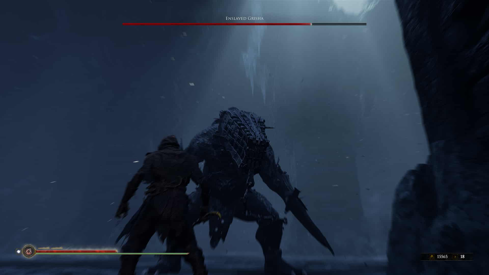
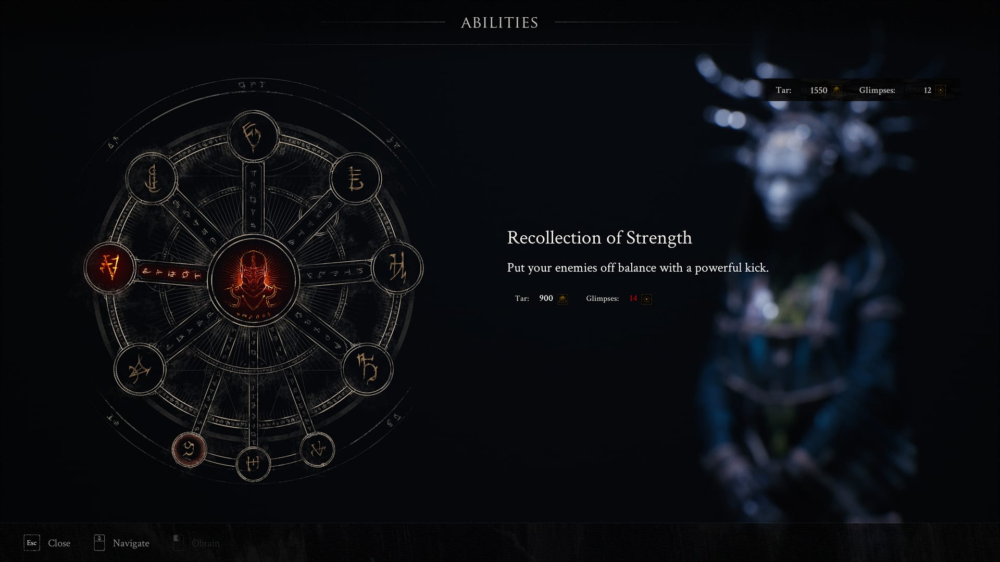
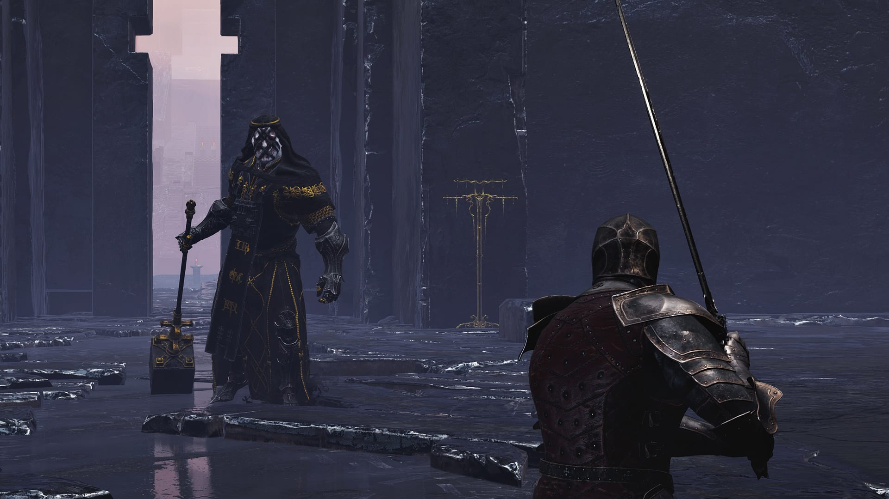
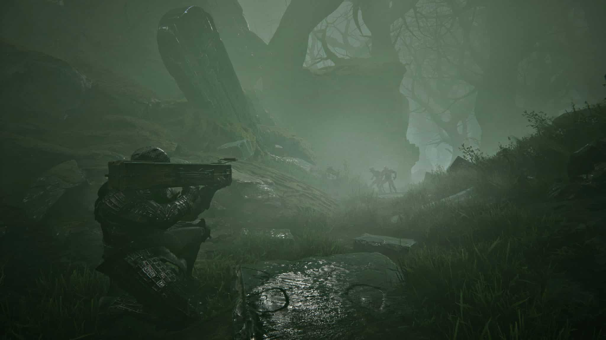
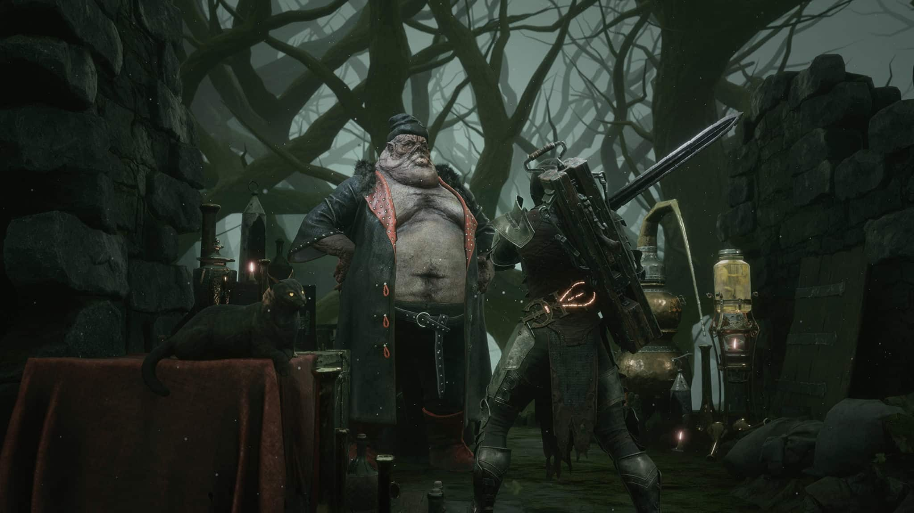

În urmă cu un an și jumătate a avut loc primul meu contact cu jocurile From Software. Sigur, strict și prin curiozitatea generată de meme-uri și alte glumițe de pe internet, m-am plimbat și eu ca tot omul prin Dark Souls atunci când s-a lansat versiunea de PC, dar nu cât să-i aprofundez lumea. În fapt, portarea necizelată nu m-a dat pe spate și am decis că o voi lăsa pe altădată. Iată că acest altădată a venit când studioul japonez a lansat pe piață Sekiro, care încă de dinaintea apariției m-a cucerit prin estetică și atenția la detaliu, un deliciu pentru fanii culturii japoneze. Probabil am bolborosit cam mult, pentru că m-am trezit cu un cadou surpriză de la prietenă și vrând nevrând a trebuit să mă arunc în genul ăsta de jocuri și să investighez dacă laudele fanilor sunt îndreptățite.

O parte dintre jocurile apărute în ultimii ani sunt construite pe ideea că le vei juca cu jumătate de creier. Tendință manifestată în mod special la cele de tip open world, cu acțiune, gândite pentru a maximiza dependența prin generarea de endorfine într-un interval de timp cât mai scurt, fiind astfel perfect de consumat în reprize. Practic, sunt un fel de sitcomuri. Ce speram de la Sekiro era o rupere de ritm din punctul ăsta de vedere. Am auzit că jocurile From Software sunt greu de pătruns, că e nevoie să le înveți, să fii atent la detalii și așa mai departe…

A urmat o mică revelație, în urma căreia am descoperit poate cel mai bine realizat joc de acțiune al acestui mediu, cu un rafinament și precizie în calibrarea gameplay-ului demne de o fabrică elvețiană de ceasuri. Talentul producătorilor în a controla, submina, dar și educa și răsplăti jucătorul m-au dat pe spate, așa că am pornit într-o călătorie mai lungă dar extrem de satisfăcătoare, ce m-a trecut prin toate jocurile Dark Souls la rând, apoi prin Demon’s Souls, precum și altele inspirate mai mult sau mai puțin din acestea (Nioh). În categoria a doua se încadrează și Mortal Shell, un omagiu exclusiv single player adus jocurilor souls din partea unui studio micuț, de numai 15 oameni, dar cu ambiții de luat în seamă.

### *Rise if you would, for that is our curse*

Evident, cei de la Cold Symmetry au considerat Dark Souls un joc prea puțin abstract, care-și explică prea clar universul și evenimentele ce au dus lumea în stadiul actual. Nu de alta, dar de la început te bagă în ceață și la propriu și la figurat. Începe printr-un mini tutorial pe care îl parcurgem din perspectiva unei… forme, o entitate slabă pe cont propriu, dar care poate să se insereze într-un cadavru, aducând la viață amintirile celui controlat, precum și abilitățile pe care le avea când încă umbla nestingherit prin lume.

Povestea, atât cât există ea, se învârte în jurul unui obiectiv primit de la o altă entitate misterioasă ținută prizonier în zona centrală a jocului. Acest prizonier are nevoie de glandele sacre răspândite prin Fallgrim (lumea dezolantă în care ne aflăm), iar odată ce le primește ne va oferi o răsplată pe măsura libertății dobândite de el. Ce să zic, la o primă vedere mi-a sunat cam suspicios.

În caz că nu era evident din nume, carcasele umane (”shells”) reprezintă elementul central al jocului. Pentru că în lumea aceasta aflată în moarte clinică, amintirile sunt o resursă importantă. Fiecare amintire deblocată dezvăluie noi detalii despre persoana care a fost, dar și despre lumea înconjurătoare și oferă un dram de context atât de necesar. Abilitățile specifice fiecăreia dintre cele patru carcase reprezintă principală sursă de varietate în gameplay. Poate că un anumit inamic mare și lent e mai vulnerabil în fața unui personaj rapid, iar altul se cere a fi abordat mai iute, cu cineva mai flexibil. În teorie, faptul că fiecare are alte abilități, iar tu îi poți interschimba și dezvolta separat, ar trebui să ducă la niște combinații de-a dreptul nebune. Din păcate lucrurile nu stau chiar așa, după cum urmează să aflăm.

Sistemul de luptă seamănă tare cu cel din Dark Souls. Trebuie să stai cu ochii pe bara de stamina în timp ce alternezi atacurile rapide cu cele lente, te ferești, parezi și… blochezi? Ei bine, nu. În Mortal Shell nu există posibilitatea de a bloca, cu sau fără scut, atacurile inamicilor - o caracteristică atât de specifică genului. În schimb, una dintre abilitățile de bază ale personajelor e întărirea. În această formă, devii acoperit de armură, imobil și invulnerabil, iar primul atac care te lovește îți sparge armura, fără a avea alte repercusiuni.

Cum nimic în viață nu vine pe gratis, dezavantajul față de o blocare normală este perioada de cooldown. Nu poți folosi întărirea la foc automat, trebuie să aștepți puțin după fiecare activare. Din nou, o idee aparent foarte faină, ar trebui să crească dinamismul confruntărilor forțându-te să te miști și să reacționezi diferit la inamici, în funcție de situație. Consecințele însă sunt altele; e destul de clar că cei fără un simț sinucigaș vor prefera din contră, să încetinească și mai mult luptele, pentru că folosind întărirea în mod inteligent și cu răbdare, adversarii nu prea au ce să îți facă. E de ajuns să te rostogolești de câteva ori din calea atacurilor, să activezi întărirea, lovești, înapoi de-a dura și tot așa… Eficiența acestei rutine e accentuată de faptul că întărirea se poate face oricând. Fie că ești în mijlocul unui atac, în cădere liberă sau rostogolire, dacă activezi abilitatea și ții apăsat pe buton, rămâi fix până cineva te lovește. Când ești scos din această stare, acțiunea continuă normal. Deci dacă erai în cursul unui atac puternic, acesta va lovi în primul nefericit care te atacă.

Nu recomand această strategie de joc decât dacă aveți un stil de viață prea alarmant și nu știți cum să vă plictisiți, dar ideea de bază este că posibilitatea există și ca atare scade stresul din confruntări. Știi că dacă nu reușești să stăpânești o luptă și să dovedești vreun inamic mai dur, există oricând varianta dansului acesta plicticos, dar al naibii de eficient.

”Personajele” sunt până la urmă un substituent pentru clase, dar nu oferă atât de multe schimbări cum ai crede în primă fază. Toate au aceleași abilități de bază, aceleași tipuri de atacuri și talent cu armele. Nu există magie, folosești în schimb cele două monezi ale jocului:  smoala (metaforă prea evidentă pentru gustul meu, apropo) și amintirile, pentru a debloca o serie de abilități speciale din repertoriul fiecăruia. În caz de moarte subită amintirile colectate nu se pierd, spre deosebire de smoală.

Sistemul este însă foarte rudimentar, sunt doar zece asemenea abilități, la unele dintre ele ai acces indiferent cu cine joci, o parte sunt pasive (bonusuri la viață, rezistențe, etc.) și în cel mai bun caz, una sau două aduc ceva cu adevărat interesant în joc. Spre exemplu, eu n-am putut să mă împac cu Mortal Shell până nu am dat de Tiel, care are abilitatea de a transforma otrava dintr-un substanță dăunătoare într-una care îți reface din punctele de viață pierdute. Cadavrul cu cel mai mare potențial de zbenguială, Tiel are de trei ori mai multă anduranță decât ceilalți, dar moare din două lovituri. Eredrim e o mașină de ucis care stă fix pe dos cu caracteristicile și moare foarte greu. Harros e băiatul cuminte, perfect balansat în atribute și primul cu care ai posibilitate să joci (pentru mulți rămânând și ultimul, îmi imaginez). Al patrulea și cel din urmă este Solomon, care stă decent și cu viața și cu anduranța, dar se bazează pe tot felul de giumbușlucuri în lupte, care depind de atacurile speciale ale armelor, astfel fiind alegerea ceva mai puțin consistentă.

### *Every age it seems, is tainted by the greed of men.*

Pentru că nu s-au intitulat Cold Symmetry degeaba, numărul de arme disponibile este tot patru, plus una mai specială, și anume ”Ballistazooka”. Denumită probabil dintr-un lapsus, căci sigur exista o alternativă îndeajuns de deprimantă pentru a se potrivi cu restul jocului. Ballistazooka e singura armă de distanță din joc, e extrem de eficientă și distractiv de folosit pentru că e practic o arbaletă care trage cu harpoane. Totuși, nu m-am văzut folosind-o prea des fiindcă muniția se găsește rar și e destul de scumpă, provoacă daune mari inamicilor dar nu e necesară în majoritatea situațiilor și nici eficientă contra grupurilor mai mari, iar nu în ultimul rând, cam știrbește din luptele cu boșii.

De partea cealaltă, avem complet genericele: sabie, sabie mare pentru două mâini, buzdugan sau varianta celor plini de fler: ciocanul și dalta. Inutil de zis cu ce am jucat mare parte din timp, ciocanul și dalta sunt desprinse parcă din alt joc. Dacă le combini cu Tiel, care pare singurul ce nu a funcționat pe trei pachete zilnice de țigări, luptele devin foarte antrenante. Nu recomand neapărat asta ca unic mod de joc, preferabil și încurajat este să dezvoltați cam două arme și tot atâtea personaje jucabile (de altfel, mai mult e greu fără grind) pentru că sunt câteva lupte în care nu e bine să fii lipsit de alternativă.

Însă ce-am menționat mai sus legat de cele patru arme scoate în evidență un neajuns al jocului: luptele sunt foarte lente și din păcate, plictisitoare. Da, și Dark Souls era lent, dar construcția nivelurilor era de așa natură încât tot timpul te ingropa ceva relativ nou. Zonele noi veneau cu o provocare cât de cât relevantă, aproape fiecare inamic aducea ceva de luat în seamă prin comportamentul sau atributele sale (chit că ulterior erau reciclați). Însă aici lucrurile nu mi se pare că stau deloc așa. Poți alterna combo-urile dar nu prea ai de ce, poți evita întărirea dar atunci rămâi doar cu pararea loviturilor (”parry”), iar asta mi se pare cea mai mare slăbiciune a sistemului de luptă. Mă descurc destul de bine cu timpii de parare, am practicat această activitate relaxantă prin toate jocurile souls. Nu neapărat pentru că trebuia, ci pentru că mi-a plăcut.

Ei bine, în Mortal Shell implementarea mi se pare oarecum stânjenitoare. Animația nu e fluidă, timpii parcă variază, iar ripostele sunt limitate de atributele personajelor. Fiecare dintre cei patru are un număr de sloturi pentru riposte, prezentate tot ca niște bare de interfața jocului. Aceste sloturi se pot umple prin luptă sau folosind diferite consumabile și se pierd pentru fiecare ripostă reușită. Dacă nu era de ajuns, armele au și ele atacuri speciale, mult mai puternice decât cele de bază, dar execuția unui astfel de atac îți rade două sloturi, limitând astfel și mai mult potențialul unei parări. Pe hârtie, luptele trebuiau probabil să te încurajeze să alternezi între parare și întărire, respectiv riposte și atacuri speciale. Dar iată că din nou ce a fost o intenție bună se transformă mai degrabă în ceva redundant în joc.

### *You have a heart of gold, don't let them take it from you.*

Problemele lui Mortal Shell devin și mai accentuate când punem laolaltă criticile de mai sus. Să parezi nu prea e avantajos, există o varietate destul de mică de arme și personaje, dar tu trebuie să explorezi și să găsești glandele alea blestemate. Chestia e că Fallgrim, ceea ce pentru noi reprezintă lumea jocului și prima zonă cu care iei contact, este și cea mai plictisitoare. Un labirint construit în jurul unui turn (varianta Firelink Shrine de aici) prin care te tot plimbi încercând să găsești intrarea în cele trei locații secundare (“dungeon-uri” practic), pentru a-ți îndeplini misiunea. Doar că explorarea e greoaie, luptele sunt lente, armele puține și inamicii peste tot și la fel. Iar dacă asta nu era de ajuns, jocul propune un sistem cel puțin bizar pentru inventar.

Obiectele găsite au efecte necunoscute jucătorului decât după prima utilizare, indiferent că vorbim de cele care te vindecă sau rănesc. Bun, hai să zicem că asta ar putea fi trecut în coloana de lucruri cât de cât interesante, pentru că pe măsură ce folosești un consumabil mai des, descoperi noi efecte.

Însă ce nu am remarcat eu decât după câteva ore bune de joc este că nu pot să-mi schimb armele. Vedeți voi, armele nu există în inventar, ele trebuie invocate folosind obiecte specifice, consumabile. Și decedații pe care îi punem la luptă se schimbă în același mod, dar aici mi se pare mai de bun simț alegerea. În schimb cu armele… mi-am blestemat zilele. M-am trezit de vreo două ori în mijlocul unui dungeon, având nevoie de cealaltă armă pe care o folosesc și fără vreun mod de a o obține. Fiecare dintre locațiile secundare are chiar la intrare o statuie de care e agățată o armă, pentru că practic așa le deblochezi, printr-o luptă cu un inamic puternic care o folosește. Ei bine, cum faci să ai două arme cu tine în același loc și să fie cele două pe care le și vrei? Lași una la intrare și iei ce e disponibil acolo, ieși din mijlocul acțiunii, fugi prin mlaștina care înconjoară turnul din Fallgrim și-ți iei cealaltă unealtă. Apoi ajungi înapoi de unde ai plecat și când o testezi în țeasta inamicilor, descoperi că te-ai agitat degeaba și era mai buna prima variantă. Grozavă treabă!

Sigur, sigur, exagerez poate și eu. Există fără îndoială destule consumabile pentru invocarea armelor și dacă se întâmplă să le găsești când trebuie, nu prea ai bătăi de cap. În plus, pe parcursul jocului găsești și alte modalități mult mai facile de a călători de la o zonă la alta, dar chestia asta e o limitare cam neinspirată în faza de început. Din construcție, lumea lui Mortal Shell nu te invită la vreo progresie naturală în care să descoperi locații noi. E un haos total în care te învârți ca un livrator fără Google Maps și te bucuri când dai de un loc care pare să conțină ceva important. Pe lângă faptul că nu-mi pot imagina ceva mai puțin imersiv ca momentul când trebuie să-ți activezi, pe rând, toate obiectele din inventar, ca să vezi care mama naibii e cel ce-ți trebuie ție acum.

Ironia care subliniază probabil lipsa de experiență a producătorilor, este că au structurat în așa fel locațiile de parcă intenționat au vrut să sublinieze părțile negative. Nu m-am uitat pe ceas, dar jur că jumătate din timpul petrecut cu jocul a fost rătăcind prin Fallgrim, în lupte monotone, căutând obiecte folositoare. Dar jocul nu se încheie aici, cele trei locații în care găsești glandele sunt excelent realizate. Fiecare cu tematică proprie, inamici specifici și pentru numele lui Dumnezeu, comori folositoare! Recomandarea de bun simț ar fi să nu vă aruncați prea departe în aceste locații fără să explorați Fallgrim, să găsiți toate personajele jucabile și să strângeți experiență. Însă sincer vorbind, cred că eventuala frustrare pe care o poți avea mergând prea repede în locurile astea e de preferat monotoniei zonei de început. Când treci dintr-o mlaștină generică la o fortăreață enormă din obsidian, cu o arhitectură și geometrie aproape extraterestre și inamici care puteau la fel de bine să existe în Anor Londo… atunci descoperi cu adevărat potențialul jocului.

De altfel, dacă geografic lumea realizată de producători nu impresionează cu nimic, din punct de vedere vizual și artistic este la un nivel foarte înalt. Atmosfera e mai apăsătoare și mai bizară decât în souls-uri, iar inamicii se simt mai brutali, mai necizelați. S-a încercat obținerea aceluiași sentiment de interpretabilitate specific jocurilor lui Hidetaka Miyazaki. Abstractismul și simbolismul merg mână în mână, contribuind la sentimentul de lume moartă, atemporală, în care ai luat naștere pentru îndeplinirea unui scop neclar.

### *Goodbye then. Stay safe friend. Don't you dare go hollow.*

Dacă această recenzie pare cam sumară, să știți că așa și este, dar e o consecință a jocului. Mortal Shell nu oferă prea mult conținut. Personajele pe care le readucem la viață și omorâm sistematic pe parcurs nu se fac cu adevărat remarcate prin diferențe notabile, inamicii nu vor impresiona veteranii souls prin multitudinea de comportamente sau abordări disponibile. Iar armele... Ei bine, patru pur și simplu nu e destul, jocul nu compensează cu ceva această lipsă de varietate. Poate că în Sekiro ai doar sabia aia nenorocită tot jocul, dar devine prietenul tău cel mai bun și până la final o folosești în moduri ce nu păreau a fi posibile.

Chiar și-așa, nu-l pot numi un joc prost, pentru că asta ar însemna să-mi lipsească complet capacitatea de a pune în context dezvoltarea sa. Pentru resursele disponibile și numărul de oameni implicați, ce a ieșit este excelent. Tehnic vorbind e un titlu care se prezintă impecabil. Arată ca un joc blockbuster, e optimizat mai mult decât mulțumitor și e lipsit de bug-uri majore. Producătorii au fost implicați și au rectificat deja diferite neajunsuri semnalate de fani. Strict și numai prin atmosferă și implicarea emoțională pe care ți-o provoacă lumea sa, este de încercat. Durata scurtă (undeva la 15 ore) nu-i permite să te plictisească cu adevărat (mai degrabă să te frustreze), iar ocazional ies în evidență idei foarte bune, care într-un viitor joc Cold Symmetry ar putea chiar să imprime un suflu nou genului. Momentan, e mai degrabă o demonstrație plină de talent, un omagiu care nu face de râs Dark Souls și care ar trebui să mulțumească pentru moment fanii acestui gen de jocuri. ■
