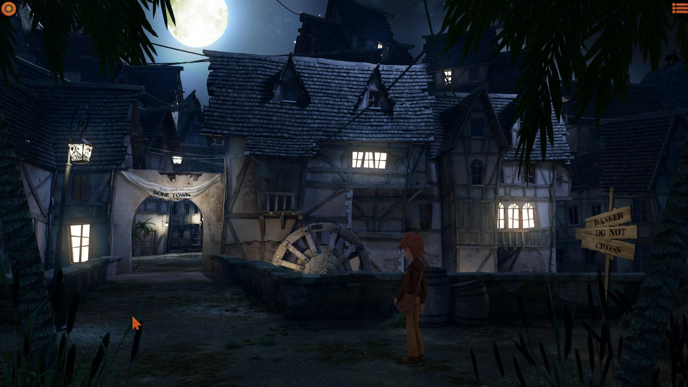
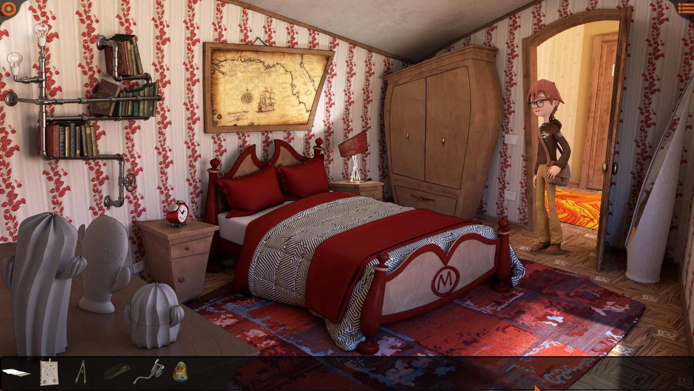

De-a lungul timpului au apărut multe jocuri de aventură care au făcut trimiteri variate, mai multe sau mai puține, mai evidente sau mai subtile, la clasicul Monkey Island, dar **Willy Morgan & The Curse of Bone Town** al italienilor de la imaginarylab este mai degrabă un tribut adresat acestei serii. Aventuri, pirați și comori, Willy Morgan le are pe toate. Dar, spre deosebire de șarmul cu care ne-a cucerit Monkey Island și umorul spumos al lui Guybrush Threepwood, Willy Morgan abordează pirateria cea de toate zilele dintr-o perspectivă a maturizării. Într-un gen din ce în ce mai sufocat de povești telenovelistice și drame pseudo-existențiale, Willy Morgan este o experiență diferită, micuță și plăcut de jucat.

Totul începe cu o scrisoare misterioasă primită de Willy, personajul principal, în ziua care marchează zece ani de la dispariția tatălui său, Henry Morgan, arheolog plecat în căutarea comorii Căpitanului Kidd. Scrisoarea se dovedește a fi chiar de la Henry și a fost trimisă în urmă cu 10 ani, dar a ajuns abia acum - lucru deloc surprinzător pentru cine a mai avut experiențe cu Poșta Română. În scrisoare Henry îi scrie lui Willy să se ducă în Bone Town și să se cazeze la Dead Man Inn, încheind cu un misterios „totul va fi revelat acolo”. Willy nici nu stă pe gânduri, e gata de plecare chiar în momentul ăla, dar cum în viață nu faci nimic fără bani, are nevoie de fonduri și de un mijloc de deplasare. După câteva puzzle-uri simple, în care ne familiarizăm cu interfața jocului, putem să plecăm spre Bone Town.

Ajunși în Bone Town putem obseva că nu este un oraș ca oricare altul. Acesta se prezintă straniu, prin străzile sale pustii și aspectul învechit, de muzeu viu pe lângă care tehnologia a trecut complet. Dar pentru lipsurile sale tehnologice, Bone Town compensează la capitolul locuri cu personalitate și istorie. Fiecare clădire esențială progresului în joc are un aspect aparte și este de remarcat atenția la detalii în ceea ce privește decorul. Atunci când petrecem timp în biblioteca locală ne simțim chiar ca într-o bibliotecă, cu mirosul greu dat de cărți, liniștea și praful care sunt elemente indispensabile oricărei biblioteci care se respectă. Spre deosebire de aceste locații, personajele pe care le vom întâlni sunt mai puțin memorabile, dar ne vor ajuta să avansăm sau, din contră, vor reprezenta bariere peste care va trebui să trecem pentru a progresa în joc.



Willy Morgan se poate juca la fel ca orice alt point & click clasic și are un inventar ușor de accesat la o mișcare din rotița mouse-ului, un buton de indicii care ne arată lucrurile cu care putem interacționa și cam atât, interfața este aproape inexistentă în rest. Cât despre puzzle-uri, acestea sunt accesibile și nu prea complicate. Nu am întâlnit vreun puzzle care să îmi dea dureri de cap și toate s-au bazat pe logică. Cea mai mare parte a jocului o petrecem încercând să facem rost de bucățile din harta comorii Căpitanului Kidd, prin diverse metode, de la memorarea meniului unui restaurant la un test de forță la carnaval. Pentru cele 4 ore pe care le vom petrece în joc, nimic nu apucă sa devină prea plictisitor sau neinteresant. Deși mi-aș fi dorit să țină mai mult, cred că exista riscul ca totul să devină repetitiv și sforăitor.

Pe partea de grafică lucrurile devin și mai interesante, pentru că jocul are un aspect realist cu proporții și unghiuri distorsionate în așa fel încât să capete un aer caraghios, cumva între un tablou de Salvador Dali și un desen animat experimental de pe Cartoon Network. În felul acesta jocul prezintă un aer copilăros, inocent, de văzut într-o sâmbătă dimineața la televizor. Animațiile sunt și ele acolo, nimic care să ne dea pe spate, dar personajele sunt desenate frumos și sunt propriile lor caricaturi.

Din păcate, sunetul este partea cea mai slabă a jocului. Voice acting-ul lasă de dorit și aș fi preferat să nu existe sau să am opțiunea de voice acting în italiană. Dacă actorul lui Willy le mai zice bine uneori, restul actorilor o cam dau în bară la dialogurile în engleză și ajung să sune lipsiți de naturalețe.   

Deci jocul e bun. Sigur, are micile sale defecte, dar eu susțin orice viitoare inițiativă imaginarylab. Au potențial și aș vrea să văd ce idei le mai vin. Pe viitor mi-aș dori de la ei personaje ceva mai dezvoltate și fie să renunțe la voice acting, fie să treacă pe italiană. Deși nu o să dea pe nimeni pe spate, în Willy Morgan se poate vedea potențial și zvâc. Sperăm să mai auzim de ei. ■
