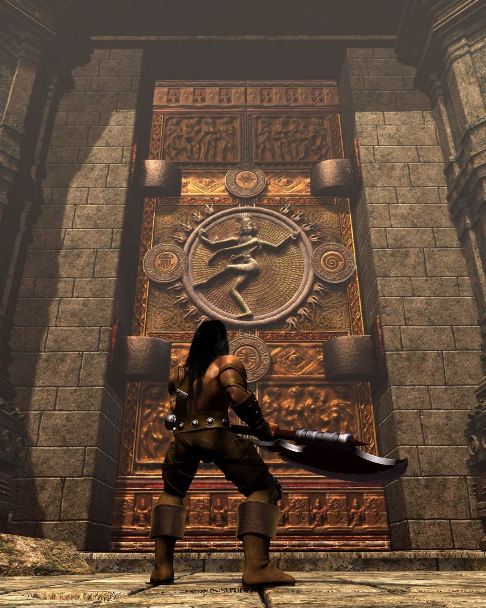

Gînduri bune. Vorbe bune. Fapte bune. Și puțină cafteală pătimașă cu ipostaza distructivă.

Șeherezada bocește în afara cadrului în vreme ce un nea profet recită versete apocaliptice cu o engleză de conac în care a dat umezeala. Asta peste vîntul ce spulberă frunze uscate deasupra unor scrijelituri asemănătoare unui alfabet ebraic. Apoi vin fumurile rele, prelingîndu-se peste o poartă pe care joacă Nataraja ușor alterat în simbolism. Dincolo de ea, o sabie stă înfiptă în soclu, cu figura unei zeițe selenare gravată în mîner. Cad trăznetele, iar din ochii zeiței curg șuvoaie de sînge. Cam acesta este filmul de introducere al lui Severance: Blade of Darkness (BoD), destul de reprezentativ pentru ghiveciul de idei și surse de inspirație prezente în joc. Conceptul fundamental nu sună tocmai nimerit, anume (în vorbele producătorilor) acțiunea lui Conan Barbarul împletită cu narativa Stăpînului Inelelor. Cam înalte ambiții, ce s-au întins pe un timp de producție de aproape cinci ani în grija unui studio spaniol lipsit de experiență, Rebel Act Studios. Jocul a fost distribuit de Codemasters, inițial sub titlul Blade: The Edge of Darkness. Ar fi fost mai potrivit pentru conținut, dar a intrat în conflict cu numele unei drame britanice și pînă la urmă a fost schimbat în BoD pentru diverse piețe. Din păcate, produsul care a ajuns pe rafturile magazinelor la începutul lui 2001, deși cu realizări tehnice impresionante pentru vremea respectivă și plin de abordări interesante, se afla într-un stadiu neterminat sub aspectul programării, nefinisat în privința elementelor artistice cît și a mecanicilor de joc. A urmat un eșec financiar în urma căruia planurile celor de la Rebel Act au fost întrerupte, fiind anulată o ediție revizuită a jocului pentru console. De ani buni nimeni nu mai deține drepturile de distribuție ale lui BoD, dar chiar și obținerea unei copii în regim abandonware nu înseamnă neapărat că jocul poate fi și încercat, căci rularea lui pe sisteme moderne este cel puțin problematică. În ciuda dificultăților întîmpinate, în acest articol vor fi spuse cîteva cuvinte despre unul dintre primele jocuri cult ale mileniului III.



Fixarea unor repere spațio-temporale pentru universul lui BoD este cvasiimposibilă. N-avem la îndemînă decît un petic de hartă ce prezintă un pustiu înconjurat de ape, cu niște piscuri înzăpezite înspre apus și ceva întinderi verzi în lungul unor fluvii. În acest areal, producătorii au ținut neapărat să arunce de-a valma mii de ani de civilizație umană. Complexe ritualice scoase parcă din Valea Nilului, megaliți din epoca bronzului, piramidele olmecilor, fortărețe medievale acoperite de zăpezi, minarete, temple hinduse și alte minuni întrepătrunse cu o viziune artistică ce poate pica oriunde între asirian și gotic. Prin toate trece un fir subțire de filozofie indo-iraniană care reușește să lege surprinzător de bine toată năzdrăvănia. Și stați să vedeți protagoniștii. Vă vine să credeți că avem de ales între primul om din istoria consemnată care a stăpînit un imperiu, o corabie făcută din unghiile morților, amanta lui Tipătescu (dacă tot n-am prins trimiteri către Cucuteni și Tărtăria, măcar atît?!) și un mare poet indian? Desigur, vorbim doar de numele lor, care sunt culese precum hărțile jocului, fix din slava mirării. În aceeași notă a uimirii consternate, deși povestea e la grosimea nanofirului și lăsată să țîrîie mai dintr-un mural, mai dintr-un monolog criptic, merită menționată o deversare de cunoștințe mistico-pseudo-istorice destul de tîrziu în joc. Un fluviu care năvălește parcă din microfonul lui Crin Antonescu pe vremea cînd încă pișcotărea prin parlament, copleșind ascultătorul cu toate tainele reale sau închipuite ale Mesopotamiei.

Meniul în care ne sunt prezentați eroii este imaginat ca o fortificație destul de inspidă, unde fiecare freacă buha după cum îl îndeamnă cuviința. Coloana sonoră de aici este o versiune extinsă a unei mostre ce poate fi găsită în diverse medii. Eu mi-o amintesc din Heroes of Might & Magic III, fiind redată la trecerea prin porțile ce conectează suprafața cu subterana. Selectarea unui erou produce o listă de atribute care pot lăsa impresia că se pregătește o sesiune RPG intensă, fiindu-ne expuse caracteristici precum vîrsta, înălțimea și greutatea. Există un sistem minimal de progresie bazat pe acumularea de experiență, dar finețurile fiziologice nu prea au nicio relevanță în jocul propriu-zis și nici măcar nu se corelează neapărat cu aptitudinile atletice ale eroilor. Mai departe, aventura este structurată de-a lungul a paisprezece hărți, într-o manieră semi-liniară. Harta inițială este unică fiecărui erou și arată felul în care acesta este prins în evenimentele aventurii. Jocul oferă de multe ori ocazia de a alege ordinea în care dorim să completăm hărțile, dar nu este o chestiune cu prea mult impact, deoarece asprimea inamicilor este calibrată relativ la cît am reușit să dezvoltăm eroul pînă la acel moment. Chiar dacă alegînd o anumită ordine de completare putem obține armament mai capabil mai devreme, utilizarea lui optimă este condiționată tot de nivelul eroului, astfel că arma respectivă rămîne uitată în traistă pînă la momentul potrivit.



Totodată, jocul are două finaluri posibile, iar cel „bun” se află la capătul unui nivel secret ce poate fi accesat numai dacă am reușit să intrăm în grațiile unei zeițe și să-i primim binecuvîntarea. Acest fapt necesită absolvirea unui mic curs de mazdeism în varianta povestită pentru gîngavi, curs ce mai departe implică găsirea scripturilor Avestei ascunse prin hărți. Ca să înțelegeți dimensiunea obscurului, singura șansă de a afla că aceste scripturi există și că sunt relevante e ferecată în spatele unui secret destul de perfid ce e aflat într-o hartă care poate fi accesată cam după o treime de joc. Deja la acel moment, cei slabi de spirit au pierdut o parte din tăblițele scripturii. Totuși, BoD nu e excesiv de crud. Chiar dacă implică o mică bătaie de cap, jucătorului i se oferă posibilitatea ca la momentul critic să avanseze fără binecuvîntarea respectivă (rezultînd în finalul „rău”) sau să se întoarcă în hărțile deja parcurse pentru a recupera scripturile. Revenirea în acele hărți aduce o serie de schimbări față de parcurgerea lor inițială. Nu mai trebuie străbătute aceleași rute sau urmărite obiective rudimentare (găsește cheia sau artefactul care descuie ușa ce dă în altă ușă încuiată), și totodată sunt golite de inamicii obișnuiți, dar populate cu unii mult mai enervanți. Una peste alta, chiar dacă finalul „bun” merită pe deplin osteneala, e bine ca acele secrete să fie descoperite la prima parcurgere. Acesta nu este însă singurul lucru care încurajează explorarea.

Hărțile par foarte reușite chiar și după aproape două decenii. Deși sunt în general mari și destul de alambicate, este întotdeauna limpede unde suntem și unde trebuie să ajungem, iar scotocitul prin unghere este răsplătit cu diverse obiecte utile sau frînturi de informații. E remarcabil cît de multă atmosferă se poate construi cu mijloace modeste. Poate că n-a fost un scop precis, ci mai degrabă rezultatul crizei de timp în care s-a afundat producția jocului, dar a devenit o tehnică standard a unor serii de succes precum Dark Souls (DS), care au asemănări izbitoare cu abordarea lui BoD. Ocazional pot fi descoperite trunchiuri de idei sau mecanici care n-au ajuns niciodată să fie utilizate în versiunea finală a jocului și e interesant de imaginat cam ce ar fi vrut producătorii să realizeze cu ele. Hărțile specifice fiecărui erou prezintă în particular mecanici și abordări unice care nu mai sunt întîlnite nicăieri altundeva, precum discuții  între inamici (e adevărat, interpretate cu un talent parcă smuls din sesiunea de întins lehamitea la umbra măslinului) sau elemente ce țin de manipularea mediului, de exemplu folosirea unei torțe pentru a produce un incendiu ce ne eliberează calea. Că a venit vorba de torțe, deși sunt puține momente în joc în care viața eroului poate fi curmată prin combustie, e curios că există animații și vaiete speciale pentru tăvălitul în chinurile focului. Ciudat amestec de carențe în aspecte esențiale, în vreme ce detalii fine îmbrobodesc chestiuni mult mai puțin importante. E o trăsătură definitorie a lui BoD, vizibilă în întreg parcursul jocului.



Ca note introductive, despre eroi putem spune următoarele. Sargon este un cavaler trecut de anii tinereții, membru al unui ordin pare-se important, dar care în afara unor evocări vagi rămîne în mare parte absent din derularea evenimentelor. E trimis alături de alți viteji să facă ordine în ograda unui  căpitan care a întors armele și s-a dat de partea unui inamic încă nevăzut, dar desigur că toți pică în ambuscadă ca ultimii fraieri și mor în chinuri. Sargon sfîrșește în temniță, înconjurat de tînguielile unor muribunzi anonimi și ronțăiala șobolanilor. Pentru a-și recîștiga onoarea, nu trebuie decît să evadeze cu mîinile goale, să facă pîrtie printre rîndurile trădătorilor și să-i ia capul infamului care deja se visează satrap de nădejde sub noua stăpînire. Naglfar este un pitic ce, asemenea temerarilor neamului, are obiceiul de a ajunge ori beat, ori din pură întîmplare, la momentele de cumpănă ale istoriei. Despre piticii din BoD nu aflăm mare lucru în afară de faptul că sunt experți în războiul vombatid. Adică, precum simpaticul marsupial, cînd prind vînt că urmează ceva urît, bagă capul în vizuină, improvizează bolovan la peșteră cu fundul și așteaptă să treacă. Exact ce se petrece și la debutul aventurii, iar bietul Naglfar are ghinionul (înțeleaptă vorbă) de a rămîne exilat la suprafață si fără mari alternative în afară de o iscodeală piticească, poate-poate ghicește sensul semnelor rele.

Zoe, damă ademenitoare de altfel, este clasificată drept aventurieră, adică o Lara Croft la superofertă pentru publicul amator de blonde. Ea are de răspuns la două întrebări copleșitoare. Mai întîi, cum mama dracului și prin ce metrică a spațiu-timpului au ajuns olmecii în Uzbekistan. Apoi, poate ne explică totuși de ce după toată tevatura cu un puzzle parțial de electrochimie, parțial de hidrodinamică și cu niște discipline de atletism scăpate printre, cînd în sfîrșit punem mînuțele pe cheia mult visată și ajungem la poarta templului, elementul final care ne oferă acces constă în băgarea femeii cu fundul la înaintare și inducerea ei dincolo de prag cu marșarierul. Altfel ne trezim în umbra celui mai enigmatic Crash to Desktop al mileniului. În fine, mascota aventurii este tînărul Tukaram, ce pare scăpat direct din Aquilonia. La peste doi metri, peste suta de kilograme și cu masa de grăsime estimată la vreo zece procente, viteazul este atît de impresionant încît la numai cîțiva ani după lansarea jocului îl vedem pe The Rock trăgîndu-și un tatuaj similar cu al eroului peste pectoralul stîng. În calitate de speranța tribului, Tukaram este trimis de către înțelepți în pustiuri, pentru a consulta opinia strămoșilor față de iminenta recesiune.



Indiferent de eroul ales, parcursul în general este cam același. Hărțile trebuie străbătute de la cap la coadă, descoperind pe drum cît mai multe dintre secretele conținute în ele. Obstacolele de care ne lovim sunt de vreo trei feluri. După cum am spus deja, progresia este condiționată de îndeplinirea unor obiective destul de rudimentare. Trebuie găsit butonul sau cheia ce deschid drumul spre următorul buton sau următoarea cheie. Există însă și cîteva idei interesante. Una dintre hărți este alcătuită dintr-un complex de temple în care trebuie efectuat un ritual destul de lăbărțat, iar o bună parte din hartă este accesibilă de la început și putem alege ordinea în care finalizăm primele etape, ce implică aducerea focului sacru și a apei sfințite ca jertfă către niște zei nenumiți. Apoi, avem capcane presărate cu bun simț, în sensul că păzesc locurile de veci ale unor figuri importante sau secrete periculoase. Există multe metode pentru a trece de ele: uneori trebuie decuplate, alteori activate premeditat după care exploatăm intervalul de timp în care se rearmează, iar ocazional trebuie puțină dexteritate și un amestec de alergări și țopăieli. Sigur că pentru varianta din urmă avem toate șansele să o mierlim groaznic, dar din fericire se pot executa salvări și încărcări la orice moment. Deși nu are impact real, producătorii au găsit o soluție pentru a stăvili „abuzurile”. Astfel, primim un calificativ în funcție de numărul total de salvări efectuate în joc. Dacă vrem scorul „uimitor”, avem voie să salvăm de vreo două ori pe hartă, iar dacă nu ne deranjează să alergăm în confortul experienței single player cu apelativul „pîrlit” scrijelit pe frunte, putem salva de cîte ori dorim.

Ultimul tip de obstacol vine sub forma inamicilor care populează hărțile. Nu este nimic aleator în ceea ce privește felul în care sunt generați, astfel că orice sesiune într-o hartă anume este exact la fel, iar jocul poate fi extrem de ușor sau extrem de dificil, funcție de cît de bine înțelegem comportamentul monstruleților. Ca regulă generală, cu cît sunt mai mici, cu atît sunt mai periculoși, deoarece sunt foarte rapizi. Chiar dacă le-am tras una, timpul lor de recuperare este mai mereu sub intervalul necesar pentru a continua seria de atacuri, și ne pot lovi eroul pe contră. Au totodată obiceiul să care scuturi și arme otrăvite, drept pentru care e bine să ne obișnuim cu ideea că ne vor para cel puțin un atac, iar după secunda de năucire vom avea o bară de sănătate verde ce se topește cu trecerea timpului. Oricum, punctele de viață sunt recîștigate la fiecare creștere în nivel, astfel că nu otrava lentă este pericolul real, ci mai degrabă faptul că inamicii tind să lovească destul de tare și sunt puține oportunități pentru a reface sănătatea pierdută. Putem trăi din coji de pîine și mere în primele hărți, dar acestea devin ineficiente foarte repede o dată cu avansarea în nivel și tot mai rare pe măsură ce ne aventurăm în medii din ce în ce mai ostile. Există diverse feluri de poțiuni sau provizii, dar sunt oferite cu destul de multă zgîrcenie, de regulă fiind în posesia unor inamici. Nu numai că inamicii în cauză le pot folosi ei înșiși dacă simt că și-o fură și au spațiul necesar (au o viteză absolut perversă de a da butelci întregi pe gît, și ne rîd în nas după aceea), dar în general poțiunile trebuie folosite pe loc. La curea se pot pune foarte puține, astfel că e bine să strîngem din dinți și să nu ne vindecăm eroul decît cu o cingătoare plină și o poțiune suplimentară la îndemînă. În afară de licori tămăduitoare, mai sunt diverse  mărunțișuri care se pot agăța la curea cu scopul de a ne face viața mai bună. Sunt puține însă, cîteva în întregul joc și de multe ori ascunse diabolic, și pot fi folosite o singură dată. Nu aduc niște beneficii nemaipomenite și oricum se pierd cu totul prin buzunare între hărți. Sunt trecute într-un meniu compact care conține cam toate informațiile de bază pentru eroul începător, dar de multe ori rămîn uitate.



Chiar dacă monstruleții vin buluc pe jucător, în special carcalacii chițăitori și goangele, există diferențe la nivel de programare în ceea ce privește comportamentul din timpul luptei. O bună parte din aventură înfruntăm diverse neamuri de orci. Aceștia tind să fie extrem de agresivi, presînd permanent eroul și înlănțuind serii de atacuri turbate ce oferă puține ocazii pentru o ripostă. Cavalerii care au decis să sară în luntrea dușmanului sunt în schimb mult mai defensivi. Stau pitiți după scut și pîndesc contraatacul oportun, cînd uite-așa ne ard una de nicăieri și iar ne-au otrăvit pentru o bună bucată de hartă. Morții umblători sunt și ei de vreo cîteva feluri. Cadavrele umblătoare sunt inofensive. Lovesc de-ți sar lacrimile, dar sunt atît de lipsite de inițiativă și atît de lente încît și atunci cînd dorești să încasezi cîteva bucăți de dragul științei, răbdarea îți este pusă la încercare. Scheletele sunt însă în altă ligă. Joacă mult mai bine rolul de entități reanimate care operează în baza unor reflexe păstrate din vieți trecute. Au atacuri destul de rapide, dar ușor de intuit. În principiu n-ar fi o prea mare pacoste, dar ne lovim de următoarele probleme. În primul rînd, apar frecvent în joc și sunt rezistente la armele ascuțite. Armele boante sunt mai indicate în astfel de situații, dar acestea sunt la rîndul lor inferioare celor ascuțite și mai puțin eficiente pentru restul inamicilor, astfel că nu prea merită cărate într-o traistă extrem de limitată (putem duce patru arme, iar una este mereu arcul altfel complet inutil în luptă, dar necesar pentru a activa butoane plasate în cele mai bizare locuri). Apoi, scheletele lovesc năprasnic, putînd să taie sute de puncte de viață dintr-o pălitură (totalul disponibil fiind de vreo cinci mii, la nivelul douăzeci) și sunt inamicii la care sistemul de detecție al coliziunilor dă cel mai frecvent rateuri. Adică prăvălim uite-atîta fatala care în mod misterios trece prin ciolanele lor obosite și nu frînge decît oxigenul în două, după care încasăm la ofertă cîteva lovituri care zdruncină o bară de sănătate deja chinuită.

O varietate similară se găsește și în rîndurile inamicilor de dimensiuni mari. Morminte sau artefacte importante sunt păzite de golemi animați din diverse elemente specifice alchimiei. E interesantă texturarea celor telurici, pentru că nu e pur și simplu un model copiat la toate ocaziile în care apar, ci este folosit exact profilul geologic al locației respective, astfel că în funcție de mediu vedem golemi turnați din diverse nisipuri, sedimente sau pietrișuri. În situațiile în care trebuie să biruim cîte doi deodată, aceștia vor folosi mereu o tehnică de rocadă, unde golemul care începe să o încaseze dur se retrage și îi face loc celuilalt, alternînd din nou cînd îi este depășit nivelul de uzură. Ceva mai rar apar demoni parcă scoși din Silent Hill. Dincolo de ciudățenia aspectului și de faptul că sunt năpasta urechilor, prezintă o amenințare destul de redusă, fiind demolați ușor de cam orice formă de armament. Numai să nu-i prindă cheful de un fireball spam la cooldown nul, situație în care ne putem și noi apuca de un grătăr, pentru că nimeni și nimic nu ne mai scoate eroul din animația copănelului la rotisor. De la un punct încolo, începem să întîlnim regulat minotauri care fac o atmosferă frumoasă, dar altfel sunt lenți și previzibili, fiind culcați ușor de tehnici standard precum jucat hora dimprejur și lovitul cu sabia peste fund. În departamentul șefuleților ne trezim iar păliți de sindromul ia-i de unde apuci. Un vampir de horror japonez, cavaleri ai haosului care sunt practic Warhammer Fantasy în suspensorii lui Skeletor, Mescalină Prințul Pustiului (remember 3000 î.Hr), un ciudat furat din Kamen Rider (băiatul cu pișcoturile) și în fine, zmeul cel rău, bizar în execuție (îmi amintește de un film lovecraftian destul de pulp de la începutul anilor '90), dar interesant în dimensiunea filozofică, din păcate cam puțin explorată. Ca o ultimă notă aici, animațiile sunt în general excelente pentru toată lumea, fiind obținute prin uzul tehnologiei de captură a mișcărilor.



Atît ghiveciul arhitectonic cît și cel zoologic sunt digerabile datorită prezentării grafice excepționale. Eșecul  jocului s-a datorat într-un final unui management defectuos și prelungirii exagerate a timpului dedicat dezvoltării motorului grafic, dar realizările sunt de neegalat pentru începutul lui 2001: sistem de iluminare dinamic, umbre redate într-o tehnică popularizată abia cîțiva ani mai tîrziu, în jocuri precum Thief: Deadly Shadows sau Doom III, efecte de particule pentru condiții atmosferice (ceață, ninsoare) sau manifestări magice și apa care reflectă lumina. Toate astea pe plăci grafice cu suport la nivelul lui DirectX 7, înainte ca tehnologia Pixel Shader să fie disponibilă. Din păcate, acest efort este subminat de calitatea slabă a texturilor, care sunt la incredibila rezoluție de 256x256 pixeli, astfel că detaliile fine ajung să arate cam urîțel.  

În ceea ce privește componenta sonoră, lucrurile stau destul de romînește, adică și foarte bine, și foarte prost. Efectele sonore în general sunt praf și pulbere. Interacția de orice formă cu mediul, luptele, grohăielile inamicilor, și mare parte din cuvîntări sunt prinse cu profesionalismul studioului din sufragerie unde am avut acces la Windows Sound Recorder, microfonul căștilor asamblate într-o plută aflată în derivă pe Dunăre, am folosit o cutie de carton și două linguri de lemn pentru percuție (o poveste adevărată de altfel, o spunem cu mîhnire) și  cineva a uitat să-și sufle nasul înaintea executării chiuielilor mitice (hîăăă, huăăă, ayayauri și alte scremeri eroice). Asta în timp ce moș teacă de la un etaj mai jos urlă pe fereastră „termină că te sparg” și cîinele vecinilor s-a speriat atît de tare că a dat în plîns. Totul sună în cel mai bun caz ca o nucă zvîrlită violent în fundul butoiului cu gogoșari, în cel mai rău caz precum trecerea suavă a cretei pe sticlă. Mai departe, localizarea spațială a sunetelor e țăndări și butuci. Bine, bine, auzul ne este copleșit de un ORA ORA ORA ORA răcnit în spumele turbării, dar e imposibil de dedus de unde anume va sări orcul frustrat. Iar dacă sunt doi e nevoie măcar de mila zeiței, dacă nu și niște vată, să stea păvază în calea tinitei. În mod absolut uimitor însă, coloana sonoră propriu-zisă este în general de excepție și acoperă tot spectrul de trăiri și mijloace, de la contemplativul-melancolic și sacrul intim, pînă la trîmbițări iperboree și corale furtunoase. Umblă vorba încă din 2001 că ar fi cam multă furăciune  în acest departament, și n-ar părea de necrezut în cazul efectelor sonore care probabil au fost șutite din cine știe ce sursă liberă, din criză de timp. Unii s-ar jura că sunt ceva compoziții din filme Disney și jocuri pentru console amestecate acolo, dar în afara mostrei menționate din Heroes III (probabil la rîndul ei preluată dintr-o librărie publică), n-am recunoscut alte elemente ale muzicii ca aparținînd unor medii străine.

În orice caz, prezentarea grafică și muzica inspirată creează o atmosferă rar întîlnită în jocuri. Unul dintre cele mai frumoase momente are loc la coborîrea într-o criptă ai cărei locatari sunt ușor neliniștiți. Beznă tuci, pătrunsă de mișunatul cadavrelor, iar ambianța sonoră e alcătuită din murmure stinghere și foșnete care ar putea fără probleme să ne apese umerii în Quake. Dacă purtăm o torță, în lumina tremurîndă se proiectează atît umbrele cadavrelor cît și cea a eroului. La capătul criptei găsim un toiag fermecat cu o nestemată în vîrf ce radiază lumină caldă și regenerează lent viața celui care îl poartă, constiuind unul dintre rarele momente de alinare din BoD. Ca mai toate artefactele din joc, nu aflăm niciodată mare lucru despre el în afară de faptul că trebuie dus în locul cutare pentru a avansa în hartă, dar tot oferă o ocazie bună pentru introspecție spirituală cînd ne luminează calea înapoi prin criptă.



Elementul central al lui BoD, executat excelent pe edificiul grafic și sonor (măcar în partea de muzică), ține de lupte. Ca parametrizare, sistemul pare un prototip al celui care va fi folosit ani mai tîrziu în DS, iar ca execuție se bazează pe principii din cam orice joc de cafteală. Pe lîngă bara de sănătate, numerele relevante pentru erou sunt numite putere de atac, apărare și energie. Puterea de atac crește ușor o dată cu nivelul și în salturi mari atunci cînd echipăm arme mai bune. Numărul acesta reprezintă pragul de referință al efectului produs de atacurile noastre asupra sănătății inamicului, variind ușor în funcție de tipul armei și clasa de armură a opoziției. Regula de bază e că armele boante sunt mai bune împotriva scheletelor și golemilor, în rest în general sunt preferabile cele ascuțite, pentru că oferă o putere de atac mai mare, ceea ce ajunge să prezinte un avantaj clar în majoritatea situațiilor. Motivele sunt simple. Mai întîi, sănătatea inamicilor crește destul de abrupt. Sigur, dacă pornim jocul cu Tukaram, în prima hartă o să ucidem cam orice dintr-o pălitură, dar nu durează prea mult pînă să ajungem la punctul la care inamicii au mii sau zeci de mii de puncte de viață, iar puterea noastră de atac este de cel mult cîteva sute de puncte. Cum inamicii lovesc în general foarte tare iar ocaziile de a revigora sănătatea eroului sunt foarte puține, de regulă vrem să terminăm luptele cît se poate de repede, iar aici intervin înlănțuirile de atacuri. Din tastele care indică direcția de deplasare și clickuri vehemente putem executa atacuri de bază, care lasă dîre albe la trecerea armei prin aer. Acestea sunt atacurile care folosesc nivelul de referință al puterii. Fiecare armă are însă un lanț de atac unic, accesibil o dată cu atingerea nivelului necesar și executat în  urma unei combinații de apăsări de taste și clickuri expuse convenabil în meniul antemenționat.

Totodată, la creșterea în nivel un erou primește acces la atacuri care nu țin de o armă anume, cît de o clasă întreagă de arme (de exemplu săbii, topoare etc.). Aici stă tot farmecul sistemului de luptă din BoD, căci aceste lanțuri sunt în general ușor de executat (cel puțin mecanic), foarte spectaculoase din punct de vedere vizual și de regulă satisfăcătoare ca rezultat. Prețul este acela că necesită stăpînirea distanței dintre erou și inamic și puțină coordonare pentru a lovi la momentul oportun. Lanțurile intermediare lasă dîre aurii și produc pagube la un factor ce poate ajunge la doi-trei față de nivelul de referință, astfel că pot foarte ușor să taie mii de puncte de viață dintr-o execuție. Lanțurile criminale sunt cele care lasă dîre roșii, o astfel de lovitură putînd să amplifice puterea de atac chiar și cu un ordin de mărime sau mai mult. Sunt genul de atacuri care trec prin scuturi și demolează agresorul din spatele lor dintr-o execuție, iar armele ascuțite au în general mai multe astfel de atacuri, depășind clar alternativele boante. În condiții potrivite, putem avea parte de momente extrem de familiare celor care au jucat DS, unde eroul execută o tumbă sau eschivă pe sub lovitura inamicului, se repoziționează după care-i arde o secvență de i se topesc zilele. Lucrurile se pot petrece și invers, unii dintre inamici avînd la rîndul lor parte de astfel de atacuri nimicitoare. E frumos cînd ridicăm cel mai bun scut din joc, nou-nouț și lucios, după care ne trage cavalerul haosului o ultimată care ni-l face țăndări în mod irecuperabil și ne lasă sănătatea în buza tunelului cu luminiță-n capăt.

Felul în care puterea de atac este echilibrată lasă puțin de dorit. Parametrul de energie joacă un rol similar cu cel din DS (bara verde, și aici și acolo), dar este folosit numai atunci cînd atacăm. Alergatul, eschivele sau pararea loviturilor nu au niciun cost de resurse. Dacă atacăm prea frenetic sau încercăm să executăm un lanț prea ambițios pentru nivelul nostru (chestie care ar trebui să fie imposibilă, dar din grabă a scăpat pe ici pe colo), rămînem fără energie, eroul își pierde vlaga și răsuflă terminat timp de cîteva secunde, în vreme ce inamicii îi transmit urări de bine din toate pozițiile. Problema mai mare este că întreg sistemul este temporizat destul de prost. Sunt foarte multe arme în BoD și foarte multe tehnici care pot fi accesate, dar acestea nu prea țin pasul cu cerințele de nivel și progresul eroului. Se întîmplă frecvent să găsim tot soiul de arme drăguțe dar să avem prea puțină experiență pentru a le putea folosi, iar apoi ajungem într-o hartă celebră pentru cantitățile perverse de experiență ce ne sunt oferite pe tavă și din cîteva clickuri avem nivelul necesar pentru a mînui arme mult mai bune care ne așteaptă după colț. Ca să continuăm lista decepțiilor, trebuie spus că ocazional ne trezim puși în situația în care o armă de nivel mare este mult mai puțin utilă decît una mai prăpădită, exclusiv din cauza atacurilor speciale care lasă de dorit din cauza stilului de execuție ce ne expune eroul la un risc prea mare pentru recompensa oferită. Chiar dacă putem să legăm orientarea eroului de poziția unui inamic, regula de bază e că am vrea ceva de genul unei pălituri năprasnice orizontale, nu triplă tumbă cu șurub în piruetă și o împungere efecutată după ce urîtul deja a sărit în spatele nostru și declanșează Operațiunea Durerea. Ce se poate întîmpla e că dacă nu am scotocit atent hărțile și am mai scăpat arme în urmă, e posibil să ne trezim în situația în care avem de ales într-o armă slabă, ce are nevoie de o veșnicie ca să răpună inamicii tot mai duri, sau una care i-ar croi mai bine, dar care pur și simplu nu oferă o experiență plăcută de joc din cauza tehnicilor împleticite care sunt legate de ea. Unde mai punem că cele mai bune arme pentru toți eroii sunt ascunse, ca de altfel toate lucrurile drăguțe din acest joc, în spatele unui secret ultra-perfid.



Ca parametru, apărarea este în general irelevantă. Crește ușor cu nivelul și primește un avînt mai consistent dacă găsim o armură potrivită eroului, dar niciodată nu ajunge să absoarbă prea mult din loviturile care ne sunt aplicate. Mai mult, cu cît o armă este de nivel mai mare, cu atît o să ne trîntească o penalizare mai dură la apărare atunci cînd este mînuită. Se poate ajunge astfel și la apărare negativă, deci singurul sfat real care poate fi oferit în această privință e să evităm să fim loviți. Oricum, ceea ce discuția tehnică nu surprinde este farmecul luptei. Nu degeaba jocul are cuvîntul Severance în titlu. Loviturile au foarte mult impact, sîngele sare pe toți pereții, iar membre, capete și uneori trunchiuri întregi sunt trimise pe orbită. Eu n-am mai văzut decît în Vermintide, joc lansat aproape cincisprezece ani mai tîrziu, un sistem de luptă la fel de satisfăcător și visceral. Iar în ciuda regulilor simple, e remarcabil cît de diferit se comportă cei patru eroi.

Sargon este de departe cel mai echilibrat personaj și cel care poate oferi o experiență cu un nivel minim de frustrări. Se vede că s-a muncit mult la el, atît în aspectele narative cît și în calitatea jocului. E singurul erou care poate echipa o armură grea și, culmea incredibilului, chiar în mega-platoșă tot execută niște eschive din șale precum Smokin' Joe de ziua mamei '71, cînd l-a demolat pe Ali. Poate să care scuturi, deși nu e genul de joc în care să ne bazăm prea mult pe ele, deoarece se sfarmă repede și nu pot fi reparate decît între hărți, presupunînd că n-au fost făcute țăndări. Sunt bune atunci cînd suntem pe piciorul din spate și trebuie neapărat să dezechilibrăm un inamic pentru a crea o oportunitate de ripostă, deoarece blocarea unui atac îl va lăsa năucit pentru o secundă. Numai să nu vorbim de un minotaur turbat care prăvălește peste noi baobabul cu bolovan în vîrf,  că atunci năuceala e un efect cauzal cu sens unic. Armele în care Sargon este specializat sunt săbii și buzdugane, și în general nu e mare lucru de reproșat la ele. Tehnicile sunt foarte bune, lovește de sar scînteile, iar pe lîngă înlănțuirile unice pentru fiecare armă, are un arsenal întreg de execuții aplicabile pe întreaga clasă a săbiilor, permițîndu-i să aibă un răspuns la majoritatea situațiilor urîte din joc. Are la dispoziție și două săbii speciale, una de foc, iar cealaltă de gheață. Regula cu genul acesta de arme e că au o putere mică de atac și în general nu merită osteneala, dar lanțul special poate fi revoltător de bun. Sabia de gheață este ridicolă, avînd cam cel mai trăznit atac din joc. Îi zice Aurora Boreală; e aprig la mînie și degrabă vărsătoriu de sînge vinovat. Răpune grămezi de urîți deodată dacă-i adunăm cum trebuie.

Naglfar, săracul, măcar de ar fi tras paiul scurt numai la plăcile epifizeale, dar din păcate e prostul poveștii. Piticul are alcătuirea unui butoi, lucru care nu îi oferă niciun avantaj în BoD. Are o eschivă oribilă, dar totuși amuzantă măcar în termeni de umor negru. După cum am spus, eschivele nu consumă energie, așa că înlănțuirea lor rezultă într-un pitic ce sare în repetiție cale de distanța unei tălpi, icnind un „Niă! Niă! Niă!” la fiecare execuție și sperînd ca totuși să se aleagă cu ceva mai mult decît diploma pentru premiul „bravo, ai încercat!” în timp ce barosul necuratului tot în frunte îi dă botezul negru. Și la săritura în lungime stă prost, fiind singurul personaj care riscă să rateze anumite acrobații și să se prăvălească în te miri ce genuni cu niște animații totuși bizare pentru un cîmp gravitațional despre care bănuim că ar trebui să fie constant. Punem ciudățenia pe seama disipării energiei prin frecarea cu aerul și a suprafeței mari de contact pitic-atmosferă. Mai departe, piticul poate purta cel mult o armură medie, iar la scuturi este la fel de priceput ca Sargon. La arme însă, mîhnirea e adîncă. Are brațele foarte scurte, așa că deja este într-o poziție dezavantajată față de cam orice inamic. Ca să contracareze asta, ar avea nevoie de prăjini cu lamă-n vîrf, dar fiind pitic trebuie să lupte piticește, cu bărdiță și ciocănel. Ei bine, majoritatea bărdițelor și ciocănelelor sunt de tot plînsul. Nu ajung pînă la inamic, au atacuri anemice și de foarte multe ori ratează lovituri care par execute în plin. În general coliziunile sunt detectate foarte bine de ambele părți (cu excepția scheletelor, după cum am amintit). Putem să ne eschivăm cu sabia vîjîind pe la urechi și să avem o ripostă glorioasă, dar în cazul lui Naglfar loviturile se topesc în vid. Bărdița de foc îl transformă într-un sac de box deosebit de trist, iar ciocănelul de gheață poate fi folosit ca o suliță și ne mai scapă de frustrări. Are în plus și un ciocănel otrăvit, bănuim ideea genială a cuiva din studio care a vrut un fel de Mjölnir afumat în rasuflarea Jordmundgandrului. Ciocănelul ăsta lovește de crapă nicovala lumii, dar îl putem găsi numai pe la începutul jocului și rămîne nefolosit pînă aproape de final din cauza cerințelor de nivel foarte ridicate. Armele i-ar fi avut nevoie de o testare serioasă, o regîndire a execuțiilor și puțin ajutor la puterea de atac, iar dacă judecăm și după absența aproape totală a tehnicilor general aplicabile (fie la bărdițe, fie la ciocănașe), e limpede că producătorii nu au mai avut timp de el și l-au aruncat la pachet într-un stadiu care nu îi face cinste. Bietul pitic este un Sargon pipernicit, iar BoD este orice numai Dwarf Combat Simulator nu.



La Zoe lucrurile sunt iar razna, dar din alt punct de vedere. Fătuca are ceva mai puține puncte de viață decît vlăjganii (dar pînă la final e o diferență neglijabilă), poate purta numai armură ușoară și nu umblă cu scuturi decît în tandem cu arme la care nu se pricepe. Poate para cu armele ei, dar e nevoie de foarte multă precizie în execuție, iar acest lucru uzează arma. Dacă e sfărîmată nu poate fi recuperată, așa că la defensivă e cel mai bine să ne bazăm pe nivelul înalt de pregătire atletică de care dispune. E singura care poate alerga la viteză maximă cu arma pregătită, și totodată nu are parte de eschive, ci de rostogoliri pe distanțe foarte mari. Avînd capacitatea să controleze distanța după cum binevoiește și mînuind exclusiv sulițe și alte neamuri de prăjini de care piticul ar fi avut nevoie disperată, ea trivializează jocul și rîde în nasul tuturor supăraților care și-au petrecut ultimele două decenii deplîngînd dificultatea exagerată a lui BoD. E adevărat că nici ea nu are tehnici de atac independente de armă, chestiune care face luptele cam repetitive, dar în cazul ei e greu de zis dacă a fost vorba de lipsă de timp sau  de o încercare chinuită de a-i tempera cumva avantajul oferit de abilitățile atletice, abilități ce demonstrează imediat de ce ar fi fost bine să ca execuția lor să fie legată de energia disponibilă. Tipa trece la fel de nestigherită prin joc precum Ahura Mazda prin vastitatea necuprinsului. Menționăm însă următoarea situație greu de lămurit. Zoe își petrece tot jocul galopînd cu lancea armată, execută ditai tumbele, face roata într-o mînă în timp ce cu cealaltă învîrte halebarda și în general demonstrează că are mai mult spate decît tot lotul de gimnastică preferat. Poate aflăm totuși de ce îi ia o veșnicie să execute o tracțiune, fiind singura din gașcă ce întîmpină reale probleme la cucerirea unei prăpădite de suprafețe verticale. Nu că ar avea prea mare însemnătate, dar este un moment în joc în care evitarea unei capcane necesită un urcuș rapid, atît de rapid încît nici un personaj nu poate scăpa fără să sufere niște pierderi la bara de sănătate. În cazul lui Zoe, dacă nu avem suficientă viață la purtător o dată cu declanșarea capcanei, putem ajunge în situația în care parcursul ne este complet blocat, deoarece nu avem niciun mijloc de a zori femeia să urce totuși mai cu elan și singura finalitate este un sfîrșit caustic.

Adevărata experiență BoD este cea cu Tukaram, chiar dacă barbarul nu este la fel de ușor de jucat precum Sargon sau Zoe. Specializarea lui este în săbii pentru băieți mari și topoare (nu bărdițe, ci topoare pentru tranșat bovini mezolitici), avînd și cîteva inserții năstrușnice în arsenal, precum un buștean cu niște coarne de rinocer înfipte în vîrf sau un mîner improvizat la falca ultra-megalodonului.  Pentru cine a visat să traiască năvălirea peste vreun nefericit cu lovituri sălbatice, fiecare scurtîndu-i lista de membre atașate trunchiului, Tukaram nu dezamăgește. Are parte de o grămadă de animații de bun simț, unde îl vedem contrapunîndu-și greutatea și săltînd fierătania pe umeri înainte să prăvălească amărîtul în pulberea morții, dar și chestiuni de un ridicol fermecător. De exemplu, pentru nostalgicii lui Diablo 2, băiatul ăsta știe să facă uraganul. Are acces la multe arme excelente și tehnici utile, dificultatea principală cu el venind din faptul că trebuie jucat atent la poziționare, cu multă precizie la executarea eschivelor și înțeles de cîtă distanță au nevoie diversele sale arme pentru a izbi cu partea zemoasă a tehnicii. În cazul lui se simte cel mai acut lipsa unei mecanici de stabilitate, care să ne permită să continuăm un atac printr-o lovitură primită de la inamic (nicio armură nu ajută în acest sens). Se simte totodată și puțină rigiditate în execuția lanțurilor mai complexe, care sunt punctul lui forte. Nu am înțeles niciodată dacă e vorba de un bug sau vreo mecanică nedocumentată, dar lanțurile lui pot fi uneori întrerupte de o eschivă rapidă, după care secvența poate fi continuată, lucru care ne poate face viața mai ușoară în situația unei lupte la înghesuială.

În încheiere, merită vorbit despre o realizare rară a jocurilor video, de care BoD se achită pe deplin. Cu toate neajunsurile sale, aventura devine tot mai interesantă de la jumătate încolo. În loc să pară grăbite, hărțile sunt tot mai atent lucrate și mai apropiate de dimensiuni mistice. Harta „finală” este o reprezentare chintesențială a luptei dintre lumină și întuneric. În cel mai rău caz un pitic nervos, iar în cel mai fericit o femeie emancipată, ajung la poarta turnului unde-și au sălaș toate vrăjitoriile rele. Urmează o ascensiune prin legiunea de trepăduși ai necuratului, iar în vîrf, printre blesteme umblătoare și morminte răscolite, are loc bătălia ca-n povești. Însă, pentru cine a căscat gura la înțelepciunea lui Zoroastru, adevărata luptă începe abia după. Harta finală-finală, genială dincolo de cuvinte, prezintă un parcurs invers. O pogorîre din înalt în lumea subpămînteană, din lupte și încleștări de basm într-o liniște tot mai apăsătoare și un întuneric tot mai adînc. Pînă cînd ajungem jos, jos de tot, în măruntaiele abisului. Acolo, ochișorii ne sclipesc înmărmuriți sub aripile dragonului Tiamat, ce ne îndeamnă să visăm jocul în care minunile se-ntind șnur, de la Uruk pîn' la Nippur. Cu Ghilgameș viteaz blazat, vîslind molcom pe Eufrat, și Enkidu, păcălici ingenios, plutind agale pe Tigru-n jos. Iar Iștar, cu surîsul balsam, vînează aprecieri pe Instagram. Căutați-vă bucuria în fericirea tuturor. Gînduri bune! ■

