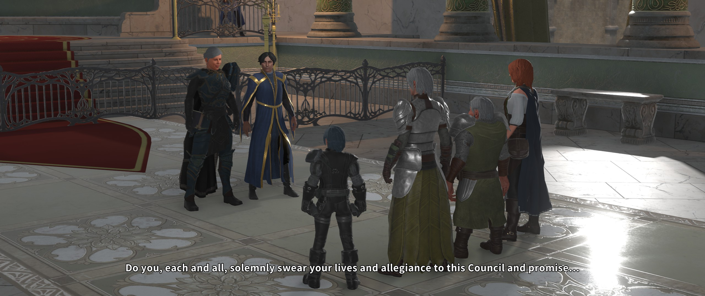
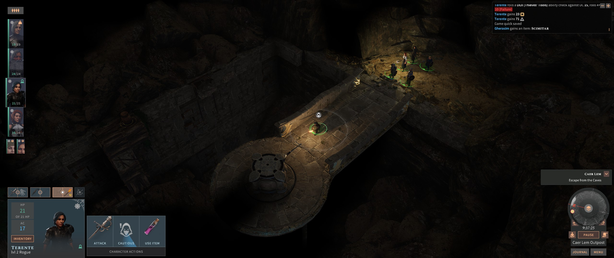
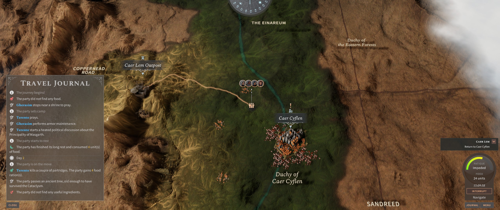

A scrie un preview mi s-a părut mereu o îndeletnicire bizară, la limita dintre reclamă și visat cu ochii deschiși. Frunzărind prin reviste vechi de gaming nu se poate să nu zâmbești cât de optimiste și adeseori fanteziste sunt articolele din această categorie. De multe ori tot ce avea la dispoziție un redactor erau câteva screenshots și un comunicat de presă, în cel mai fericit caz un demo. Lucrurile s-au mai schimbat între timp. Demo-urile au dispărut din peisaj — deși în ultimul timp remarc o revenire a acestora pe Steam — dar tot mai multe jocuri se lansează în early access, într-o formă nedefinitivă. Mai avem și cazuri de crowdfunding, unde susținătorii jocului primesc acces la versiuni beta sau chiar alpha ale jocului. Iar dacă jocul nu poate fi încercat într-o formă brută înainte de lansare, distribuitorii pun la dispoziție o multitudine de materiale media: gameplay videos, story trailers, showcase-uri de câte o oră. Cu siguranță sunt mai puține lucruri lăsate imaginației acum.

Despre **Solasta: Crown of the Magister** o să pot să vă scriu fără să fabulez prea mult, fiind disponibil de mai mult de o lună în early access. În versiunea actuală nu se poate parcurge jocul complet, cum se întâmplă la unele jocuri aflate în early access, ci ne este oferit un prolog de mici dimensiuni, în care pot fi încercate însă principalele sisteme și mecanici ale jocului. Îmi atrăsese atenția de mai multă vreme, cu mixul său de idei old school și moderne. Pe scurt, părea un RPG care promite o redare fidelă a regulilor D&D (ediția a 5-a, mai exact), cu un sistem de luptă pe ture și nu în ultimul rând un accent pus pe explorarea (și pe) verticală a nivelurilor. N-o să mint, prima dată când am văzut Dungeons & Dragons și turn based în aceeași frază, gândul mi s-a dus repejor spre clasicul cult Temple of Elemental Evil și spre pe nedrept uitatul Pool of Radiance 2 — două jocuri care mi-au mâncat nopți fără număr la începutul acestui secol.

Cum spuneam mai devreme, Solasta are la bază ediția a cincea a regulilor D&D. Deși am văzut că majoritatea veteranilor preferă ediția 3.5, pentru bogăția de detalii tactice și opțiuni de definire a personajelor, pot spune că nu e chiar de lepădat nici această ultimă iterație a setului de reguli. Într-adevăr, există o tendință spre simplificare, care a debutat puternic la ediția a patra și a mai fost temperată puțin în cea actuală. Feat-urile sunt mai puține, nu mai există prestige classes, iar sistemul de magie e o combinație între cel cu vrăji memorate și cel spontan (*sorcerer style*). Nimic radical, aș zice — cine a mai jucat din clasicii D&D nu o să aibă probleme să se adapteze. Puriștii vor avea totuși câteva surprize mai puțin plăcute. Deși cei de la Tactical Adventures se laudă cu o transpunere fidelă a regulilor, din Solasta lipsește cu desăvârșire opțiunea de multiclassing. Personal nu mă deranjează această omisiune; mereu am preferat să mă joc cu build-uri simple, clasice. E clar însă că cine își găsea plăcerea în experimentat cu tot felul de combinații de clase și sinergii de feat-uri nu va găsi aici aceeași satisfacție ca în jocuri precum Pathfinder: Kingmaker.

După ora pe care am petrecut-o inevitabil dând cu zarul și definind patru personaje de la zero, jocul m-a luat ușor cu câteva tutoriale care vin sub forma unor amintiri ale personajelor. Premisa e simplă: conduci o bandă de patru aventurieri trimiși de consiliul local să investigheze un fort de la marginea unui nicăieri rău famat. După cum se va vedea, evenimentele de la fort sunt, ce surpriză, doar preludiul unor mișcări mai ample ale unor forțe necunoscute încă, care manifestă un interes pentru artefactul menționat în titlu.

Drept să spun, aș fi preferat un început mai abrupt, care să mă înfigă direct în miezul unui dungeon întortocheat. Dar producătorii s-au gândit și la cei care n-au experiență cu dungeon crawler-ele clasice. Așa că primele ore au mai degrabă aerul unui al doilea tutorial mai extins, în care jocul își pune în valoare principalele atuuri, în cadrul câtorva set-pieces de mici dimensiuni. De departe se remarcă focusul pus pe verticalitate. Duse sunt zilele în care plimbai personajele 3D pe un fundal 2D pre-generat. În Solasta atât luptele cât și explorarea se derulează în toate cele trei dimensiuni. Păianjeni coborând din beznă pe pereți, reptile zburătoare, inamici cu arbalete cocoțați pe metereze — toate acestea vor face viața de coșmar aventurierilor nepregătiți. Nivelurile devin și ele ceva mai interesant de parcurs. Comorile pot fi ascunse pe vreo coloană escaladabilă doar de eroii mai atletici sau dincolo de o prăpastie peste care pot trece doar zburătoarele sau magii cu vrăji corespunzătoare (*Jump* la nivel mic, *Fly* mai târziu).

De asemenea iluminarea joacă aici un rol mai important decât potențarea atmosferei. Toate atacurile asupra monștrilor aflați la adăpostul (semi)întunericului suferă o penalizare la șansele de a lovi. Din fericire, există un întreg arsenal de a produce lumina, de la lumânări și torțe până la tot felul de vrăji. Inclusiv torțele din nivel pot fi aprinse cu orice sursă de flamă pentru a obține avantajul tactic. Dar mai târziu pot apărea inamici care castează *Darkness*, iar asta nu poate fi combătută prin mijloace naturale.

Luptele sunt în general ușoare și de aceea vă recomand să nu abuzați de *long rest*, dacă doriți un minim de provocare la începutul jocului. Către finalul versiunii disponibile în early access m-am trezit însă aruncat în mijlocul a două bătălii greuțe, care m-au luat prin surprindere și au necesitat câteva reluări de salvări. A fost ca în vremurile bune, a trebuit să folosesc tot arsenalul de abilități și vrăji ca să scap la un fir de păr de înfrângere.



Din păcate, chiar când am ajuns cu eroii la nivelul cinci — punctul în care de regulă începe să se încingă treaba într-o campanie low level — build-ul de early access s-a încheiat. Mi-a plăcut însă locația finală pe care am explorat-o și sunt curios ce surprize ne rezervă versiunea definitivă a jocului. Mi-aș dori să văd poate mai multe queste și locații secundare, să mai atenueze din liniaritatea începutului.

Povestea rămâne punctul slab al lui Solasta. Și asta nu pentru că un astfel de joc ar fi avut nevoie de o intrigă grandioasă și meșteșugit lucrată. Chiar din contră, majoritatea RPG-urilor clasice care pun accent pe lupte și dungeon crawling nu se abat de la clișeul cu *„an ancient evil awakens”*. În nișa asta meșteșugul poveștii constă în a ști unde să te oprești — povestea din Icewind Dale sau Temple of Elemental Evil e mai mult undeva în fundal, momentele de narațiune fiind suficient de sporadice încât să nu sufoce aventura. Mi s-a părut însă că Solasta forțează puțin aceste limite. Expozițiunea ar fi putut fi mai scurtă, iar momentele de întrerupere a explorării pentru dialoguri ad-hoc între aventurieri ar fi putut lipsi fără probleme. De asemenea, lumea fantasy în care are loc acțiunea este cât se poate de standard și nememorabilă — nu am reținut mai nimic din mostrele de geografie și istorie care mi-au fost livrate. Din nou, asta nu e neapărat un minus la genul acesta de joc. Nu pot spune că am simțit la Solasta un exces de poveste, dar mi s-a părut că pe alocuri producătorii ar fi putut să fie mai reținuți.

Ca și cum provocările dezvoltării jocului n-ar fi fost de ajuns, în aceeași perioadă cu Solasta s-a lansat și Baldur's Gate 3. Tot early access, tot pe regulile D&D 5, tot turn based. Comparația e inevitabilă, dar în același timp nedreaptă. Este clar că BG3 este jocul cu bugetul cel mai mare — grafică arătoasă, poveste complexă, dar și un preț pe măsură. Nu mi se pare totuși că cele două jocuri s-ar intersecta atât de mult ca viziune și scopuri. Pe când BG3 demarează în trombă cu o poveste care transpiră „epic” prin toți porii, Solasta pune pe masă o aventură convențională, cu eroi ageamii, dar dornici de înavuțire și glorie. Iar la BG3 se face simțită influența lui Divinity, cei de la Larian luându-și chiar mai multe libertăți față de setul de reguli D&D5. În cele din urmă, depinde de fiecare ce caută la un RPG, iar eu unul mă bucur că se lucrează la nu unul, ci două jocuri Dungeons & Dragons cu lupte pe ture. Chiar trei, dacă punem la socoteală și Knights of the Chalice 2, dar asta e deja din altă ligă.

În concluzie, cei cărora le e dor de un *Turn undead* prin catacombe prăfuite sau să prăjească goblini cu un *Burning hands* ar trebui să stea cu ochii pe Solasta. Conținutul disponibil în early access nu este foarte lung — vorbim practic despre primele zece ore de joc — dar producătorii trag tare să lanseze versiunea finală în 2021. Din câte am văzut, sunt foarte receptivi la criticile din comunitate, deci dacă vă place să vă implicați și să experimentați întorcând jocurile pe toate părțile, puteți să-i dați o șansă de pe acum. ■
