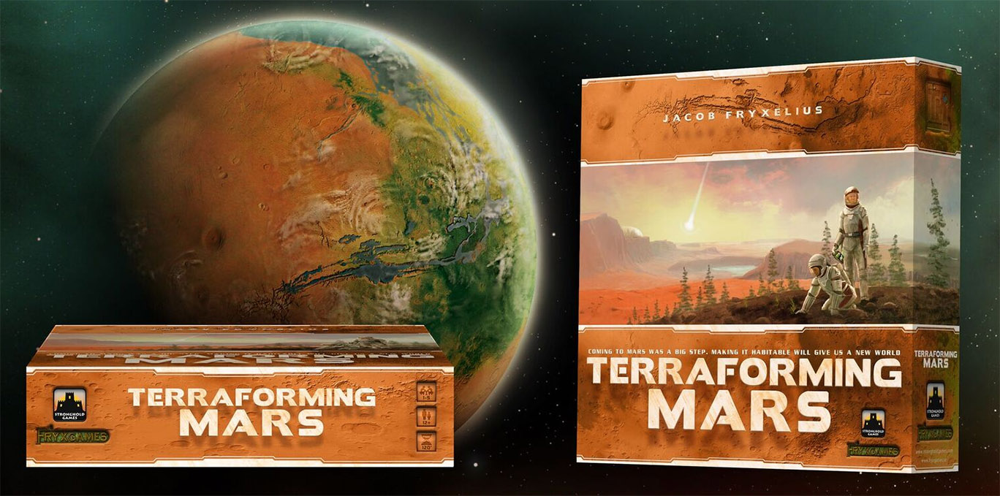
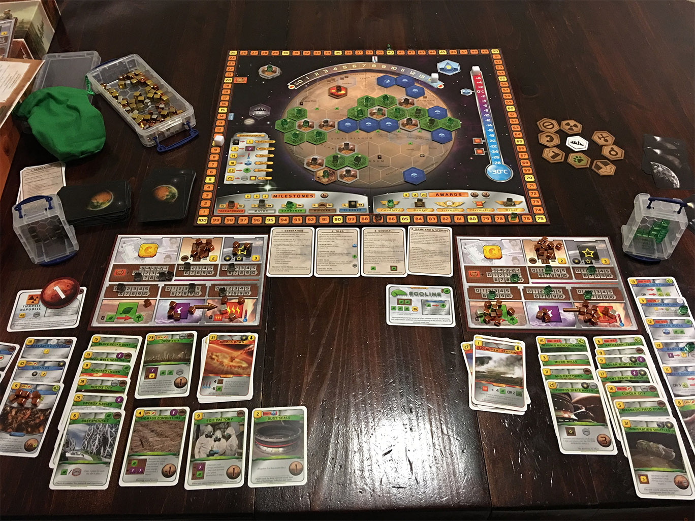

**Terraforming Mars** este un foarte popular joc de societate pentru 1 până la 5 jucători. Încă de la apariția din 2016 a luat cu asalt topurile de specialitate, atât pe cele ale criticilor, cat și pe cele de vânzări, și continuă să rămână foarte sus în preferințele împătimiților de board games. În România a fost localizat de Lex Games în 2019, sub numele de **Terraformarea Planetei Marte**.

Inspirată din literatura hard SF — în primul rând din _Trilogia Marțiană_ a lui Kim Stanley Robinson — tema jocului este efortul comun al omenirii, aflată în secolul 24 sub presiunea suprapopulării Pământului și a epuizării resurselor, de a transforma planeta roșie într-un mediu locuibil și propice extinderii societății. Sub coordonarea Guvernului Planetar, diferite corporații, fiecare condusă de un jucător, se întrec în a contribui cel mai mult la acest demers, lucru care va fi răsplătit printr-un buget mai generos în fiecare rundă a jocului (tematic, o generație de coloniști) și, la final, cu puncte de victorie.

Harta de pe planșa jocului este corectă din punct de vedere geografic și marchează multe repere faimoase ca labirintul Noctis sau Ascraeus Mons, al doilea cel mai înalt vârf de pe Marte, după celebrul Olympus Mons, aflat din păcate în emisfera opusă celei ilustrate pe planșă.

Jacob Fryxelius, designerul jocului, este, printre altele, doctor în chimie, așa că substratul științific este foarte bine reprezentat în mecanicile jocului. Obiectivul principal este modificarea a trei parametri globali până la valori considerate suficiente pentru ca planeta să devină locuibilă: un nivel al oxigenului din atmosferă de 14%, o temperatură medie la ecuator de 8° C (de la o valoare inițială de -30° C) și o suprafață de 9% din planetă acoperită de mări, suficient pentru a întreține un ciclu al apei.

Așadar, există un aspect cooperativ, în care toți jucătorii conlucrează spre o țintă comună, dar încercând în același timp să își reprezinte cât mai bine corporația proprie în cursa spre glorie și profit. Există șase resurse diferite (bani, oțel, titan, plante, energie și căldură), iar în fiecare generație, jucătorii vor achiziționa proiecte pe care apoi le vor implementa dacă îndeplinesc condițiile necesare și își permit costurile asociate. Efectele lor includ de cele mai multe ori modificarea valorilor resurselor și a unuia din cei trei parametri globali, care apoi rezultă în creșterea ratingului de „terraformator” al jucătorului. Acest rating afectează pozitiv bugetul disponibil în generațiile următoare, iar la finalul jocului este cel mai important factor în calcularea punctajului final.

Proiectele mai sus menționate sunt de două feluri: cele standard, mereu disponibile, cum ar fi construirea unui oraș sau a unei centrale de energie, sau cele speciale, reprezentate de un pachet cu peste 200 de cărți, fiecare cu o ilustrație unică și cu o mică poveste tematică ce însoțește acțiunea propriu-zisă. Ca exemple evocative: temperatura poate fi ridicată prin construirea unei fabrici GHG (gaze cu efect de seră), iar lichenii adaptați pot ajuta la producerea oxigenului. Unele proiecte, cu costuri mai mari și efecte mai dramatice, cum ar fi prăbușirea de asteroizi de gheață pentru ridicarea nivelului de apă, pot fi realizate o singură dată în joc. Alte acțiuni au efecte mai puțin directe, dar aduc totuși beneficii pe termen lung jucătorilor. De exemplu, construirea unui oraș-cupolă va contribui pozitiv la economie, iar astfel proiectele de terraformare vor fi mai ușor de implementat în generațiile următoare.

De-a lungul jocului se acordă puncte importante pentru realizări notabile cum ar fi cea de „primar” (primul jucător cu trei orașe dezvoltate) sau „grădinar” (primul cu trei zone de vegetație). Există și un aspect politic, jucătorii putând sponsoriza anumite premii care vor acorda puncte la finalul jocului, fără a avea însă certitudinea că acele premii le vor reveni lor.

O partidă durează în jur de 2 ore, timp care poate varia în funcție de numărul de jucători și de nivelul de familiaritate cu regulile și strategiile posibile.



Înainte de încheiere merită menționat că jocul oferă și un excelent mod de joc solo, în care un singur jucător, reprezentând o singură corporație, are la dispoziție doar 14 generații pentru a terraforma planeta, ridicând cei trei parametri globali la valorile țintă. Din propria mea experiența, rata de succes e în jurul valorii de 50%, o dovadă că acest mod de joc e mereu interesant și provocator.

Evident, la final, jocul vine cu o recomandare din partea mea. Nivelul de complexitate este inițial ridicat, dar, odată învățate regulile de bază (aici simbologia excelentă ajută foarte mult), variabilitatea și multitudinea de opțiuni fac ca fiecare sesiune de joc să fie o experiență memorabilă. ■

P.S.: O metodă alternativă de a vă bucura de acest joc este aceea de a folosi varianta digitală, disponibilă pe PC ([Steam](https://store.steampowered.com/app/800270/Terraforming_Mars/)) sau pe platformele mobile [iOS](https://apps.apple.com/us/app/terraforming-mars/id1353471030) si [Android](Terraforming Mars).