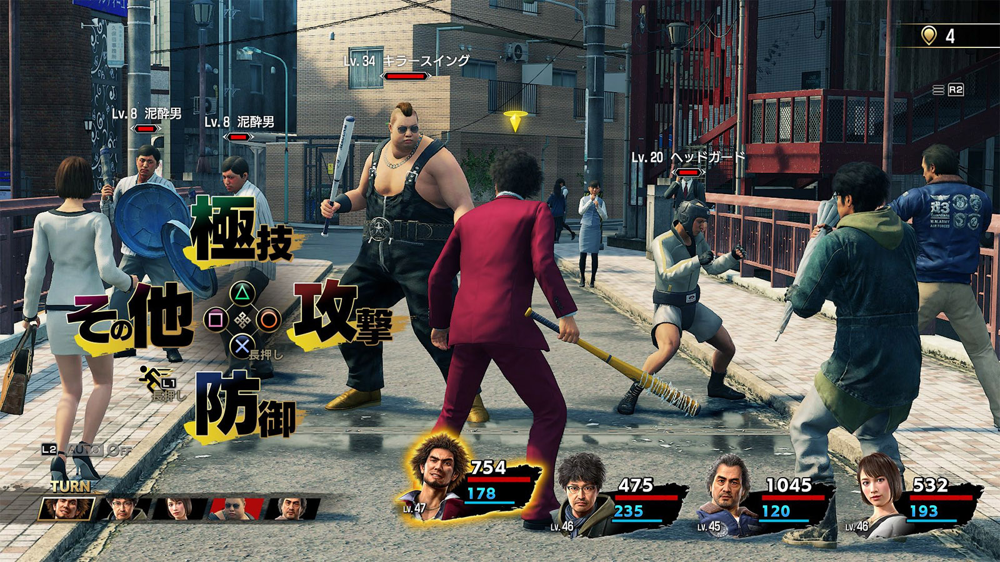

> Articol tradus din limba engleză de [Azad](/authors/azad/)

Dacă ești fan al jocurilor video și dacă Japonia înseamnă pentru tine mai mult decât un ansamblu de clișee precum florile de cireș sau restaurantul local de sushi, atunci probabil că ai auzit în ultimii ani de seria de jocuri video **Yakuza**. Evident, dacă ne luăm după titlu, nu trebuie să ne gândim foarte mult la tema jocului. Deși seria era mult mai populară în Japonia decât în Occident, o dată cu apariția în 2015 a lui **Yakuza 0**, jocurile Yakuza au început să prezinte interes și pentru publicul larg din vest și nu au rămas doar ceva de nișă. Seria a stârnit atât de mult interes încât anunțul lui Like a Dragon a reprezentat un adevărat eveniment în rândul gamerilor.

**Yakuza: Like a Dragon** este al șaptelea titlu Yakuza, toate jocurile din serie fiind dezvoltate de către SEGA și studioul Ryu Ga Gotoku (al cărui nume se traduce întâmplător prin _„Like a Dragon”_). Cele șase titluri precedente se încadrează în genul _beat ‘em up_, gen în care apeși taste și te bați cu yakuziști rivali, și în care lumea pe care o poți explora se rezumă la câte un cartier dintr-un oraș japonez, inspirat din realitate. Jucătorul era pus în titlurile precedente în pielea lui Kazuma Kyriu, un yakuza din Tokyo, un băiat rău cu o inimă sensibilă.



După aceste șase titluri desfășurate pe parcursul a treizeci de ani virtuali, studiourile SEGA și Ryu Ga Gotoku au realizat că poate au cam epuizat povestea și că un Kyriu în vârstă de 60 ani nu ar mai fi credibil, asta ca să nu mai vorbim de aceleași cartiere, mecanici și personaje. Cu alte cuvinte, seria avea nevoie de un nou episod care să aducă o gură de aer proaspăt.

De aceea, cele două studiouri au făcut o schimbare considerabilă, noul joc Yakuza nemaifiind doar un _beat 'em up_, ci un RPG care aduce un protagonist nou.

### Wait, is that... really your name?

Noul protagonist este Ichiban Kasuga, un fel de Naruto al lumii interlope japoneze, amândoi tunși cu grenada și cu gusturi vestimentare dubioase, la fel de prostuți, dar cu un suflet bun și talentați la bătaie. Având în vedere că fiecare nume și prenume japonez are câte o semnificație, nu vom fi surprinși de faptul că și numele protagonistului nostru înseamnă ceva. Mai exact, _„ichiban”_ înseamnă „cel mai bun”, lucru destul de ironic în contextul personajului nostru.



Povestea începe într-un mod liniștit; jucătorul urmărește viața lui Ichiban, în vârstă de 20 de ani, tânăr golan și membru al unui clan yakuza modest. Lucrurile încep să o ia razna când Ichiban, vrând să salveze onoarea șefului său și a întregului clan, își asumă răspunderea pentru o crimă pe care nu a comis-o. Acesta ajunge la închisoare fără să se poată bucura de atracțiile tinereții, cum ar fi petreceri, festivități și întâlniri cu fete, și îl redescoperim 18 ani mai târziu o dată cu eliberarea sa din închisoare. Numai că în timpul acesta lumea s-a schimbat drastic: smartphone-urile au fost inventate și răspândite, BlackBerry a avut timp să fie la modă, să devină învechit și apoi să dispară, lumea postează poze cu pisici grase pe internet și tot așa. Cu toate astea, nu descoperirea unei lumi complet noi îl afectează pe Ichiban, ci faptul că a fost uitat de către clanul său și asta îi frânge inima. Nu îl așteaptă niciun membru al clanului să îi facă cinste cu sushi, nimic. Astfel Ichiban se trezește singur și abandonat, fără casă, dar hotărât să își găsească clanul. Bineînțeles, în felul acesta va ajunge să fie implicat în multe mașinațiuni ale mafiei, dar va merge cu capul înainte indiferent de situație.



### New game new me

După apariția primului trailer al jocului toată de pe internet a intrat în panică: „Nu mai putem juca cu Kiryu?”, „RPG??”, „un personaj principal vagabond?”. Dar apoi au venit adevăratele întrebări care necesitau răspunsuri: „o să fie un joc Yakuza bun fără charismaticul Kiryu?”, „o să fie un RPG bun?”. Răspunsul este simplu și nu mă pot abține să nu dezvălui o mică parte din verdictul acestei recenzii: **Yakuza: Like a Dragon** este atât un RPG excelent, cât și un joc excelent. O să vedem de ce componentele jocului sunt strălucite.

JRPG-urile tradiționale se prezintă, de obicei, ca jocuri serioase și care trebuie să țină cont de anumite clișee pentru a putea vinde mai mult de o sută de mii de copii: eroii trebuie să fie niște Aleși, trebuie neapărat să apară niște cristale sacre menționate pe undeva, muzica boșilor trebuie să fie în latină sau harta lumii să fie imensă și, mai presus de orice, să fie în mare parte goală. Ei bine, în această nouă aventură Yakuza, puteți uita de toate acestea.

Jocurile precedente îi permiteau jucătorului să circule liber în cartierele Kamurocho (inspirat de cartierul Kabukicho din Tokyo) sau Sotenbori (inspirat, de asemenea, de cartierul Doutonbori din Osaka). În noul titlu, jucătorul urmărește aventurile lui Ichiban în cartierul Isezaki Ijincho, inspirat dintr-un cartier din Yokohama, Isezakichou.

Orașul oferă multe locuri de joacă și cu posibilitatea de a călători rapid dintr-o zonă în alta prin intermediul taxiurilor. Deși peisajele și atmosfera sunt mai aeresite și în comuniune cu natura, prin prezența copacilor și a unor căsuțe din lemn, orașului îi lipsește efectul „wow” și asta poate stârni urme de regret în rândul unor jucători. Nu te mai simți bombardat de lumini și nu mai ești lăsat cu gura căscată ca atunci când treci prin poarta din Kamurocho sau când treci pe sub crabul uriaș din Sotenbori. Yokohama este un oraș mai înțelept, mai calm, departe de agitația din Tokyo.



Când Ichiban începe să trăiască sub podurile din Yokohama, tovărășii săi vagabonzi cu care își va organiza o echipă încep să îl învețe multe lecții de viață și șmecherii, iar în felul acesta ne vom obișnui gradual cu mecanica de joc. Ca să poată trăi iar ca un om bogat, Ichiban va trebui să învețe să se descurce cu traiul pe stradă. Astfel vom începe să luăm parte la diverse mini-jocuri în care Ichiban trebuie să adune cât mai multe gunoaie într-un anumit timp și pe care le poate da la schimb pe bani sau alte obiecte.

### Life is like an RPG

Jocul ne face să înțelegem destul de devreme că toate componentele sale sunt inspirate din RPG-uri sau chiar din viața reală, în felul acesta reușind să introducă interacțiuni între Ichiban și amicii săi care frizează bariera dintre joc și realitate.

Am menționat reciclatul gunoaielor, dar comparațiile cu viața reală nu se opresc aici. Ce faci atunci când ai nevoie de niște bani? Începi să cauți un loc de muncă, iar Ichiban exact asta face. O să meargă la centrul local de joburi care îi oferă munci variate. Toate activitățile acestea, la fel ca în **Final Fantasy III** sau **Dragon Quest VI**, o să îi modifice parametrii și îi vor permite să învețe diferite tehnici și trucuri care îi vor fi de folos în timpul luptelor. De exemplu, dacă Ichiban învață să danseze, lucrul acesta se va reflecta în valoarea de agilitate și va învăța să facă break dance în timpul luptei ca să îi pună la podea pe adversari. Dacă îl vom face pe Ichiban bucătar, acesta va începe să arunce cu tigăi înspre inamici. Sunt multe exemple similare și probabil vei petrece mult timp încercând să execuți în luptă tot ceea ce învață Ichiban. Aceste „talente” sunt departe de clasele tradiționale din RPG-uri, precum „mage”, „warrior” sau „priest”, iar viziunea aceasta realistă aduce seriei Yakuza revitalizarea de care avea nevoie.

Sunt vreo duzină de munci diferite, iar fiecare personaj din trupa lui Ichiban poate să facă anumite meserii. Ține de jucător să formeze o echipă echilibrată (sau nu), în funcție de îndemânările deprinse de fiecare tovarăș al lui Ichiban în urma joburilor efectuate. Componenta aceasta a meseriilor, deși clasică în esență, se potrivește ca o mănușă în universul jocului și funcționează de minune, fără să existe munci inutile sau care să strice echilibrul sistemului de joc. Din păcate, personajele feminine din echipa lui Ichiban nu pot să facă aceleași job-uri ca și partea masculină.



La fel ca seria **Persona**, și puțin ca în viața reală, cu cât faci mai multe activități cu membrii echipei (cum ar fi mersul la restaurant), prietenia voastră va deveni din ce în ce mai puternică și vei putea debloca diferite avantaje. Ichiban își va putea, astfel, dezvolta aspecte ale sale precum inteligența, charisma, încrederea în sine.

Dezvoltatorii jocului sunt probabil mari fani ai jocurilor RPG și ai seriei **Dragon Quest**, deoarece jocul pur și simplu abundă în trimiteri și omagii aduse acestora. Am putea chiar crede că au dezvoltat noul Yakuza doar pentru a-și mărturisi dragostea pentru genul RPG care a fost puțin abandonat în perioada PS3/X360, dar care a făcut o întoarcere triumfală în ultimii ani.

Toate componentele implementate în joc sunt utile și sunt atât de numeroase încât putem să amețim dacă stăm să ne gândim câte putem face ca activități secundare, fără a urmări povestea principală.

### Like a Yakuza

Un nou joc Yakuza înseamnă, de obicei, că sigur vom descoperi niște elemente comune cu titlurile precedente: misiuni secundare care pot varia de la registrul absurd la cel ilar sau emoționant, sau o mulțime de mini-jocuri în centrele de jocuri arcade (cu multe jocuri retro reale, precum Virtua Fighter sau Space Harrier), mahjong sau karaoke. Pe lângă toate acestea, au apărut și activități noi precum cursele, management-ul afacerilor, un centru de antrenament pentru luptă și încă pe atâtea. Porțiunea aceasta de conținut secundar este complet opțională pentru jucătorii care vor să se concentreze doar pe povestea principală, dar ar fi păcat să le ratăm, deoarece ele ne arată cât de generos este jocul în conținut. Unele dintre aceste activități secundare aproape că ar putea fi vândute separat ca jocuri de sine stătătoare.



Sistemul de luptă este un amestec de bun gust între sistemul clasic din Dragon Quest, cu atacuri fizice sau magice, un sistem de avantaje și slăbiciuni moștenit din Megami Tensei și chiar un sistem de „gardă” (atunci când apăsăm o tastă pentru a ne apăra exact în momentul în care suntem atacați) la fel ca în **Garou: Mark of the Wolves**. Mai sunt și alte trucuri, dar vă las pe voi să le descoperiți.

Nu lipsesc nici evenimentele aleatorii cu lupte pe stradă, care le permit jucătorilor să mai adune experiență și niște yeni. Din păcate, aceste evenimente sunt puțin prea numeroase și mai dificile decât ar trebui din cauza îngustimii străzilor din oraș. Uneori tind să întrerupă ritmul jocului, mai ales când vrei doar să mergi până la magazinul de la colț. În anumite zone este chiar imposibil să eviți aceste lupte, care se pot dovedi a fi doar o pierdere de timp atunci când echipa ta este mai puternică decât inamicii.

Din fericire, jocul ne permite să punem la punct o echipă echilibrată care poate profita de fiecare slăbiciune a oponenților și în felul acesta putem trece repede prin inamici, urmând să transpirăm mai mult la luptele cu boșii.

Cât despre poveste, aceasta e un mix de crimă, violență, lacrimi și emoții puternice aflate doar la un pas minuscul de clișeu. Iar atunci când te obișnuiești cu conținutul de calitate, începi să nu acorzi atenție detaliilor minore, cum ar fi lipsa de lupte în care oponentul își aruncă haina de pe el și îi poți vedea într-un mod dinamic tatuajul de pe spate. Dar asta nu înseamnă că Yakuza 7 nu este un joc intens.

### I’m going to kick your ass... in 15 seconds

Un aspect al jocului care lasă de dorit ține de partea tehnică. O să petreceți mult timp așteptând, și nu din cauză că timpii de încărcare ar fi lungi, dar sunt numeroși ^[Din comunicatele celor de la Microsoft și de la Sony, problema aceasta nu ar trebui să existe pe consolele noi precum PS5 și Xbox Series.]. Jocului îi place să își construiască atent intriga, dar lucrurile devin enervante atunci când apar o gramadă de timpi de încărcare și mai ales după vreo cinci lupte de stradă iscate din senin.

Cât despre partea grafică, Dragon Engine, motorul pe care este construit jocul, își face treaba, dar performanța nu a evoluat foarte mult de la Yakuza 6. De aceea grafica nu este foarte strălucită, dar lucrul acesta nu împiedică imersiunea.

### What are you all waiting for ?

Exact ca în **Final Fantasy XV**, noul titlu Yakuza este făcut deopotrivă pentru veteranii seriei și pentru nou veniți. Fanii vechi vor fi încântați să găsească tot ceea ce le-a plăcut și în jocurile precedente, dar cu retușuri de prospețime și modernitate aduse de partea RPG-istică, iar cei ating pentru prima dată seria vor putea juca fără să urmărească ore de recapitulări ale titlurilor anterioare. Jucătorii alergici la latura mai absurdă și excentrică a culturii japoneze probabil vor fi puțin iritați de joc, dar Yakuza 7 reușește să îi facă pe toți să cadă de acord asupra calității sale.

Seria Yakuza a crescut din ADN-ul SEGA — ar fi ușor să ne imaginăm seria aceasta pe Dreamcast, dacă Dreamcast ar fi avut succes comercial. Ascensiunea popularității seriei în Occident este unul dintre cele de succes lucruri care li s-au întâmplat celor de la SEGA în ultimii 10 ani. Ar fi putut Yakuza să existe într-o lume dominată de **Shenmue**? Am putea să dezbatem acest lucru cu orele, dar faptele rămân: Yakuza este una dintre cele mai bune serii _beat 'em up_ și acum are un potențial mare pentru a deveni și o serie RPG de calitate. De aceea mi-aș dori ca SEGA și Ryu Ga Gotoku să îmbunătățească rețeta și în câțiva ani să ne ofere un **Yakuza: Like a Dragon 2** perfect, exact așa cum au făcut cu Yakuza 2 la vremea sa. ■

> review efectuat pe un PS4 slim