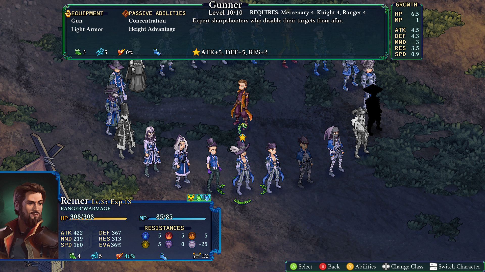

Ai crede că după decenii de jucat jocuri pe calculator ai fi jucat de toate, dar cu cât joci mai multe cu atât îți dai seama cât de multe mai ai de jucat. Faptul că România, că restul zonei balcanice, din rațiuni pur politice legate de securi și ciocane, a fost „scutită” de influența Nintendo și Sony nu e ceva nou. A fost „scutită” de Dreamcast-uri, de SEGA Genesis, NES-uri și aproape și de prima serie de Playstation-uri, cu toate jocurile care face lumea vestică, dar și depărtat-estică, să cadă în genunchi de nostalgie. Pasionații mioritici de jocuri nu au mari tangențe cu Mario-uri, în afară de clasicul Mario Bros. care era pe toate Terminatoarele bulgărești. Au ratat multe din Zelde, din Final Fantasy-uri și alți clasici mereu dezgropați la fiecare doi-trei ani în zilele noastre sub formă de remaster-uri și sequel-uri sau spiritual sequel-uri pentru care se fac cozi la magazine și precomenzi babane.

Și în continuare, dat fiind că și eu sunt un pasionat de jocuri de pe susmenționatele plaiuri mioritice, cu ale lor tuneluri energetice pe sub Bucegi, nici eu nu am jucat Final Fantasy Tactics. Și vai, ce bine mi-ar fi prins acum vreo trei săptămâni, când m-am apucat de **Fell Seal: Arbiter's Mark**, să știu și eu cum stă treaba cu AP-ul și cu XP-ul, cum e cu clasele/joburile și care-i șmecheria cu build-urile. Deși mă consider un veteran suprem al tot ce înseamnă strategie pe ture sau cu active pause, m-am trezit în niște ape puțin prea adânci pentru mine, ademenit în adâncuri de un gen de jocuri neexplorat, o nișă super specifică de care nu m-am lovit până acum. Fell Seal: Arbiter's Mark este un spiritual sequel la Final Fantasy Tactics, și când zic spiritual sequel nu vorbesc Prey versus System Shock, vreau să zic aproape clonat, upscalat și modernizat. Avem o strategie pe ture în care controlăm șase omuleți pe o hartă izometrică împărțită în pătrățele frumos sprite-uite de-a lungul unei campanii destul de lungi care, cu tot cu măcinat niveluri și clase în plus, dacă vreți a face, duce la vreo șaptezeci de ore de tactică și poveste.



Vorbind de poveste... Am intrat în joc aproape pe nevăzute și nemirosite și nu știam mare lucru mai mult decât că era un fel de JRPG, ținând în piept o gură de aer așteptând să răsuflu dezamăgit la primul clișeu cu tsundere sau fetițe mult prea drăgălașe care chicotesc și zbiară pentru al nostru amuzament. Dar după ce m-am făcut albastru la față și instinctul de supraviețuire s-a făcut cunoscut, descleștându-mi buzele și trăgând în piept mult-cerutul aer, mi-am dat seama că eram la aproape jumătate din joc și încă nu mă strâmbasem la nimic. Avem personaje autentice prezentate cu fler și stil, cu o narațiune fără patos și fără schimbări stranii de ton. Desigur, finalul poveștii îl vezi venind de parcă ai pus GPS-ul pe el înainte să pornești la drum, și poate pacing-ul putea să fie ceva mai rapid și mai dinamic, dar experiența își îndeplinește rolul de a ne da o mușama peste care vine jocul în sine. Avem o bucată personaj principal în stil Hagi, care face bine să nu fie rău, cu un hero's journey stas și o gloată de personaje secundare care tot picură până aproape de sfârșitul jocului. Intriga se arată repede, ne punem în mișcare și dăm bătălie după bătălie, și păstrăm aceași cadență până la final, numai dorința noastră de a mai face vreuna dintre puținele aventuri secundare trăgându-ne de pe firul narativ. Dar toate ca toate, nu am intrat cu așteptări dospite și așadar n-am fost dezamăgit. Dar oricum nu de aici mi-a venit durerea de cap.

Nu, dragi cititori, durerea de cap a venit de la mecanicile în sine. Dar nu a fost o durere de cap neplăcută, d-aia de te scoală în miezul nopții, îi dai cu algocalmin și apoi stai într-un colț ghemuit până trece... Nu. A fost așa, un masaj capilar foarte apăsat de către o maseuză supărată, care m-a făcut să scot Excelu' și să-mi fac niște tabele, să-mi culeg gândurile și să fac ordine în ordinea jocului. Să începem cu niște matematică simplă. Fiecare personaj are o clasă principală și o clasă secundară care se pot schimba în orice moment, alegând dintre mercenar, vrăjitor, furăcios, pădurar, d-astea d-ale RPG-ului, adunându-se la un total de 20 de clase de bază (+3 în DLC), peste care adăugăm șase clase speciale, semilup, prințesă, super nemort, și dacă credeți că am terminat, sunați ACUM și veți primi bonus pentru fiecare personaj principal o clasă numai a lor, în total de iar șase. Fiecare clasă are pe lângă skill-urile lor active de vreo cinci-șase și două pasive și un skill de ripostă. Acum, clasa principală obligă la folosirea a celor două pasive ale clasei respective, dar clasa secundară e independentă doar cu skill-urile active, și dacă credeți că nu se poate mai complicat, aici vine bomba. Peste cele două clase și două pasive, putem folosi ÎNCĂ două pasive de la orice clase deblocate pe acel personaj, și orice ripostă de pe orice clasă deblocată. Dacă deja nu v-a luat cu leșin, aflați că la fiecare susnivel cu o clasă pricipală setată, personajul ia puncte în anumite statistici conforme cu clasa principală pe care era atunci când a făcut susnivelul. Deci mercenarul ia viață în plus și putere, pe când dacă erai vrăjitor, luai puncte de mana și rezistență la vrăji. Mă rog, nu e atât de alb și negru, diferențele fiind ușor superficiale, dar suficiente încât peste 40 sau 50 de niveluri să contureze rolul unui personaj. Dar nu-i bai că există posibilitatea de a reseta la nivelul 1 un personaj, păstrând totuși toate clasele deblocate.

Acum înțelegeți de ce Excelul? Faptul că într-un final îți dai seama că personajele sunt tabula rasa și extrem de customizabile, în funcție de cât timp vrei să depui să deblochezi clasele pentru fiecare. Și nici măcar nu am zis că un anume personaj principal are clasele numai ale lui, sau faptul că în DLC putem avea lighioane și bărzăuni care, iarăși, au clasele lor. Este o nebunie completă pentru ăștia că mine, kriptonită pură. Parcă jocul m-a prins la sol cu o mișcare de jiujitsu brazilian și nu voia să-mi dea drumul... dar nici eu nu am bătut cu palma în saltea. Din cele șaptezeci de ore petrecute în joc, probabil că am avut vreo zece numai stând și analizând build-uri și posibilități. Că avem și seturi de arme cu efecte speciale, seturi de armuri, diferite slot-uri de echipament care pot stoarce ultimii 10% dintr-un build, să-l dea complet peste cap sau să fie ultima piesă necesară pentru ceva într-adevăr special. Dar destul cu frecția uscată la membrul de lemn, timpul pentru un E-XEM-PLU.

Pe lângă alte personaje și builduri, eu ajunsesem la un miez de trei Sorcerors, mai vrăjitori ca vrăjitorii, care aveau ca clasă secundară Gunner, niște pușcași cu puști. Ați crede că nu au nimic în comun, dar ați greși. Vedeți voi, primul skill activ la Gunner e Focus, care face ca următorul atac de orice fel, să fie la dublu efect. Și doar se întâmplă că Sorcerors au ca bază să dea cu furtună de foc sau urgie de grindină peste toți inamicii în același timp, un skill care costă foarte multă mana și nu e făcut să fie chiar dat așa în fiecare rundă. Apoi se întâmplă că Gadgeteer să aibă o ripostă care ne dă voie să sugem mana din vrăjile cu care suntem atacați, și mai avem apoi o pasivă de la Druid și una de la Wizard și cu niște toiage care dau bonus fix pe un anumit element și niște echipamente care cresc puterea de foc magică... și curățăm toată harta din trei oameni la sfârșitul turei a doua, cu mici excepții, excepții care aveau apoi de a face cu restul echipei. Și, deși comboul e foarte puternic, nu pare cu mult mai puternic decât orice alt combo din joc, dar e ok, că jocul oferă soluții și în cazul asta.



Fell Seal oferă o plajă foarte mare de opțiuni de dificultate în caz că crezi că nu e cinstit față de inamic ce anume tocmai le faci. Poți ajusta de la numărul de inamici pe hartă, la cât de puternici sunt ca statistici brute, la ce tactici folosesc sau ce echipament au disponibil. E ceva pentru toată lumea să își customizeze dificultatea exact în modul în care consideră ei că trebuie, și dacă trebuie, în sus sau în jos. Ca bonus, deși e complet dizgrațios pentru fanii strategiilor, există opțiunea să automatizezi mișcările unora din personaje sau chiar a întregii echipe dacă vrei, dacă ai făcut-o absolut imbatabilă și vrei să-ți mănânci ciorbă în liniște în timp ce ai tăi le dau mucu' la inamici. Personal am folosit asta când vroiam să mai storc niște niveluri și să deblochez niște clase, pentru a perfecționa susmenționatele build-uri, dar pot înțelege că ar fi interesant să încerci să faci build-uri speciale și să joci jocul ca pe AutoChess. Zic interesant că inteligența artificială a ceea ce întâlnești des îți dă de furcă și e foarte eficientă, și de partea lor, dar și a ta dacă alegi să o folosești pentru unități. Pe cât posibil, inamicii folosesc toate oportunitățile pe care le văd, și rar au milă față de tine. Dacă jucați și cu setarea de dificultate de a le da frâu liber inamicilor să îți înece unitățile - moarte instantă pentru cele care nu pot înota - veți cunoaște cu adevărat un nivel al iadului rezervat sadomasochiștilor. Dar totuși, niciodată AI-ul nu a părut imbatabil sau foarte „artificial”. Își lasă destule găuri în defensivă și are destule hibe „umane” încât să fie plăcut să te lupți împotriva lui folosind mecanicile jocului, nu limitările AI-ului în sine, ceea ce e mare lucru pentru strategiile de gen.

Jocul are și un New Game+, iarăși foarte customizabil, dar, după ce am terminat tot ce am avut de terminat în joc și l-am dovedit, deși mi-a plăcut foarte mult timpul petrecut în el, am răsuflat adânc și bucuros că nu mai aveam de a face cu el. Nimic de rău, doar un sentiment de eliberare din experiența intensiv mentală, bucuros că pot să trec mai departe și să mă dau în alt joc care nu mă lasă să mă arunc în el ca într-un hău gata să mă înghită.

Bonus: Legat de DLC, ce aduce pe lângă clasele extra și monștrii e o mecanică clasică de „trimit tipii în misiune și peste 35 de minute mi se întorc cu ceva”, dar care, peste banalitatea ei, o consider aproape necesară pentru cei care vor să tragă tot ce pot din joc. Ajută enorm la creșterea personajelor și deblocarea claselor, și vă da ceva de făcut cu unitățile extra pe care o să le adunați. Poate nu chiar 15$ extra, dar 10$ merită dacă îl vedeți la discount sau ceva bundle. ■
