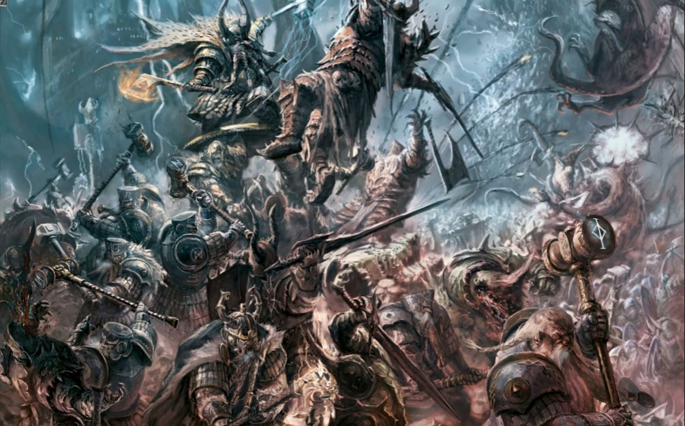

Scurți de statură, dar compensînd cu lungimea bărbii, piticii sunt una dintre cele mai bătrîne civilizații ale Lumii Vechi și totodată una destul de atipică. Spre exemplu, piticii nu au divinități în sensul teologic uzual, anume ființe supranaturale care să intervină în chestiuni lumești. Ei își venerează strămoșii, la loc de cinste fiind făurarul Grugni, care i-a scos din paleoliticul piticesc prin meșteșugul metalurgiei, gospodina Valaya, care a descoperit secretul vital al fabricării berii, și supăriciul Grimnir de la care au învățat deprinderea esențială de crăpare a țestelor potrivnice cu securea. Pe lîngă aceștia e loc și pentru alți pitici de soi, iar de regulă fiecare neam piticesc are strămoșii săi de renume, venerați la nivelul lanțului muntos local. Fiecare clan este condus de cîte un rege, și în principiu există o autoritate supremă în persoana marelui rege de la Karaz-a-Karak, Piscul Veșnic unde se află cea mai veche fortificație piticească. Problema de principiu se pune din cauza faptului că, la data la care au loc evenimentele din TW:WH, piticii sunt deja de vreme bună într-o stare de degringoladă. Istoria lor are în mare două faze: o epocă de aur, la care privesc înapoi cu ranchiuna specifică pentru idealurile pe veci pierdute, respectiv un declin lent înspre uitare și ruină. De vină sunt manevre elfești din străvechime, o mini-apocalipsă geologică provocată de un necromant dus cu sorcova și invaziile dușmanilor ancestrali, anume triburile pieilor verzi, respectiv șobolanii.

Puțini și mohorîți, piticii au o tendință susținută spre auto-izolare. Baricadați sub munți și preocupați aproape exclusiv cu supraviețuirea fortăreței de care aparțin, privesc mai mereu cu suspiciune chiar și spre vechi prieteni, fie ei scurți sau mai înalți decît permite rînduiala cinstită. Dincolo de buna chivernisire a bogățiilor muntelui, trei lucruri sunt de importanță supremă pentru orice pitic onest: berea, barba și onoarea, cea din urmă ridicînd cele mai sensibile probleme. O vătămare de absolut orice natură a părții piticești, de la insulte imaginate la dispute miniere sau chestiuni cu adevărat problematice, precum pierderea bărbii, sunt reclamate la regele cel mare de la Karaz-a-Karak. Acesta pune repede mîna pe condei, îl înmoaie în propriul sînge și înscrie respectiva plîngere în Dammaz Kron, un catastif al ranchiunilor la fel de vechi precum piticimea, ca nu cumva vreo nedreptate să rămînă uitată. În cazul în care un pitic își pierde onoarea în circumstanțe deosebit de grave (își încalcă cuvîntul, nu este în stare să-și îndeplinească atribuțiile, păgubește vatra sau neamul din cauza comportamentului etc.), acestuia i se taie rezervarea la o măsuță în sălile lui Grimnir, astfel că după moarte nu mai poate ciocni halbe cu vitejii. Nu există cale de întoarcere din dizgrație, dar chiar și așa ingeniozitatea piticească a găsit o soluție: piticul dezonorat își părăsește muntele, este trecut mort în acte, iar clanul îi face serviciile funerare. Apoi, acesta călătorește înspre piscurile înzăpezite deasupra unei trecători care leagă răsăritul de Lumea Veche, unde se află o fortăreață numită Karak Kadrin. Regele ei, Mîhnilă, adună în jurul său toți amărîții cufundați în rușine și-i școlește în meșteșugul răpunerii de fiare. Piticii în cauză depun apoi un jurămînt la marele altar lui Grimnir și-și petrec restul existenței năvălind la burtica goală împotriva celor mai teribili adversari, iar dacă au parte de o moarte glorioasă își primesc din nou scăunelul și halba în viața de apoi. Poanta în tot acest artificiu e că nu le este permis să țină cu ursul. Trebuie să facă tot ce stă în priceperea lor piticească pentru a birui împotriva celor mai potrivnice sorți și n-au voie să pună în niciun fel în pericol vatra și viața altor pitici sau prieteni ai piticilor atunci cînd își caută moartea.

Atît gloria cît și tragedia piticească își ating culmile în spuma berii. În eventualitatea în care o fortăreață urmează să cadă, ultima luptă se dă în berărie, și se bănuiește că niciodată în lunga istorie a piticilor nu s-a întîmplat ca berăria să fie cucerită înainte să se termine băutura. Cea mai amară astfel de poveste este cea a berarului de legendă, cu un nume mai pe placul urechii omenești. Josef Bugman își desfășura operațiunile la marginea de răsărit a Imperiului, fiind cunoscut pentru sortimente precum faimoasa XXXXXX, servită atît în capitala Imperiului cît și în cea a piticimii. Acesta și-a văzut afacerea năruită cînd, întorcîndu-se de la o livrare, a găsit berăria făcută scrum și neamul luat în sclavie de către un trib de piei verzi, ale cărui urme s-au risipit în Munții Cenușii. De atunci, despre Bugman și temerarii lui nu mai sunt decît umbre și zvonuri: lovituri în noapte date văgăunilor pieilor verzi sau vreo apariție vremelnică la o mare bătălie de-a piticilor, cît să vîre de nicăieri puțină răzbunare în coasta dușmanilor înainte să se facă nevăzuți.

Toate aceste detalii de atmosferă sunt bine reprezentate în TW:WH. Configurația de deschidere găsește piticii fragmentați în cuprinsul fostului Karaz Ankor, regatul ce ar fi trebuit să fie veșnic precum munții. El se întide din pustiurile de la miazăzi în lungul piscurilor care constituie frontiera răsăriteană a Lumii Vechi. La miazănoapte, ultimul bastion piticesc este chiar la marginea tărîmului Haosului. Sper apus, piticii urmăresc frontiera sudică a Imperiului, în lanțul Munților Cenușii. Tot acest areal prezintă o mare diversitate geografică și climatică: de la galerii săpate sub deșerturi sau în vatra vreunui vulcan, la piscuri mereu înzăpezite sau văgăunile mai temperate din jurul Munților Cenușii. Vechile fortărețe sunt căzute în mîinile pieilor verzi, fie ele triburi sălbatice care cutreieră deșerturile în mari migrații ritualice, fie băieți de munte, ceva mai inteligenți și mai pricepuți cu tehnologia rudimentară. Cele cîteva vîrfuri care încă sunt în stăpînirea piticilor sunt izolate și înconjurate de dușmani. Desigur, vremurile tulburi sunt binevenite, căci fiecare pitic vrea să fie cinstit de către neamuri și faptele-i de vitejie să fie transpuse în cîntec. Cum la mari provocări trebuie să pășească în față și regi de soi, opțiunile în TW:WH sunt pe măsura situației.

Canonic, Supărilă este cel care domnește la Piscul Veșnic. Îndrăznim să-l numim un fel de Klaus Werner Iohannis al universului WHF, în sensul că împărtășește o viziune de țară în spiritul „pas cu pas”. Nemulțumirea lui ține de faptul că de-a lungul mileniilor catastiful ranchiunilor a devenit nemăsurat de încărcat. Nedreptățile au fost lăsate să se adune, și oricît ar fi de lungă viața unui pitic nici o mie de domnii nu i-ar ajunge să facă ordine în ele. Dar fix acesta este scopul lui Supărilă și mijlocul prin care reușește să smulgă piticii din amorțeală, adunîndu-i în jurul unui obiectiv pe măsura încăpățînării lor. Domnia lui marchează începutul unei mari luări la socoteală, o epocă în care piticii ies la luptă, hotărîți să nu se oprească pînă cînd nu au tăiat ultima plîngere din Dammaz Kron și nu i-au tras la răspundere pe toți ticăloșii care le-au făcut rău vreodată.

Alt pitic de renume este însuși Mîhnilă, cel care din poziția de rege trebuie să apere piticimea, iar din ipostaza urmașului unui lung șir de răpunători trebuie să-și împlinească jurămîntul în fața lui Grimnir și să caute o moarte glorioasă. Jurămintele piticești nu sunt chestiuni care să fie tratate superficial, chiar și atunci cînd nu intră în conflict unele cu altele. Uneori nici măcar moartea nu poate opri un pitic prea încăpățînat ce se găsește prins de un legămînt suficient de greu. Cam despre asta ar fi vorba în cazul celui de-al treilea mare rege, nimeni altul decît Furilă, cel care de-a lungul istoriei s-a arătat mereu semenilor în momentele de cumpănă, bătînd singur meterezele sau vreun pisc golaș în ajunul marilor bătălii.



Lăsînd la o parte detaliile de savoare, toți trei sunt croiți cu stofa liderilor de legendă, spre deosebire de prăpădiții imperiali discutați in episodul anterior. Supărilă și Furilă în particular oferă bonusuri substanțiale pentru întreaga facțiune și armata aflată sub comandă directă. Mîhnilă e ceva mai modest cu facilitățile către neam și oști, dar compensează fiind un lupător de excepție, aflat în mediul său natural cînd intră la rupere în uriași, mamuți și alte namile. Indiferent de alegere ne trezim aruncați pe Drumul de Argint, la poarta lui Karaz-a-Karak, avînd cîteva bărbi de nădejde alături, o vistierie goală și roiuri de piei vierzi mișunînd pe toate coclaurile. Privitor la condițiile de victorie, în primul rînd toate regatele piticești trebuie să treacă sub conducerea noastră, chestiune care în timp se poate rezolva destul de ușor pe căi diplomatice. Pe măsură ce ne crește faima în urma unei domnii iscusite, tot mai mulți pitici vor fi mai dornici să ni se alăture. Apoi, toate fortărețele căzute în mîinile dușmanilor sau aflate în ruină trebuie recuperate, iar pieile verzi trebuie stîrpite. Precum în cazul Imperiului, Vitejii Haosului trebuie trimiși înapoi în pustiu, făcuți pachet împreună cu Arcăucea.

Piticii încasează însă un cotor de carte destul de strașnic în coaste, căci catastiful ranchiunilor este implementat ca mecanică la nivelul întregii facțiuni. Primim plîngeri generate aleator, după specificul situației în care ne aflăm: cucerit un teritoriu sau securizat o provincie, cîștigat o bătălie împotriva unei facțiuni anume etc. Fiecare astfel de misiune ce este tăiată ne aduce o mică recompensă, dar cel mai important e că răzbunarea nedreptății aduce mulțumire neamului piticesc. În funcție de severitatea plîngerii și de timpul scurs de cînd a fost introdusă în catastif, nerezolvarea acesteia ne poate trage în jos reputația de rege priceput, strică relațiile cu ceilalți pitici și crește nivelul de neliniște publică. Vestea bună e că această penalizare se plafonează destul de repede la o valoare nu chiar semnificativă, lucru care ajută foarte mult dat fiind că sistemul poate fi scăpat extrem de ușor de sub control. Problema aici este că  piticii nu știu de glumă și absolut fiecare bazaconie se adaugă în condică, iar dacă nu este adresată urgent putem ajunge să plafonăm penalizările din te miri ce prostie. A venit Sven din fundul Norscăi, ne-a prăduit teritoriul timp de o tură și apoi a fugit la loc? Am face bine să-l găsim repede-repejor și să-i dăm în cap, că altfel se aprind toate bărbile neamului. Ne-a tăiat un vampir granița cînd s-a retras din calea unei armate imperiale? E cazul să bubuim toată Sylvania, că altfel nu mai scăpăm de misiuni care cer tragerea morților umblători la răspundere. A dat un elf aiurea cu o piatră și i-a vărsat cornul cu băutură lui Bowli Semețul? Aici chiar ne-a luat dracul, că șansele să răzbunăm nedreptatea asasinînd agentul sunt atît de reduse încît mai bine ne apucăm să dăm foc la întregul Athel Loren și să eliminăm facțiunea. Este singura variantă rezonabilă de altfel, avînd în vedere apetența AI-ului pentru inflația de sabotori și asasini.

Începutul este destul de dificil în primul rînd datorită numărului și ferocității pieilor verzi, și nu sunt rare situațiile în care trebuie să stăm păvază în calea unor valuri nesfîrșite, Waaagh! după Waaagh! în special de unități mobile, fie vorba de arcași călare pe lupi, mistreți sau alte lighioane. Mai mereu în cursul seriei TW AI-ul a fost incapabil să răspundă adecvat la blitzkrieg, dar în cazul piticilor cam lipsesc uneltele cu ajutorul cărora să le furăm dușmanilor lumea de sub fund. Chestiunea la care se pricep cel mai bine este războiul de uzură. La început nu prea avem altă alternativă decît să ne punem pe treabă pas cu pas, pisc după pisc, fortificînd fiecare poziție înainte să trecem la următoarea și fiind conștienți că recompensele primelor victorii vor fi întru totul umbrite de dimensiunea roiurilor de piei verzi pe care le vom stîrni. Știți însă ce mai începe lent? Fucking avalanșa. Dacă trecem de hopul inițial, piticii saltă în ascendent, iar bulgărele timid al primelor ture se rostogolește în cea mai abruptă, ridicolă și ostentativă paradă de putere din TW:WH.

Fenomenul este ușor de înțeles în virtutea modelării economice a facțiunii. Piticii își cresc teritoriile foarte lent (în sensul acumulării punctelor de creștere discutate în episodul trecut), dar practic nu există așezămînt în care să nu poată organiza o afacere lucrativă. În cel mai rău caz un atelier meșteșugăresc, o negustorie cu resurse locale sau chiar o berărie de soi. Mai mereu însă piticii trec la cașchete, felinare și tîrnăcoape, afundîndu-se în adîncuri, de unde scot metale prețioase și diamante. Nu numai că toate aceste activități aduc individual o grămadă de bani, dar venitul total poate fi umflat ridicînd ghilde negustorești prin provincii și cercetînd tehnologiile cu efect global asupra veniturilor. Piticii au un arbore tehnologic imens, separat în două mari ramuri: una care se ocupă de bani, diplomație și ordine publică, respectiv una axată pe calitatea trupelor și costurile generale de întreținere ale armatei. Cu o minimă infrastructură economică și cîteva tehnologii, vistieria piticeasă ajunge să dea pe dinafară, permițîndu-ne să întreținem oricîte armate dorim pentru a ne spori cuceririle și implicit veniturile. Că am adus vorba de diplomație, e drăguț că există tehnologii care permit normalizarea relațiilor pînă la urmă firești. De exemplu, se pot menține alianța străveche și legăturile comerciale cu Imperiul, așa că nu trebuie să vedem un Karl Franz cu ochii explodați de turbare și spume la gură trimițînd oști împotriva dușmanilor omului din cătunele de negustori presărate prin Munții Cenușii, asta în vreme ce Vitejii Haosului îi joacă tontoroiul prin domnie.  



Piticii mai au parte de un avantaj strategic semnificativ în faptul că pot folosi oriunde rețeaua de tuneluri subterane. Nu au nevoie să traverseze trecători sau mai rău, să ocolească munții, atunci cînd pot pur și simplu să o ia pe sub ei, tehnică ce le permite și efectuarea de incursiuni în teritorii afectate de corupție vampirică sau haotică fără să sufere pierderi. Există într-adevăr riscul ca armata să fie interceptată în tuneluri, dar astfel de bătălii se duc pe un cîmp de luptă extrem de îngust care oricum favorizează stilul de luptă piticesc. Oștile lor pot fi conduse de feluriți nobili sau de stăpîni ai runelor care îi fac pe primii destul de irelevanți. Piticii nu folosesc deloc magia convențională, dar în compensație au o rezistență nativă la efectele ei și acces la tehnici utile fie pentru a genera încurcături în curenții vrăjitorilor inamici, fie pentru a produce efecte fermecate cu ajutorul runelor. Împreună cu încăpățînarea și echipamentul de calitate ridicată, rezultă că și o armată piticească de nivel mediu, dacă-i bine poziționată, poate deveni un bastion insurmontabil pentru forțe ostile mult mai fioroase.

Opțiunile cu mobilitate ridicată pe cîmpul de luptă sunt absente. Piticii nu au cavalerie deloc, așa că bătălia trebuie purtată pe terenul care le convine lor, mai tot timpul într-o formație defensivă care să nu permită lovituri din flanc. E adevărat că pot desfășura în avangardă regimente de mineri sau temerari și că o ploaie de explozibil aprins, săgeți sau securi azvîrlite de nicăieri pot produce o deschidere frumoasă, dar în general nu prea merită pentru că implică și sacrificarea acelor unități din moment ce sunt absente posibiltățile reale de suport. Pentru a-și atrage inamicii în poziția dorită, piticii au o listă bogată de piese de artilerie specializate pentru spart fortificații, formații defensive sau spulberat rîndurile care pregătesc o șarjă. Pentru luptele deschise pot întrebuința baliste și tunuri care spumegă foc sau sunt legate în serie. În cazul celor din urmă, nimic nu-i mai frumos ca o salvă în plin ce pune cu roatele în sus cavaleria inamică. Altfel, pentru asedii și grupuri mari de unități pot întrebuința catapulte și tunuri convenționale. Mai mult, ingenozitatea piticească triumfă din nou și le permite executarea unor manevre de ciocan și nicovală, unde pentru ciocan întrebuințează autogire. În funcție de model pot fi dotate cu mitraliere, tunuri cu aburi sau lansatoare de flăcări, dar toate vin la pachet și cu o încărcătură de bombe. Astfel, cînd bărbile strîng rîndurile și adună puhoiul inamic la un loc, survolăm mormanul și slobozim moartea din ceruri. Nici pentru infanteria specializată în lupta la distanță lucrurile nu stau prost deloc, existînd multe sortimente de arbaletieri, pușcași și temerari plus tehnologie piticească avansată sub forma dragonilor de fier, regimente în armură grea ce pot echipa fie lansatoare flăcări pentru rumenit infanteria, fie lansatoare de torpile pentru răpus lighioane.  

Nicovala în această poveste este infanteria de contact. Minerii și răpunătorii sunt cam tot ce există în termeni de trupe ușoare, fiind concepuți pentru lovituri din flancuri sau ca un răspuns la adresa monștrilor. În rest, avem parte de infanterie extrem de durabilă cît cuprinde: războinici, bărbi-lungi și spărgători de fier în variante după pofta inimii, echipați fie cu scuturi, topoare mari sau baroase. Toți sunt concepuți pentru a lua inamicul în plin și a cîștiga lupta de uzură grație încăpîțării, armurii și eventual runelor de protecție bătute de un făurar destoinic. Trebuie spus că după experiența cu fricoșii Imperiului, a avea piticii sub comandă e o adevărată plăcere. Pur și simplu nu știu cînd să renunțe, iar dacă dîrzenia lor este sprijinită cu puțină putere de foc nici măcar vitejii Haosului nu reușesc să le străpungă rîndurile. E adevărat că nu sunt cele mai interactive lupte, cam toate cărțile jucîndu-se la cît de bine ne-am poziționat și cum am reușit să apărăm flancurile. Însă dacă la asediul asupra lui Altdorf nu am avut alt răspuns pentru Sighi Magnificul în afară de rezolvarea automată, cu totul altfel au stat lucrurile la Karak Azgaraz. Aici, Vitejii Haosului s-au lovit de metereze ca vifornița de chipul muntelui, și chiar dacă lighioanele le-au ajuns la poartă, tot ce-a făcut un pas dincolo a primit faimosul salut de Barak Varr purtat pe un tir susținut din țevi de pușcă și guri de tun. Sighi însuși a sfîrșit alb de spaimă și făcut clătită sub loviturile lui Ciocănilă, un pitic deosebit de supărat, după cum vom afla mai tîrziu.

Se poate reproșa o chestiune aici, dar e o problemă care ține mai mult de evoluția seriei decît de TW:WH în sine. În jocurile vechi, unitățile de elită meritau investiția în infrastructură și pregătire. Desigur că în cazul piticilor banii devin repede o non-problemă, dar încă se ridică o întrebare de utilitate. Nu prea are rost să stăm după spărgători de fier și lansatoare de torpile cînd cam pentru toate situațiile se poate găsi o soluție cu bărbi-lungi, arbaletieri și catapulte, unități versatile ce sunt ușor de obținut și întreținut. Nu e nici măcar ceva ce se poate regla prin dificultate, chiar din contră. Avînd în vedere că nivelul de dificultate se reduce la severitatea penalităților aplicate jucătorului și cît de mult se exagerează cu trișarea din partea AI-ului, unitățile versatile și ieftine devin tot mai de preferat pe măsură ce învîrtim setul de reguli în favoarea calculatorului.

Înainte de a rîde despre cel mai scandalos abuz al mecanicilor de joc, să spunem cîteva cuvinte despre agenți. Piticii au acces la căpetenii de clan care pot menține ordinea publică în teritorii sau pot juca rolul de asasini și bătăuși, ingineri care pot aburi mișcările inamicului sau sprijini puterea de foc pe cîmpul de luptă, respectiv făurari de rune, cei din urmă fiind instrumentali în amplificarea nivelului de dubioșenie al asediilor. Să presupunem că am reușit să ajungem cu o expediție piticească la Muntele Celor Opt Piscuri, unde s-a nimerit că avem de luptat cu nu mai puțin de trei armate de piei verzi: garnizoana fortăreței, o armată aflată dincolo de ziduri și una aflată afară, dar suficient de aproape cît să sosească sub formă de întăriri și tot în spatele zidurilor, pentru că așa e TW-ul de rit nou. Sigur că victoria este imposibilă, dar acolo unde pînă și curajul sau dărzenia șovăie, ingeniozitatea piticească găsește o cale. Deschidem asediul cum am învățat deja, bulucind toată armata într-un colț în vreme ce generalul întreține  un joc de glezne sub turnuri pentru a le atrage tirul, iar catapultele sau tunurile noastre le fac țăndări. Odată ce suntem în siguranță, profităm de pasivitatea AI-ului și executăm următoarele: mutăm făurarul sub ziduri, triplăm viteza de desfășurare a jocului și ne punem pe invocat furia și ruina, o rună care produce pagube masive unităților cu un număr mare de entități individuale. Cum e vorba de o rună piticească și nu de magie, nu există vreo resursă care să îi limiteze folosirea în afară de perioada de vreo patruzeci și cinci de secunde care trebuie să treacă între folosiri. De fiecare dată cînd topim o unitate, AI-ul va muta una nouă în locul ei și putem s-o ținem tot așa pînă cînd producem pagube suficient de mari încît întreaga forță să fie demoralizată iar nouă să ne revină victoria. Chiar dacă durează o vreme, ajungem să cucerim fortificații extrem de bine apărate fără să pierdem nici măcar un singur pitic. Teribil de eficient, destul de amuzant dar și tulburător de stupid.



Pentru cei care vor o provocare, există campania Clanului Angrund. Vorbim de aceeași facțiune cu aproape aceleași condiții de victorie, dar cu o poziție de deschidere extrem de dificilă. Clanul Angrund este condus de Ciocănilă, moștenitorul de drept al ultimului rege de la Muntele Celor Opt Piscuri, pierdut în străvechime sub asaltul șobolanilor și al pieilor verzi. După o viață dedicată organizării unei expediții care să-i permită să-și recapete tronul, Ciocănilă găsește sprijin la Karak Izor, o fortăreață aflată în Munții Cenușii, din păcate destul de departe de obiectivul său. Dificultatea majoră ține de faptul că Ciocănilă stă în chirie, lucru care se traduce printr-o creștere a tuturor cheltuielilor militare cu cincizeci de procente pînă cînd își recapătă tronul, moment în care bunăstarea se revarsă și campania trece pe făgașul ascendent specific piticimii. Pînă atunci însă, trebuie să ne descurcăm cu regiuni mai sărace decît cele ale Drumului de Argint, cu o prezență militară mai scăzută din cauza costurilor foarte ridicate și cu cu incursiuni venind atît din partea pieilor verzi cît și a fiarelor cornute scăpate din Reikwald sau Athel Loren. Ciocănilă are totuși un avantaj care poate lăsa loc abuzurilor în mîini pricepute. Misiunea lui este atît de importantă încît pînă și strămoșii clanului se ridică pentru a-l ajuta, sub formă de agenți piticești în formă spectrală oferiți la debutul campaniei. Sunt extrem de rezistenți la atacuri de natură fizică, ceea ce permite desăvîrșirea strategiei discutate anterior, cu runa de furie și ruină.

Una peste alta, piticii au foarte mult farmec și par a fi o facțiune într-adevăr gîndită sub toate aspectele universului WH. Sunt chiar cam supraturați și fără piedici reale odată ce s-au pus pe treabă. Cu siguranță vor fi pe placul infanteriștilor bătrîni care nu doresc să-și bată capul cu manevre largi pe cîmpul de luptă sau cu subtilități deosebite pe harta strategică, deși puțină viclenie ajută mult cînd avem de înfruntat cîteva duzini de piei verzi pentru fiecare barbă destoinică. Nu toate strădaniile pot fi duse la capăt într-o viață, dar putem mereu să tragem nădejde în vorbele lui Bugman, la ora cea mai neagră: *cîtă vreme există munți, întotdeauna vor fi și pitici sub ei*. ■
