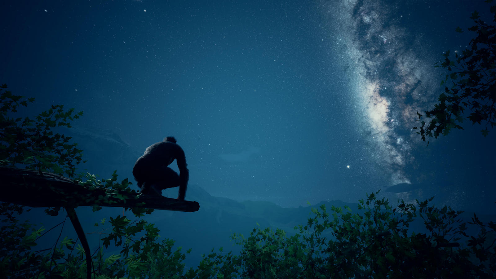

„Privind în urmă la modul simplist, [povestea anomaliilor genetice care au definit specia umană] pare un lanț incredibil de coincidențe.” Acest citat din cartea [„Revoluția după Darwin”](https://stiintasitehnica.com/revista-stiinta-tehnica-43-revolutia-dupa-darwin/) a jurnalistului Adrian Nicolae, deși menit să ilustreze complexitatea incredibilă a parcursului evoluționar al omenirii, descrie la fel de bine și premisa de la care pleacă acest joc mai puțin obișnuit.

**Ancestors: The Humankind Odyssey** ne poartă înapoi în timp cu 10 milioane de ani, în Africa din a doua parte a Neogenului și ne dă în grijă un grup de hominizi dintr-o specie neidentificată pe care trebuie să-i ghidăm, de-a lungul a 8 milioane de ani și nenumărate generații, pe drumul evoluției către genul Homo. Fără să aibă pretenția de acuratețe științifică, jocul este totuși un exercițiu serios de imaginație, bazat pe o bună documentare a descoperirilor paleoantropologice recente, și propune răspunsuri la tot felul de întrebări de tipul „ce-ar fi dacă...?” pentru a desluși misterele evoluției.



La început, acțiunea jocului nu e cu mult diferită față de alte jocuri în care trebuie doar să supraviețuim vitregiilor naturii — controlăm un membru oarecare al tribului și trebuie să îi asigurăm hrană, adăpost, apărare în fața numeroșilor prădători. Diferențele încep să apară atunci când realizăm că putem schimba oricând personajul și că important este grupul (cunoștințele acumulate de orice individ fiind disponibile imediat și celorlalți membri) și că trebuie să avem grijă să asigurăm descendența clanului. Drept urmare, jocul nu ia sfârșit dacă hominidul pe care-l controlăm la un moment dat moare, ci doar atunci când clanul rămâne fără fără femele fertile care să ducă mai departe linia genetică.

În încercarea de a reda cât mai bine procesul evolutiv, jocul nu ne oferă prea multe indicii pentru a facilita progresul, astfel că jucătorului îi revine sarcina de a experimenta cu abilitățile personajului (auz, miros, instinct, apucarea de obiecte etc.) pentru a descoperi noi și noi aspecte ale lumii și a declanșa schimbări comportamentale și cerebrale ale hominizilor noștri. Prin executarea de diverse acțiuni, rezervorul de cunoștințe al tribului dezvoltă „neuroni” specifici, împărțiți în mai multe categorii, care apoi, prin repetiție, se consolidează, putând fi transmiși mai departe generațiilor următoare pentru a deschide noi posibilități. De exemplu, simpla trecere a unui obiect dintr-o mână în alta duce la dezvoltarea abilităților motrice. Cu timpul, acestea vor permite executarea unor acțiuni mai complexe, precum confecționarea de bețe ascuțite sau pietre tăioase, iar, în cele din urmă, vor duce la mersul biped. În mod similar, există categorii de acțiuni ce dezvoltă inteligența, comunicarea, metabolismul și altele. De-a lungul mileniilor, acești neuroni se acumulează și formează un arbore extrem de complex de legături sinaptice ce influențează o mulțime de parametri — reflexe, percepție spațială, dexteritate, alimentație, memorie și așa mai departe.

Odată ce am acumulat un număr de astfel de dezvoltări neuronale în grupul curent, putem declanșa un salt generațional, care dă timpul din joc înainte cu 15 ani și le fixează în linia genetică a tribului, permanentizându-le. Apoi, în anumite condiții, pot apărea unele mutații genetice spontane, independent de acțiunile noastre, pe care le putem dezvolta ulterior prin repetiție, și care ne permit să activăm un salt evolutiv. Acesta marchează o înaintare mult mai mare în timp (mii sau chiar milioane de ani), calculat de joc pe baza progresului neuronal de până în acel moment, și determină și o schimbare a habitatului tribului, de la pădurea luxuriantă de la început spre ținuturi din ce în ce mai deschise.

Totodată, aceste salturi reprezintă și o vagă aproximare a transformării umane de la o specie la alta. Primul salt înseamnă evoluția clanului nostru la specia Sahelanthropus tchadensis ("Toumaï"), continuând apoi cu Orrorin tugenensis („Omul Mileniului”), Ardipithecus ramidus ("Ardi"), Australopithecus afarensis ("Lucy"), Australopithecus africanus (copilul din Taung) și, în cele din urmă, Homo ergaster (Băiatul din Turkana).

Nu e un joc ușor. E nevoie de răbdare și perseverență pentru a vedea tot ce are de oferit și pentru a descoperi și stăpâni regulile supraviețuirii. Dar este un joc unic, plasat undeva la granița dintre entertainment și documentar, ce reușește să ofere o imagine mult mai vie asupra vieții preistorice decât o pot face cărțile sau ilustrațiile. Și nu oferă doar o mostră a vieții cotidiene a hominizilor timpurii și o vedere de aproape a faunei africane de acum câteva milioane de ani, dar reușește să transmită și cât de lent a fost procesul evolutiv, felul gradual în care apar schimbările și cum se influențează reciproc pentru a da naștere la și mai multe schimbări, ce înseamnă trecerea de la traiul preponderent arboricol la viața bipedă în spațiile deschise ale savanei și, nu în ultimul rând, cât de ușor este ca o linie evolutivă să devină o fundătură genetică. ■

