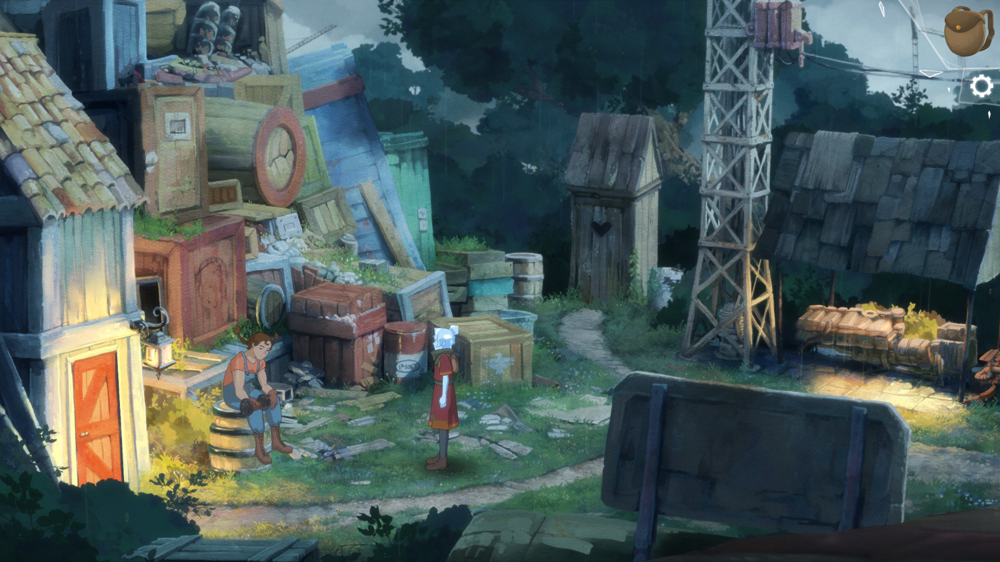
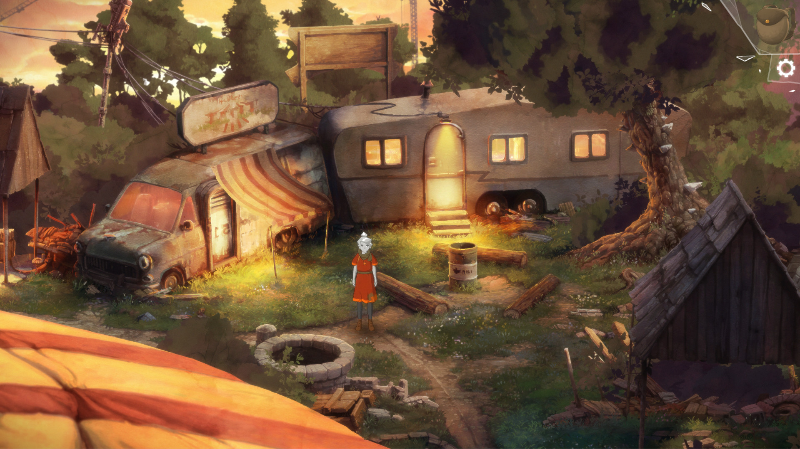

O să încep cu o mică mărturisire. Aproape era ca această recenzie să nu existe și asta nu din cauza jocului, ci din cauza unor probleme în viața reală care s-au suprapus cu jocul și au făcut atât jucatul cât și scrisul niște experiențe destul de dureroase. Dar, cum o sa vedem mai târziu, au transformat jocul într-o experiență specială pentru mine. The Girl of Glass este un titlu de care am auzit abia recent, după ce am citit review-ul de pe Adventure Gamers, și care m-a cucerit cu stilul vizual, adică ce am văzut prin poze. Mai multe despre el nu știam, dar când am intrat în meniul acompaniat de un pian nostalgic am știut că am ceva special în față. Realizat de către Markus Oljemark, dezvoltator independent, The Girl of Glass este un joc care combină atât genul adventure, cât și genul RPG, și reușește să le îmbine de minune.

Jocul te pune în pielea lui Kristal, o adolescentă orfană care lucrează ca îngrijitoare la un circ și care visează să plece cât mai departe și să cutreiere lumea largă. Care, dacă veni vorba, este dominată de către gheara de fier a Vulturului, un guvern fascist care controlează toate aspectele vieții de zi cu zi, de la afaceri și justiție până la religie. În lumea aceasta destul de crudă Kristal nu are pe nimeni în afară de colegii de la circ cu propriile lor probleme și un băiat misterios cu care ajunge să plece în aventurile visate.

Și că tot vorbeam mai sus de colegii de la circ, aceștia sunt mijloace, la început doar cu denumiri generice cum ar fi Strong Girl sau Tall Lady, prin care jocul explorează teme complexe precum singurătatea, depresia, pierderea și felul în care interacționăm cu ei ne poate aduce ocazia să le aflăm numele adevărate și chiar să legăm prietenii cu ei. Din păcate jocul este destul de liniar în această privință, iar la început ne sunt arătate câteva poze cu fiecare personaj de la circ și noi vom decide prin dialog ce fel de abordare vom avea față de acel personaj. Ca să clarific, să luăm exemplul clovnului. Când Kristal va avea în față poza lui, noi vom avea la dispoziție trei linii de dialog, adică trei metode în care vom putea trata clovnul pe parcursul jocului. Eu am mers pe depresie, dar voi puteți explora și alte căi. Oricât aș fi tentat să iau fiecare personaj în parte și să îi fac analiza psihologică, o să mă abțin, altfel risc să vă stric plăcerea de a-i descoperi pe fiecare în parte. E de ajuns să spun că de fiecare dată când am aflat povestea câte unui membru al trupei de la circ am avut câte un moment în care priveam în gol și cu falca în palmă.

Cât despre băiat, acesta este calea prin care Kristal evadează de la circ, dar nu este numai un instrument de care ne folosim. Din contra, băiatul este prima dragoste a lui Kristal, una inocent-juvenilă, și alături de care vom cutreiera locurile din joc, de altfel nu așa multe la număr. Pe lângă toate acestea, băiatul funcționează pentru noi și ca sistem de ajutor. Atunci când nu știm cum să rezolvăm un puzzle este de ajuns să dialogăm cu băiatul, dar, lucru surprinzător, Kristal se prinde de soluție înainte ca acesta să poată spune ceva. Un mod subtil de a arăta cum nici el nu e chiar perfect și nici Kristal nu are chiar atât de multă nevoie de el. Pentru că aceasta din urmă, deși la început de joc este timidă și plăpândă, va căpăta din ce în ce mai multă siguranță de sine cu parcurgerea jocului.

Și dacă tot am ajuns la parcurgerea jocului, acesta are șapte capitole care alternează între vis și realitate. Da, am spus vis pentru că o poveste despre maturizare nu ar fi completă și fără aspectele sale onirice. În acest caz, Kristal visează că este o ființă supranaturală care poate să poarte singură război împotriva mașinațiunilor Vulturului. Și nu numai atât, visul este momentul în care componenta RPG-istică a jocului preia controlul și purtăm bătălii cu grade diferite de provocare. Ba chiar aș putea spune că multe dintre aceste bătălii îi vor satisface și pe aceia dintre voi care sunt fani ai jocurilor TBS. Și nu doar Kristal este cea reprezentată supranatural, ci și tovarășii de la circ. Aceștia sunt întâi antagoniști în lumea viselor, deoarece Kristal trăiește cu vinovăția că i-a trădat atunci când a plecat de la circ, ceea ce a dus la închiderea acestuia de către Șeriful trimis de Vultur, iar metoda prin care îi putem aduce de partea noastră este prin dialog.

Dacă secțiunea visului este cea mai bogată în luptă și acțiune, lucrurile revin la normal atunci când Kristal se trezește și jocul își reia ritmul molcom, fără mize mari. Aici este dominantă componenta de aventură și totul se transformă într-un _point & click_ clasic, din perspectivă 2.5D. Rezolvăm puzzle-uri, alungăm o pisică cu mătura, lucruri obișnuite. În felul acesta jocul reușește să lege foarte bine cele două componente, adventure și TBS, iar fanii ambilor genuri vor avea cu ce să se delecteze.



Și dacă tot am ajuns la secțiunea de gameplay, aș vrea să detaliez puțin sistemul de luptă și puzzle-urile. Lupta în acest joc seamănă cu cea din jocurile Final Fantasy, în care îi dai fiecărui personaj niște ordine pe care le va îndeplini la sfârșitul turei. Poți da ordine precum cel de atac, de apărare, de concentrare (în care nu faci nimic o tură ca să ai două acțiuni următoarea) sau abilități speciale. Pe lângă toate acestea, trebuie să ții cont că fiecare personaj reprezintă un element natural cu puncte forte și slăbiciuni. Să o luăm de exemplu pe Kristal. Aceasta reprezintă elementul fulgerului, iar avantajele ei sunt împotriva oponenților de apă, dar este slabă împotriva celor de pământ. Un personaj de foc este puternic împotriva celui de lemn, dar slab împotriva apei. Dificultatea luptelor se poate ajusta la începutul jocului, iar pe parcurs dificultatea se poate face doar mai ușoară, nu și mai grea. Ei bine, sistemul acesta de luptă, deși simplu în aparență, poate reprezenta o provocare pentru orice fel de jucător. Eu însumi a trebuit să reiau unele lupte pentru că îmi tot luam bătaie.

Cât despre puzzle-uri, acestea nu sunt foarte dificile, dar nici nu sunt prea ușoare. Mi se pare că necesită atât logică cât și intuiție. Asta nu înseamnă că vei rămâne blocat cu orele sau că vei avea nevoie de walkthrough. Pentru mine a fost o plăcere să rezolv puzzle-urile într-un ritm lent, fără să mă grăbesc undeva, ca să pot savura întreaga experiență de joc. Dar nu pot spune că am rămas cu vreun puzzle memorabil, mai degrabă mi-am concentrat atenția pe dialoguri și personaje.

Experiența de joc este completată de grafică și sunet. Estetica este pur și simplu superbă, iar totul pare a fi pictat de mână și se prezintă ca o lume de basm. După părerea mea, culorile își fac treaba de minune: albastrul cerului care duce la visare, verdele care ne aduce aminte de zilele de vară din copilărie, toate acestea fac din The Girl of Glass unul dintre cele mai frumoase jocuri pe care le-am încercat în ultimul timp. Pe partea de muzică Fredrik Jonasson a creat o coloană sonoră excelentă, ce alternează între piese melancolice, bucăți sumbre și marșuri de bătălie care ne stârnesc să fim victorioși în luptă. Iar în ce privește _voice-acting-ul_, doar naratorul jocului este însuflețit de către un actor, în rest avem parte doar de text. Dar eu nu văd asta ca pe un minus - mereu am fost de părere că prefer textul decât actori slabi care să îmi strice experiența.

Acestea fiind zis, concluzia. Ei bine, nu am una. Am spus la început că acest joc s-a suprapus cu un eveniment nefericit din viața mea. Era să pierd pe cineva drag, prin suicid, iar jocul ăsta a scos din mine emoții care mai de care, de la singurătate, teama de pierdere, la nostalgie, nu a iertat nimic. Da, este o poveste frumoasă cu foarte multe componente faine, dar în același timp simt și că este o experiență personală pentru fiecare în parte. Îl recomand și vă recomand și vouă să încheiați această recenzie cu piesa care m-a făcut să rămân în meniul jocului mult și bine. ■


