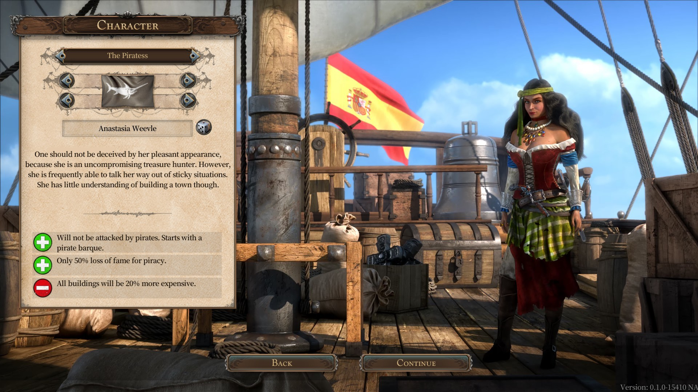
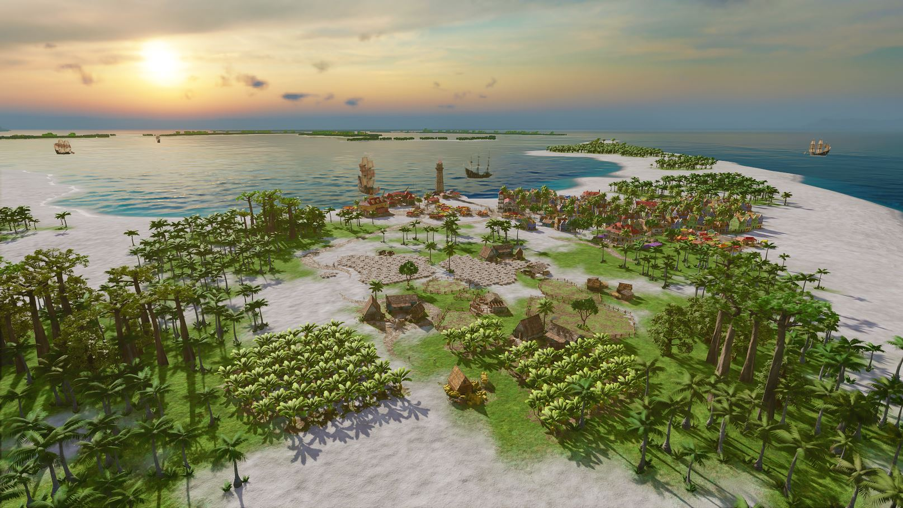
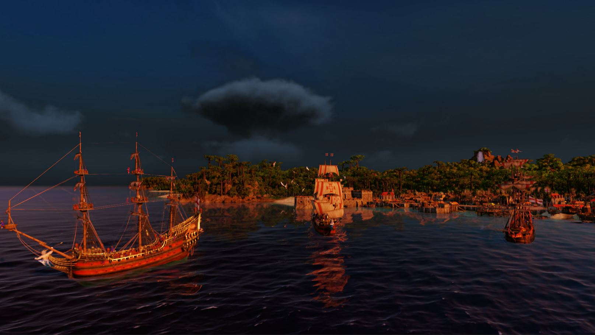
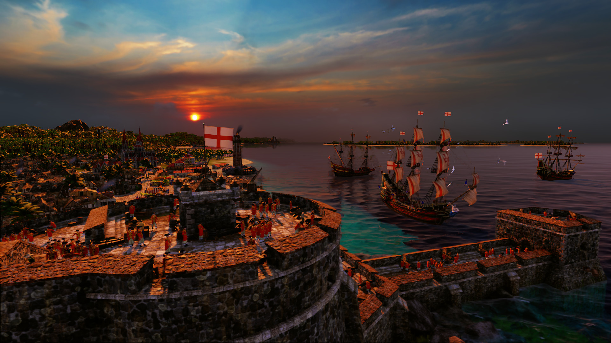

În 1992 Ascaron Entertainment scotea pe piață “The Patrician”, un simulator economic plasat în perioada și jurisdicția ligii hanseatice… pe care nu am avut plăcerea să-l joc. Așadar o să trecem pe repede-înainte până în 2000 când Patrician II și-a făcut simțită prezenta. În Germania jocul a avut un succes notabil, astfel devenind relativ cunoscut și prin restul Europei. Toate aceste informații oferă context dar sunt neimportante și doar o formalitate de care mă achit, pentru că Patrician II este unul dintre jocurile cele mai dragi mie, în care am investit probabil peste o mie de ore și care încă mai reprezintă, alături de Transport Tycoon Deluxe, un punct de referință al genului.

La atmosfera rece, nostalgică și introspectivă care-ți pătrundea în oase când jucai Patrician II, producătorii au tras o paralelă în 2002, prin “Port Royale: Gold, Power and Pirates”. Adică, dumnezeule! Jocul se intitula “Gold, Power and Pirates”, era de ajuns să-i vezi meniul principal și amalgamul de culori, muzică și elemente vizuale deja te ducea cu gândul la aventuri piraterești: comori, întinderi de albastru presărate cu mici petice de păduri tropicale, războaie mici și mari… romanță! Nimic nu descrie la fel de bine jocurile astea precum sentimentul de romanță juvenilă și ridicol de fermecătoare desprinsă dintr-o altă vreme a jocurilor, în care imaginația îți era supra-stimulată într-atât de mult încât nici nu mai realizai că practic te joci în niște excel-uri frumos colorate.

Așa se face că ajungem la Port Royale 4, ultima înfățișare a seriei. Jocul e dezvoltat de Gaming Minds Studios pentru că între timp Ascaron a dat faliment (ironic, știu) și s-au reformat sub umbrela Kalypso Media, unde au continuat cu un exces de tradiționalism cele două serii de jocuri. A existat destul de puțină inovație de-a lungul timpului. Patrician III e de fapt o expansiune pentru jocul anterior, iar Port Royale 2 ar putea la fel de bine să fie considerat la fel. Abia prin trecerea la 3D lucrurile s-au mai schimbat semnificativ, dar din păcate nu pozitiv. Jocurile și-au păstrat complexitatea și savoarea pentru fanii genului, numai că au fost învelite într-o pătură groasă de superficialitate. S-au sacrificat multe de dragul unei audiențe mai largi (care între timp a ajuns să includă și consolele) și nici avalanșa de DLC-uri la suprapreț nu a ajutat.

Așadar Port Royale 4 s-a lansat într-o vreme furtunoasă pentru serie, și tocmai de aceea producătorii au ales să riște puțin și au venit cu un motor grafic proaspăt, precum și elemente noi de gameplay, menite să mai trezească din somn jucătorii. Sau așa trebuia să fie cel puțin, pentru că jocul a fost lansat într-un stadiu dezastruos, practic beta, cu o droaie de bug-uri și probleme. Aș fi putut desigur să merg pe linia asta și să-l îngrop în două paragrafe, dar ar fi o recenzie inutilă atunci. Nu a durat foarte mult și producătorii au scos trei patch-uri majore care au mai schimbat lucrurile, iar experiența mea cu jocul vine după lansarea lor. Ceva îmi spune că Gaming Minds ar înflori mai degrabă ca studio independent, finanțat prin “crowdfunding”, decât sub presiunea unui publisher mare, dar asta e altă poveste.



### *Choose your fighter*

La fel ca în toate jocurile Gaming Minds, și în Port Royale 4 ai de ales inițial între campanie și modul de loc liber. În acest caz există chiar patru campanii diferite, pentru fiecare dintre națiunile jucabile: Anglia, Franța, Spania și Olanda. Acest mod de joc este în esență un tutorial extins, presărat cu evenimente scriptate, care poate fi distractiv pentru cei ce preferă să nu aprofundeze mecanicile de joc, în favoarea unei experiențe mai liniare. Personal, recomand din toată inima să săriți cu totul peste treaba asta. Jocul la liber, fără obiective, este cel care scoate în evidență calitățile acestor titluri.

De asemenea, și o spun lipsit de vreo tangență de elitism, în “free play” setările de dificultate trebuie date la maxim cam la toate capitolele (voi detalia excepțiile mai târziu), altfel jocul este cu totul altul. Nu este o exagerare, nu e vorba de laude cu realizări virtuale, ci pur și simplu este o chestie de bază, fără parametrii de dificultate setați corespunzător, jocul este prost fără rost de dezbatere. Asta fiindcă nu e vorba de un shooter sau joc de acțiune, nu contează cât de greu mor inamicii sau cât de mulți sunt. Într-un simulator economic pe care nu îl ”pierzi” decât în circumstanțe extreme, satisfacția jucătorului vine din maximizarea profiturilor și construirea unui imperiu. Da, se face asta pe fondul unor elemente de design care caută să-ți gâdile imaginația și să-ți stimuleze aventurierul lăuntric. Totuși, dacă câștigurile vin fără un aport real din partea ta, iar pierderile nu te afectează, atunci după maxim cinci, poate șase ore de joc îl poți dezinstala și continua cu altceva.

Acum că ne-am lămurit, să continuăm. Indiferent de modul de joc preferat, trebuie ales un personaj și o națiune înainte să pornești la treabă. Fiecare personaj are bonusurile sale, idem pentru națiuni… dar nu prea contează. Într-o campanie sau scenariu, cu scopuri clar definite, poate ar conta să ai un bonus la banii câștigați din piraterie sau un discount considerabil la construcția de clădiri. Sunt însă chestii de suprafața, care nu prea te mai afectează când ți se plimbă zeci de nave pe hartă care aprovizionează alte zeci de producții diferite de bunuri, vândute în cantități optime pe parcursul unor rute de comerț optimizate la sânge. În contextul ăsta, alegerile de la început devin mai degrabă cosmetice, cu o excepție mare și lată: numărul de orașe sub controlul națiunii tale.

În infinita mea înțelepciune, am ales să încep cu minimul posibil de orașe setat, Olanda fiind astfel bătaia de joc a caraibelor. Foarte important de zis, nu faceți asta! O să aflați în continuare de ce.

### *Stonks!*

La început, când tot ce-ți permiți să întreții este o bărcuță puțin prea mare pentru cada din baie, principala activitate este cumpărarea și vânzarea de bunuri. Harta din Port Royale 4 e mai mare ca niciodată, frumos populată cu orașe variate ca structură, fiecare dintre ele cu producția și consumul ce reflectă nevoile cetățenilor. În funcție de distribuția locuitorilor, se schimbă și consumul de bunuri. Un oraș mai mic și sărac va avea în principal nevoie de bunuri de bază, cum ar fi alimentele (includem romul aici desigur) sau materialele de construcții, dar pe măsură ce clasa de mijloc iese în evidență apar cerințe tot mai greu de satisfăcut. Oamenii vor s-o pună de-un grătar, dar carne nu se produce decât în sud, la mare distanță. De aceea inițial profiturile vin din astfel de călătorii prin care aprovizionezi câteva orașe și eventual îți crești reputația scărpinând pe spate viceregele.

Aleatoriu, liderul coloniilor îți aruncă câte o misiune generică (să aprovizionezi un oraș cu zahăr, spre exemplu) și dacă o duci la bun sfârșit își arată recunoștința față de tine, ceea ce îți crește reputația. Reputația e critică în acest joc, căci prin creșterea reputației primești puncte de faimă, iar aceste puncte sunt folosite pentru deblocarea de diferite bonusuri pentru orașe (spital mai eficient, case mai încăpătoare, etc.), precum și a clădirilor de producție mai avansate (de exemplu producerea de haine necesită deblocarea în prealabil a altor câteva tipuri de clădiri). Cam în asta constă partea mai zemoasă a jocurilor Gaming Minds: producerea și distribuirea bunurilor într-un mod optim. Excitant, știu!

Oricine poate cumpăra de unde e mult și vinde unde e puțin, dar cu strategia asta nu ajungi în Forbes. Așa începe veșnica întrebare: ce să produc în continuare? Jucat cu parametrii de dificultate setați corespunzător și în Port Royale 4 întrebarea aceasta e foarte importantă, pentru că un lanț de producție - distribuție implică și o investiție majoră. Dacă alegi prost și nu faci profit, e posibil să trebuiască vândut tot și să pierzi câteva ore de joc fără să-ți îmbunătățești poziția, ba din contră. Aici intervine lupta dintre arta mai subtilă prin care intuiești cam ce e cumpărat destul să-ți aducă profit și calculele de tip ”brute force” prin care stai și iei fiecare oraș la puricat, stabilești la sânge consumul per bun și aprovizionarea, apoi luând toți acești factori în considerare decizi că e mai ușor să te faci pirat și să furi navele altora. Pentru că dacă-ți plăcea atât matematica ajungeai departe în viață și nu pierdeai o zi întreagă pentru o rută de comerț circulară, formată din doar câteva orașe… care nici măcar nu face profit.

Glumesc, desigur, sunt mulți jucători înfocați care preferă metoda exhaustivă și nu trec neapărat la piraterie. Personal, consider mai plăcut să aduni experiență organic, prin comerț simplu, tradițional, și când te simți pregătit să investești în ceva care să genereze de la sine profit. Din fericire, în ce privește rutele de comerț, aș zice că jocul îmbunătățește puțin formula predecesorilor. Vorbesc desigur de configurarea complet manuală a rutelor, pentru că există și posibilitatea de a apăsa rapid pe câteva butoane prin care transmiți jocului să se ocupe de detaliile astea pentru tine. Să ne facem cruce și să continuăm.

Dacă înainte puteai doar să specifici orașele, cât să se cumpere și să se vândă din fiecare produs și prețul, acum mai intervine un factor în ecuație: viteza. E mai important ca oricând să menții o rută rapidă, orice zi petrecută pe drum costă bani fără să genereze profit. În acest sens devine acum posibil să alterezi manual traseul unei rute de comerț între orașele setate, pentru a optimiza timpul petrecut pe drum. Astfel, dacă ruta e formată din nave rapide în larg, modifici ruta să evite coasta și încerci să o potrivești de-a lungul curenților de aer. Se poate configura în acest mod fiecare rută în parte și ajungi să tai zile bune din durata călătoriilor.

### *War is bad for business*

Până aici, experiența de joc din noul Port Royale seamănă cu cea din titlurile anterioare Gaming Minds, în special Rise of Venice. Surpriza apare sub forma războaielor dintre națiuni, ce se activează automat la anumite intervale de timp. Când națiunea ta e la război cu altele, comerțul se complică. Nu mai poți accesa orașele inamice decât pe căi ascunse, dacă ai avut norocul să-ți găsești un căpitan de navă scos din ghilda hoților sau dacă ai ales să începi jocul cu un personaj axat pe comerț. Această mecanică de joc subliniază altă schimbare deosebit de importantă, dacă pe timp de război nu mai ai acces la teritoriile inamice, cum îți menții producțiile de bunuri în aceste teritorii? Ei bine, nu ai cum.

Deci adio cu lanțurile de distribuție construite alandala, dacă vrei să produci carne, ești obligat să te duci peste spanioli, să le iei din teritoriu apoi să-ți stabilești afacerile acolo. Evident, dacă la vreun viitor conflict nu ești atent și îi lași să-și recupereze orașele, duse sunt și afacerile proprii. O penalitate foarte usturătoare ce nu se regăsea în titlurile anterioare. Și nici nu am ajuns la dezastrul adevărat. Pe timp de război nu mai poți accesa orașele inamice, deci ai cam pus-o când rutele tale de comerț depind direct de aceste orașe pentru a scoate profit. Dacă ai făcut alegerea deosebit de inspirată amintită anterior (națiune cu număr minim de orașe proprii), nici nu poți substitui orașele de-a lungul rutelor cu unele prietenoase.

Așa am realizat că alegerea celui mai mic număr de orașe pentru națiunea ta este un element de “dificultate” care nu trebuie activat. Pentru că războiul e al naibii de rău pentru afaceri, iar odată pus în situația asta ești aproape lipsit de salvare, singura soluție fiind să-ți faci națiunea să câștige războaiele. Suna bine în teorie, îți sufleci mânecile și te pregătești să-ți murdărești mâinile în război. Dar odată intrat pe segmentul de luptă al jocului, Port Royale 4 se dezintegrează de parcă ar fi fost construit din cărți de joc. Dacă ai destui bani să formezi o flotă mică, devine o problemă de (scurt) timp să ajungi cel mai bogat om din lume.

Întreg ansamblul de sisteme economice, comerț, producție de bunuri și consum emulat pe baza tipurilor de cetățeni și numărul lor se duce pe apa sâmbetei. Am aplaudat când am văzut că luptele se desfășoară pe ture acum. O alegere excelentă dar din păcate lipsită de substanță. Sistemul de luptă pe vremea (versiunea de joc) când a fost evaluat de mine era trivial, la nivelul unui joc de telefon simplist. Nici elementele complementare luptei nu ajută. Dacă recuperezi o navă de-a inamicului aproape distrusă, la un pârț de scufundare, costul reparațiilor e cam jumătate din cât primești pe ea dacă o vinzi reparată complet. Nonsensic, înseamnă că poți să tragi în veselie în toate navele și să le îmbarci când vrei tu, iar la sfârșit tot ieși pe plus, pentru că le aduci repede și ieftin în condiții impecabile.

E ridicol de ușor să echipezi complet flota, găsești din plin marinari în mai toate orașele mari, iar cu muniția nici nu mai trebuie să-ți bați capul - spre deosebire de jocurile anterioare, nu mai trebuie echipate navele manual cu tunuri. Să invadezi și cucerești un oraș e de asemenea ilar, doar pui navele să blocheze portul și stai și te uiți. Dacă ești atacat pe parcurs, nici o problemă, oprești asaltul, te lupți, le furi din nave și le repari, vinzi ce ai reparat și când invadezi data viitoare orașul ai și mai multe nave. Incredibil! Producătorii au promis că vor interveni cu ciocanul asupra acestei componente de joc, dar faptul că niște sisteme de-a dreptul tâmpe existau implementate așa nu le oferă deloc credibilitate. Nu e vorba de bug-uri sau de testare aici, cineva a dat-o în bară din punct de vedere conceptual.

### *Avast Ye*

Da, jocul e frumos! Sunetele te acaparează,, harta e cea mai detaliată de până acum și e o adevărată plăcere să-ți urmărești flota cum fuge de colo-colo încercând să-ți facă profit. Ba chiar avem și ciclu zi-noapte! Nu m-aș risca să-l numesc bine optimizat, dar raportat la restul jocurilor 3D dezvoltate de Gaming Minds, cu siguranță e o îmbunătățire majoră. Ocazional (mai ales în faza de început) reușește să surprindă foarte bine sentimentul de aventură și goana după aur din primele jocuri ale seriei.

Ca de obicei, există și câteva activități secundare prin care să te... distrezi. Goana după comori e clasică, găsești aleatoriu o bucată de hartă, apoi încă una și tot așa până la cea cu X-ul magic, după care trebuie să și găsești locația exactă din lume. Nu lipsesc, cum spuneam, nici misiunile date de vicerege, în vâna celor din Rise of Venice. Niște prostii crunte, desigur, exact la fel cum erau și acolo. Practic sunt niște misiuni generate aleatoriu și la infinit în care trebuie să aprovizionezi un oraș cu bunuri, să vânezi pirați, invadezi națiuni vecine sau să faci pe salvamarul, căutând naufragiați. Sună mai frumos decât este, după câteva obiective de genul ăsta te-ai săturat, iar jocul te bombardează constant cu ele.



Pentru că sunt legate de sistemul de reputație, producătorii te obligă practic să suferi prin misiunile astea. Motiv pentru care eu recomand să jucați cu Olanda și să alegeți ca personaj de început corsarul, care primește direct câteva puncte de faimă (atinge deci mai repede maximul și poate ignora misiunile). Este totodată și singura clasă care chiar merită aleasă. Nu are nici un sens să începi jocul cu piratul sau aventurierul, deoarece nu fac decât să scoată în evidență cât de slab stă Port Royale 4 la tot ce ține de lupte. Negustorul sună bine în teorie, pentru că poate face comerț oricând, inclusiv pe timp de război. Condiția garantează totuși doar accesul pe timp de conflict la orașele adversarilor, nu te ajută cu inamicii care te atacă sistematic la fiecare pas și îți golesc navele de bunuri.

O ocupație secundară mai interesantă ține mai degrabă de dezvoltarea orașelor, Port Royale 4 oferind ceva mai multă varietate decât predecesorii săi pe partea asta. Ai mai multe tipuri de clădiri de construit, iar fiecare dintre ele variază ca eficiență în funcție de poziția pe care o are. Crâșma lângă zona rezidențială clar va da rezultate mai bune decât în mijlocul pădurii. Din păcate, oricât de dezvoltată ar fi partea asta de construire a orașelor, jocul îți oferă prea puțină motivație să o aprofundezi. E de ajuns să cumperi câteva clădiri mari (biserica de exemplu) și să plasezi pe unde ai loc case, iar populația crește. Poate faci un spital dacă chiar te doare sufletul când apare vreo epidemie, dar cam atât. Poți să pierzi ore bune dezvoltând orașe, dar nefiind o componentă natural integrată în joc, cred că orele alea ar fi mai distractiv de petrecut într-un joc axat pe nișa asta.

Ar mai fi probabil lucruri de zis, dar poate ar fi mai bine să fie zise peste un an sau doi, căci jocul este în continuă schimbare. Deja a devenit posibil să-ți declari independența și să formezi propria ta națiune, lucruri pe care eu nu le-am avut la dispoziție. Nu pot decât să evaluez experiența mea cu jocul, după ce am avut răbdare să iasă câteva patch-uri majore. M-a prins binișor atmosfera și m-am distrat cu partea economică, însă pur și simplu suferă de prea multe elemente de design prost gândite și implementate. Sunt curios cum se va prezenta în viitor, dar nu mi-aș ține respirația, printre noile schimbări de gameplay au existat și rateuri complete, urmate de plângeri constante din partea fanilor. ■

