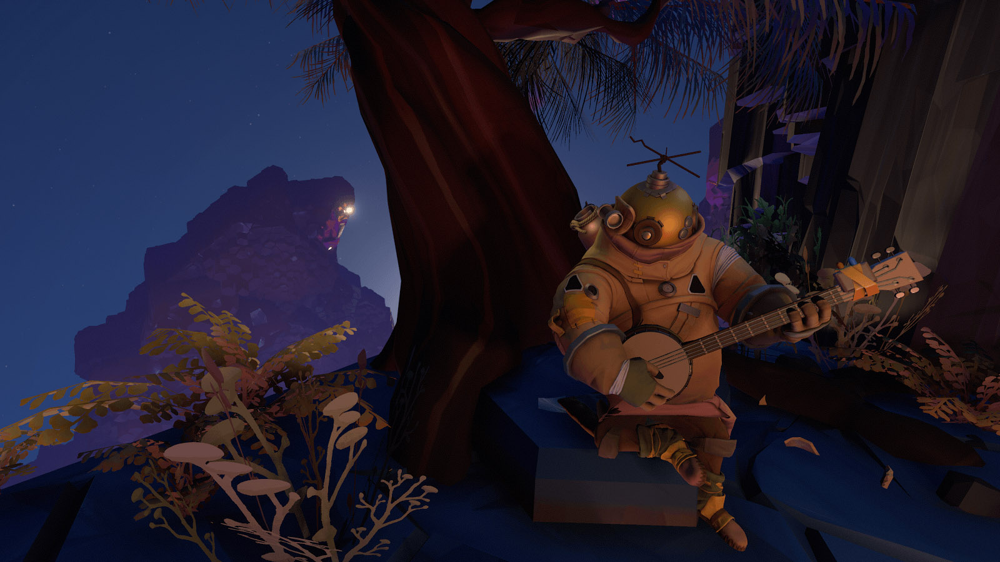

Probabil că mulți dintre noi ne-am închipuit în copilărie tot felul de aventuri în necunoscut, înfruntând pericole de tot felul înarmați doar cu recuzită încropită din ce jucării sau obiecte casnice aveam la îndemână. Nu era nevoie de mult pentru a ne aprinde fanteziile și a ne transpune în adâncul pământului sau în spațiu.

Outer Wilds recreează în mod miraculos acea magie a copilăriei în lumea adulților, o aventură ancorată în știință, dar plină de necunoscut, care ne cheamă să-l cucerim. E un joc făcut, parcă, pentru a ilustra toate citatele lui Carl Sagan despre imaginație, sete de cunoaștere și locul nostru într-un univers uriaș, prin felul în care jonglează cu ușurință și coerență cu tot felul de concepte fizice precum supernove, găuri negre, stele albe, călătoria în timp, mecanică cuantică, păstrând în același timp sentimentul de uimire copilărească în fața mărețiilor naturii.



Jocul începe undeva departe în spațiu și timp, într-un loc asemănător cu Pământul nostru — o planetă stâncoasă, cu atmosferă, viață, brazi, râuri, iar deasupra o mică Lună. Personajul nostru, cel mai recent absolvent al programului spațial local, e gata de îmbarcare în nava spațială ce-l va purta în expediția de explorare a sistemului solar. Dar nici nu apucăm bine să ne obișnuim cu lumea jocului și să decolăm, când deodată soarele explodează, totul e distrus și jocul ia sfârșit. Poftim?!

Glumesc, de fapt aventura de-abia acum începe. Jocul e structurat ca o buclă temporală, în care retrăim aceeași perioadă de 20 de minute la nesfârșit. Indiferent ce facem și oriunde ne poartă fragila noastră navă, soarele explodează și o luăm de fiecare dată de la capăt. Dacă ați văzut filmul Ziua Cârtiței veți înțelege imediat despre ce e vorba.

Și aveți ce face! Terenul nostru de joacă este un sistem solar redus în mod exagerat la dimensiuni de doar câteva zeci de kilometri, în care planetele au doar câțiva kilometri în diametru, iar o călătorie interplanetară durează câteva secunde. Chiar și așa, jocul e mult mai mare decât ați crede, căci sistemul e plin de puncte de atracție care abia așteaptă să fie descoperite: sateliți, comete, fenomene naturale ce modifică semnificativ fața planetelor, alți exploratori rătăciți, etc. Ca să vă faceți o idee, una dintre planete ascunde o gaură neagră în centru, în care se prăbușesc bucăți din scoarța aflată sub bombardamentul meteoriților desprinși din satelitul activ geologic. Iar în altă parte avem un sistem binar de planete, legate de o coloană de nisip ce curge de pe una pe cealaltă, ca o clepsidră, nisip ce acoperă și scoate la iveală în același timp… veți vedea voi ce.



Toate aceste corpuri cerești de dimensiuni complet nerealiste sunt puse apoi în mișcare cu o simulare foarte realistă a legilor fizice, în special cele ce țin de astrodinamică și gravitație bazată pe masă. Rezultatul este un adevărat planetariu, ce prinde viață sub ochii noștri: planetele au mișcare de rotație și de revoluție în jurul soarelui, fiecare pe propria orbită, sateliții (naturali și artificiali) se mișcă în jurul planetelor, cometa orbitează soarele de-a lungul unei elipse alungite, atracția gravitațională e mai mare cu cât corpul e mai dens și așa mai departe. Veți avea astfel surpriza ca nava să se manevreze diferit de la o planetă la alta, necesitând și un consum mai mare de combustibil, dar efectele sunt vizibile și la scară mai mică, cum se întâmplă, de exemplu, cu obiectele de pe planeta de baștină care se mișcă ușor la trecerea Lunii pe deasupra.

Fiecare corp ceresc ascunde urmele unei antice civilizații care a explorat demult sistemul în interes științific, lăsând în urmă doar ruine și inscripții, a căror investigare ne va purta în aventuri și descoperiri de-a lungul și de-a latul întregului sistem solar în căutarea misterelor universului.

Și dacă ideea de buclă temporală cu timp limitat poate părea o piedică, în practică este fix opusul. Știind că toate piesele se resetează de fiecare dată, vom putea alege unde, cum și cât să explorăm, fără teama că vom pierde ceva în altă parte, cum ar fi o ușă ce poate fi deschisă doar într-un anumit interval de timp, sau un loc ce poate fi vizitat doar în anumite condiții. Informația este singurul element de progres real din joc, care deschide de fiecare dată noi și noi destinații și care leagă toate „viețile” într-o poveste coerentă despre știință și cunoaștere, cu un final superb ce transformă întreaga călătorie într-o poezie interactivă despre viața și moartea universului.

Ca un cub Rubik, Outer Wilds este o jucărie ingenioasă, plină de mecanisme și rotițe interconectate, ce necesită chiar și zeci de ore pentru a fi descoperit, dar apoi poate fi rezolvat doar din câteva mișcări. Dar prin atmosfera relaxată, în care muzica și personajele îndeamnă la contemplație și minunare în fața măreției naturii, jocul ne aduce aminte constant să ne bucurăm și de călătorie, nu doar de destinație. ■

