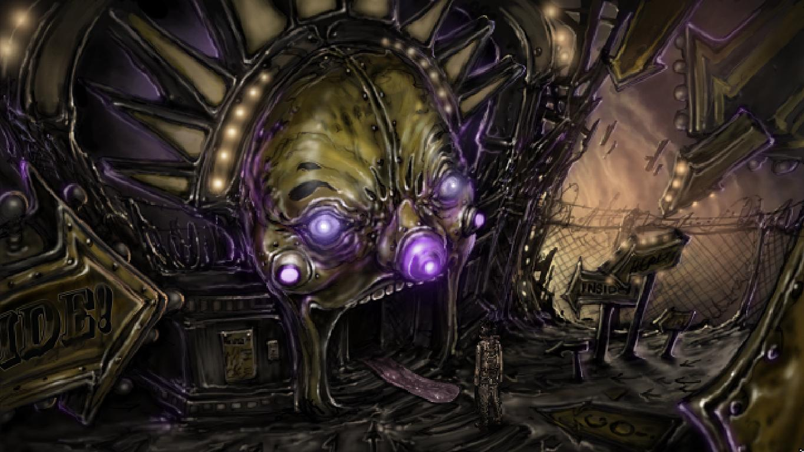

Există o poveste bine cunoscută în mitologia greacă, mai exact mitul lui Icar și a ascensiunii acestuia până la soare. În aroganța sa specifică fie vârstei, fie a omului în general, Icar a crezut că se poate apropia de soare. Bineînțeles, această credință s-a topit odată cu aripile sale de ceară, iar ce a urmat după a fost doar prăbușirea în întuneric. Sigur, există interpretări peste interpretări ale acestui mit, dar ce se întâmplă atunci când propriile noastre minți devin labirinturi ale regretului și pierderii iar aripile nu sunt nimic mai mult decât bule de săpun în briza unei seri de vară? La întrebarea aceasta încearcă să răspundă **Strangeland**, cel mai nou joc scos de Wormwood Studio, adică băieții și fetele din spatele aclamatului Primordia.

Fără prea multă expozițiune ne trezim în pielea unui personaj despre care nu știm nimic în afară de ce putem observa la exterior, anume un aspect exterior neîngrijit și o cămașă de forță, de parcă tocmai a evadat de la sanatoriu. O săgeată uriașă pe care scrie „Strangeland” ne arată direcția de mers, de altfel singura în care o putem lua la pas. Straniul din titlu începe să își spună cuvântul aproape imediat. Intrarea propriu-zisă în Strangeland se face prin gura unui cap uriaș de clovn care spune câte o glumă de fiecare dată când murim și trecem pe acolo. Da, am spus „murim” pentru că în joc se progresează chiar și murind din diferite cauze. Să zicem că am dat-o bară cu un câine care s-a gândit că arătăm apetisant sau că am încercat să ne sinucidem. Probabil e și ăsta un chin, sa îți dorești să mori și să nu poți, dar poate fi și o victorie asupra jocului propriu zis. Prin oricâte orori am trece, tot aici suntem, gata să o luăm de la capăt.

Lumea propriu-zisă din Strangeland se prezintă ca un carnaval al ororii și al fricii, cu locuitori cu aspect monstruos, dar care sunt de fapt doar singuri. Ca să dau câteva exemple, îi avem pe Murmur, un cap de om aflat într-o cutie și care spune profeții sau Scribul cel orb de la poalele copacului care adună vorbe spuse de mari înțelepți. Mai sunt și alte personaje a căror inspirație se poate regăsi în mitologia greacă, de la Hefaistos, fierarul, la cele trei femei care îți urzesc destinul, Moirae. Personajele secundare de mai sus reprezintă de asemenea, atât entități de sine stătătoare, cât și reflexii ale personajului principal contorsionate în forme demne de milă. Totodată, într-un moment al jocului vom putea călăuzi sufletele unora dintre acestea folosindu-ne de o torță, asumându-ne astfel rolul unui Charon care nu cunoaște drumul spre casă.



Scopul nostru este să salvăm o femeie a cărei moarte ne bântuie iar și iar pe parcursul desfășurării poveștii. Suntem urmăriți de frustrarea de a o privi cum este ucisă de un ghem de materie întunecată, *The Dark Thing*, care de altfel ne pune și nouă bețe în roate. Această Întunecime poate să apară în orice moment pe ecran și să ne ucidă, forțându-ne să ne întoarcem la intrarea în Strangeland. Însă cu puțină prezență de spirit putem scăpa de el părăsind zona actuală în care ne aflăm. Revenind la femeia pe care vrem să o salvăm, nu ne este clar din prima ce înseamnă ea pentru personajul principal, doar că el pare foarte atașat de aceasta. Dacă ea este doar o fantomă a regretului, asta aflăm pe parcurs. De altfel, nu știm prea multe nici despre personajul principal, nici chiar numele. Nu putem să nu fim puțin trimiși cu gândul, în cazul acesta, la Planescape Torment și la cum un nume nu este altceva decât o altă fantomă care să ne bântuie în propriile fortărețe ale regretului.

Să vorbim puțin și despre componenta de gameplay. Jocul e un point & click clasic, iar puzzle-urile sunt integrate inteligent ca jocuri de carnaval. Astfel ne vom încerca reflexele la trasul cu arma sau va trebui să reparăm mașinuța din carusel. În general nu am avut probleme cu puzzle-urile și se pare că se pot rezolva în mai multe feluri, dar nu am parcurs jocul decât o dată. În cazul în care rămânem blocați avem o cabină telefonică bizar plasată în mijlocul cortului, unde putem asculta la telefon propria noastră voce, care ne va da câteva sfaturi despre ce trebuie să facem mai departe.

Din punct de vedere audio-vizual pășim într-o lume a melancoliei, cu inspirații artistice care mai de care, de la Giger la filmele body horror, totul acompaniat de o muzică blândă și tristă. Pe fundalul acesta demn de milă predomină culori șterse, maronii, cu pete de mov care dau o tentă subterană jocului, de parcă ne-am afla în regatul lui Hades. Pe partea de voice acting actorii își fac treaba foarte bine și ne fac să simțim disperarea sau dorul din vocile lor.



Ajungem și la punctul sensibil al acestui review. Nu mi-a plăcut Strangeland. Sigur, am apreciat la nivel intelectual inspirațiile și temele, dar totul mi s-a părut prea încărcat și cu desfășurare pe un interval timp prea scurt în lumea reală. Jocul ține doar vreo 5-6 ore iar, personal, nu sunt adeptul rejucării unui titlu pentru a lua alte decizii. Mi-aș fi dorit să mă simt absorbit de joc, dar asta nu s-a întâmplat. Toată experiența a fost una mai degrabă chirurgicală pentru mine, în care nu am simțit această călătorie prin carnaval ca fiind a mea, ci mai degrabă ca luând parte la o căutare a sinelui în urma unei tragedii personale a altcuiva.

Ca și concluzie, Strangeland mi se pare că gâdilă la intelect și cam atât. Poate alte persoane vor aprecia jocul la un nivel mai emoțional, dar pentru mine nu a fost mai mult decât o sesiune de momente în care m-am scărpinat în bărbie și am zis „hmm… interesant”. Desigur, în adâncul jocului mișună acel întuneric care m-a făcut să bănuiesc dureri și tristeți profunde, dar când am închis jocul tot acolo au rămas și aceste trăiri. Cu toate astea, tot este un point & click mai interesant decât multe din genul său, așa că vi-l recomand și numai pentru părțile sale bizare. Sau, cine știe, poate pe unii dintre voi va reuși să vă captiveze cu atracțiile sale. ■
