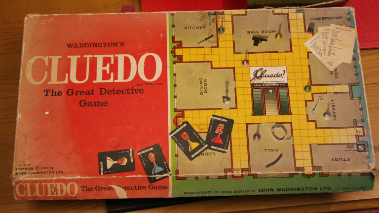
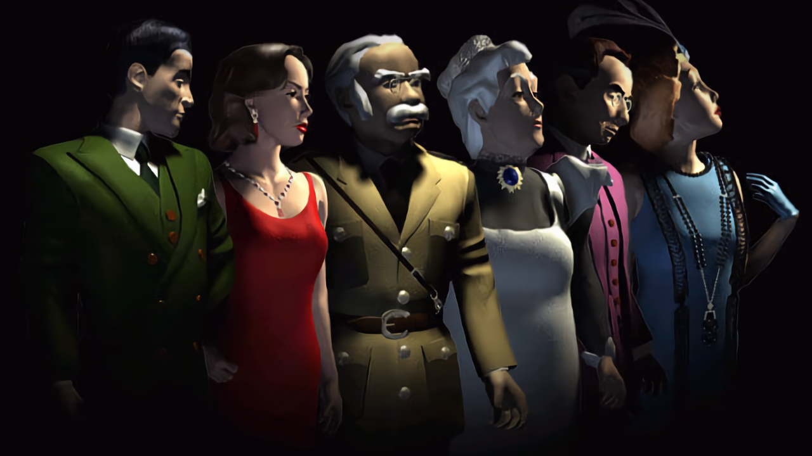
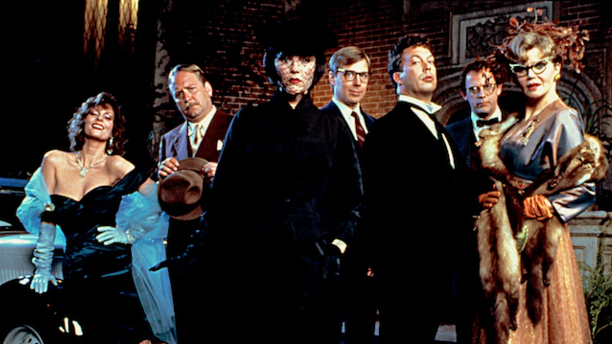
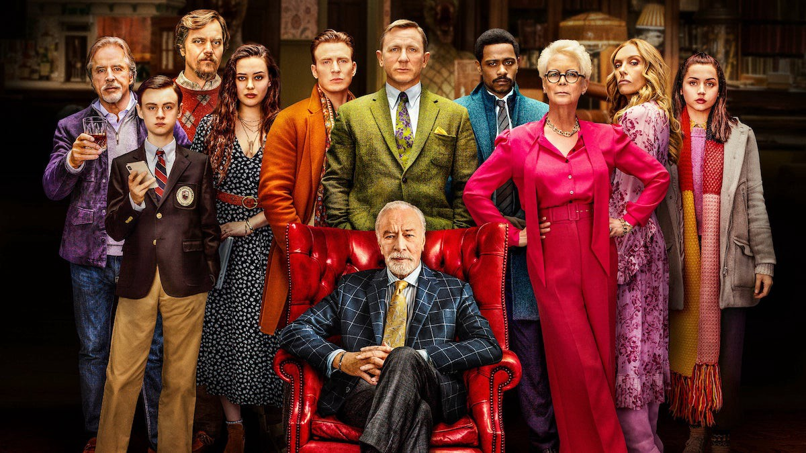

Care este prima voastră amintire legată de jocurile video? Orice amintire, fie că e vorba de împușcat rațe pe televizorul vechi din sufragerie (care avea de obicei un milieu pe el), fie că e vorba de jucat Disney’s Hercules pe butoanele cu săgeți ale tastaturii sau de Cluedo, jocul original cu detectivi pe PC. În cazul meu e tot jocul cu rațele, pentru că făcuse tatăl meu rost de ceva nintendo knock-off, dar vă jur că m-am jucat și Cluedo din ‘98 mai târziu, pe primul meu calculator cu, evident, Windows ‘98. Ăsta era cazul fericit, de obicei jucam orice joc care îmi era adus pe CD de vreo cunoștință cu acces la internet sau îmi găseam alte preocupări.

Și deci, **[Cluedo](https://en.wikipedia.org/wiki/Cluedo)**, care a fost printre primele mele jocuri video, este mult mai mult decât un joc casual pe calculator. Prima întrebare ar fi: de ce? Păi, între noi fie vorba, majoritatea lumii se bucură de obicei de o poveste de tip _whodunnit_, oricât de simplă e ea, iar istoria cinematografiei ne-a demonstrat asta. Începând cu After the Thin Man, în 1936 și până la Knives Out, în 2019, tot ce ne dovedește publicul e că acest tip de poveste va fi mereu popular, cu mici schimbări la detalii sau tipologiile personajelor.

Jocul a fost inițial gândit de Anthony E. Pratt în 1943 și a apărut pe piață în 1949, în Regatul Unit, ca boardgame. În ziua de azi drepturile sunt deținute de Hasbro Interactive și nu-s sigură de cât de entuziasmată e lumea de schimbări, dar așa cum am zis mai sus, atâta timp cât detaliile se schimbă, audiența rămâne interesată.

Așadar, primul pas mare după apariția efectivă a boardgame-ului a fost jocul pe PC, cel din 1998. Din nou, ideea a fost a celor de la Hasbro, care s-au gândit să profite de popularitatea jocului și de apariția calculatorului personal împreună cu jocurile video din ce în ce mai populare. I s-a mai dat un nume, ca să nu fie confundat cu boardgame-ul: în Statele unite i se spune **Clue** sau **Clue: Murder at Boddy Mansion**, în restul lumii i se spune **Cluedo** sau **Cluedo: Murder at Blackwell Grange**. Și nu vă speriați, e același joc, depinde dacă jucați varianta americană sau cea britanică/internațională.

Prin 1999 s-au gândit să scoată un al doilea joc numit **Clue Chronicles: Fatal Illusion**, dar nu voi intra prea mult în detalii pentru că este aceeași premisă și jocul nu a fost foarte popular la vremea lui.

Dacă jucați Clue sau Cluedo, boardgame sau joc pe calculator, variabilele sunt aceleași, deci aș zice că e cel mai bine să vi le prezint. Personajele sunt după cum urmează (cu variații în jocul nou pentru că au mai multe teme de joc ca să facă și ei un ban cinstit din season pass):

* _Miss Scarlett_ sau _Scarlet_ (depinde din nou de versiune), care pare a fi și cel mai popular personaj dintre toate, e reprezentată evident de pionul roșu
* _Reverend Green_ sau _Mr. Green_ (în SUA), reprezentat de pionul verde
* _Colonelul Mustard_, mai trebuie să menționez culoarea? Galben
* _Profesorul Plum_, violet (sau mov)
* _Doamna Peacock_, albastru
* _Doamna White_, reprezentată de pionul alb sau în varianta nouă din 2016 Dr. Orchid reprezentată de culoarea roz

Acum că știm care sunt variantele de jucători/pioni, care e scopul? Așa cum am zis la început, e un joc de tip _whodunnit_. So who did? Toate personajele sunt suspecte în crima comisă, iar criminal mai trebuie identificate și armei crimei (variantele fiind sfeșnicul, pumnalul, țeava din plumb, revolverul, frânghia sau cheia franceză) și locul din vilă unde a avut loc crima (bucătăria, sala de bal, conservatorul, sala de cină, sala de biliard, biblioteca, sala de studiu, holul, salonul și în cazul jocului clasic, pivnița).

Dacă vă place o provocare, jucați Cluedo online sau cu prietenii (dacă credeți că prieteniile sunt destul de puternice, nu de alta, dar jocul ăsta are același efect ca Monopoly). Regulile de bază sunt simple, dai cu zarul, muți pionul și faci o presupunere (de criminal, camera în care s-a produs crima și arma crimei), la care lumea îți răspunde în funcție de cărțile de joc pe care le au în mână. Numărul de cărți de joc depinde de numărul de jucători, iar la începutul jocului se extrage câte o carte din fiecare categorie, pentru a descrie exact modul în care s-a produs crima. Apoi, în ordinea aleasă (sens orar sau anti-orar când jucați boardgame) dacă unul din ceilalți jucători are una din cărțile din presupunerea ta, trebuie să îți arate cartea respectivă.

S-au implementat câteva lucruri interesante la joc în 2016, și anume posibilitatea de a deschide jocul din Steam pe un monitor și de a se conecta mai mulți jucători prin intermediul unei aplicații gratis în AppStore. E o idee foarte faină de petrecut timpul cu prietenii dacă, din nou, prieteniile voastre sunt destul de puternice. Au apărut și mai multe teme diferite de joc, schimbările fiind personajele și locațiile: Sherlock Theme, Egyptian Adventure, Hollywood etc.

Prin 1985 a apărut și un film, tot [Clue](https://en.wikipedia.org/wiki/Clue_(film)) îi zice, iar dacă vă zic cine a fost implicat în proiect, sigur o să fiți surprinși. O avem pe Debra Hill care a lucrat printre altele la Halloween-ul din '78 și pe John Landis, regizor și scriitor pentru proiecte ca An American Werewolf in London sau Twilight Zone: The Movie. În cazul actorilor, au făcut rost de nume destul de cunoscute la momentul respectiv: Tim Curry care joacă un majordom numit Wadsworth, Christopher Lloyd ce îl interpretează pe profesorul Plum și Michael McKean în rolul domnului Green.

Întrebarea următoare ar fi ce e așa interesant la acest film? Păi, faptul că există diferite finaluri ale filmului, trei la număr. Nu voi intra în detalii, pentru că e interesant să parcurgi filmul fără spoilere și e chiar simpatică toată debandada. Conceptul rămâne interesant totuși pentru că, exact ca în cazul jocului, nu știi cum se termină povestea (deși unele cinematografe anunțau înainte ce sfârșit va fi arătat).

Dacă e să luăm în considerare bugetul și profitul, Clue a fost o dezamăgire totală, dar eu nu îl consider astfel. Da, poate se puteau implementa alte deznodăminte sau putea fi făcut mai atractiv prin alte giumbușlucuri, însă și-ar fi pierdut esența de poveste de tip detectiv clasică.

Prin 2011 s-a făcut și o mini-serie, iar după apariția filmului din 1985 au apărut diferite episoade prin seriale cunoscute (Psych, Family Guy) care aduc un omagiu acestui joc clasic, însă în rest nu a fost băgat în seamă ca concept. Nu spun că acesta a fost singurul joc de tip _classic mystery_, însă a fost sigur printre primele și a captat atenția foarte multor oameni, fie prin jocul clasic, prin boardgame sau prin film și nu putem să negăm influența pe care acesta l-a avut asupra altor tipuri de media.

Simt că parcă mă învârt în jurul cozii, dar cel mai ilustrativ exemplu este recentul Knives Out (2019), un film clasic de tip _whodunnit_, în care ies în evidență tipologiile de personaje ale jocului, cu mici schimbări. Cluedo a reprezentat pentru filmele și jocurile de tip „detectiv” o piatră de temelie mai ales prin simplitatea acestuia.

Desigur, dacă îl joci prea mult timp încontinuu, toată treaba devine repetitivă dacă joci împotriva calculatorului sau online cu oponenți necunoscuți. Însă ce face Cluedo atât de interesant e ideea de a-l juca împreună cu prietenii și să vedeți care din voi poate să mintă cât mai natural. În esență, Cluedo e un fel de poker cu pași în plus care nu te bagă în datorii (asta dacă nu jucați pe bani). Farmecul lui vine exact din familiaritatea celor cu care joci și încercarea de a-ți da seama cum gândesc și dacă spun adevărul, în timp ce tu încerci să îți păstrezi, de asemenea, secretele.

Evident că dacă nu ați jucat Cluedo când erați țânci, ca mine, nu sunteți atașați emoțional, dar vă promit că sentimentul de nostalgie va fi acolo. În momentul când deschizi jocul (pe cel original îl găsiți gratis) și vezi interfața acompaniată de coloana sonoră clasică, o să vă simțiți brusc ca Sherlock Holmes.

Dacă aveți timp măcar o oră sau două și găsiți o copie a jocului original, recomandarea mea e să vă faceți o cană de cafea fierbinte, să vă lăsați pe spate în scaun și să vă puneți creierul la muncă. Alternativ, dați un ban pe jocul de pe Steam, strângeți-vă prietenii (după pandemie sau dacă sunteți toți vaccinați și deparazitați) și încercați să prindeți criminalul împreună. ■
