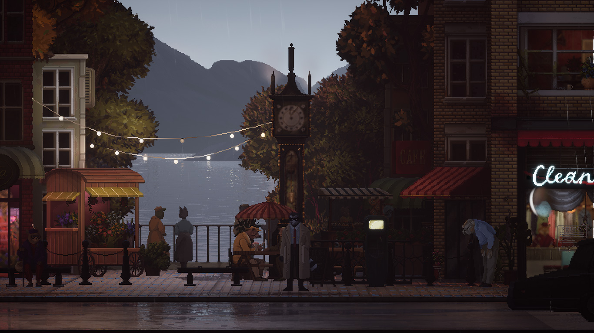
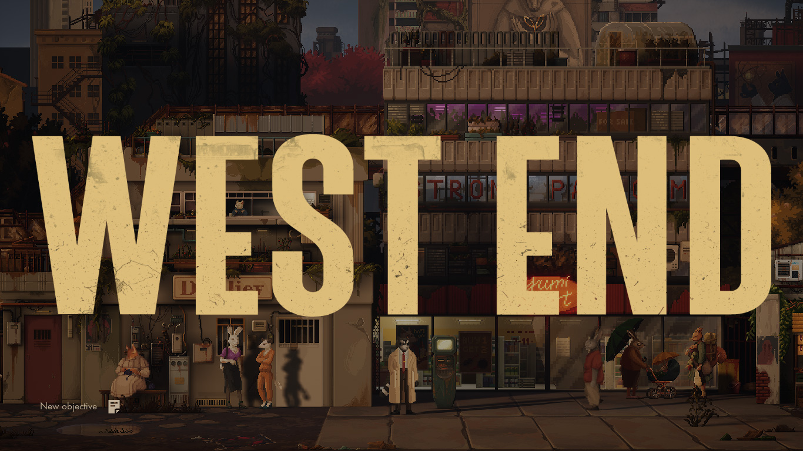
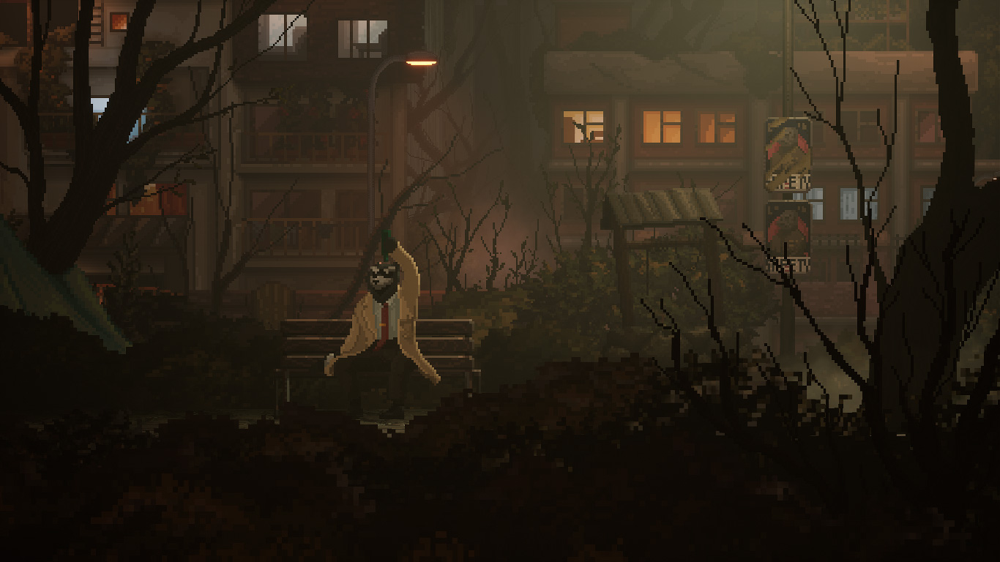
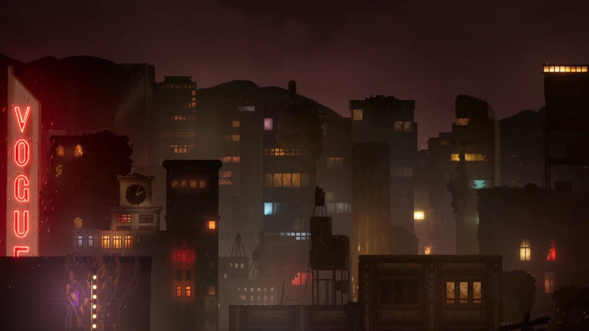

Se întâmplă destul de rar să-mi achiziționez un joc în ziua de lansare și chiar mai rar să-l iau în orb fără a ști vreun aspect considerabil despre el. **Backbone** a zăcut câteva luni în wishlist, încă de dinainte să se concretizeze în altceva mai mult de câteva cadre spilcuite care promiteau un noir-adventure cu animale antropomorfe. Așadar, în preziua lansării m-am hotărât să-i încerc prologul, ca neștiința să nu-mi fie completă, iar după numai câteva minute l-am părăsit pentru a nu-mi strica experiența viitoare cu promisiunea că-l voi cumpăra fără preget.

Cum spunea și Gherasim, aparent nișa asta a devenit aproape o modă, iar numărul jocurilor ce se folosesc de asemenea arătări pare să fi crescut în ultima vreme, fie că ne referim, ca prime exemple de marcă ce mi-au venit în minte la apelul bocancilor, la [Night in the Woods](https://candaparerevista.ro/posts/2018/08/review-night-woods-woozie/) sau la [Blacksad](https://store.steampowered.com/app/1003890/Blacksad_Under_the_Skin/)-ul căruia Backbone vrea să-i fie emul, dacă nu prin gameplay măcar cvasivizual și cvasinarativ. Tendința de a se folosi de antropomorfizări pare a fi o cârjă lesnicioasă în caracterizarea personajelor, nefiind necesară o înrâurire de artificii narative pentru a le exemplifica anumite trăsături psiho-morale. Cumva aceste întrupări totemice se vor o scurtătură în redarea anumitor arhetipuri preconcepute, născute prin corelarea și suprapunerea metehnelor comportamentale similare dintre un animal și un gen de om.



Începutul jocului se pune pe un eșichier cunoscut al genului noir: Howard Lotor stă într-un apartament prăpădit, ce-i dublează ca birou pentru activitatea sa detectivistică. Primește cazul unei doamne care-și suspectează soțul de infidelitate - o consecință normală, îngrijorată, a absenteismului repetat din ultima vreme, a parfumului străin ce-i stăruia pe haine și a deteriorării relațiilor sale cu angajatorul. După câteva întrebări despre obiceiurile cotidiene ale soțului de care clienta sa avea habar, Howard iese dintre pereții înguști, construiți parcă în [AGS](https://www.adventuregamestudio.co.uk/), pe strada aglomerată la ceas de seară unde se afișează întreaga frumusețe a jocului: lumini plăcute și o rumoare liniștită; vocea străzii se suprapune și se-ngemănează cu o muzică instrumentală suavă; rezonanțe de jazz plutesc în urma câte unei mașini răzlețe trecută-n viteză; restaurante pentru tot felul de mușterii cu mai multă sau mai puțină dare de mână stau cu firmele la vedere. Peste tot lumini hipnotice întrerup continuitatea inscrutabilă a nopții și un strop de ploaie ici și colo sare de pe umbrele pe lentilele celui de dincoace de ecran. O adevărată încântare, ea se prelungește și după intrarea în The Bite, în aglomerația interioară și fumul de țigară,  urmată de o voce onctuoasă ce s-aude de pe scenă și acoperă clinchetul de sticle și pahare. Deși e o încropire de clișee, cumulul lor funcționează foarte bine pentru a crea atmosferă și a te transpune în lumea lui Backbone.

Din păcate idila jocului cu marota polițienească pierde constant din avântul luat în prolog și, după descoperirea făcută în subsolul restaurantului, aidoma cu cea din bucătăria doamnei Lovett, totul începe să se destrame și să se ducă de râpă încet dar sigur cu cât te apropii de final. De la ușoara intrigă polițistă, povestea, țesută remarcabil în primele minute, urcă un ridicol constant, misterul se adâncește aiuristic migrând din fundurile restaurantului către o conspirație ce ia forma fizică a unui film timpuriu de Cronenberg. Dacă e să dau altă formă analogiei începi prin a te uita la [The Big Sleep](https://www.imdb.com/title/tt0038355/) și într-o clipă de neatenție conștientizată de un clipit subsecvent ei te trezești la finele lui [The Fly](https://www.imdb.com/title/tt0091064/). Pus pe hârtie pare o idee suficient de bizară care stârnește măcar un minim de curiozitate dar desfășurarea e defectuoasă cu atât mai mult cu cât un întreg capitol e un șir prostuț de activități banale în sânul pegrei societății care trebuia să culmineze într-un fel. Și cum altfel decât prin trădare? Lucru ăsta n-ar fi putut surprinde pe nimeni dacă iei în considerare în cine-ți pui încrederea. După plimbarea prin mulțimea informă a festivalului și coșmarul ce se desprindea din festivitate, trecerea la calmul banal din cortul oamenilor străzii e aproape prăpăstioasă iar trădarea e așteptată cu osârdie pentru a afla deznodământul.

Apoi tot aici la marginea societății, pe albia râului format de canalizarea orașului se poate vedea limpede tentația netăgăduită a scriitorilor de a depăși delimitările omagiului, de a fura, de a lua cu nerușinare din conversațiile interioare ale lui Disco Elysium. Dacă la început, doar amplasarea vizuală a dialogului pe ecran făcea trimitere la DE, după metamorfoză, solilocviul sinelui capătă veleitățile lui și împrumută mai mult decât ar fi îngăduit. Dincolo de evidenta sursă de inspirație, spre deosebire de Disco, unde răgazul permite interiorizarea și reflectarea asupra spuselor, în Backbone opțiunile de răspuns pe care ți le dai sunt fără de consecință. Discursul continuă neabătut de la linia sa, independent de alegerea făcută. Asta mi-a devenit aparent după ce am fost silit să repet începutul capitolului din cauza unui bug - am vrut să termin opțiunile conversaționale cu un personaj și jocul a rămas într-o anume buclă. La repetarea capitolului, alegând vreo două opțiuni diferite în conversația cu sinele am văzut că nimic nu s-a schimbat față de momentul precedent.



Mergând mai departe în poveste, jocul se claustrează, își limitează orizonturile - ținându-l prizonier pe Howard în vreo câteva camere amărâte se pierde abundența detaliilor încât mi-a creat impresia de prisos în folosirea engine-ului Unreal, de suprainginerie extinsă și neesențială. Pentru ce atâta muncă dacă oricum timpul petrecut în spațiile larg deschise e limitat la vreo 4-5 scene de câteva minute fiecare? Finalul mai face o încercare de deschidere, de lărgire a microcosmosului dar, la fel ca până atunci, durează prea puțin să poată deveni notabil.

Ar mai fi o ciudățenie remarcabilă, întâlnită destul de devreme, în două instanțe undeva prin capitolul 2, când surprins asupra unor fapte suspecte jocul se comportă straniu - destul de inefabilă senzația, de parcă ar lipsi câteva cadre și te-ai trezi într-o scenă lipită ulterior. Nicio continuitate între activitatea întreprinsă și apariția celor care te-au dibuit și te-au interpelat, deși conversația se poartă în spațiul general în care te aflai. Pare, cu toată sinceritatea, că n-au știut cum să realizeze interacțiunea între protagonist și alt personaj cât timp avatarul se afla sub controlul jucătorului. Totuși, momentul în care ești surprins de cei doi prichindei în birou creează un simțământ straniu: chipurile lor sunt distorsionate și de nepătruns, de parcă ai văzut ceva ce n-ar fi trebuit, dincolo de limitele comprehensiunii. Din păcate cred că ori a fost un alt bug ori o întâmplare, nici vorbă de o alegere deliberată.

Backbone se mândrește, printre altele, cu eticheta de adventure, dar de-a lungul lui am avut parte de un singur puzzle în adevăratul sens al cuvântului, cu posibilitatea existenței unuia adițional peste care cred că am trecut abordând lucrurile diferit - o cutumă proprie prologului. Așa că, dacă mersul biped nu te face om, nici existența unui puzzle clasic nu te transformă în adventure. Cu asta vreau să spun că i-ar putea fi reproșată respectiva auto-etichetare cu propunerea de a i se retrage și de a regresa la titulatura de „poveste interactivă”.

Într-un sfârșit, Backbone e un șir continuu de ratări: impresionant audio-vizual prin anumite zone de început cât să te agațe în minciună și din ce în ce mai dezamăgitor pe parcurs. Activitățile, fie că vorbim de cele de explorare a orașului ori de cele ce țin de poveste, sunt întreprinse la nivel superficial iar dezamăgirea venită din partea de investigație e cu atât mai mare. Nu pare că ai vreo influență, că n-ai contribuit în vreun fel la elucidarea misterului. Plimbarea lui Howard din punctul „a” în punctul „b” nu se poate numi investigație. Povestea se întâmple strict ca o consecință a plimbării și nu a acțiunii sau dialogului. Finalul e un șir de conversații purtate de două personaje ca pentru a umple anumite goluri și a da speranța unui soi de continuare. Răzbate o puternică senzație de abandon, că de la un anumit punct încolo producătorii n-au știu încotro să se îndrepte, s-au  plictisit sau au avut termene de atins și au încropit ceva din ce aveau disponibil. I-aș fi înțeles și iertat multe dacă se dovedea că e altceva, cum ar fi un vehicul de promovare inedit pentru albumul unei tinere cum (speculez că) e [The Longest Road on Earth](https://store.steampowered.com/app/1295790/The_Longest_Road_on_Earth/) (un alt exemplu de joc cu animale antropomorfe).

Sincer, nu cred că aș putea recomanda Backbone cuiva. Sfatul meu, jucați prologul că-i gratis și construiți-vă restul de poveste în imaginație. Dar, dacă totuși dați dovadă de slăbiciune și vă acaparează atenția, așteptați o reducere masivă. La ce oferă în momentul actual, raportul preț-conținut e mult disproporționat. ■

