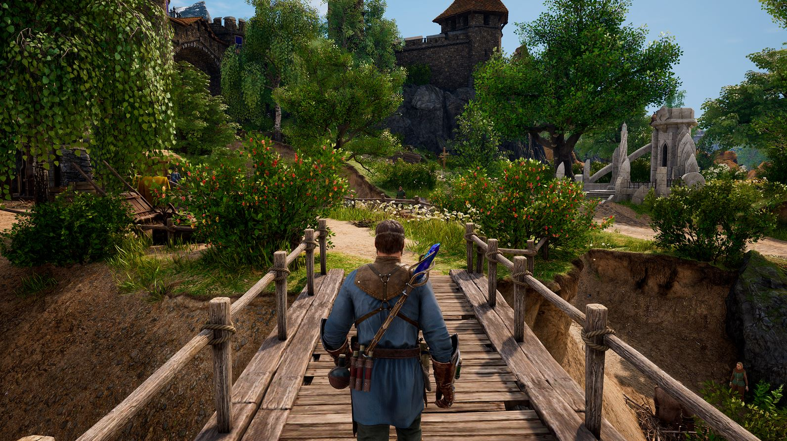

Despre **King's Bounty II** v-am mai povestit acum vreo doi ani, când am avut ocazia să joc o versiune alpha la Gamescom. Dacă vă mai amintiți, nu rămăsesem cu o impresie prea bună - build-ul neșlefuit și schimbările radicale de gameplay și direcția artistică mă dezamăgiseră puțin. Am pornit însă cu un sâmbure de curiozitate și optimism prudent copia de preview primită acum câteva săptămâni.

Cât de mult s-au putut schimba lucrurile în doi ani? Ei bine, o să încep cu ce a rămas la fel. Încă din primele trailere King's Bounty II a fost prezentat ca un joc mai întunecat și mai serios decât predecesorii săi, cu un accent mai pronunțat pe dialoguri și secvențe cinematice. Așa era și în alpha build, așa a rămas și în preview. Având însă mai mult timp să mă afund în el, am descoperit că lumea în care se desfășoară acțiunea jocului nu e chiar așa de întunecată. Ne aflăm încă pe teritoriul unui high fantasy convențional, cu paladini cu ochi albaștri și arhimagi care veghează la bunul mers al lucrurilor. N-aș zice că este cu adevărat „serios”, are suficiente momente cheesy sau umoristice, întâlnite în special prin quest-urile secundare. Dar în comparație cu seria începută în 2007, se simte într-adevăr schimbarea de ton. Asta nu e neapărat ceva deranjant, mi se pare că pe genul ăsta de joc se poate mula o paletă largă de estetici, de la basme viu colorate la epopei grimdark.



Mai supărătoare e aplecarea spre o redare cinematică a poveștii. Nu de puține ori mersul lucrurilor e întrerupt de dialoguri și mici secvențe cinematice, inclusiv când vine vorba de questuri mărunte, fără legătură cu povestea principală. Este evident că s-a avut în vedere publicul de pe console - este primul King's Bounty care va ajunge pe Playstation și Xbox - dar există câteva neajunsuri majore la această direcție. În primul rând, jocul nu duce în spate o poveste sau o lume suficient de interesantă încât să merite o asemenea insistență pe prezentarea ei. Efectul e contrar celui dorit - în loc să trezească interesul pentru personaje și poveste, crește plictiseala. Iubesc poveștile simple și clișeele cu răul străvechi care se trezește din somnul de veacuri, dar nu-mi place să fiu blocat în dialoguri și filmulețe interminabile. Este echivalentul unei ședințe la birou care ar fi putut fi evitată cu un simplu mail trimis la toată lumea. Pistonând jucătorul cu tot felul de dialoguri de umplutură, îl ții departe de conținutul pe care a venit să îl vadă: confruntările tactice între armate de creaturi fantastice.

Cum vă spuneam și data trecută, King's Bounty II împrumută mult din RPG-urile open world ieșite în ultimul deceniu. Nu mai controlăm un erou călare de undeva de sus, pe o hartă inspirată de Heroes. Când nu suntem ocupați cu luptele tactice, explorarea lumii se face dintr-o perspectivă obișnuită 3rd person, similar cu Witcher. Vom putea lua orașele si satele la pas, să vorbim cu țăranii sau negustorii și să le cotrobăim prin cufere și butoaie. Lumea jocului e lucrată cu migală, iar perspectiva asta la firul ierbii e o noutate binevenită pentru serie. În același timp însă, altoiul ăsta de RPG are fix efectul negativ pe care îl are excesul de poveste cinematică. Mai mult timp cotrobăind după saci cu aur prin dungeon-uri cu puzzle-uri simpliste înseamnă mai puțin timp petrecut acolo unde contează, și anume dirijând oșteni pe câmpul de luptă.

Ne confruntăm așadar în King's Bounty II cu un exces de elemente noi pentru serie, elemente care nu aduc prea multă plusvaloare experienței jucătorului, ci care sunt acolo doar să fie. Dincolo însă de timpul pierdut cu activități conexe se întrezărește farmecul seriei. Luptele sunt ceva mai puține, dar mai elaborate, dându-se pe câmpuri de luptă presărate cu obstacole variate. Proporțiile armatelor au fost aduse la un nivel mai firesc - unitățile sunt formate la început din doar câte 3-4 recruți, iar pe măsură ce abilitățile de lider cresc, pot fi mărite și efectivele. Preview-ul mi-a oferit acces la primele zece ore de conținut, dar din câte am văzut, nu se va mai ajunge la confruntări între sute de plăieși și creaturi fantastice. Dar chiar dacă numărul lor de pe câmpul de luptă a scăzut, s-a acordat mai multă atenție calităților creaturilor. Acestea pot acumula experiență, crescând în nivel și dobândind abilități suplimentare.

Fiecare unitate aparține unuia din patru mari idealuri: order, anarchy, power sau finesse. De-a lungul jocului eroul va putea soluționa questurile în mai multe feluri, fiecare abordare crescându-i scorul într-unul din cele patru idealuri, și implicit afinitatea pentru o anumită categorie de unități recrutabile. La creșterea în nivel se pot distribui puncte într-o sumedenie de skill-uri, la rândul lor împărțite după idealuri. Dacă eroul nostru se comportă precum un cetățean model în rezolvarea quest-urilor, va avea acces la skill-uri mai diplomatice sau care îi cresc experiența și abilitățile de lider. Soluțiile mai elaborate deschid drumul spre skill-uri de magie și savantlâc, iar cele care fac uz de forță brută duc la skill-uri pe măsură.



Așadar, bătăliile și dezvoltarea eroului rămân punctul forte al jocului. A fost o decizie inspirată din partea producătorilor să nu dilueze și aceste elemente, la pachet cu adițiile epic-cinematice. Chiar dacă se pierde mult timp cu activități „extracuriculare” insipide, nucleul gameplay-ului rămâne similar cu al predecesorilor. Dincolo de măiestria pe câmpul de luptă, e important și în King's Bounty II să-ți alegi luptele în așa fel încât să nu rămâi cu o gaură prea mare în buget. Jocul nu mi s-a părut foarte dificil - vorbim totuși de primele zece ore - dar tot a reușit să mă angreneze în câteva lupte care nu mi-au ieșit din prima încercare. Pentru generalii min-maxeri cărora nu le poate ține nimeni piept pe harta principală, producătorii au adăugat și câteva quest-uri unde trebuie să duci lupte semnificativ mai dificile, din perspectiva altor eroi cu armate predefinite.

King's Bounty II se lansează peste trei săptămâni. Merită cumpărat? Aș vrea să pot răspunde cu un „da” categoric la această întrebare, dar tot conținutul de umplutură prin care a trebuit să trec mi-a cam tăiat elanul. În același timp, nu pot oferi nici un „nu” ferm. Ajuns la capătul preview build-ului, intrasem cum-necum în ritmul jocului și mi-aș fi dorit să duc la capăt quest-urile pe care le aveam încă deschise. Nu este un joc rău - și e de lăudat încercarea producătorilor de a nu face o a cincea copie după King's Bounty: The Legend - dar până la un nou clasic al genului mai e cale lungă. ■
