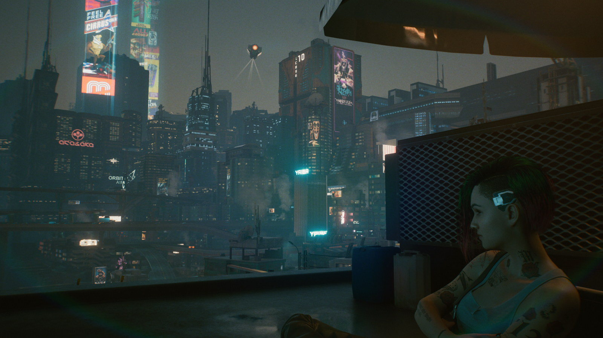
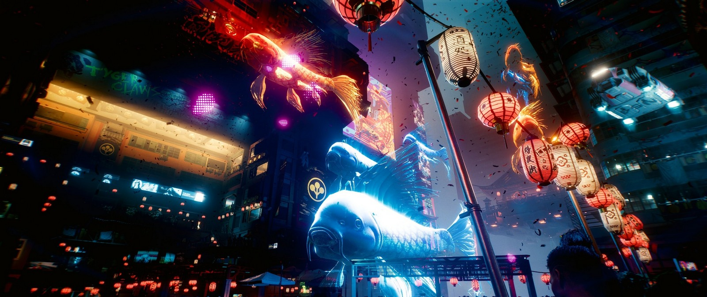
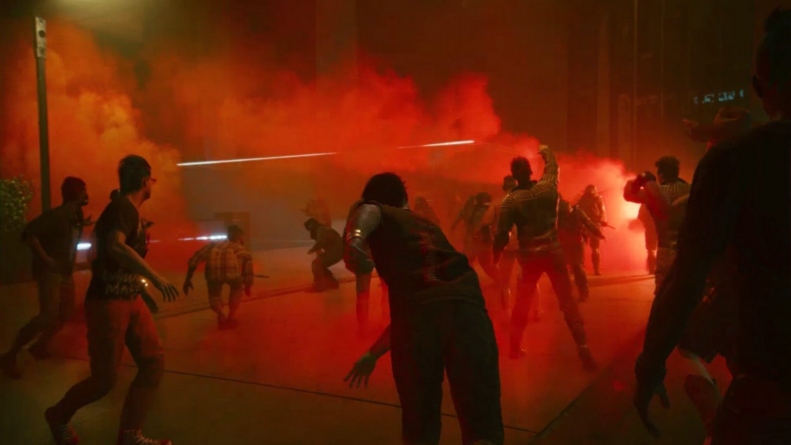

Ambiție. Dacă ar fi să folosesc un singur cuvânt ca să descriu **Cyberpunk 2077**, acela ar fi „ambiție”. Sunt extraordinar de rare jocurile care se chinuie atât de tare să ajungă la lună. Dar dacă aș putea să folosesc două cuvinte, acelea ar fi „ambiție prostească”.



Dar să o luăm cu începutul: ce e **Cyberpunk 2077** de fapt? Poate fi descris ca un fenomen, un val de hype ajuns în topul produselor media contemporane care au generat cele mai mari așteptări, un Avengers: Infinity War al jocurilor video. Iar din perspectiva asta Cyberpunk 2077 a fost un succes — nu cred că există suflet de om care să aibă chiar și tangențial legătură cu gamingul și care să nu fi auzit de, vorbit de sau jucat jocul ăsta.

Cyberpunk 2077 poate fi descris și ca cea mai tristă poveste din 2020 despre _game-development-ul_ AAA, nu departe de Star Citizen. Să ai toți banii din lume, toată bunăvoința posibilă și resurse... hai nu infinite, dar, după cât de lungă e lista de credits, suficiente cât să transpui orice vis în realitate... și totuși! Ca în orice alt act de creație — nu contează că e sculptură, tablou, melodie sau film — absolut nimic altceva nu contează la final decât produsul care ajunge la oameni. Restul, toate ideile din lume, toate schițele conceptuale, toate promisiunile făcute și toate poveștile care răsar la zece seara la o pizza și o bere, toate acestea nu contează decât pentru documentarul _making-of_ care se va scoate după aceea, dar nu vor conta deloc pentru jucător.

Mai concret, însă, Cyberpunk 2077 poate fi descris ca un joc video care a apărut în decembrie 2020, într-o stare tehnică aproape nejucabilă pentru multe persoane și, cu indulgență maximă, „jucabil” pentru restul. Este un sandbox open-world, shooter/action, în care jucăm cu un mercenar numit **V** (uuu, misterios!), cu elemente puternice de RPG, de la numere în tabele până la dialoguri și relații cu personaje, iar totul este învăluit într-o tematică de cyberpunk, tehnologie și golăneală. Acesta e Cyberpunk 2077 și nu este un joc video bun.

## ***

Gata recenzia? Am zis "Cyberpunk 2077 nu este un joc video bun" și s-a terminat?

Nu, nu chiar, deoarece consider că e important să vorbim totuși despre ce există acolo. Dați-mi voie să vă fiu un ghid turistic, să vă arăt câte ceva din Cyberpunk 2077 care, deși nu îl va face un joc bun, vă va contura și îmbogăți experiența. Așa că puteți respira liniștiți, judecătorul a lovit deja cu ciocănelul în masă, știți ce concluzie să luați din articol, dar poate mai stați un pic, astfel că la final nu doar veți ști, ci poate veți și înțelege.

Am petrecut în jocul ăsta aproape 130 de ore, ceea ce, conform howlongtobeat.com, mă plasează în limita extremă de sus. Pot să zic că am trecut prin tot conținutul pe care jocul îl avea pentru mine, mai puțin o mână de _fillers_, și am hoinărit destul pe străzile Night City-ului, orașul care e aproape un personaj principal în sine. Am tras cu urechea la zeci sau sute de povești ale oamenilor de pe stradă, am citit graffiti-uri pe pereții străduțelor (nu am văzut două la fel), am văzut ghetouri atât de detaliate că puteam să-mi imaginez unde dorm și cum trăiesc oamenii ăia, am sărit peste case, m-am urcat pe unde nu trebuia și multe altele, foarte rar jocul zicându-mi „nu ai ce căuta aici”. La fiecare pas vedeam ceva nou, pus manual de către un artist, sau auzeam sau citeam ceva nou scris (sper eu) cu drag de un scenarist și adus la viață de către un actor.

Orice s-ar putea spune despre Cyberpunk 2077, Night City este cel mai dens act de creație al unui spațiu virtual pe care l-am văzut într-un joc până acum. Niciodată nu am avut un déja-vu că poate am mai văzut fix zona aia altundeva, sau că am recunoscut acel aranjament de mobilă din altă misiune. De fapt, mint, o singură dată mi s-a întâmplat, într-un sidequest, și asta doar pentru că eram în aceeași zonă în care mai fusesem și înainte, dar mi-am dat eu seama târziu. Și nu pot să subliniez destul, fără să mă apuc să trag cu pixul pe ecran, cât de multă muncă s-a depus aici.



Păcat însă că tot orașul este lipsit de reactivitate, nu are vlagă. Nu e niciodată „gol” efectiv, nici nu pare un spațiu creat special pentru mine ca jucător, dar lasă impresia unui braț care nu are destulă tărie în mușchi ca să crezi că el chiar se poate mișca. Uneori, dacă te oprești și iei mâinile de pe mouse și tastatură, strângi puțin din ochi și tragi o gură de aer _fix așa cum trebuie_, poți ajunge să crezi că ai în față cea mai vie experiență a unui spațiu virtual. Asta până când o mașină se „spawnează” deasupra alteia și începe să claxoneze, sau iarăși se lovește un tip de tine și te înjură, sau când încep cetățenii să o ia la picior speriați fără niciun motiv. Dar totuși, arareori, pentru un moment, poți să ai experiența AIA.

Terminând jocul, țin minte că am văzut scris pe un perete, sau mai degrabă scrijelit, "I DID NOT WRITE THIS", și am stat un pic până să-mi dau seama că de fapt ba da, cineva chiar a scris aia. Dar câți mai sunt ca mine ca să vadă zgârieturile alea? Cât de mult a contat munca depusă pentru experiența produsului finit? E atât de important să avem scris pe un perete "I DID NOT WRITE THIS"? A făcut asta jocul final, cel jucat de noi, mai bun? Nu, probabil că nu. Era nevoie Night City să fie atât de detaliat? Pur cantitativ, se putea să fie mai puțin din tot, iar jocul să fie primit la fel? Da, consider că da.

Fiindcă ceea ce am apreciat, și ce o să țin minte, nu o să fie niciodată NPC-ul #20318 care și-a pierdut mașina la pariuri, desigur într-un mod diferit de NPC-ul #4082 care nu a putut să-și plătească datoriile și căruia i-a fost confiscată mașina, ci o să fie momentele mărunte, când unul dintre personajele principale de a căror poveste eram interesat mă suna să-mi zică ce a mai descoperit și care mai e șmenul.

Căci da, ca sandbox, Cyberpunk 2077 face ceva pentru care restul industriei (Ubisoft în mod special) ar trebui să-și scoată carnețelul și să ia notițe. Deși am avut telefon și în GTA 5, întotdeauna simțeam că urmez tot o progresie statică, fugind după locații pe hartă ca să încep câte o misiune aranjată special pentru mine. Pe când în Cyberpunk 2077 ești sunat de un personaj când poate ești în drum către vreun sidequest oarecare, îți zice ce necazuri are și că o să se mai intereseze de problemă și atât, doar un _check-in_. Uneori chiar textuiți sau vă trimiteți poze. Apoi te sună din nou după un timp și te duci să vă întâlniți la un ramen shop în mijlocul străzii, unde stai jos și mănânci în timp ce vorbiți de treaba aia. Apoi, fără să îți dai seama că ai intrat deja într-o misiune, ajungi să intri într-o cameră și să hăckuiești un terminal, ieși, vă luați la revedere și aia a fost.



Și orice lipsuri ar avea jocul în a-și aduce la viață lumea, sunt compensate prin interacțiunile cu personajele și modul în care decurg acestea. Mă jur că în niciun alt joc nu am fost mai dispus să am o conversație sau să stau la o bere cu un NPC doar pentru că îmi apărea un prompt pe ecran. Iar când primești un telefon legat de ceva quest pe care l-ai terminat acum două ore (în timp real), asta creează un sentiment real de atașament cu lumea din jur, simți că nu exiști în acel timp înghețat al jucătorului în care totul de pe hartă stă și te așteaptă pe tine doar ca să înceapă să se miște. Când m-a sunat Judy (gagică de treabă!) că i-a găsit pe niște motherfuckeri cu care urma să avem noi o discuție mai sângeroasă, poți să fii sigur că mi-am băgat piciorul în misiunea random #237 pe care urma s-o încep și m-am dus să continui questul ăla. Dacă îmi era greu și până acum să intru într-un sandbox, după ce am jucat Cyberpunk a devenit și mai greu efortul de a fugi după iconițe pe hartă și să-mi mențin iluzia că NPC-ul ăla din quest nu m-a așteptat în frig 80% din joc până mi-am făcut eu timp pentru el.

Nu mă înțelegeți greșit, harta jocului e PLINĂ de iconițe, iar jocul este absolut împânzit din metru în metru cu ceva de făcut. Nu puteam să trec strada (serios, erau două activități fix vizavi) fără să dau de ceva de făcut. Dar așa cum ziceam, puzderia de conținut nu a contat aproape deloc, decât poate ca _filler_ între treburile cu adevărat interesante; personajele și interacțiunile sunt cele mai importante lucruri din Cyberpunk 2077. Dacă CD Projekt Red face ceva bine (și sincer, ar trebui să se rezume mai mult la asta decât la mastodonți de vise), acestea sunt poveștile din jocurile lor.

Sunt atâtea povești în jocul asta și unele sunt extrem de memorabile, dar în rest seamănă cu un pateu foarte bun tras într-o pojghiță foarte subțire pe foarte multe felii de pâine. Absolut, dar absolut fiecare _encounter_ de pe hartă (și vorbim de sute) are cel puțin unul-două documente de măcar câteva linii de text explicând ce s-a întâmplat acolo și de ce tocmai ți-ai murdărit ghearele cibernetice cu sânge. Dar în loc să impresioneze, faptul ăsta doar subliniază cât de fără sens a fost interacțiunea. Încă un _combat encounter_ de 3 minute din care ai ieșit cu trei puști noi pe care deja le-ai dezasamblat pentru piese. Încă un exces de care jocul nu avea nevoie.

Dar, că veni vorba, a avut Cyberpunk 2077 vreun exces pe care l-am apreciat? Da, a avut, și acela a fost _voice acting_-ul. Nu știu cum a fost actorul de la V-ul bărbătesc (din ce am văzut pe YouTube, mi s-a părut doar un _tough guy_ stereotipic), dar pot să zic că actrița care a interpretat rolul V-ului feminin, Cherami Leigh Kuehn, a fost unul dintre motivele importante pentru care am reușit să trec prin 130 de ore de Cyberpunk 2077, egalând-o în topul personal pe Jennifer Hale (Captain Shepard-ul feminin pentru cunoscători). Există o cantitate ridicolă de voce înregistrată în jocul ăsta, de la orice NPC de pe stradă până la misiunile principale, și V o să fie cel puțin 50% din tot ce o să auzi de-a lungul jocului, ore întregi de dialog. Nu știu cum le-a reușit, dar nu de puține ori a avut exact inflexiunea potrivită pentru paragraful citit, fix tonul pe care îmi imaginam că o să-l aibă. Și nu e deloc puțin lucru ca actorul vocal să poată înțelege contextul replicii și cum să o redea.

Și nu putem să vorbim de _voice acting_ fără să îl menționăm pe Keanu Reeves, care interpretează rolul rockerului bețiv din capul tău, Johnny Silverhand, și care are și el destule replici în joc. Deși inițial mi s-a părut foarte stranie alăturarea (greu să nu ți-l imaginezi pe Keanu însuși, mai ales că și înfățișarea personajului e modelată după actor), până la finalul jocului era Silverhand pentru mine, deci... _Mission Success_? Dar iarăși mă scarpină gândul — totuși, chiar era nevoie de atâta voice acting? Era nevoie de Keanu? Putea Silverhand să fie oricine altcineva? Absolut.



## ***

De fapt, ce ar fi fost Cyberpunk 2077, presupunând că s-ar fi lansat vreodată exact așa cum și-l imagina CDPR? Cu alergat pe pereți, cu mașini customizabile, cu toate rămășițele de poveste care se pare că aveau o anvergură mai mare, cu BD-uri interactive fără legătură cu povestea principală? Dacă Cyberpunk 2077 ar fi avut toate lucrurile astea, ar fi fost un joc mai bun?

Răspunsul e nu. Revenind la primul paragraf, Cyberpunk 2077 este un joc ambițios. Dar are o ambiție prostească. E un joc creat să fie „mai mare, mai frumos, mai dens, mai interesant, mai cool” și cu intenția clară de a le uni într-un tot omogen, dar rezultatul dă impresia unor bucăți de piele cusute cu greu, strânse prea tare, aproape să plesnească din cusături. Și lucrul cel mai trist e că nu era nevoie.

Cyberpunk 2077 este, la bază, un RPG semi-liniar, cu personaje mișto, interacțiuni cool, momente chiar tandre și meditative uneori, și nervoase sau sumbre alteori. Era suficient ca jocul doar să spună poveștile alea, să ofere un minim cadru de _side-quests_ ca să te țină ocupat și să te fure puțin cât timp rumegai la story, într-un cadru doar suficient de mare cât să nu te sufoci. Cyberpunk 2077 putea să fie un joc chiar și cu 70% mai mic din toate punctele de vedere, mai concentrat și cu resursele mai atent distribuite, și ar fi fost cel puțin același joc, cu probabil milioane de buguri mai puține. Dar în cel mai bun caz?

CDPR puteau să scoată două sau chiar trei Cyberpunkuri în cei zece ani care au trecut de la primul teaser, fiecare construit pe lecțiile învățate de la predecesor, și având posibilitatea de a dezvolta o franciză cu pași măsurați și riscuri atent calculate. CDPR puteau să construiască următorul Mass Effect — piesele sunt acolo, undeva sub toate liniile de cod în plus, dar au decis să scoată Mass Effect 1, 2 și 3 în același joc (și poate și un Dragon Age Inquisition îndesat printr-un colț). Și asta e ceva care nu se poate rezolva nici dacă ar scoate zeci de patch-uri. Problema nu e tehnică aici, e conceptuală și e legată de abilitatea de a lansa o creație artistică bună fără a simți un ștreang în jurul gâtului care să te oblige la deadline-uri și obligații externe presante. Chiar și dacă ar mai fi stat doi ani în lucru, tot nu cred că ajungea unde trebuie.

La final de drum, repet, Cyberpunk 2077, jocul instalat pe hard care pornește la dublu-click pe iconiță, nu este un joc bun; e un joc mediocru, cu momente de sclipire, care totuși mi-a lăsat amintiri memorabile. Dar totalitatea „Cyberpunk”, incluzând aici atât experiența de dinaintea lansării, cât și tot ce a urmat după, e mult mai mult decât produsul în sine. E un fenomen, o să fie un documentar, e o lecție de „cum să nu”, un avertisment către cei ce vor încerca să zboare spre soare cu idei mărețe, și e validarea opiniei unui vreunui directoraș de pe la Ubisoft că „a scoate un produs jucabil e suficient”. Watch Dogs Legion a venit și a trecut, și-a cules banii, și o să revină și anul viitor sau răsviitor. Dar nici că o să țină cineva minte numele Watch Dogs Legions, pe când Cyberpunk 2077 a devenit deja o legendă. Infamă, dar tot legendă. ■

_**LE**: review-ul a fost scris în decembrie și am tot adăugat la el până în ianuarie. Suntem în aprilie 2021 acum și, după cum am estimat, patch-urile nu au rezolvat nimic care să schimbe măcar 1% din sentimentul din review._
