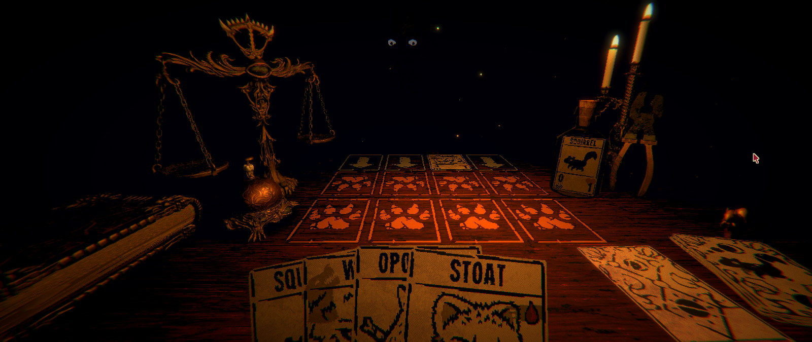

**Inscryption** se prezintă ca un „deckbuilding roguelike” și în mod normal această introducere ar fi fost suficientă ca să-i zic pas, deoarece evit cam orice joc bazat pe mecanici de CCG. În general, prefer jocurile cu un parcurs predictibil, în care să am șansa de a învăța și de a depăși provocările prin propriile-mi abilități, decât să fiu nevoit să gestionez niște probabilități și să mă bazez pe norocul sau ghinionul de moment al unor abilități random. Dar pentru că știam că acest joc a fost dezvoltat de Daniel Mullins mi-am depășit cu ușurință toate prejudecățile. Dacă acest nume nu vă spune nimic, vorbim puțin mai încolo ce înseamnă asta, dar e suficient deocamdată să știți că face parte din acel gen de jocuri care e bine să fie jucate cu cât mai puține informații prealabile. Ceea ce, evident, îngreunează orice efort de a le recenza — cum îi explici cuiva de ce ar trebui să joace un titlu, când experiența în sine este principalul argument pentru a face asta? Dar voi încerca să explic măcar premisa și mecanicile de bază fără să stric nimic altceva (nu mai mult decât o face chiar Mullins însuși în [prezentarea jocului](https://www.youtube.com/watch?v=bWfaY4g3gwE)).

Odată pornit jocul, apeși, cum e normal, pe _Continue_, deoarece butonul _New Game_ este dezactivat, nimic ciudat aici, iar apoi te trezești într-o încăpere slab luminată, față în față cu un personaj misterios, cufundat complet în întuneric cu excepția ochilor. Ca să evit să tot repet de acum încolo „personaj misterios” în diverse forme, o să vă dau acum singurul spoiler din articol și vă spun că îl cheamă Leshy, un nume inspirat de [o zeitate din mitologia slavă](https://en.wikipedia.org/wiki/Leshy), un spirit protector al pădurii și animalelor. Ei bine, Leshy îți urează bun-venit la masa de joc, unde vei începe un fel de tabletop role-playing game bazat pe colecționat și duelat cu cărți.

Asumând pe rând când rolul de game master, când pe cel de adversar, Leshy îți va explica întâi regulile de bază, apoi începe jocul propriu-zis, în care avansezi cu o figurină pe o hartă pe care sunt marcate diverse _encounters_. Majoritatea acestor evenimente reprezintă dueluri de cărți contra lui Leshy, iar restul sunt oportunități de a găsi cărți noi sau de a obține diverse bonusuri pentru a-ți construi un _deck_ din ce în ce mai puternic.

Avansând până la capătul unei hărți, vei lua parte la un _boss battle_ — de fapt tot cu Leshy, dar de data asta purtând o mască pentru a intra în rolul noului personaj. Aceste dueluri sunt mai interesante, dar și mai dificile, nu doar pentru că boss-ul trebuie înfrânt în două runde separate, dar și pentru schimbările de reguli pe care le aduce, în ton cu personalitatea acestuia. În acest fel, miza crește și mai mult și te forțează să te adaptezi și mai rapid, cu atât mai mult cu cât același pachet de cărți trebuie să te susțină în ambele runde.



Între encounters, te poți ridica de la masă și poți explora în voie singura cameră a ceea ce pare a fi o cabană de bușteni, fără ferestre, în care vei găsi mici puzzle-uri și alte secrete care pot debloca avantaje importante pentru jocul de pe masă, sau pot chiar avansa firul narativ. Nu intru în detalii, dar nu e cazul să neglijezi partea asta.

Vei realiza astfel destul de repede că ești de fapt prizonierul lui Leshy și că, deși nu ești forțat să rămâi la masă, nu poți ieși din cameră, astfel că nu ai de ales decât să continui jocul și să speri că ceva bun se va întâmpla dacă câștigi. Dar atmosfera sinistră și decorul scos ca din legendele urbane cu vrăjitoare nu-ți lasă prea multe speranțe, ca să nu mai zic de muzica spartă ce te învăluie permanent, punctată de tot felul de sunete care să-ți țină părul ridicat pe mâini: bătăi de ciocan, scârțâieli, tapet jupuit, note prelungi, tânguitoare și câte și mai câte.

Iar atunci când pierzi... vei avea singura ocazie să-l vezi pe Leshy, ieșit din conul său de întuneric pentru a-ți face o fotografie și a te imortaliza într-o nouă carte de joc (la propriu). Practic, acum alegi ce păstrezi din _playthrough_-ul curent, având ocazia să creezi o carte puternică combinând caracteristici — cost, resurse, abilități — de la mai multe cărți din pachetul curent, iar în jocurile următoare te vei putea folosi de ea dacă o găsești.



## ***

Am tot vorbit până acum despre duelurile de cărți, mecanica de bază a jocului, dar încă n-am detaliat și cum se desfășoară. Spre surprinderea mea, partea aceasta s-a dovedit a fi mai captivantă decât mă așteptam, fiind mult mai strategică decât „bătaia cu abilități random” de care mă temeam.

Conceptul e destul de simplu. Ai o tablă de joc împărțită în trei rânduri de câte patru căsuțe, pe care ne vom așeza cărțile — primul rând e pentru jucător, celelalte două pentru Leshy. Atât, ăsta-i tot terenul de luptă. Îți plasezi cărțile în joc, apoi la finalul rundei acestea vor „ataca” rândul din față. Dacă acolo se găsește o carte inamică, vor face damage acelei unități, iar dacă e o casetă goală, vor face damage direct adversarului. Aceasta e și condiția de victorie: să reușești să faci 5 puncte de damage oponentului. Simplu, nu? Dar atenție, scorul nu se ține separat, ci pe talerele unei balanțe. La finalul rundei tale, vine rândul lui Leshy. Orice punct de damage pe care îl face și nu ai o carte care să-l „încaseze” devine o contragreutate la punctele tale, astfel că condiția de victorie înseamnă de fapt să ajungi să faci 5 puncte de damage mai mult decât adversarul. Și asta nu mai e deloc atât de simplu pe cât sună.



Cărțile se împart în „resurse” și „unități”, fiecare într-un pachet separat. Cel de unități conține doar cărțile găsite până în acel moment în jocul tabletop, pe când cel de resurse este infinit, iar la începutul fiecarei runde poți trage o singură carte din ce pachet vrei. Fiecare unitate are înscris un cost de resurse pe care trebuie să-l plătești înainte de a o putea introduce în joc. Apoi, pentru lupta propriu-zisă, o cifră care reprezintă puterea de atac și încă una ce reprezintă câtă viață are, sau mai precis cât damage poate să primească până moare. Luptele nu au niciun element de RNG, ci se rezolvă pur aritmetic — 2 puncte de damage vor scădea întotdeauna 2 puncte din viața inamicului, indiferent care ar fi acesta.

Figurinele desenate pe cărți reprezintă diferite tipuri de animale care dau și caracteristicile cărții. Un „urs grizzly” are nu doar viață multă, ci și un atac puternic, dar vine și cu un preț pe măsură, astfel că nu-ți vei permite să-l joci prea devreme. În schimb, o biată șopârlă are un atac de doar 1 unitate, dar vei putea s-o introduci în joc imediat. În acest fel sunt reprezentate o mulțime de viețuitoare (să ne aducem aminte și de inspirația pentru personajul lui Leshy).

Și peste toate acestea vin „sigiliile”, care sunt niște bonusuri permanente sau temporare care modifică într-un anumit fel comportamentul cărților și măresc extraordinar de mult posibilitățile tactice, în general inspirându-se din caracteristicile animalului de pe carte. De exemplu, o „călugăriță” face damage doar 1, dar poate ataca la stânga și la dreapta. Păsările au sigiliul „airborne”, astfel că fac damage direct adversarului, ignorând unitatea din față. Vipera, cu veninul său, omoară instant orice unitate adversă, indiferent câtă viață are. O anumită pisică are damage zero, dar vieți infinite. Și multe altele asemenea care dau varietate și pot modifica cursul unei partide.



Și mai este un amănunt important peste care am sărit destul de repede. Spuneam că adversarul folosește două din cele trei rânduri ale tablei de joc. Regulile sunt făcute în așa fel încât oponentul își introduce cărțile pe primul rând, fără să atace, iar de-abia în runda următoare acestea se vor muta pe cel de-al doilea rând, unde e „linia frontului”, și atunci vor ataca. Astfel, în combinație cu lipsa de RNG, vei ști (aproape) întotdeauna la ce atac trebuie să faci față și să decizi cum îți așezi cărțile. Desigur, nu vei avea mereu unități adecvate situației, așa că de multe ori vei fi în situația de a alege răul mai mic, cum ar fi să sacrifici o carte bună doar pentru a preveni damage-ul pe care altfel l-ar fi făcut unitatea adversă.

Ah, și am zis de resurse pentru a juca cărțile? Ei bine, costul acestora este reprezentat de picături de sânge, fiecare reprezentând o... viață. Viața unei alte unități. Vrei să introduci un lup care „costă” două picături de sânge? Trebuie să sacrifici alte două cărți care sunt deja pe tabla de joc. Pachetul de „resurse” pe care îl menționam mai devreme conține tot animale, veverițe cu cost zero, al căror singur scop este să fie jucate și apoi sacrificate. Dar desigur, nu ești limitat doar la veverițe, poți sacrifica la fel de ușor orice altă unitate de care nu mai ai nevoie. Tocmai ai tras ursul acela cu damage mare și vrei să-l arunci în joc? E cazul să sacrifici castorul și oposumul care au dus greul până acum. Pisica aceea inutilă, dar cu vieți infinite? Dintr-o dată devine una dintre cele mai folositoare cărți. Partea bună este că nu există limită la câte cărți poți juca într-o rundă, câtă vreme ai cărți de sacrificiu.



Așadar, terenul de luptă e mic și unitățile puține — în orice moment se pot înfrunta maxim patru contra patru cărți — iar posibilitățile tactice numeroase. În felul acesta, fiecare rundă e plină de tensiune și de decizii de luat, fiecare punct de damage contează, fiecare unitate pierdută sau prost plasată se simte enorm. Trebuie să menții în permanență un echilibru între a absorbi cât mai mult din atacul inamicului și a face damage la rândul tău, fie unităților adverse, fie direct oponentului pentru a te putea detașa pe balanța de scor. În mod surprinzător, jocul mi-a trezit în minte o paralelă mai puțin evidentă cu genialul [Into the Breach](https://store.steampowered.com/app/590380/Into_the_Breach/) — ambele oferă același gen de tensiune și te pun în fața unor decizii similare prin felul în care îți prezintă dinainte atacul cu care te vei confrunta și te obligă să rezolvi practic un puzzle cu mijloace tactice limitate. 

## ***

După ce v-am povestit, o să vă mai dau un spoiler — jocul de-abia începe. Da, v-am mințit mai devreme, dar obișnuiți-vă cu asta, căci jocul e plin de secrete și twist-uri. Veți avea de văzut și de făcut mult mai mult decât am prezentat eu aici. Jocul se transformă și se reinventează în permanență, introducând mecanici noi sau modificându-le pe cele existente pentru a se împleti cu meandrele narațiunii, dar reușește în același timp să-și mențină esența gameplay loop-ului initial, păstrându-și coerența până la final.

Pentru cine nu știe, Daniel Mullins, programatorul din spatele jocului, a mai făcut în trecut **Pony Island** și **The Hex**. Deși nu e nicio legătură directă între ele (deci nu e nevoie neapărat să le fi jucat înainte), ce au toate aceste titluri în comun este felul în care pornesc de la o premisă sau o mecanică de joc aparent simplă, dar pe măsură ce joci așează încontinuu strat peste strat de gameplay, secrete, poveste și meta-poveste, mare parte din experiența de joc fiind dată tocmai de descoperirea tuturor aromelor și a felului în care se întrepătrund pe măsură ce-l consumi. Iar **Inscryption** este de departe cel mai bun dintre acestea, o rețetă dusă la perfecțiune, un tort care nu trebuie ratat. ■

