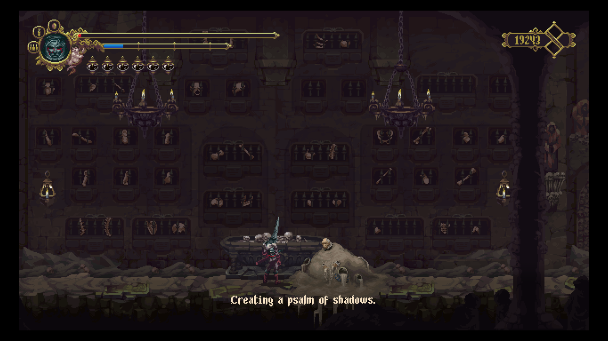

Aidoma episcopului Melchiade, exhumat de credincioși, îmbăiat în miruri și împodobit în mătăsuri și aur pentru a fi purtat în procesiuni, astfel și cei de la The Game Kitchen au procedat cu moștenirea cultural-religioasă a Peninsulei Iberice când au creat lumea Cvstodiei.

Cunoscuți pentru cele două jocuri The Last Door, TGK prin **Blasphemous** s-au îndepărtat teribil de ceea ce știau. Saltul de la point and click adventure cu pixeli uriași la un action-adventure cu valențe de metroidvania și mici elemente souls-like este în sine o încercare temerară ce merită admirație.

Spuneam că piatra de temelie a Cvstodiei stă pe vigurosul sol al tradiției catolice cu o aplecare spre cutumele culturale specifice ibericilor. Influențele sunt dincolo de străvezii, atât prin folosirea iconografiei Bisericii Universale cât și prin toponimele sau simplele nume ale NPC-urilor, de la umilul rozariu la scribul și istoricul acelor locuri, pe numele său Deogracias. Trimiterile sunt multe chiar copleșitoare mai ales pentru un neofit cum sunt cu lințoliul neștiinței așternut peste ochi. Dacă unele sunt de-a dreptul evidente, altele sunt ascunse în tainițele necunoașterii. Fără a-mi face vreo misiune din a descosi fiecare firicel al jocului, l-am descoperit ulterior terminării jocului, în *Viața domnului Molière* pe Tirso de Molina, poet și dramaturg baroc, spaniol la origine și călugăr, acest ultim rol avându-l și tizul său găsit în orașul Alberto, aparținător al unui ciudat ordin monahal însărcinat cu sărutarea rănilor, punându-se astfel suferind și credincios la mila Miracolului. Tot astfel, grație lui Roberto Bolaño, am învățat că Exposito e un nume de familie dat copiiilor din flori sau orfanilor a căror origine nu poate fi aflată. În Cvstodia, numele este dat unuia din cei trei adăpostiți din uriașa catedrală, Madre de Madres, din a cărei deambulatoriu, Părintele Escribar îi veghează imperturbabil pe mirenii aflați dincolo de porți impenetrabile.

Astfel fiecare element preluat din realitate a fost răsucit și-ntors în Blasphemous, stors de vlagă și distilat. Echilibrul dintre măreția nesfârșită a divinității și groaza izvorâtă din infinit e lezat în universul jocului, centrul fiind mutat mai degrabă către angoasă la manifestarea divinității și mai puțin spre evlavie. Cumplitul Miracol, divinitatea de facto a lumii, nu poate fi descifrat în vreun fel. Se poate face o supoziție, Miracolul manifestându-se după reguli gnostice, un demiurg într-un microcosmos creat pentru a-și afla amuzamentul în ritualuri indicibile și de neînțeles. Deogracias numește Miracolul ca: *"that divine will, equally pious and cruel, which we could not and will never be able to unravel"*, încă din liminarul jocului. Mai departe nu rămâne decât o urmă de nădejde într-o mare de credință frenetică că ar putea fi înduplecat. Astfel imensele acte de credință izvorâte din piepturile anumitor credincioși iau o formă tangibilă pe trupurile lor, Cumplitul Miracol potrivindu-le firea cu latura fizică. Uneori prin binecuvântare și grație divină, alteori (adeseori) prin metamorfozări mordante. Chinul pare să fie singura constantă a Cvstodiei.

Pornind de la asta, propunerea celor de la The Game Kitchen e una simplă: un lung drum spre izbăvire, întortocheat și crud, într-o lume cotropită de vină. Preiei controlul asupra ultimului Penitent întru Tăcere, în mijlocul ordinului său masacrat, singurul care să mai urmeze supliciul Primului Fiu al Miracolului, a cărui suferință a rămas tăcută cât timp Miracolul l-a-ncolăcit după bușteanul de care se rezemase. Mai departe povestea se încâlcește în tonuri grave și grandilocvență, scopul fiindu-ți delimitat de Deogracias - pentru a accede în sânul măreței catedrale trebuie să te supui celor trei umilințe ale penitenței, exemplificate de câte o luptă împotriva câte unui boss. Altfel povestea e în cel mai bun caz criptică, situată într-un subtext sau dosită într-un noian de elemente de lore (fiecare obiect găsit va avea o descriere a ceea ce este și un dedesubt în care îi e atribuit un mic paragraf narativ, rupt din lume). Nimic nu e explicit propriu zis ori spus pe față. Ca voința divinității și resorturile după care funcționează lumea sunt de nepătruns fără un efort vizibil.

În mod surprinzător, povestea obscurată funcționează dintr-un anumit punct de vedere: incertitudinea succesului trebuie să fie covârșită de o credință oarbă. Nu există o metodă clară pentru a pătrunde mofturile Miracolului sau de a-i atrage mila. Patosul și fervoarea credinței sunt singurele care pot face față necunoscutului.



Multe nu sunt de menționat despre gameplay: e un 2D action-adventure cu elemente de explorare luate din clasicele serii Metroid și Castlevania și mici, aproape insignifianți dumicați din jocurile From Software. Dacă Salt and Sanctuary a fost întemeietorul sau de nu, unul din înainte-mergătorii unui asemenea hibrid mai soulsy peste care Hollow Knight domnește ca rege al genului, Blasphemous e un soi de animal pe același calapod, cu mici minusuri care-l împiedică să-și aproprieze coroana. Spre deosebire de HK și de majoritatea jocurilor "vania", setul de mișcări folosite pentru a descoperi lumea rămâne la fel pe tot parcursul jocului. Zonele inaccesibile devin obiectiv turistic de vizitat abia după găsirea unor relicve care nu aduc un aport în mișcările Penitentului. Nu poate fi vorba de vreun double-jump sau de vreun jump-dodge, motiv pentru care am văzut anumite frustrări la câțiva oameni de pe discordul jocului. Din punctul meu de vedere parcă nu s-ar fi potrivit un astfel de salt în cadrul jocului, mai ales că nu se întâmplă să ai nevoie explicită de vreo relicvă pentru a duce la bun sfârșit aventura. Mai mult de atât, cel puțin una din relicve se găsește foarte ușor.

Cam pe aceeași potriveală pică și schemele de luptă. Există o singură sabie folosită pe parcurs, numită Mea Culpa. Se pot debloca atacuri adiționale la altarele menite a spori grația sabiei, pentru care trebuie cheltuite *lagrimas de expiacion*, obținute la rândul lor prin omorârea inamicilor sau îndeplinirea unor quest-uri. Mai mult de atât, sabia poate fi modificată mai departe cu ajutorul unor „inimi” care oferă câte un avantaj, luând altceva la schimb. Ca de exemplu, una din ele dă posibilitatea de a recupera un pic de viață după ce omori un inamic, dar reduce viața pe care ți-ar da-o sticluțele biliare în mod normal (poțiunile de viață din joc). Mai există posibilitatea de dodge și o mecanică la fel de simplă de parare a loviturilor. Dacă e executată cu succes, ea poate fi urmată de un contraatac devastator.

Pe lângă atacurile normale mai există și o parte de magie în joc pentru care trebuie cheltuită fervoare strânsă cu mai mult sau mai puțin succes prin atacurile normale. Magia vine sub formă de rugăciuni și, din câte îmi amintesc, poartă numele stilurilor de flamenco: verdiales, saeta dolorosa, zarabanda, etc. Fervoarea poate fi câștigată și printr-o ofrandă de sânge: oricând Penitentul poate să-și treacă sabia peste brâul lui Apollo, obținând astfel fervoare pentru răni.

Ca o contradicție a scopului vădit - de a spori vina din inima penitentului - mai sunt destule lucruri care să ușureze povara drumului spre mântuire: mărgele de rozariu, noduri pentru a crește numărul mătăniilor purtate, sticluțe biliare adiționale, Senora de los Seis Dolores pentru un aport la viață și uleiul pelerinilor menit să crească fervoarea. Toate astea sunt răsplată pentru perierea temeinică a fiecărui colțișor de hartă.

Acum, aportul venit de la seriile souls sunt următoarele: în Cvstodia, de fiecare dată când Penitentul moare este întors la ultimul Prie Dieu la care s-a-nchinat cu toți inamicii reînviați și pe poziții. De fapt fiecare folosire a unui Prie Dieu fie că e pentru restituirea vieții, fie pentru a stabili un punct de salvare va duce la revenirea inamicilor pe hartă. În urma lui, în locul în care și-a pierdut viața, rămâne un fragment de vină care poate fi recuperat dacă te apropii de locul respectiv sau plătești lacrimi la statuile confesionale. Lacrimile nu se pierd o dată cu moartea, dar se pierde o parte din fervoare cu tot cu capacitatea completă a ei. Bara de fervoare e coruptă de prezența vinei și doar prin recuperarea fragmentului se restituie la dimensiunile complete.

Mecanica asta are sens în Cvstodia - ciclul de penitență cu tot cu morțile și reînvierile trebuie să continue până când divinitatea se îndură de cumulul suferinței și ritualul aparent aleator al mântuirii e îndeplinit. Practic, izbăvirea coincide sau trebuie să coincidă cu o moarte definitivă.

În decembrie trecut s-a lansat ultimul DLC gratuit: **Wounds of Eventide**, făcându-se astfel încă o adiție după **Stir of Dawn** și **Strife and Ruin**. Fiecare DLC a venit cu îmbunătățiri și adaosuri la jocul de bază, deși mi-e puțin dificil să discern exact care DLC a venit cu respectivul ceva, fiindcă am luat o pauză sabatică între jocul de bază și acest ultim DLC.

Ce e cert e că Stir of Dawn a venit cu modul New Game+, unde au fost adăugați cinci noi boși, un NPC, și cred că și posibilitatea de a face donații la biserica din Alberto, lucru de un folos extraordinar. Una din plângerile inițiale a fost faptul că trebuia făcut o grămadă de backtrack și nicio posibilitate de a face asta ușor, mai ales că unele zone sunt înțesate de țepușe - singurele capcane cu moarte sigură. Dublat de faptul că inamicii își dau respawn de fiecare dată când te rogi la un Prie Dieu, jocul se apropia vertiginos de zona corvoadei. Dacă penitentul face o donație cumulativă de douăzeci de mii de lacrimi, atunci Prie Dieu-urile de pe hartă vor permite teleportarea la oricare altul descoperit.

Probabil cea mai importantă adiție a lui Stir of Dawn a fost noul sistem de penitențe: înainte de a părăsi Ordinul Tăcerii ți se pun la dispoziție patru posibilități, trei penitențe care modifică substanțial modul în care se parcurge jocul sau poți continua la fel ca-n New Game. Ultima data când am terminat jocul am ales calea *verdadera culpa*: sticluțele biliare nu restituiau viață ci fervoare, iar la fiecare moarte se pierdea maximul de fervoare care se poate pierde (ca o comparație în NG trebuie să mori de trei-patru ori fără să recuperezi fragmentul până ajungi în acel punct de maxim care-i pe undeva pe la jumătatea barei de mană). O altă excepție e faptul că cu fragmentul de vină rămân și toate lacrimile strânse până atunci. O moarte subsecventă, înainte de recuperarea fragmentului, duce la pierderea definitivă a bogățiilor lacrimale acumulate.

În New Game+ se pierd aproape toate upgrade-urile (viața, fervoarea, poțiunile de viață și nodurile de rozariu) dar se păstrează mărgelele, relicvele, inimile și upgrade-urile Mea Culpei. Lucrurile pierdute se pot recupera prin reexplorarea hărții. Ba mai mult de atât se pot găsi în aceleași locuri știute. Obiectele care există deja în inventar vor atribui lacrimi la regăsirea lor.

Strife and Ruin e o colecție de challenge rooms în care trebuie s-o ajuți pe Miriam din Bloodstained să se întoarcă în lumea ei. E o alegere puțin bizară, Bloodstained nu e cunoscut pentru secvențele lui de platforming extrem, iar Blasphemous are o singură astfel de cameră în jocul de bază care e suficient de ușoară. Am încercat să parcurg respectivele camere, dar de pe la a treia mi se acrise deja. Nici recompensa lui Miriam nu prea merită efortul: o rugăciune nouă care e depășită din toate punctele de vedere de altele deja existente. Mai puțină îmbunătățire, mai multă diversificare de dragul schimbării.

Wounds of Eventide a adus cu sine două zone noi și un nou final, cel adevărat. În original erau două finaluri posibile, unul lesne de atins și în mod clar cel greșit - calea spre mântuire nu poate suferi scurtături. Celălalt final, ascuns în spatele unui fel de metaforă cu privire la plata indulgențelor, funcționa bine-mersi, deși lăsa loc anumitor întrebări datorită ultimelor cadre de după credits. Noul final, ce-a venit cu acest ultim DLC, pune capăt întrebărilor precedente și deschide porțile pentru Blasphemous 2. Din nefericire, cum am aflat pe propria piele, finalul canonic e chiar mai bine dosit decât precedentul final canonic. Problema avută a fost că am explorat una din noile zone abia după ce reterminasem în mare parte ce știam deja, iar noul final depinde de ceea ce se întâmplă pe la jumătatea jocului. Puțin nedrept, dar calea adevăratei salvări nu trebuie să fie nicicând ușoară. Cei doi noi boși sunt la poli opuși: unul foarte impresionant cum de altfel s-a întâmplat cu toți cei care păstrau o formă umană. Celălalt e destul de modest în prezentare și leneș în execuție. Unele zone noi par totuși un pic diferite față de cele știute, de parcă ar aparține unei alte echipe de artiști. Se poate ca un jucător nou să nu sesizeze diferența stilistică, mai ales că toate DLC-urile se adaugă automat jocului de bază și nu mai ai cum să faci vreo comparație fără a umbla pe sub capotă.



N-am spus nimic despre partea audio-vizuală. Carlos Viola, compozitorul, e pe cai mari. Coloana sonoră de la The Last Door a fost foarte bună iar cea din Blasphemous e de-a dreptul uimitoare. Doar în zona Cisternei ea poate să fie un pic mai slăbuță, dar întreaga zonă mi s-a părut astfel - fiind un areal de tranziție cu prea puține recompense și pe care trebuie să-l străbați de mai multe ori pe măsură ce-ți sunt disponibile relicvele ce permit explorarea, devine obositor după o vreme. Grafic vorbind, Blasphemous e de departe cel mai frumos pixel art game pe care l-am văzut. Se observă cel mai bine aici influențele din lumea reală. Când am văzut prima dată coiful penitentului, mi s-a părut o idee originală și puțin stupidă. Mai apoi am aflat că respectivul acutrament era purtat de flagelanți în procesiuni, vizibili de altfel și-n vreo [două picturi ale lui de Goya](https://www.wikiart.org/en/francisco-goya/procession-of-flagellants-1793). Cumva se poate face o paralelă între picturile angoasante și religioase ale lui de Goya și stilul vizual din Blasphemous, atât prin compoziție cât și prin tematica abordată. Se poate exagera și spune că opera pictorului spaniol a fost transpusă în artă pixelată într-un soi de melanj simplificat.

Spre surprinderea mea, voice acting-ul e de asemenea la un nivel înalt, atât în engleză cât și în spaniolă. Interpretările sunt vast diferite, cel puțin în privința tonalității între cele două limbi, dar diferența nu mi se pare că afectează percepția poveștii. În privința dublajului spaniol, actorii îmi par mult mai temperați în rostirea reliplicilor, parcă mai resemnați și mai puțin afectați decât cei englezi. Sincer să fiu chiar dacă s-au făcut făcut mici retușuri în zona VA-ului, mie mi-au plăcut și actorii inițiali care-i jucau pe Tirso sau Gemino, schimbați între timp. E de înțeles motivul schimbării: în original Tirso era foarte demn, foarte stăpân pe situație în ciuda auspiciilor rele sub care se afla ordinul său. Acum el pare obosit, la capătul puterilor, în plină deznădejde din cauza respectivelor auspicii.

Privind un pic în urmă, pare că-i duc osanalele lui Blasphemous cu ardoare prozelită. E croit cu drag și măiestrie, parcă după preferințele mele și mi-e puțin greu să nu-i caut în coarne. Marile minusuri ale lui Blasphemous sunt în esență mici: combat-ul și explorarea sunt un pic lente deși, cu riscul de-a mă repeta, mie mi-au plăcut și mi-a plăcut cu predilecție tendința asta calculată, aproape rigidă în care interacționezi cu lumea. Ultimele update-uri au fluidizat controlul, l-au făcut chiar mai precis de cum era fără a-mi ciunti din impresia inițială. Scările în schimb au rămas cu aceleași dureri și țin mai degrabă de noroc decât de știință atunci când trebuie sărite. Povestea e obscurată nu doar de extravaganța modului în care e prezentată, ci de o lipsă acută a explicitării. Are sens în contextul lumii, n-are prea mult sens pentru cel din partea cealaltă a ecranului. Nu cred să fie foarte mulți oameni dornici să caute bezmetici fără să știe nici măcar ce trebuie să caute.

Faptul că în Wounds of Eventide, pentru a atinge finalul canonic trebuie traversată harta într-un anumit mod, a stricat în parte explorarea și libertatea pe care le-am avut inițial. Nu complet, multe lucruri încă pot fi făcute în același mod până la un anumit punct. E totuși de menționat că dev-ii au avut în vedere că se poate trece foarte lesne peste acel moment critic și au adaptat conversația avută în consecință cu „alegerea” făcută. Și nu e singurul moment adaptat pe baza întâmplărilor la care contribui. Chiar și ultimele replici ale lui Deogracias pentru vechiul final au fost alterate puțin să reflecte noua realitate. Așadar, nu știu câți pot fi atrași de perspectiva, devenită obligație, de a parcurge jocul de mai multe ori pentru a vedea intenția adevărată a poveștii când „greșeala" e atât de facilă. Ultima luptă, adiție a finalului oficial nu mi-a plăcut de nicio culoare. Parcă nu aparține jocului pe care l-ai parcurs până atunci. Asta mi-a fost impresia. „Platformer on rails” ar putea să fie un termen potrivit pentru ce se întâmplă acolo? În orice caz destul de modestă ultima luptă. Tot cu Wounds of Eventide au venit și vreo câteva bug-uri. Am întâlnit și eu unul de care am trecut ușor, printr-o întoarcere la Prie Dieu. Alții s-au lovit de o problemă asemănătoare dar de care nu s-au putut descotorosi și din păcate, oprea perspectiva progresului.

Ultima „plângere” e legată de o rugăciune, nu chiar simplu de obținut având în vedere concluziile variate ale respectivului quest. dar nici deosebit de greu. Respectiva rugăciune îți conferă invulnerabilitate pentru șapte secunde. Cu câteva modificări durata poate fi crescută la un maxim de doisprezece-cincisprezece secunde, un interval enorm în care nu ți se poate întâmpla nimic. Fără vreun efort se poate trece prin majoritatea boșilor. Un mare păcat (sic!).

Am uitat de o alegere bizară - accesul în meniul jocului. Nu există nici o cale de a intra în meniul principal din joc, ci doar din harta jocului, lucru pe care nu l-am văzut menționat nicăieri prin opțiuni.

În sfârșit, Blasphemous este un joc bun făcut de oameni muncitori. Merită cu asupra de măsură să fie jucat în ciuda minimelor sale minusuri. Nu revoluționează nimic prin gameplay și chiar dacă narativ nu se lasă ușor scrutat el impresionează prin coloana sonoră de excepție și prin frumusețea macabră a direcției artistice. ■
