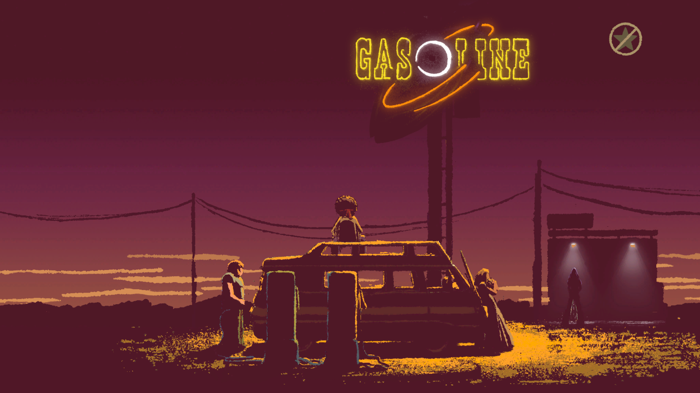
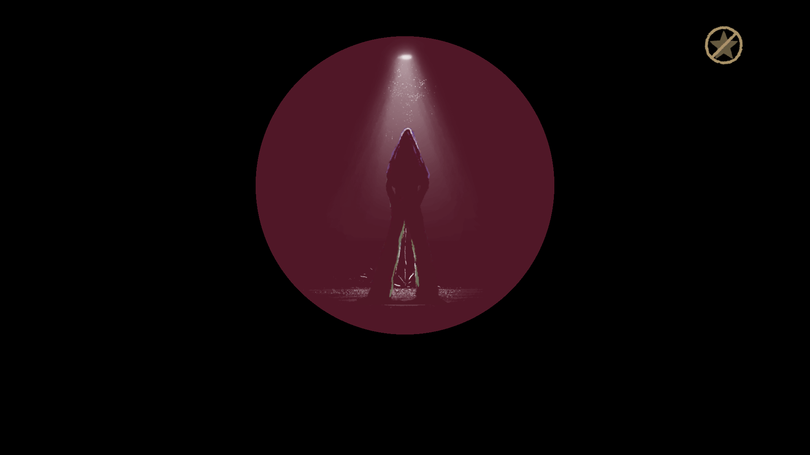

Jocurile cu temă muzicală pe care le-am parcurs de-a lungul timpului sunt în cam aceeași stare în care-mi erau jocurile adventure într-o vreme -  enumerabil de puține. Înainte de **A Musical Story** au mai fost Audiosurf și Music Catch 2, acesta din urmă de pe vremea când n-aveam altceva mai bun de făcut și rupeam jocurile flash de pe kongregate.

A Musical Story e un rhythm game ușurel din punct de vedere al conceptului de gameplay, cu o direcție artistică de-a dreptul remarcabilă și o coloană sonoră parcă ruptă din perioada psihedelică a rock-ului anilor ‘60-’70, influențată în mare măsură de Jimi Hendrix. Mai mult de atât chiar și „protagonistul” aduce cu celebrul Hendrix din mai multe puncte de vedere.

Scopul narativ e la fel de simplu precum conceptul jocului: nou înființata trupă – n-am băgat de seamă să aibă nume – trebuie să ajungă la un festival pe măsura talentului lor, anume la Pinewood. Parcursul drumului și inerent al poveștii e marcat de provocări muzicale din ce în ce mai ridicate. Dacă gameplay-ul pleacă de la o idee simplă: folosești, după caz, o tastă direcțională pentru notele din cheia sol și o alta pentru cele din cheia fa, iar câteodată pentru acordurile armonice trebuie apăsate amândouă simultan sau ținute un interval mai lung de timp, lucrurile se complică vertiginos spre sfârșit când crește atât numărul de note cât și tempo-ul melodiilor și durata fiecărei melodii.



Dar asta nu e un capăt de țară – pentru jucătorii mult mai puțin melomani, ca să nu zic de-a dreptul afoni, se poate activa „asistarea” permanentă. Practic, dacă jucătorul nu are răbdarea necesară să repete la nesfârșit o secțiune din cauză că nu se poate acomoda suficient cu tempo-ul crescut și ploaia de note potrivnice, renunță la mândrie și participă mai degrabă mecanic la muzică și mai spectator la poveste. Adevărul e că, repetarea anumitor părți poate să devină frustrantă dacă dorința jucătorului e îndreptată spre poveste și muzică și nu atât spre gameplay.

Dacă tot am menționat asistarea: sunt trei moduri, unul presupus hardcore, pentru cei care nu vor să fie ajutați în alt fel decât de urechile proprii, cel mijlociu, cum recomandă dezvoltatorii jocului, anume ca după greșeli repetate să se activeze automat asistarea, și modul de care ziceam mai sus pentru leneși sau iubitori pasivi de muzică.

Ca să fiu cârcotaș până la capăt într-o *Recomandare* mă voi agăța și de o non-problemă: nu există o legătură permanentă între taste și gamele muzicale. Într-o secțiune pentru linia de bași se folosește o tastă direcțională și-n următoarea se poate să trebuiască cealaltă pentru o linie similară.

În orice caz, deși dificultatea se bazează mai degrabă pe o cârjă prin creșterea numărului de note și a tempo-ului, muzica și povestea se mențin la nivel înalt pe tot parcursul jocului. De jucat, dacă nu acum, măcar la o reducere. ■
