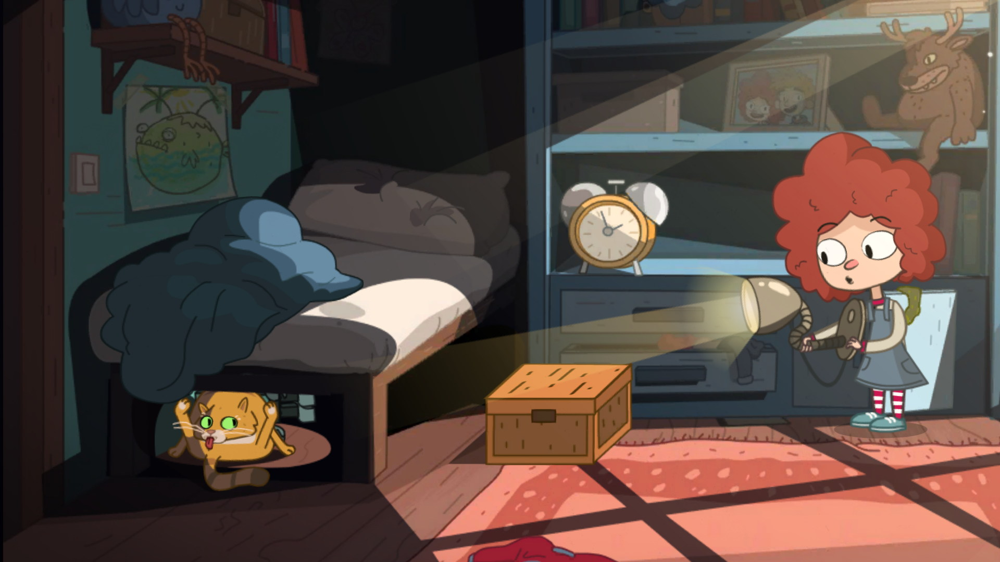
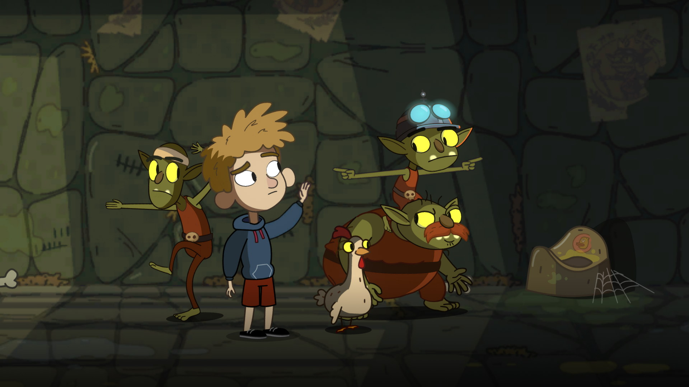

Când am văzut prima oară un trailer de la **Lost in Play** am avut o puternică senzație de _narrative adventure_ à la [Little Misfortune]()), punând astfel așteptările pe un anumit eșichier. Când fu să și apară pe la jumătatea lui august, nu ezitai să-l iau în ciuda așteptărilor. Nu-mi displace neapărat genul ăsta de jocuri, dar parcă îmi surâde mai tare ideea de a fi o parte sesizabil activă într-o lume chiar iluzorie.



Nu mică mi-a fost surpriza când am descoperit jucând, cum altfel, că Lost in Play este un adventure în sensul clasic al genului. Lucru care m-a mulțumit pe deplin. După prezentarea frumoasă din trailer în care părea să evoce ceva din Gravity Falls, un pic prin stilul abordat, mai mult prin dinamica stabilită între frate și soră, cu el mai rezervat și închis și ea mai expansivă și excentrică, faptul că avansul în joc e construit pe dezlegarea unor puzzle-uri a fost o surpriză nesperată. Mai departe mirarea s-a exacerbat când soluțiile s-au bazat de cele mai multe ori pe un anumit nivel de perspicacitate.

Dacă prezentarea te duce cu gândul la un joculeț de care se pot bucura cu toții, cuprinși într-un interval nelimitat de vârstă, soluțiile par să îngrădească respectivul interval. Voi recunoaște că m-am simțit nevoit să recurg la sistemul intern de indicii care funcționează pe anumite reguli impuse de alte jocuri relativ recente ale genului: soluția finală nu-ți e relevată decât după apelări multiple ale sistemului, soluția fiind devoalată după interpelări repetate. E un compromis bun având în vedere că în cele câteva instanțe, să tot fii fost patru la număr, n-aș fi putut să le găsesc rezolvarea fără un mic impuls extern. Aș putea spune că, și după finalizarea jocului, încă n-am înțeles exact raționamentul unui anumit puzzle apropiat de final. Celelalte în schimb au avut o logică, dar pe care n-am putut să o văd la respectivul moment și parcă n-am dispus de răbdarea necesară să discern prin ghemul de minuni ticluite de dezvoltatori.

Nu e totuși un joc point'n'click adventure pur fiind presărat din loc în loc pe parcursul celor 15 episoade de câte un mini-joc ce nu se baza pe ideea clasică de puzzle. Se poate că e una din cutumele jocurilor adventure moderne de a încerca o diversificare proprie a gameplay-ului. Astfel pentru a avansa povestea trebuie să câștigi în unele momente câte un joc specific, unele chiar bune. Ca să iau un exemplu unul din respectivele jocuri, cu cărți, mi-a plăcut suficient de tare încât mă tentează ideea de a-l adăuga în rândul jocurilor de societate când vinul se va dovedi insuficient și discuțiile se vor lăsa pe tânjeale. Nu știu dacă are un echivalent cu nume în realitate deja, dar ideea e simplă și are nevoie de un pic de strategie pentru a fi jucat cum trebuie.



Altundeva, într-un alt moment critic, într-un alt joculeț care pare o antiteză la ce am spus mai sus, am căpătat impresia nețărmurită că a fost pur și simplu noroc că am reușit să-l duc la capăt și astfel am putut să duc povestea mai aproape de final. N-a fost neapărat legat de dificultate cât de confuzie, iar faptul că n-am ajuns niciodată la unul din punctele de reset a ținut de un noroc prostesc.

Să fac vreo mențiune cu privire la partea vizuală e de prisos. Din câte am înțeles, fiecare părticică a fost însăilată cu grijă, lucru care se vede și din cadrele surprinse, iar influențele moderne sunt de-a dreptul străvezii. Mare bine e că au păstrat o proporționalitate concretă și n-au picat în păcatul desenelor de acum de a intercala dimensiuni relative imposibile între personaje și decor prin mutarea cadrelor o dată cu schimbarea perspectivei.

Coloana sonoră, atunci când se afișează cu mai multă emfază e plăcută, surprinzând momentele cheie. Voice-acting-ul e doar o îngânare de cuvinte, ceea ce dă o latură de universalitate jocului. Nefiind într-o limbă care se poate discerne am putea spune că poate aparține tuturor. Poate și de acolo sporește ideea că poate fi jucat de oricine.

Cred că singurul inconvenient major din Lost în Play, pe lângă acel unic puzzle care mi s-a părut ilogic, e timpul de joc care pare a fi un pic prea apropiat de termenul „deosebit de scurt”. Poate că n-ar fi fost așa dacă mi-aș fi concentrat eforturile pe rezolvarea individuală a adversităților și m-aș fi aplecat pe lâncezirea excesivă asupra lor, fără a apela la sistemul de hint-uri, dar cel mai probabil aș fi mutat calificativul în „scurt”.

Așadar, Lost în Play e un joculeț excelent, presărat cu umor și la fel de frumușel precum e descrierea dezvoltatorilor. Se prea poate să pară că oferă puțin escapism la prețul de pornire, dar merită cu prisosință. ■