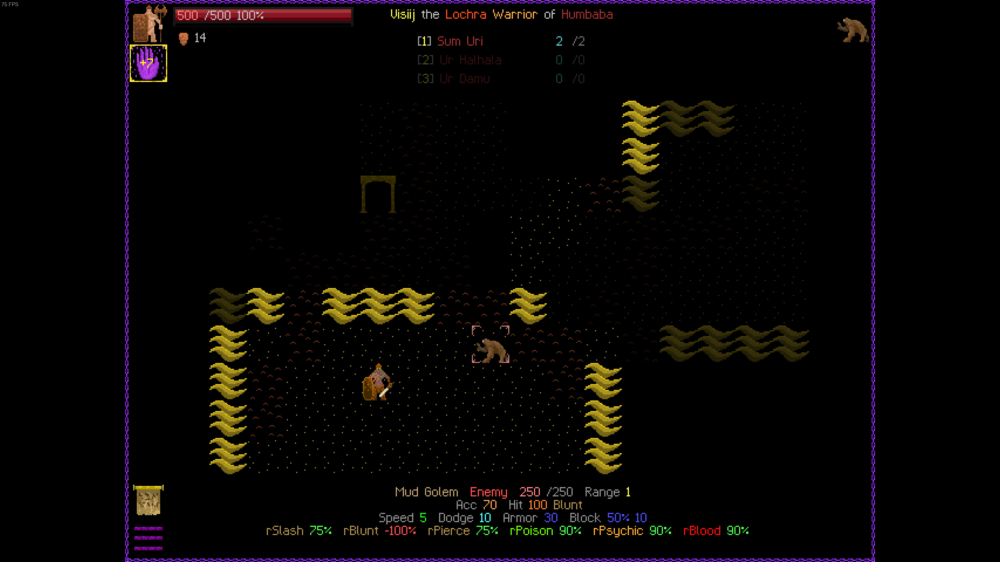

Genul roguelike e unul foarte interesant. Pe de o parte, nu poți să mergi mai retro de atât: grafică de la ASCII în sus, movement cu numpads, spreadsheet gameplay și soundtrack dungeon synth de ascultat la cafea noaptea. Pe de altă, popularitatea crescândă a (sub)genului din ultimii ani se datorează și inflației de jocuri masive, pline de conținut de umplutură și cu suflet „căldicel”; și poate și lipsei generalizate de timp închegat a gamerilor trecuți de 30. Dincolo de părerisme, simt că e ceva cu adevărat eliberator în jocurile construite în jurul ideii de permadeath — jocuri în care toată varietatea, mecanicile și conținutul se descoperă samsaric prin experimentare, joc și auto-narațiune.

Așa cum îi spune și numele, genul roguelike origineza în clasicul Rogue (1980), un dungeon-crawler ASCII cu generarea procedurală. Din acest [concept](https://en.wikipedia.org/wiki/Rogue_(video_game)), un întreg arbore de subgenuri a luat naștere; motiv pentru care asistăm de mai mulți ani la o renaștere în adevăratul sens. Titluri de mare succes precum The Binding of Isaac, Spelunky sau Hades, spre exemplu, amestecă elemente din genuri înrudite (RPG, deck-building, adventure, survival), sacrificând în schimb complexitatea mecanicilor și a simulării.

Revenind la teritoriul gamerilor ce nu țin la dioptrii, zona ASCII-iconițe ne oferă azi titluri de o complexitate absurdă, de la Caves of Qud, Unreal World și până la Dwarf Fortress, lumi aproape integral simulate. Fiind aproape exclusiv bazate pe text, roguelike-urile clasice oferă posibilități inedite celor cu imaginație bogată. Deși n-am reușit încă, sunt convins că în Dwarf Fortress poți invoca o legiune de demoni ascunzând un artefact blestemat în toaleta unei prințese cu schizofrenie. 

Iconoclasmul roguelike-urilor e greu de dus pentru idolatria simțurilor noastre dornice de imersiune, da. Dar nu cred că dificultatea e dată de grafică în sine. Pragul de enjoyment rămâne foarte sus (sau jos) și fiindcă complexitatea mecanicilor, questing-ul și reactivitatea lumii sunt greu de experimentat fără efort considerabil și fără a îți seta singuri scopuri.

Din aceste motive, roguelike-uri recente precum Vampire Survivors sau Loop Hero au popularizat variante cu gameplay simplificat, automatizând mai mult sau mai puțin mecanici. Questurile, simularea și reactivitatea lumii dispar, jocurile păstrând estetica, ethosul și varietatea imensă dată de combinatorici de echipamente/inamici/drop-uri/abilități. Cu toate acestea, nici unul nu a reușit să mă rețină mai mult de câteva ore: dacă un roguelike clasic rămâne foarte greu abordabil din cauza complexității și lipsei de repere imersive, gameplayul de tip deck-build sau auto-battle rămâne prea superficial (chiar compulsiv) datorită lipsei de agenție.

Din fericire, un titlu recent mi-a atras atenția mai mult decât altele: Path of Achra este un roguelike undeva între Caves of Qud (grafică, muzică, imersiune) și Vampire Survivors (auto-battle, skills, build-uri). 

Comparat cu Caves of Qud, Paths of Achra nu are questuri sau travelling, ci constă într-o serie de navigări prin encounter-chambers (asemenea roguelike-urilor vechi, sau Binding of Isaac). Deși nu există o poveste principală, jocul este încărcat de flavour text, item descriptions și varietăți de inamici astfel încât fiecare run se simte ca și cum ar avea un „vibe”.



Cea mai bună descriere pentru Paths of Achra este „build-sim” - combat-ul este extrem de reactiv, iar la doar câteva nivele adâncime, zeci de buff-uri, proc-uri și debuff-uri vă vor umple combat log-ul. Cu toate acestea, combat-ul rămâne surprinzător de ușor de urmărit, sunetele și grafica lowpixel reușind cu brio să construiască o atmosferă.

Itemele, abilitățile și cultura/zeitatea aleasă toate influențează build-ul, dezvoltând sute de sinergii posibile dar care se și simt, în mod curios, și nu doar se expun drept culori diferite de damage. Jocul este plasat într-un context vag și apocaliptic (Era Potopului) în care progresul făcut cu un caracter deblochează noi culturi/clase/religii. Flavour text-ul este și el foarte fain scris, level-description-urile sugerând diferite legende, creaturi, ordine mistice, erezii și istorii fragmentare (multe de sorginte persană) ce hrănesc imaginația jucătorului.

Deși este abia ieșit în Early access, Paths of Achra abundă de conținut. Există și un demo pe Steam. Îl recomand ca un soi de Caves of Qud-light, sau un Vampire Survivors enhanced. Pentru mine se dovedește un „intermediar” fericit și care m-a făcut să mă simt ca în anii 90, jucându-mă pe SEGA Terminator. ■