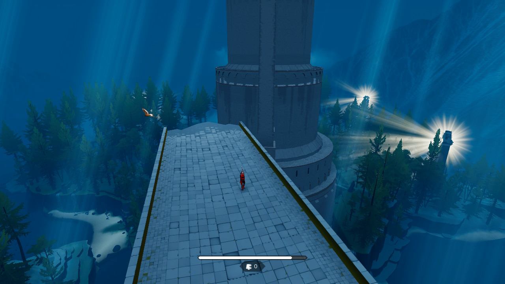
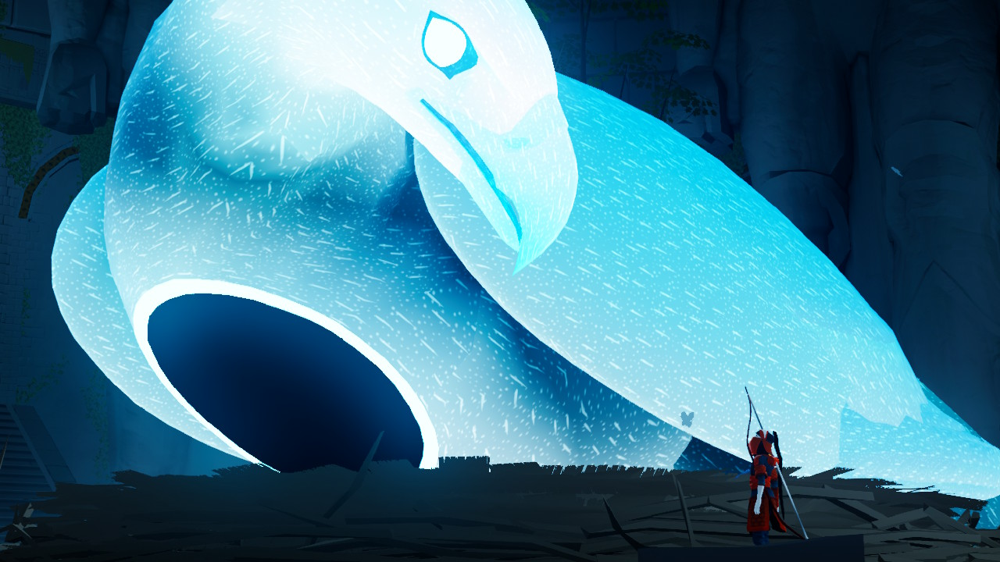

De **The Pathless**, deși lansat de câțiva ani, nu am auzit până nu am dat de el din întâmplare pe raftul unui magazin. Mi-a atras atenția arcașul de pe copertă, acompaniat de un vultur menit, am presupus eu, să-l ajute într-un fel sau altul în misiunile sale.

Proaspăt ieșit din Assassin's Creed (Origins, dar și cele mai noi, au aceleași arcuri și același vultur), nu a fost prea greu să încerc să-mi imaginez despre ce ar putea fi jocul. Îmi sugera că voi intra în rolul unui vânător sau ceva similar, furișându-mă prin păduri și căutând pradă cu ajutorul vulturului.

Nu știam nimic despre joc, dar de ce nu? Hai să-l încerc. Într-un final, am avut oare parte de gameplay-ul pe care mi l-am imaginat? Răspunsul e „nu, dar e ok”.



### Lumea și plimbatul prin ea

În The Pathless intri în rolul nu al unui vânător cum credeam, ci al unei vânătorițe, în drum spre o insulă unde o entitate numită „The Godslayer” a corupt sau eliminat atât populația cât și zeii la care obișnuiau să se roage respectivii. Misiunea ta, afli curând, este aceea de a readuce la viață zeitățile de pe insulă și de a-l elimina pe Godslayer.

Întreg procesul este împărțit în mai multe acte sau mai bine zis platouri aflate la înălțimi din ce în ce mai mari, fiecare cu propria atmosferă, geografie și arhitectură. Fiecare platou are de asemenea propriul zeu ce trebuie eliberat de corupția lui Godslayer. 

În cazul primelor trei platouri jocul este „open world”, în sensul că, dacă găsești calea, poți să te plimbi și să ajuți zeii în ce ordine vrei. În practică libertatea nu te ajută neapărat cu ceva - este mai comod să le joci în ordinea în care te ghidează jocul, iar la final tot acolo ajungi, nu o să ratezi nimic și nu aș putea zice că vreun zeu oferă un bonus atât de important încât să vrei să schimbi ordinea lor.

Deci, open world, dar nu-i nici de rău, nici de bine. Jocul nu are o hartă sau vreun indicator pentru obiective. În schimb, ai un detector de corupție care funcționează ca un sonar. Te așezi într-un loc înalt, dai drumul la sonar, și vezi care zonă arată roșu în loc de albastru. Apoi mergi acolo și rezolvi problema. Simplu.

Plimbatul în lume se face în trei moduri: mers, sprint, și zbor. Mersul e de la sine înțeles, iar sprintul consumă stamina, dar aceasta nu se reface de la sine. Niște ținte numite talismane împânzesc lumea jocului, iar de fiecare dată când nimerești unul cu o săgeată, primești stamina. Dacă te afli într-un sprint, primești și un boost de viteză (respectiv de înălțime, dacă ești în aer), iar mai târziu vei găsi inclusiv talismane cu efecte mai importante asupra deplasării prin lume.

Arcul este atunci o parte importantă a movement-ului, alergatul și nimeritul țintelor în același timp fiind cea mai eficientă metodă de a parcurge distanțe mari... pe orizontală.

Pe verticală intervine zborul - vulturul te acompaniază peste tot în aventură, și este suficient de puternic încât să zboare cu tine agățat. Pe măsură ce avansezi în joc o să poți să zbori din ce în ce mai sus, și ai mereu și opțiunea de a „pluti” de pe ceva înalt până la destinație. E practic un glider căruia îi poți da câte un „boost” când vrei să te ridici mai sus sau când vrei să începi să zbori.

Vulturul te va ajuta de asemenea la lupte și la puzzle-uri (nu ești singurul lucru pe care-l poate căra, desigur), și dacă tot am ajuns aici...

### Ce faci pe lângă plimbare?

Pe scurt: puzzle-uri, descoperi povestea jocului, și te bați cu bossi. Luptele sunt *doar* cu bossi, nu există inamici pe hartă, arcul este folosit strict la mișcare, puzzle-uri, sau activități puzzle-like. Puzzle-urile nu sunt deloc dificile cât timp ești dispus să te uiți cu atenție la ce te înconjoară, iar de la un punct toate incep sa semene intre ele, fiind doar variații asupra unor idei de bază. Nu sunt însă consumatoare de timp, deci nu e șansă mare să cauzeze plictiseală.

Explorarea este foarte plăcută, chiar dacă recompensa constă „doar” în fragmente de lore sau unica resursă a jocului, cristalele, care te ajută să zbori din ce în ce mai sus (i.e. să explorezi și mai bine).  Fragmentele de lore le afli inspectând tabletele inscripționate din lume, sau „auzind” ultimele gânduri ale victimelor lui Godslayer. Unele pot fi de-a dreptul deprimante, actually. Sunt câteva pe care mi-aș dori să le dez-citesc.

Luptele cu bossii - zeii corupți sub formă de animale gigantice, sunt mereu spectaculoase și un adevărat punct forte al jocului. Deși „puzzle-like”, sunt rapide și dinamice, foarte similare cu ceva ce ai găsi într-un joc action. Toate urmează cam aceeași rețetă - activezi niște turnuri pentru a triangula poziția bossului, apoi urmează o secvență în care îl urmărești în timp ce încearcă să fugă de tine, iar după ce reușești să-i impedici fuga cu niște săgeți bine plasate, ești transportat într-o arenă specială unde are loc lupta finală. După eliberarea zeului de corupția lui Godslayer, întreg platoul peste care domnea in trecut va fi „purificat”, cu alte cuvinte natura din el se va întoarce la normal. În punctul respectiv poți să continui explorarea și să te ocupi de obiective secundare, sau să avansezi la următorul platou.



### Concluzie

Există o doză serioasă de repetitivitate în The Pathless. Foarte curând îți dai seama că execuți aceleași mișcări, doar că în environment-uri diferite. Însă cea mai bună calitate a jocului constă în faptul că este scurt. Simți repetitivitatea, dar nu apucă să îți strice experiența de joc. Dacă vrei să îndeplinești toate obiectivele, jocul o să-ți ia cam șaisprezece ore, poate chiar mai puțin. Dacă te concentrezi pe obiectivele principale, șase ore ar fi estimarea mea.

Nu pot să nu recomand în cazul ăsta The Pathless. Conține o poveste interesantă și emoționantă într-o lume mare și atent construită, cu un stil vizual aparte. Gameplay-ul la care speram nu e tocmai acolo, dar e ok, povestea și lumea i-au ținut locul pe durata scurtei incursiuni. E un puzzle game cu elemente de action. Repetitiv până în măduva oaselor dar durata scurtă îl salvează. Dacă aveți șansă să-l jucați, go for it.

P.S. Poți să mângâi pasărea. Uneori ești obligat, alteori o faci pentru că vrei. Este și un mod de a-ți reface stamina dacă nu ai talismane în jur :) ■

