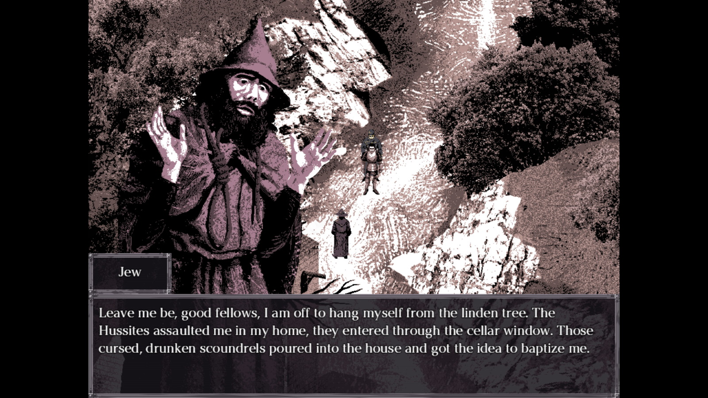

Am mai scris recent despre tendința scenei indie din ultimii ani de a vira stilistic spre grafica "PSX", re-adoptând aspectul jocurilor de consolă din era 95-2000'ish și începutul 3D-ului. Sensul ăsta cred ca merită aprofundat. În trecut, datorită sunetului comprimat și a poligoanelor puține, posibilitățile tehnice produceau adesea (și mai degrabă neintenționat) o atmosfera bizară și nostalgică. Astăzi, dezvoltatorii indie (adică cei care se păstrează artiști _a priori_ biznisului) par să fi realizat că a retrograda voit jocuri spre acel 3D arhaic produce aproape pe loc un simulator de vise febrile.

Cred că asta e direcția în care jocuri precum [Paratopic](https://store.steampowered.com/app/897030/Paratopic/), [Northern Journey](https://store.steampowered.com/app/1639790/Northern_Journey/), [No One Lives Under the Lighthouse](https://store.steampowered.com/app/1254370/No_one_lives_under_the_lighthouse_Directors_cut/) și mai recent [Dread Delusion](https://store.steampowered.com/app/1574240/Dread_Delusion/) toate s-au aservit zeilor nefirești ale retro-3D-ului, facilitând experiențe suprinzător de imersive și virile artistic. Fantezist, delirant, baroc și grotesc, 3D-ul astfel re-primitivat se dovedește a fi un izvor de atmosfere fantasmagorice, emanate din poligoane împuținate voit, contururi tremurătoare și soundscape-uri bântuite de ecouri și midi-uri.



Cu o grafică superb pixelată și animat cinematic cu un astfel de (pseudo-)3D bântuit, [Felvidek](https://store.steampowered.com/app/2299900/Felvidek/) este un indie adventure slovac, structurat pe mecanici JRPG din era PS1 în care jucătorul ia rolul unui cavaler alcoolic întovărășit de un preot acid, luptând împotriva unui cult diabolic ce agită un colț de secol XV al în sine frankenstianianului Imperiu Austro-Ungar.

Grafica și sunetul construiesc o experiență aproape psihedelică (are ceva și din [Hylics](https://store.steampowered.com/app/397740/Hylics/)), dar care rămâne necontenit tangibilă și cumva verosimilă. Combinând realități istorice cu alura orientalismelor și tropuri de avangardă, Felvidek este o experiență pe alocuri suprarealistă, alte dăți pedagogică, aruncându-ne în pielea unui Ev mediu de centru-Europă, în miezul ingenuozității, a turbulenței și a cruzimilor sale. Plimbat între varii locuri pe hartă, jucătorul va cotrobăi abscons ca un Odiseu mahmur în investigațiile sale, la granița dintre vis febril și extaz superstițios. Dialogurile și personajele sunt vii si candide, amestecând referințe reale și/sau oculte cu bășcalie spontană și ironii fine.



Combatul (destul de frecvent) este Turn-based, în stil JRPG, și surprinzător de fun datorită abilităților și a animațiilor foarte faine. Fiind un joc de doar 4-5 ore, nu are sens să dezvolt mai mult. Ca o carte bună, Felvidek reușește să transmită mult mai mult decât suma părților sale. Jucați-l, merită din plin. ■
