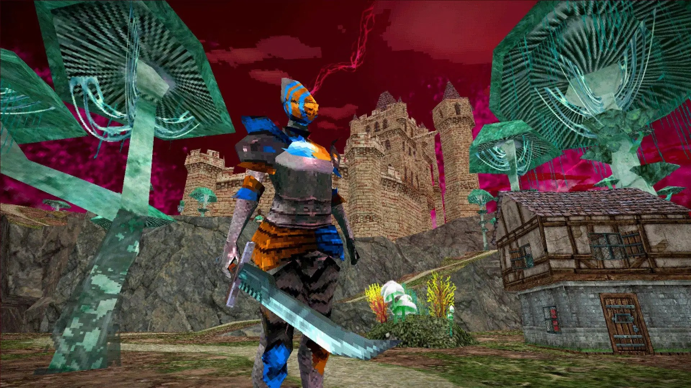
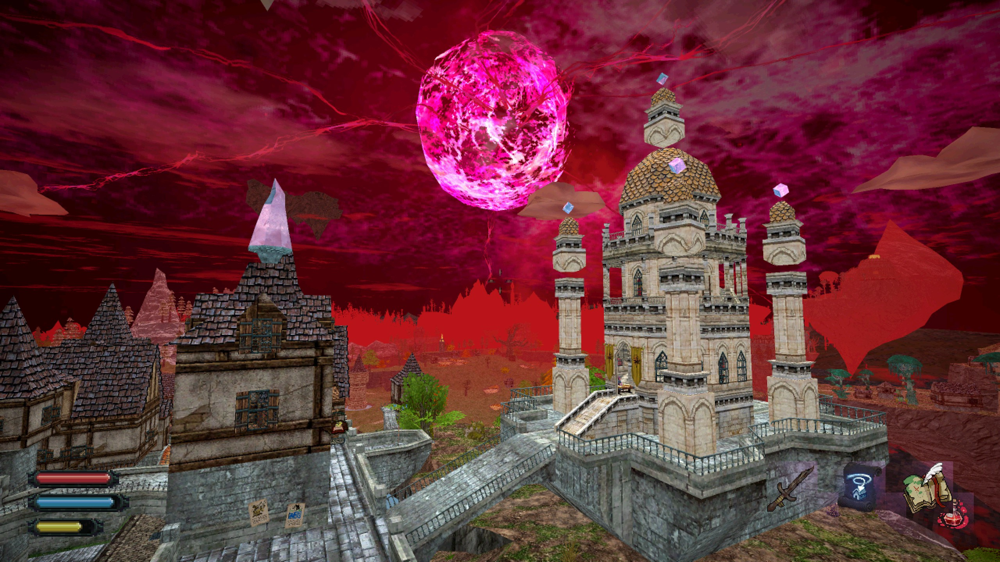
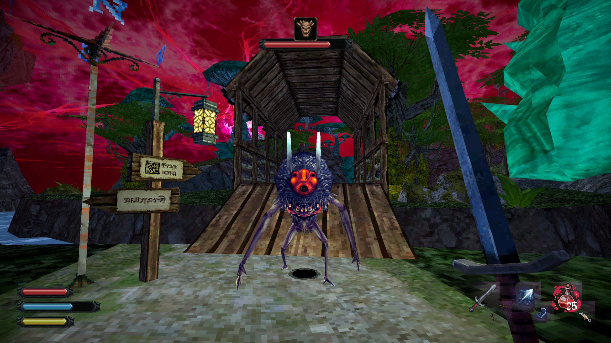
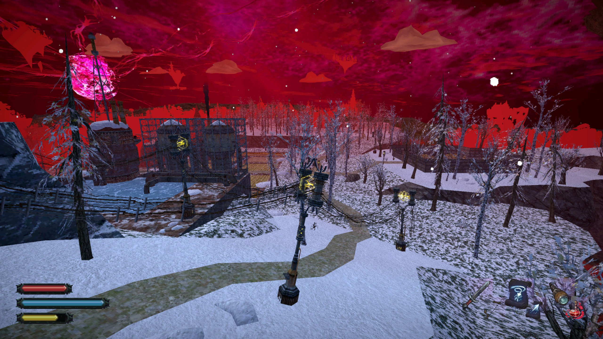

La auzul sintagmei „open-world action-RPG” în 2024 mulți riscă să facă bube -- și pe bună dreptate. În ultimele două decenii, piața s-a înecat sub aplicarea formulei de „open-world” sau „rpg” asupra mai oricărui gen. Dincolo de ambiția de a livra „o lume întreagă” și libertate de acțiune jucătorului, la baza acestei obsesii stă și un efort ingenuu, rareori izbutit, între simulare și imersiune. Originea acestui zel se poate trasa, cred, cu ușurință în anii '90, când complexitatea din ce în ce mai mare a tehnologiei și zorii 3D-ului întrezăreau posibilitatea unor lumi simulate în detaliu și-n care roleplaying-ul putea fi dezlănțuit complet. Așa s-au născut seriile Ultima, Might and Magic și Elder Scrolls - ca niște vise febrile ale unor ingineri visători crescuți într-o lume post-DnD.

### You see that mountain? [X]

Realizând că simularea de dragul simulării nu satisface nimic în afară de însăși putința de a simula (mă uit la Starfield acum), utopia „RPG”-ului suprem a fost treptat redusă la începutul anilor 2000, când promisiunea unui echilibru ludic între simulare și narațiune a început să ia formă. Gothic 1, Elder Scrolls III: Morrowind împreună cu GTA 3, urmate la ceva ani de Stalker: Shadow of Chernobyl -- toate au fost jocuri extrem de potente tehnic la vremea lor, capabile să dogmatizeze, fiecare în direcții diferite, ecuația altfel contradictorie dintre „open-world” și roleplaying.

În continuarea lui Morrowind, al cărei hărți nu era atât vastă, cât plauzibil croită, Oblivion și Skyrim laolaltă cu nou reformatul gen „action-RPG”, hrănite și de noile progrese hardware și răspândirea consolelor de generația a șaptea, au re-introdus inflația de conținut în defavoarea imersiunii și a role-playului. Până și [Witcher 3](https://www.digitalspy.com/videogames/a459757/witcher-3-inspired-by-skyrim-fallout-new-vegas-assassins-creed/) s-a dat după val, la vremea aceea, iar prin alte simbioze promiscue, numeroase sub-genuri au devenit, în fapt, același tip de jocuri „theme-park”, în care jucătorul este plimbat pe șine nevăzute, transformând și așa frankenștainiana etichetă „open-world action-RPG” într-un termen generic, supralicitat și obositor. 

O lume de joc prea mare e una ce nu poată fi „umplută” cu adâncimi mecanice sau interactivități suficiente. Când iluzia se sparge, rezultatul rămâne adesea o sumă de checklist-uri, o muncă doar mai puțin nevrotică decât cea de birou. Dar azi, vreme ce dezvoltatorii AAA abia ce se trezesc din beția orgoliului tehnologic, scena indie, eliberată parțial de ținte consumeriste și limitată în mod fertil de buget și posibilități (asemenea dezvoltatorilor din anii '90) începe să se uite cu ochi noi și vechi la formula „open-world-rpg”. Cu prea puține precedente în scena 3D open-RPGs, Dread Delusion este unul dintre primele emulații proaspăt ieșite din cuptorul post-covidist ce încearcă să umple golul lăsat de Bethesda.

### Re-legare

Lansat ca 1.0 pe 14 mai 2024, jocul se prezintă drept un „Elder-Scrolls-like„. Cu dorința *ex-pre* de a emula stranietatea și libertatea fără ținut-de-mâna a lui Morrowind, Dread Delusion este un adventure-RPG în care combatul și complexitatea mecanică ocupă un loc secundar, art-style-ul și povestea fiind principale. 

Am s-o zic din start: Dread Delusion reușește numai parțial să imite Morrowind, și poate spre binele său. Clar fiind un tribut adus seriei, a le compara mecanic sau rpg-istic nu cred că e corect. Există totuși și asemănări voite: pe lângă abundența de arbori-ciuperci și NPC-uri țicnite, ești aruncat în lumea lui Dread Delusion ca un prizonier al Inchiziției, într-un univers fracturat, post-apocaliptic, în care umanitatea se străduie să supraviețuiască pe un stol de insule împrăștiate în Eter. 

Lumea din Dread Delusion este marele său merit, și nu vreau să o descriu fără să mai las loc primei impresii. Dar cât să fac o paralelă, gândiți-va la o Europă retrogradată de la post-industrial cu accente SF la păgânism medieval, în care zeii sunt niște făpturi lovecraftiene hrănite de culte clandestine. Religia este interzisă prin lege de către un regim Iluminist ne-înțărcat și devenit în mod ironic Inchiziție și partid unic. Mai mult, tehnologia și magia ambele merg înrâurit, relevând și alterând în proces textura supranaturală a realității. Adăugați LSD.

Zeii în Dread Delusion reprezintă Forțe înscrise Naturii ce oferă rod și protecție oamenilor în schimbul unor costuri. Aceste costuri adesea invocă rituri și sacrificii dubioase, zeii fiind duplicitari în raport cu înțelegerea umană, cerând parcă sclavie (alții zic armonie) totală. Asta a făcut ca unele regate, sătule de prea multă feudă metafizică, să se unească împotriva Zeilor, declanșând un al doilea cataclism: „The God War”.



„Uniunea Apostatică” este facțiunea în care jucătorul se trezește înrolat cu forța drept spion, și trimis în lume în căutarea unor rebeli ce par să fi pus mâna pe niște artefacte periculoase. Ca în Morrowind, împingerea protagonistului ca agent dublu într-o lume stranie și străină funcționează perfect ca pretext pentru explorare și roleplay. Jucătorul poate mai departe suține sau trăda Inchiziția, ajutând sau turnând în stil *chekist* (nu *checklist*) adepții Zeilor, vânați de brigăzile Uniunii prin toate colțurile sângerii ale Cosmosului pe cale de stingere.

Tot ce am zis e doar premiza de la care jocul pleacă. Veți fi aruncați în această lume suprearealistă pentru a explora, preschimba și chiar decide evenimente -- și bineînțeles, pentru a vă bucura de atmosferă.

### Small-Open-world

Așa cum debitam în intro, dezvoltatorii încep să reviziteze idealul open-world RPG. Tendința pare să fie azi ori prin simulare procedurală („religia Daggerfall”, cu origini în dungeon crawlers și CYOA), ori prin așa zisul „immersive sim” (cultul Deus Ex, cu rădăcini adventure-RPG). Cu orientări în cea de-a doua tabără, Dread Delusion ne oferă o "lume mare mică" -- deschisă în măsura în care oferă jucătorilor un relief „hand-crafted”, variat și înțesat cu questuri, mistere și căi alternative.

Avem un quest log -- dar în general ajută să ai o memorie bună sau un carnețel. Jocul nu prea te ține de mână, dar din fericire nici nu te inundă cu prea mult conținut. Fiecare sat sau orășel are poveștile și intrigile sale, iar quest-urile secundare fac inteligent trecerea către arcul principal.

Ca gameplay, jocul este un adventure în care mecanicile RPG reprezintă sistemul de progresie și osatura combatului. Există patru Atribute principale -- și fiecare va decide dacă rezolvi quest-urile cu vorbit, magie, furtișag sau dat cu barda. Atributele se măresc prin așa zise Deziluzii (Delusions) care reprezintă puncte de XP obținute nu prin combat sau omorât, cât quest-uri și explorat. În stil clasic PS1, numeroase resurse și puncte se *găsesc*, și nu pot fi farmate. Multe dintre ele se află după uși încuiate și secrete ce pot fi descoperite doar prin anumite skill-uri. Dacă adaugi aici că anumite artefacte oferă bonusuri nesimțite, toate căile de avansare devin treptat posibile atâta timp cât explorezi în mod constant. Cel mai fain aspect al gameplay-ului este că prin toate formele sale -- dialog, quest-uri, map și encounter design -- jocul te încurajează să explorezi, să afli, să descoperi, iar recompensele -- informații, upgrade-uri, artefacte -- sunt foarte satisfăcătoare. Numeroase alternative și quest-uri secundare se pot doar descoperi cotrobăind, și pot avea consecință asupra quest-ului principal, dar nimic atât de drastic ca în cRPG-urile vechi unde puteai să rămâi blocat. Jocul incită constant, iar muzica, ciclul zi-noapte și art-style-ul împreună temporizează și oferă fiecărui drum străbătut de jucător un „sentiment” aparte. 

Lumea e populată de tot felul de creaturi stranii, unele ostile, altele neutre, foarte similar cu Elden Ring, ca niște rămășițe ale unor lumi paralele sau „dinainte”. Combat-ul este foarte simplu: poți să dai tare -- sau și mai tare cu sabia, să parezi sau să fugi. Există puține arme, dar datorită unui sistem de crafting simpluț și bine conectat la explorare, îți poți upgrada armele către alternative inventive. Spre exemplu, o sabie ce poate deveni pușcă sau obținerea unor vrăji foarte puternice. Resursele principale: Health, Stamina, Mana - sunt întreținute prin vrăji, poțiuni sau save-points și artefacte. Datorită rarității unor materiale, jocul dă sentimentul unui survival-lite, fără a pune această presiune mecanic pe jucător.

Penalitatea pentru moarte e aproape nulă: mori și te respawnezi la ultimul ~~bonfire~~ crystal save point. Chiar și așa, mi se pare că jocul oferă un echilibru plăcut între efortul de a străbate distanțe, combat și dibuit secrete. Harta e un relief viu, cu diferite puncte de interes care mai de care stranii și dubioase, cum ar fi o corabie ce dă ture unui vârf de munte, un dragon scheletic sau ruinele a varii temple sau fabrici uranice. Toate atrag jucătorul încă din orizont, și oferă repere afective ce îl țin angajat și în fluxul explorării. 



Quest-urile la început te pun să traversezi harta, în timp deblocând opțiuni de fast travel sau scurtături în stil Metroidvania. Protagonistul poate pune mâna chiar și pe o corabie anti-gravitațională -- din fericire (zic eu), doar spre final, căci știți doar vorba aia: mersul pe jos face creierul frumos, iar Dread Delusion chiar dă de muncă.

Fiecare insulă orbitează în jurul unei stele-neutronice, iar jocul se obosește să îți explice cum fiecare regat are propriile sale probleme UV, gusturi culinare și culturi agricole pe cale de dispariție. Jocul are patru zone de explorat -- nu atât vaste, cât bogate prin varietatea vizuală și narativă. Prima zonă introduce jucătorul prin tutorial, oferindu-i un sătuc uitat ca izvor pentru intrigi. Celelalte trei insule sunt asemenea unor „biomuri” -- cu floră, orătănii și orânduiri politice diferite. Regatele și fiecare insulă pe care jucătorul ajunge conțin câte o parte majoră din quest-ul principal și mai multe quest-uri secundare. Am să evit complet să *spoilez* aceste zone, sunt mult prea frumoase și merită descoperite tabula-rasa. Așteptați-vă totuși la un amestec inedit de Morrowind, Warhammer Fantasy și literatură rusă distopică. 

Acestea fiind spuse, în toate cele 30 de ore petrecute terminând jocul, nu am simțit un moment că lumea din Dread Delusion este „compilată”: jocul trăiește și respiră prin sine însuși, iar grafica și sunetul reprezintă ritmul acestei respirații.

### Pixelism si reverie

Urmând trendul vizual de PSX/PS1 haunted graphics, Dread Delusion are numeroase opțiuni în meniu de a simula până și unduirea fantomatică a 3D-ului timpuriu (*de gustibus*: vă recomand să dezactivați opțiunea pentru ecrane mari). Grafica impresionează nu prin numărul de poligoane, cât prin amestecul minunat de uz cromatic, art și level design și tremurici suprarealist. Lumea fragmentată din Dread Delusion se străbate ca o expediție montană printr-un vis febril al lui Dali. Adăugați dramă post-industrială, necromanții filozofice și iluminism fundamentalist și aveți estetica Dread Delusion. 

Coloana sonoră variază în funcție de biom, gravând în memorie niște acorduri când tenebroase, când meditative, dacă nu chiar mistice. Simplă și visătoare, vă garantez că muzica din Dread Delusion vă va ramâne în cap dacă îi oferiți suficiente șanse. Sunetele creaturilor și din combat sunt destul de limitate în schimb, și e bine să nu aveți așteptări prea mari la capitolul „acțiune”. Până și animațiile de moarte ale unor personaje par intenționat lungi și teatrale, ca și cum combatul este mai degrabă o scenetă dintr-o piesă, și nu un fapt în sine. Sunetele ambientale în schimb sunt bine plasate, de la cel de pași ce oferă feedback fain în funcție de mediul străbătut, la sunete stranii de creaturi, natură sau mașinării. Ca și în cazul lui Lunacid, pedigree-ul de dungeon crawl/adventure se resimte: de la interfața cu tente 90-iste la iconițele detaliate ale artefactelor, Dread Delusion reușește să completeze indirect cu informații despre lumea și povestea sa și prin arta interfeței, cărți și descrieri de iteme a la Dark Souls. 

Puse laolaltă, grafica, sunetul și art-style-ul generează un ambient suficient de intrigant încât să te mențină atent și imersat în mod continuu. Deși screenshot-urile nu prea îi fac cinste, prezentarea din Dread Delusion se simte ca o parte integrantă din joc. Am să las aici un Dev Diary prezentat chiar de autorul jocului, ce cred că arată încă din perioada formării sale filozofia sa de design și încercarea de coerență artistică.



### Harta sau teritoriul imaginației

Nu aș vrea să se înțelegă că Dread Delusion e un joc perfect. Luat obiectiv, combatul e repetitiv, mecanicile sunt simple iar rejucabilitatea jocului e mediocră. Toate aceste verdicte ar rata, cred, ceea ce are mai frumos de oferit. Dread Delusion nu vrea să fie un action complex și nici un RPG care ofere zece căi de a-l parcuge. Dread Delusion înțelege cum să facă o lume fantastică credibilă, și cum să trateze *misterul* ca fiind deschiderea continuă a unei lumi.

În loc de încheiere, aș vrea să revin puțin asupra ideilor care mă obsedează și cu care am pornit acest review: *open world, simulare, rpg*. Expunând teritorii vaste -- narativ, estetic, tematic -- un joc, și mai cu seamă un RPG open world, sugerează mereu mai mult decât poate reprezenta complet sau fidel. Astfel, un open world se păstrează mereu *simbolic* în raport cu lumea pe care o sugerează.

Mai mult, datorită mediului, un joc video e o abstracție de la deja abstracționata realitate a simțurilor umane. Aici experiența de joc nu poate fi egală cu sine însăși -- este și motivul petru care nu cred în (sau mă tem de) idealul fotorealismului și al simulării totale în jocuri. Pentru mine, *jocul* video e o specie artistică aparte, proprie emulației; iar *a juca* înseamnă trăirea co-participativă și empatia dăruită prin imaginația stimulată. O operă de artă, un joc ce înțelege toate astea -- nu este niciodată doar ceea ce este, ci tot ceea ce trezește: întrebări, senzații, memorii și recunoștință.

Dacă vorba celebră ne spune despre percepție cum că „harta nu este teritoriul”, atunci un open-world reușit, cred eu, nu este niciodată doar teritoriul pe care ni-l expune virtual, cât în sine o hartă pentru imaginația jucătorului. Dread Delusion reușește să fie o astfel de *hartă*, o hartă a propriei sale lumi și poate și a lumilor de dincolo de ecran. Merită să o descoperiți, să jucați și să fiți. ■

>**Alternative**
>
>Jocuri: The Elder Scrolls III: Morrowind, Elden Ring, Dark Earth 
>Literatură: A Canticle for Leibowitz Novel de Walter M. Miller Jr., Cevengur de Andrei Platonov, nuvele Warhammer 40k 
>Film: N/A. Poate vise caniculare de dormit fără aer condiționat 