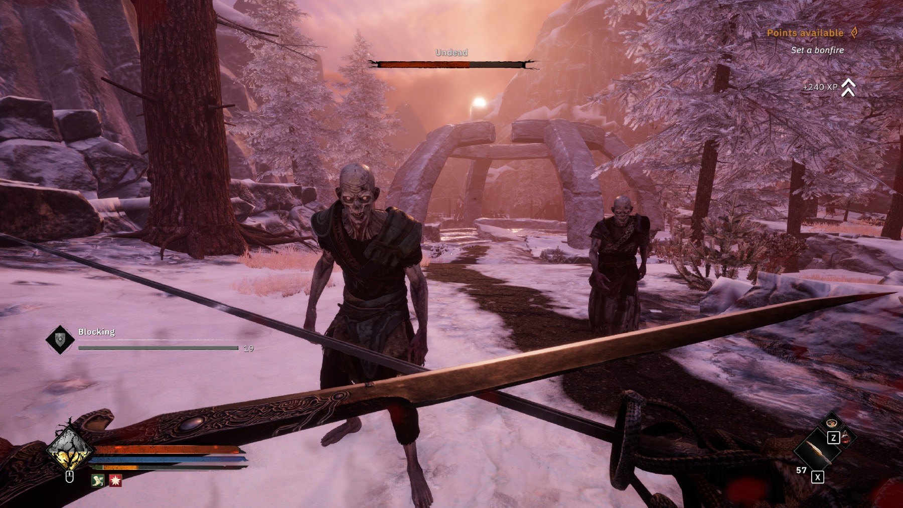

Luna aceasta, pe 11 noiembrie 2025, s-au făcut 14 ani de când Bethesda a lansat The Elder Scrolls V Skyrim, ultima iterație a unei serii foarte îndrăgite și născute cumva aproape de originile PC gaming-ului: simulare, explorare, roleplaying. Dar după 14 ani, câte jocuri mai aduc azi posibilitatea de a salva lumea ca un erou epic, în timp ce te lasă să furi furculițe și să insufli o pereche de papuci cu duhul unei demizeu?

Diablo, Baldur's Gate, System Shock, GTA, Far Cry 1, multe jocuri definitoare de gen au născut puzderii de noi iterații, în urma lor studiouri noi și vechi pășind din ce în ce mai frecvent pe granița dintre epigonie și imitație. Nu și pentru Elder Scrolls. E legitim deci ca mulți fani să se întrebe [unde sunt copiile de Morrowind, Oblivion sau Skyrim](https://www.youtube.com/watch?v=2RFfVPfuEDA)? Bune, rele, alo? Vă rog?



## Textura libertății

Elemente de open-world RPG pionierate de jocuri precum Rogue, Ultima, Might and Magic și Elder Scrolls s-au însămânțat în mai toate genurile, lăsând formula originală ca un soi de panteon uitat. Există totuși și o problemă de complexitate versus world-building. Uitându-ne la cărți, vedem cum, după decenii de evoluții literare, mulți autori încep să rescrie opere clasice fiindcă mulți nu mai citesc originalele. A fi suprascris, spart și reintegrat e un proces cât se poate de natural pentru orice operă și gen artistic; dar cu chipul homericului Todd Howard încă afișându-se peste tot, te-ai aștepta ca Bethesda să își fi dus epica mai departe.

Industria indie a început să miște peste acest gol, candidul [Dread Delusion]() scoțând ochii ca un melc vrăjit din butoiul _early-access_. Tot recent, Kingdom Come: Deliverance II ne-a delectat, oferindu-ne o epică istorică plină de aventuri și explorare bine tărmuită. Dar izbânda unui fantasy RPG de proporții simulacre a rămas departe. În umbra lui Witcher 3 (2015) și a lui Baldur's Gate 3 (2023), studiourile mari și-au consumat resursele spre a banaliza formula open-world, iar Bethesda a eșuat în a se autoimita lansând mediocrul Starfield.

Cred că nu multe studio-uri mai au bugetul, modul de lucru și cel mai important voința artistică de a crea un _first-person action-RPG open-world_. Și sub multitudinea de (sub)genuri, am uitat poate că fiecare din ele dezvoltă propriile sale exigențe. Menit a fi pășit cu ochii și nu doar traversat între obiective sau de la înălțimea unui dungeon-master, un _first-person open-world RPG_ îți cere să generezi topografii ce trezesc memorii fără precedent, să modelezi scene apăsate de istorii încă necunoscute, și care totodată să placă ochiului, indiferent de unghiul tembel în care jucătorul se hotărăște să-și parcheze calul. Cu alte cuvinte, e nevoie de o pasiune aproape demiurgică pentru a genera iluzia funcțională a unei lumi. O lume frumoasă nu este de ajuns; e nevoie să-i vezi și găurile, ca prin ele să-i descoperi ezitările și speranțele, legendele și viciile, rutina și nepăsarea.

O astfel de lume este cea din **Tainted Grail: The Fall of Avalon**, un joc ce, judecat după grile, ar trece drept mediocru sub ochii multora. Așa mi s-a părut și mie citind primele review-uri. Dar după prima sesiune de joc, am ieșit simțindu-mă ca și cum aș fi vizitat un muzeu, fiind ridicat la răspântia dintre lume și reprezentările pe care mi le-a născut asupra ei. Ce poți deci să îți dorești mai mult decât să pleci îmbogățit dintr-un joc ca dintr-o vacanță? Dragă cititorule, dacă țara pe care vrei s-o vizitezi astăzi este o insulă saxonă îmbrăcată de ceață, prinsă într-un șir de apocalipse lovercraftian-druidice cu accente de univers Alien, te rog, poftește mai departe. Bagajul emoțional este inclus.

## Detector Giger

Așa cum ziceam, primele gameplay videos cu Tainted Grail nu m-au impresionat prea tare. Niște lupte cu scheleți, niscai buzdugane, un decor arthurian, combat din deal de Windhelm... meh, mi-am zis, niște Elder Scrolls turnat sifon peste o tămâioasă de Dark Souls. Și la prima vedere cam asta e.

Poate ajutat și de venirea toamnei, câteva screenshoturi m-au convins că lumea lui Tainted Grail e ceva mai mult decât niște castele pline de scheleți. Jocul m-a atras abia prin imagini statice unde art-style-ul, înghețat de cadre, mi-au evocat imaginația. Imediat am recunoscut tributul adus de creatorii jocului lui H.R. Giger, creatorul identității vizuale a seriei Alien și a multor altor scene de film.

Văzând și ceva statui cu iz prometean, mi-am zis pe loc că e rost de niște aventuri antediluviene. M-am trezit începând Tainted Grail din eponimica închisoare bethesdiană, ca un prizonier _tabula rasa_, luat la întrebări generatoare de personaj de un gardian ursuz. Suntem bineînțeles eliberați de un salvator misterios, ce ne lasă să scăpăm singuri în chip de probă, simțindu-ne mai mult că sunt luați peste picior decât ca un mesia redescoperit.



Castelul din început servește ca un tutorial și imediat îți dai seama că lumea din Tainted Grail e bazată pe un material ce vine de dincolo de joc. Deși începi într-o temniță bicisnică ca în orice RPG respectabil, numeroase notițe, jurnale, obiecte și monstruozități îți emit contururile unui univers ce nu se rotește încă în jurul escapadei tale. Aflăm că suntem într-un regat cufundat în tenebre și istorii sângeroase, despre o boală misterioasă ce devorează ținuturile și despre mai multe ordine, facțiuni și interese divergente. Dar cel mai important, ajungem să luam contact cu reinterpretatul rege Arthur, reprezentat de joc ca un conducător labil, fragmentat de reîncarnările sale repetate menite a salva lumea de la pierzanie. Cu fiecare reîncarnare a sa, Avalon slăbește, jucătorul devenind gazda și astfel purtătorul unui destin simultan mântuitor și apocaliptic. Și nu, nu vorbesc de alegerile de anul trecut.

## Regatul proscris

Tainted Grail originează într-un boardgame lansat în anul 2019 cu ajutorul celebrului (în Polonia) autor de fantasy contemporan Krzysztof Piskorski. În 2020 studioul polonez Questline lansează primul joc în acest univers – **Tainted Grail: Conquest**, un turn-based strategy – înhămându-se apoi la un action-RPG construit în Unity ce promitea să amestece libertatea unui Skyrim cu world-building-ul unui Dark Souls ^[După spusele dezvoltatorilor: „Ne dorim neliniștea din Dark Souls în lumea vie a lui Skyrim.” (Questline Dev Blog #4, Iulie 2023)].

Acest joc este Tainted Grail: TFoA (2025), iar universul său reinterpretează legenda arthuriană într-un stil postmodern, evident influențat de seria celor de la From Software, Dark Souls deja fiind un amalgam de mituri europene și orientale coapte în niște căldări de coșmar și apocalipse oculte. Tainted Grail: TFoA abundă în referințe literare și culte până spre compilație, principala intrigă a jocului fiind așa numitul „Wyrdness”, ceața Stephen-King-ească de care umanitatea fuge, refugiindu-se pe insula Avalon sub conducerea regelui Arthur. Aici umanitatea își găsește un nou cămin, masacrând specia de umanoizi nativi și după toate aparențele avansați tehnologic numiți „Fore-dwellers”.

Ca instrument narativ, Wyrdness-ul îmbracă referințe religioase druidice/celtice cu ideea multi-dimensionalității unui _witcher_, ceața fiind sursa monștrilor și a mutațiilor ce ajung să corupă lumea. Influențați și de arta lui [Zdzisław Beksiński](https://www.artchive.com/artwork/untitled-zdzislaw-beksinski-1983-poland/), Questline s-au străduit să reprezinte Wyrdness-ul ca un soi de subconștient colectiv ce irupe înapoi spre lume, păcatele și viciile lumii și ale conducătorilor ei întorcându-se să o bântuie prin cacofonii psiho-organice.

Cu fiecare miez al nopții și prin crăpături provocate de suferință și abuz, Wyrdness-ul descinde asupra lumii din Tainted Grail, îmbrăcând lumea cu un luciu nefast și dând formă variilor nenorociri. Ciclul zi-noapte specific open-world-urilor devine astfel amplificat, trezind ceva foarte primitiv în jucător, deoarece Wyrdness-ul face ca inamicii și pericolele să sporească noaptea, laolaltă cu recompensele (un mecanism familiar deja din jocurile survival). Prin poveste și pacing jocul trezește rapid sentimentul că lumea sa stă pe buza entropiei, fiecare problemă și soluție sângeroasă agravând parcă și mai mult fracturile realității. Toate acestea fac ca lumea să se simtă fragilă și cumva mai umană, chaosul științifico-fantastic al Wyrdness-ului exprimând parcă debilitarea unei minți candva atotcuprinzătoare.

În această lume eminamente ruinată, comunități de supraviețuitori trăiesc păziți de puținele artefacte lăsate de Regele Arthur, moștenitorii unui regat fragmentat de conflicte și superstiție și asupra căruia însuși arhitectul său, miticul rege, începe să aibă îndoieli revăzându-l prin ochii jucătorului la secole distanță.



Nimic din ce am spus mai sus nu este spoiler, ci abia premiza de la care pornește povestea jocului, un adevărat carusel post-apocaliptic prin medii și influențe ingenios recroite. În cele ce urmează voi aborda pe scurt mecanicile de gameplay, urmând a mă concentra apoi asupra scopului acestui articol: level design și entuziasm estetic.

## Săbii și gloome

În stil clasic Elder Scrolls, skill-urile și atributele se influențează și cresc prin utilizare, laolaltă cu un sistem tradițional de XP ce poate fi obținut din quest-uri și inamici înfrânți. Se vede aici că polonezii de la Questline au avut timp să rafineze sistemul; progresia mi s-a părut suplă și bine drămuită. Rareori în jocuri cu mecanici bogate simt că ele încurajează gameplay-ul și nu doar că îl permit.

Revenind la temnița noastră bicisnică, combatul jocului este din start dur, trezind sentimentul unui Dark Souls pus în haina de first person: avem dodge, stealth și block, iar pe parcursul tutorialului jucătorul poate să facă uz de magii primitive și câteva arme bune de tăiat varză. Trecuți prin holuri ce ne aduc aminte de Azilul din Dark Souls 1, ne trezim parte a unei conspirații mesianice, jucătorul devenind purtătorul unei părți din sufletului regelui Arthur, pe care diferite facțiuni vor să-l readucă la viață din disperare sau devotament.

Jocul este împărțit în trei acte, fiecare reprezentând o zonă din Avalon, fiecare cu cetățenii, cultura și problemele ei specifice. În căutarea bucăților din sufletul lui Arthur (main story), jucătorul este atras în tot felul de aventuri mai mari sau mai mici. Surpriza cea mai mare se produce aici: dacă ce am scris până acum a pictat un tablou sumbru, ei bine tonul jocului și dialogurile adesea trezesc zâmbete, jocul pendulând între apăsări apocaliptice și comedii de situație și limbaj bine drămuite. NPC-urile sunt scrise cu ștaif, fiecare având poveștile sale interesante sau trăznite. De la alchimiști senili la comandanți de oșteni deprimați, la nobili scăpătați și aventurieri rupți parcă din balade medievale amestecate cu [DSM-5](https://en.wikipedia.org/wiki/Diagnostic_and_Statistical_Manual_of_Mental_Disorders), jocul te aruncă într-o lume înțesată cu povești macabre mereu ghidate de un licar de umanitate. Note, cărți, scrisori – toate sunt și ele aici, adăugând straturi via environmental storytelling. În contextul acestei lumi mânate de istorii neclare și legende propagate din pragmatism, dialogurile și consecințele alegerilor din questuri fac o treabă bună în a pune jucătorul în fața propriei conștiințe.

Loot system-ul este o altă surpriză plăcută, asediind încă de la început jucătorul cu seturi de armuri și arme. Pentru iubitorii de „Fashion Souls” jocul poate fi astfel un deliciu. Deoarece inventory management-ul și UI-ul sunt foarte bine puse la punct, nu am simțit niciodată că loot-ul e covârșitor, cât mai degrabă că am o garderoba magică în continuă expansiune.

Avem și crafting, alchimie, pescuit și gătit, dar toate sunt intuitiv integrate în joc, fără să ceară prea mult micro-management sau grind. Build crafting-ul este un alt element împrumutat din jocuri mai recente, jucătorul având posibilitatea de a-și da _respec_ printr-o poțiune ce poate fi fabricată ușor. Skill-tree-urile sunt bogate și oferă upgrade-uri semnificative, sistemul de magie și combat fiind asemănător cu Skyrim doar că mai stufos. Combatul este evident influențat de Dark Souls, dar niciodată nu taxează jucătorul prea mult cu one-hit-uri sau forțându-l să abuzeze de fente. Numeroasele skill-uri permit un combat fluid, putând fi ușor un warrior ce ține piept cu scutul, sau din contra, a la Diablo 2, privindu-ți armata de summons cum aleargă inamicii. Diversitatea e la ea acasă și mecanicile chiar încurajează exerimentarea și combinațiile fără să le facă să pară echivalente.

O critică ce poate fi adusă gameplay-ului este că își afișează influențele puțin prea vadit, resimțindu-se pe alocuri mai mult ca un tribut adus altor serii decât un joc de sine stătător. Cu toate acestea, prima impresie trece ușor, construcția narativă și level-designul acaparând atenția jucătorului în feluri ce reușesc să disipe senzația de imitație.



## Elogiu ruinei

Pentru cei care au mai citit articolele mele, știți că îmi face o plăcere aparte să fac meta-analize și să discut felul în care un joc poate și adeseori este un eveniment cultural. Ce aș vrea să fac acum este să evoc doar câteva impresii față de ceea ce este poate paradigma universului Tainted Grail: lumea ca ruină.

Atmosfera din Tainted Grail e un pastel aproape post-modern de influențe: ici-colo vezi influențe ba din Skyrim și mitologii nordice, ba din Witcher și bestiare slavone, împrumutând cel mai masiv din recent lansatul Elden Ring, și lăsându-ne ca spațiu de joc un teritoriu scufundat parcă undeva între basm, imaginație, coșmar și crudă realitate istorică. La fel ca în Elden Ring, găsim regi și regine prinse în bucle de coșmar, creaturi născute din vis și gelozie și nenumărați aventurieri pierduți ca niște suflete într-o arhivă necatalogată. Cu toate acestea, level-design-ul merge cu mult dincolo de suma părților sale. Explorând și urmărind questuri, jucătorul descoperă încet straturile poveștii ca un soi de arheolog ce descoase firele unei realități aflate la limitele rațiunii sale de a exista. Rezumată în stil clasic romantic, lumea din Tainted Grail este construită pe problema politică și filozofică a [dezvrăjirii](https://en.wikipedia.org/wiki/Disenchantment).

Primul act – Horns of the South – pare inițial un generic tărâm de coastă cu relief dramatic. Dar pentru că jucătorul tocmai a fost catapultat aici dintr-un intro cu elemente grotești-SF și învestit cu misiunea de a reasambla sufletul unui rege tiran și/sau mesianic, devine clar că peisajele golașe, turnurile singuratice și statuile fărâmate marchează unul dintre ultimele avanposturi ale unei lumi aflate în descompunere.



Cel mai impresionant este cât de mult Tainted Grail gâdilă retina: fiecare colț promite alte aventuri în zare, iar lumea ni se afișează estetic din orice unghi am privi-o. Engine-ul Unity este folosit de Questline pentru a crea texturi tăioase, aproape receptive unei atingeri imaginate, asta și datorită luminii din joc, ce adesea trece de la naturalism fotogenic la un spectralism parcă auditiv.

Povestea jocului și prezentarea vizuală și audio ne apasă prin castele năruite, falii de granit și bazalt scufundate în mare, catacombe înverzite și vestigii ale unui trecut incert, toate cu nostalgia unor transgresiuni încă sensibile. Așa cum F. N. Bohrer remarca în volumul său despre fotografie și arheologie ^[Bohrer, F. N. 2005, Photography and Archaeology: The Image as Object, pg. 180-191], orice imagine a unei ruine făcute de un artist influențează felul în care interacționăm și interpretăm vestigiile la fața locului; în cazul nostru, la fața jocului.



Actul doi ne aduce în regatul Cunacht, un tărâm de cavaleri și domnițe de mult căzuți în păgânism și foamete. Încă de la începutul zonei, suntem izbiți de cadre fotogenice ce frizează sublimul, oferind jucătorului markeri vizuali și emoționali pentru explorare. Maxima _„You see that mountain? You can climb it”_ este reînvigorată aici, iar influența picturii romantice și adularea ruinei ca religie a melancoliei și mod de idealizare a trecutului devine evidentă. Drept exemplu, putem compara doar următorul screenshot (am capturat special multe din acestea) cu una din creațiile marelui pictor german [Caspar David Fredrich](https://en.wikipedia.org/wiki/Caspar_David_Friedrich) (1774–1840).



Jocul expune numeroase astfel de scenografii imaginare, plasând prin ruine numeroase questuri, notițe și mici activități, neobosindu-se să îți explice fiecare loc sau să îi dea un nume. Astfel, printr-o combinație ciudată de AA game-dev standards și omisiuni intenționate, lumea jocului pare suficient de populată și suficient de goală încât jucătorul să se simtă adesea ca o fantomă ce o bântuie, sentiment amplificat și de amintirile regelui Arthur ivindu-se (în chip neintruziv) la focurile de tabără.



Al treilea și ultimul act, tărâmul înzăpezit din nord, găzduiește triburile de luptători ce candva i-au jurat loialitate lui Arthur. Iar ca decor pentru numeroasele probleme etice și sociale pe care le vom întâlni aici (nu vreau să spoilez questuri), avem o altă hartă înțesată de cadre sugestive, de vestigii și proporții aproape biblice — săbii gigantice aparținând parcă unor zei, fortărețe fără stăpâni, statui fără explicații și drumuri prăbușite de vreme:



Muzica jocului contribuie și ea la o atmosferă [Romantisch](https://en.wikipedia.org/wiki/Romanticism). Undeva între veghe și vis, acorduri neoclasice se amestecă dinamic cu sample-uri de muzică tribală nordică și dark-synth, generând rațiuni ambientale. Amestecul între stiluri și culturi – nordice, slave, germanice – este parcă un manifest pentru lumea infinit mai complexă și alambicată a istoriilor reale ce au servit ca inspirație. Prin valențele sale artistice, cred că Tainted Grail reușește vizual și auditiv să trezească ocazional sentimentul sublimului, acel sentiment ce ne permite să călătorim între lumi și să cugetăm la posibilele legături dintre amintire și vis, dintre trecut și viitor, istorie și fantezie, artă și realitate.

## Găuri și dume

Și acum să dezvrăjim dezvrăjirea. Combatul jocului rămâne bine înfipt pe întreg parcursul, indiferent dacă alegi să tragi cu arcul, să dai cu barda sau să arunci cu vrăji. Inamicii în schimb pot varia destul de mult în dificultate și uneori fără motiv. Muzica jocului, deși frumoasă și profund atmosferică, poate deveni repetitivă; și rămân evidente micile probleme specifice unui joc AA de o asemenea anvergură. Fără să vreau să fac o critică în stil UTC-ist aici, întâlnim: masterizare inegală a unor dialoguri (volume anapoda), sunete de combat _oomphy_ combinate cu fiare în gard, mici buguri de animații și lip sync, și o problemă de balance pe alocuri. Este clar și faptul că jocul a fost grăbit pe final, câteva fire narative fiind legate cu stoicism în threadurile de sfârșit. Chiar și așa, jocul are 12 finaluri posibile, inclusiv un final secret ce poate fi deblocat de cei din cale-afară de iscoditori și/sau într-un New Game+.

Din fericire, majoritatea problemelor mari (quest bugs, optimizare) cu care jocul a fost lansat au fost deja reparate la momentul acestui review. Actele 2 și 3 au fost deja suplimentate cu conținut și, în ciuda problemelor raportate pe forumuri, mie jocul mi s-a părut foarte bine rotunjit, luându-mi aproape 40 de ore pentru a-l termina fără să vânez fiecare quest.



## Ruinolatrie

Pentru cei mai critici, Tainted Grail poate arăta ca o ruină de joc. Și eu tot astfel îl văd: ca pe o bogată ruină în care poți vedea suma unei lumi. În orice vestigii găsim resturi de veselă și arme, pagini de scripturi, dar și misive personale, haine de luptă și jucării de copii. Tainted Grail este o astfel de ruină, o intersecție a mai multor genuri și ere de game design, reunite uneori stângaci dar profund enciclopedic prin pasiunea unui mic studio „AA” de polonezi, ce înainte de orice a avut o poveste originală de spus. Iar această poveste este excelentă, și tehnic jocul îți permite să o întorci pe toate părțile. Așa că, renunțând la note, cred că Tainted Grail este genul de joc în care dacă intri fără așteptări, el te va ține și îți va dărui amintiri fertile.

Tainted Grail: Fall of Avalon nu este Skyrim, nici Dark Souls, și nu cred că a vrut vreodată să fie. Iar într-un context în care studiouri de ingineri pasionați de literatură și game-design au fost treptat înlocuiți de o industrie ce caută să mărească profituri și să prăjească receptori de dopamină, putem spune doar că: Regele AArthur a murit; trăiască regele AArthur. ■

