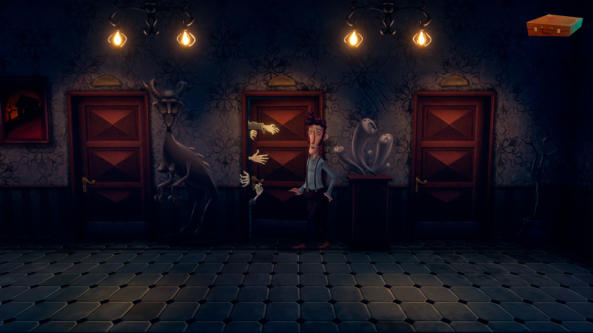
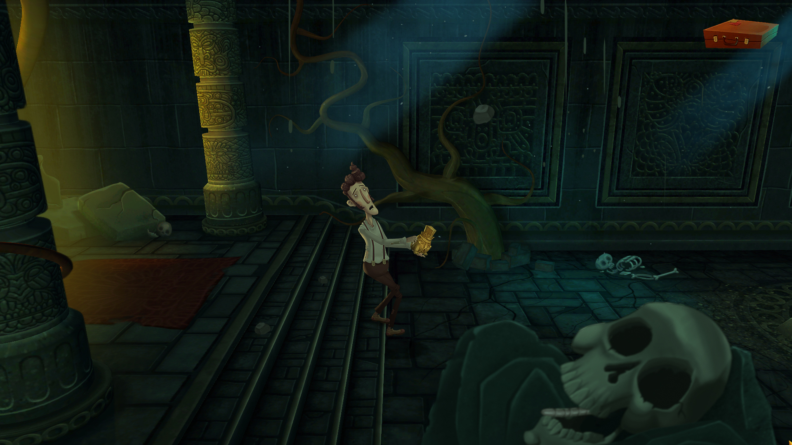

Am jucat **Slender Threads** mai mult într-o doară, mai mult ca pentru a mai atenua visul febril care a fost [Midnight Fight Express](https://store.steampowered.com/app/1390410/Midnight_Fight_Express/), în care orele interne ale jocului, cele puține în care se petrece acțiunea, s-au transformat și s-au dilatat în mai mult de o zi din viața reală.

În schimb s-a dovedit că nu a fost un simplu panaceu, un leac menit să domolească impresia puternică a jocului de dinainte. Nu a fost un fel de prag de trecere către ceva mai profund ori provocator, ci mi-a dovedit că el însuși era o treaptă. Recunosc că l-am ales pentru schimbarea de ton, pentru structura inerentă unui adventure, bine ordonată și plămădită, departe de haosul violent și furibund al lui Midnight Fight Express – lucru care, luat la puricat, poate părea o contradicție după ce l-am terminat.



Inițial am fost intrigat de trailer, cu direcția lui artistică ce părea să emuleze serialul animat [Courage the Cowardly Dog](https://www.youtube.com/watch?v=pyEKOY1TIbU) și tonul apăsător, de augur potrivnic al frânturilor de poveste care răzbăteau până dincoace de ecran. Așa că, doar pe baza acelei prime impresii, am intrat în el numai să fiu întâmpinat, chiar din momentele secunde, de când m-am trezit în camera dărăpănată a hotelului (probabil singurul) din Villa Ventana de o cu totul altă stare de spirit, anume de amuzament. Astfel am descoperit un prim anacronism, aș putea zice enorm, între ce lăsa să se înțeleagă că ar fi jocul din trailer și ceea ce era el cu adevărat. Intrat în rolul lui Harvey Green, librar-voiajor cu apucături de scriitor, îți cauți un rost și-n acest orășel uitat de lume, în căutarea unui contract de distribuție cât mai bănos pentru a te oploși cumva. Împins de întâlnirea oportună cu o bătrână doamnă în lobby-ul hotelului care vede în Harvey același spirit ca-ntr-unul din locuitorii orașului pe nume Oswaldo, simțind aceleași apucături literare într-o altă întrupare, ea te îndeamnă înspre locuința acestuia numai s-o găsești goală. Mai departe povestea îmbibată în mister se deschide ușurel și se ramifică împreună cu orașul până înspre o dilemă filosofică legată de liberul arbitru.

Nu voi intra în detalii privind povestea. Cred că merită cu deosebire să fie savurată fără ingerințele personale în experiența altora mai ales că și eu l-am jucat fără să fiu întinat de spoilere.

Ce pot să spun în schimb e că-n ciuda tonului sumbru al poveștii de ansamblu, fiecare interacțiune episodică și fiecare personaj întâlnit au o culoare deosebită, de un pestriț izbitor și contrastează prin ilaritate și neseriozitate negrul absurd în care te găsești, parcă luând în derâdere macabrul grav și tern. Cred că asta se datorează în egală măsură actorilor și scenariului, putând să discern în ele dedicare și dragoste pentru subiect, poate chiar și o fărâmă de pasiune. Că tot l-am legat mai sus de Courage, **Slender Threads** ar putea să existe sub același soare cu serialul și ar da îndoieli în privința originilor diferite dacă cineva le-ar pune unul lângă celălalt.

Dar, deși jocul se bazează pe poveste și pe interpretarea actoricească pentru a duce greul, în sine, e ceea ce aș numi un adventure adevărat: puzzle-urile sunt suficiente și în marea lor majoritate gândite cu cap, fără a face salturi ridicole de logică. Dacă ar fi să-i imput ceva aici ar fi că, deși nu ești niciodată în pericolul de a nu ști ce să faci (având la îndemână chiar și un jurnal care îndrumă și ajută pe măsura experienței fiecăruia, dar fără a oferi de-a dreptul rezolvarea), există problema lui cum să faci. Mi s-a întâmplat o singură dată și cred că a fost singurul moment în care am fost nevoit să orbecăi pe străzi, să intru prin case și instituții până mi s-au aprins în final și beculețele lui _cum_. Dar apoi, având în vedere știința acumulată în ora de perindat aiurea, lucrurile au curs aproape de la sine, de parcă aș fi fost binecuvântat cu daruri sibilice.



Dacă tot am adus în discuție lucruri de imputat ori de criticat, atunci Slender Threads are două probleme, una mai mică și una mai mare: lipsa unei coloane sonore evocative și finalul. Coloana sonoră e de un sublim extraordinar încât aș putea admite că lipsește cu desăvârșire. Cred că o singură dată am auzit sau am fost conștient de câteva note abia audibile, pierdute undeva în depărtare cât să-mi ofere suficientă bănuială în privința existenței muzicii în joc. Altfel, dacă ea chiar există ca parte consistentă, complet integrată a jocului, atunci e de o uitare remarcabilă.

Finalul e polarizant, un pic abrupt și fără o izbăvire clară. Parcă se oprește în chiar acel moment cheie care ar fi trebuit să ofere un fel de catharsis, dar ori nu dispune de resorturile necesare ori nu știe cum să se desăvârșească. Din păcate nu există acea împlinire a deznodământului, nu la modul explicit, și asta poate fi pentru mulți un motiv de frustrare. În schimb, dacă-l pătrunzi un pic, sfârșitul e construit exact pe fundațiile stabilite dinainte fără contradicții. dar pentru că procedează astfel, pentru că se încăpățânează și continuă într-o direcție rigidă, merge împotriva ideii de protagonist și pare că anulează omul în favoarea a ceva supra-uman, a ceva aflat dincolo de individ și de putința sa de a alege.

Mi-e drag Slender Threads și a fost o surpriză foarte plăcută, chiar neașteptată. Misterul lui mângâie plăcut curiozitatea. Îndeamnă și ademenește înspre a descoperi și a descoase. Nu se ia în serios în ciuda tematicii și, deși e ironic și zeflemitor adeseori, scrutat și scărmănat pe îndelete e un pic mai profund decât se arată. ■
