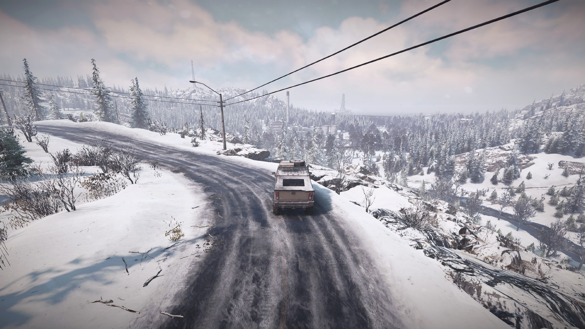

Am aflat de existența acestui simulator numit **SnowRunner** acum câțiva ani în timp ce căutam un joc bun cu mașini. Nu-mi mai amintesc dacă mi-a fost indicat într-un răspuns pe vreun forum ori arătat de algoritmul YouTube-ului, sau pur și simplu mi-a sărit în ochi numele din mormanul de sugestii oferite de Steam.

Cert e că titlul mi-a atras atenția îndeajuns încât să fac puțină muncă de cercetare în legătură cu el, ceea ce a dus la descoperirea unei serii de gameplay a unui [YouTuber român](https://www.youtube.com/watch?v=zbzPYjt21VY), iar vizionarea aventurilor lui a reprezentat un argument suficient de puternic cât să determine achiziționarea imediată a jocului pe Steam.



Dacă în privința includerii în librăria digitală am dat dovadă de reacție rapidă, când a fost vorba de jucat propriu-zis am făcut exact opusul – complet absorbit fiind de mașinile de curse și duelurile roată-la-roată de pe piste, l-am lăsat să zacă neatins vreme de vreo 4 ani, fără a-l da totuși uitării. Până de curând când, simțind nevoia unei schimbări de ritm, am decis să înlocuiesc luminile strălucitoare și adrenalina vitezei din Formula 1 cu mânecile muncitoresc suflecate și cadența sacadată a motoarelor camioanelor grele.

Și trebuie să mărturisesc că, nou fiind în domeniul simulatoarelor off-road, am descoperit SnowRunner cu un entuziasm de-a dreptul juvenil, senzație întărită și de primele contacte cu partea grafică, peisajele minunate întâlnite în călătorii inducându-mi de multe ori dorința de a lăsa la o parte îndeplinirea obiectivelor și a conduce fără o țintă anume, doar pentru a admira natura mirifică excelent realizată.



Personal am considerat întotdeauna gameplay-ul mai important decât grafica unui joc, însă având în vedere uriașul avans tehnologic al zilelor noastre față de sfârșitul anilor ’90 și începutul anilor 2000 (_golden age_-ul jocurilor pe PC din punctul de vedere al majorității gamerilor care au prins acele vremuri), o grafică foarte bună a devenit o condiție _sine qua non_ pentru ca un joc să fie încadrat în categoria celor cu adevărat memorabile.

Iar în cazul de față aceasta se situează la standarde înalte, cei de la studiourile Saber acordând o atenție deosebită celor mai mărunte detalii, atât vizuale cât și auditive. Acestea sunt ilustrate de tușe subtile dar de mare efect, precum sunetele naturii pe care le poți asculta ori de câte ori te afli în mijlocul ei cu motorul oprit, sau melodiile cu tentă country-rock care răzbat din radiourile benzinăriilor sau ale diverselor clădiri în fața cărora poposești, sau multe alte mici detalii, precum modul în care vibrează aerul din jurul camionului când claxonezi, sau scânteierea ochilor lupilor din tufișuri în bătaia farurilor pe timp de noapte; toate acestea îi dau un farmec aparte și te fac să îndrăgești SnowRunner-ul.

Dacă tot am pomenit de noapte, alternanța zi-noapte poate fi o provocare pentru noii jucători care n-ar trebui să se aventureze pe drumuri necunoscute după lăsarea întunericului, însă în aceeași măsură o bogată sursă de imagini remarcabile.



Trecând la chestiuni mai prozaice, aș începe partea de descriere a gameplay-ului menționând că tutorialul (incluzând și Codex-ul din meniul jocului) e destul de bine făcut și explică lucrurile de bază, ceea ce-i foarte important pentru orice începător în acest gen de simulatoare. Iar în caz că e nevoie de lămuriri suplimentare, din fericire există vasta bază de date a internetului.

În SnowRunner, urmașul mai evoluat din toate punctele de vedere al lui [MudRunner](https://store.steampowered.com/app/675010/MudRunner), îmbraci haina aspră a unui posesor de carnet de conducere categoria C pus pe multă treabă pentru a câștiga bani și experiența necesară avansării în nivel. Care treabă constă în principal în transportul diverselor materiale folosite pentru reconstrucția anumitor clădiri și mai ales a infrastructurii, plus niscaiva dezvoltare industrială și ceva misiuni de salvare a unor nefericite autovehicule rămase captive prin tot felul de mlaștini hulpave. Iar toate astea se petrec într-o multitudine de regiuni, fiecare dintre ele având între una și patru hărți, ceea ce oferă mii de ore de conținut, fără exagerare – în momentul în care scriu această cronică s-a anunțat deja apariția celui de-al 17-lea „sezon” (cum sunt numite DLC-urile pentru acest joc).



Există trei modalități de a juca: modul normal (_New Campaign_), _New Game+_ și _Hard Mode_. Plus un bonus sub formă de _Custom Scenarios_ care deschid ușa mod-urilor.

În modul normal, combustibilul e gratis și reparațiile la fel. Prin folosirea funcției Recover care îți „teleportează” camionul la garaj (doar camionul cu bena lui, fără încărcătură sau remorcă) realimentarea și repararea stricăciunilor se fac automat. Vânzarea autovehiculelor (cu tot cu upgrade-urile instalate, dar atenție! fără a oferi bani pentru cele neinstalate, așa că e recomandabil a se verifica toată secțiunea de upgrade-uri înainte de a vinde truck-ul respectiv) și a remorcilor se face la preț întreg, acest rulaj de finanțe oferind ocazia jucătorului posesor de DLC-uri de a încerca vasta gamă de mașini pusă la dispoziție în Truck Store. Poți da și timpul înainte astfel încât să nu joci noaptea... ce să mai, _life is good_. _Challenging, but good_.

În _New Game+_ ai posibilitatea de a-ți stabili singur regulile jocului. Poți customiza toate opțiunile: dacă vrei să începi fără finanțe sau cu o anumită sumă, dacă să fie gratis combustibilul și la pompă, sau poate vrei să fie gratis doar când alimentezi automat în urma „teleportării” la garaj, iar la pompă să coste dublu sau cvadruplu, dacă și cât să coste remorcile pe care le poți achiziționa din anumite puncte ale hărții (denumite Trailer Store) și cu cât le poți vinde, poți seta prețul de vânzare și cumpărare a camioanelor, poți face ca ziua să dureze de două ori mai mult ca noaptea pentru a putea profita cât mai mult de lumină, sau configura recompense mai bănoase pentru îndeplinirea misiunilor etc. etc., există o mare varietate de alegeri care se adresează în principal celor bine inițiați în tainele jocului și pentru care modul normal e deja prea ușor.

Iar în _Hard Mode_ totul e... ați ghicit, greu. Nu din alte motive, dar totul costă. Combustibilul costă, în unele regiuni chiar mai mult decât în altele. Reparațiile costă; dacă folosești _Recover_, costă (și încă cum, prețurile fiind de-un absurd absolut kafkian); dacă vrei să încarci marfa automat, costă; dacă intenționezi să te muți direct din garaj în garaj cu ajutorul combinației _Retain-Deploy_ (detalii mai jos) de pe o hartă pe alta sau dintr-o regiune în alta, costă. Nu poți vinde remorcile, iar pe autovehicule și upgrade-urile lor primești doar jumătate de preț. Accesul la cumpărarea jeep-urilor și camioanelor e restricționat în funcție de zona în care te afli, dacă ești în America nu poți achiziționa rusești și viceversa. Nu poți da timpul înainte, așa că ești obligat să joci și ziua și noaptea. Plus alte asemenea greutăți. Hard Mode îmi amintește de melodia aia cu _„unde soarele răsare doar dacă-l plătești”_.




Trecând la uneltele puse la dispoziție de către joc, în SnowRunner ai acces la o largă varietate de autovehicule care sunt împărțite pe categorii: Scouts (jeep-uri și camionete ușoare folosite în principal pentru explorarea hărților, dar necesare și la îndeplinirea anumitor misiuni), Highway (camioane destinate transportului de marfă prin civilizație, pe drumuri asfaltate), dar greul, atât la figurat dar mai ales la propriu, va fi așezat pe șasiurile robuste ale camioanelor Heavy Duty, Offroad și ale mastodonților Heavy.

În garaj la secțiunea Customize ai posibilitatea de a-ți îmbunătăți mașinile cu upgrade-uri pe care trebuie să le descoperi pe hartă sau care îți vor fi oferite la atingerea unui anumit nivel, iar în sub-secțiunea Frame Addons vezi ce fel de bene, cisterne, macarale sau monturi poate suporta fiecare camion în parte. Bineînțeles că poți schimba culoarea autovehiculului, poți pune abțibilduri exterioare și briz-briz-uri interioare, lumini și goarne pe plafon, bare de protecție față-spate, poți alege jante diferite și alte chestii asemănătoare.

Pe lângă jeep-urile și camioanele pe care le poți cumpăra, descoperi pe hartă sau primi în urma unor misiuni, când ajungi la câte un Trailer Store ai acces la o grămadă de remorci și semi-remorci pe care le poți folosi pentru însărcinări specifice, dar și pentru a-ți repara mașina sau a te realimenta cu combustibil.

Semiremorcile necesită să ai instalat pe camion un anumit tip de montură, iar unele dintre ele reprezintă doar partea din spate, completarea unui angrenaj a cărui parte din față trebuie instalată de la Frame Addons din garaj (cum ar fi de exemplu Futom-M Logging Trailer care poate fi achiziționată doar dacă ai montat deja Medium Logging Frame).



Cât despre misiuni, acestea sunt de trei feluri, Tasks, Contracts și Contests, toate oferind clasica răsplată în bani și experiență.

_Tasks_ sunt misiuni relativ mai ușoare care se desfășoară pe plan local, de pe urma cărora câștigurile sunt destul de modeste.

_Contracts_ reprezintă o adevărată serie de însărcinări, mai dificile, care trebuiesc îndeplinite uneori pe mai multe hărți ale aceleiași regiuni, dar odată duse la capăt nu numai că încasezi mai mulți marafeți și strângi mai multă experiență, dar și deblochezi alte contracte. Unele dintre ele necesită inițial o însemnată investiție financiară, cum sunt cele care au ca scop transportarea buștenilor, pentru care e necesară achiziționarea „uneltelor de lucru” (sub formă de cadre și remorci specifice) înainte de a purcede la treabă.

Iar _Contests_ sunt niște misiuni repetabile de oricâte ori vrei (asta dacă joci în modul normal; în Hard Mode sunt restricționate la 5 tentative), sunt contracronometru și condiționate de anumiți factori (cum ar fi că n-ai voie să dai Recover, să schimbi mașina și nici să încasezi damage peste o anumită limită, iar în unele ești restricționat la first-person view), iar recompensa e eșalonată în funcție de rapiditatea cu care le îndeplinești.



Important de menționat e că în călătoriile întreprinse de-a lungul și de-a latul hărților, spectrul pericolului planează permanent asupra jucătorului, iar varietatea terenului, de la câmpiile mlăștinoase și dealurile cu pante abrupte din Michigan sau Taymyr, până la înzăpezitele drumuri muntoase și râurile înghețate din Alaska sau Scandinavia, vă va pune la încercare abilitățile de a conduce și va forța limitele jeep-urilor și camioanelor. 

Atrag atenția aici și asupra uneia dintre capcanele întinse de creatorii jocului, și anume că aproape întotdeauna drumul cel mai scurt ca distanță e și cel mai primejdios pentru transportul unei încărcături grele, motiv pentru care cea mai indicată soluție e alegerea unei rute ocolitoare, un drum mai lung dar mai sigur. Jocul nu are un mini-map, dar absența acestuia e compensată în mare parte de un sistem GPS care permite utilizatorului să plaseze markeri pe hartă pentru a sluji drept puncte de reper pentru direcția ce trebuie urmată^[Iar dacă tot suntem la capitolul deplasare, aș preciza că prin folosirea combinației Retain (apoi trecut pe harta de destinație de la Global Map și continuat în celălalt garaj) cu Truck Storage și Deploy se poate muta orice autovehicul de pe o hartă pe alta și de la o zonă la alta. Remorcile însă pot fi mutate doar tradițional, prin punctele de acces dintre hărțile aceleiași regiuni în timp ce sunt atașate de un camion].

De asemenea, e absolut crucială studierea și alegerea cauciucurilor potrivite pentru zona care urmează a fi străbătută, dar chiar și dacă iei decizia corectă de foarte multe ori tot vei rămâne blocat în mocirlă, zăpadă sau într-o apă mai mult sau mai puțin curgătoare, așa că răbdarea e extrem de necesară în abordarea situației. Dar dincolo de răbdare ai nevoie și de ceva instrumente concrete pentru a ieși din impas, iar unealta de căpătâi e _winch_-ul. În prima parte a jocului, până îți vei upgrada mașinile, le vei echipa cu anvelopele corespunzătoare și vei descoperi sau achiziționa unele mai bune, impresia pregnantă va fi că joci de fapt un fel de _„WinchRunner”_, căci vei folosi acest troliu la greu (pun intended), putându-te ancora de stâlpii de telegraf sau copaci (cele mai bune variante), ori de tufișuri sau crengi căzute la pământ (riscând să le rupi dacă transporți greutate prea mare) și chiar de unele pietre. De orice, numai să te poți pune din nou în mișcare și să eviți coșmarul absolut al răsturnatului, sau, și mai grav, al pierderii încărcăturii. Însă uneori vei realiza că nu e indicat să te tractezi ca să ieși direct din mocirlă, ci numai ca să te poți repoziționa pentru o tractare separată care să te scoată din necaz.




Atenție și la copacii căzuți sau pietrele de pe drum, care ar părea inofensive la o primă vedere, dar poți încasa destul damage dacă treci cu viteză prea mare peste ele. La fel în privința trunchiurilor tăiate de copaci, care reprezintă adevărate capcane ascunse prin iarbă, iar coliziunea cu parapetul de metal de pe marginea drumului poate avea drept consecință un teribil dezastru, anvelope distruse (există și un nedorit achievement în acest sens, dacă reușești să conduci un kilometru cu pană la toate cauciucurile) și daune la motor sau suspensie.

Repararea daunelor mașinii în modul normal se face gratis și automat prin „teleportarea” la garaj, sau manual (dar consumând _repair points_ din dotare) prin atașarea camionului la un Service Trailer ori prin intermediul unui scout echipat cu un _toolkit_ corespunzător, însă în Hard Mode sunt disponibile doar ultimele două variante. Resetarea stricăciunilor produse mediului înconjurător se realizează activând o mașină de pe altă hartă și facând ceva acolo (fie doar și să ieși cu mașina din garaj și să intri înapoi) și, evident, la restartul jocului. E important de știut asta pentru că, dacă treci de mai multe ori pe același drum mocirlos, lași urme adânci (mai ales la propriu, dar și la figurat) și inevitabil ruta respectivă devine impracticabilă. Asta nemaivorbind de importanța semnelor rutiere ca puncte de reper, cele doborâte anterior vor fi repuse la locul lor.

În ceea ce privește modul multiplayer, existența lui e nu numai sursă de distracție cu prietenii, dar și o unealtă extrem de utilă când dai de vreun necaz în câte-o mlaștină sau dorești un progres mai rapid. Pe principiul „sună un prieten”, poți invita un amic sau mai mulți (pot fi maxim 4 jucători) pe harta ta să faceți misiunile împreună, iar treaba va merge mai repede și mai bine. Câștigurile de bani și experiență sunt aceleași pentru fiecare, deci e reciproc avantajos, doar că singurul lucru pe care nu-l pot face invitații tăi e să vândă remorcile de pe hartă (îmbogățindu-se astfel peste măsură), acestea aparținându-ți doar ție.



În altă ordine de idei, trebuie să dezvolt puțin unul dintre punctele forte ale jocului, și anume versatilitatea. Desigur, teoretic e un simulator off-road, dar poate fi tratat și ca un adventure game cu elemente de strategie în care tu, eroul, nu ești pe jos sau pe cal, ci ești în camion. Ba îi pot fi atribuite ușoare tente de racing (când trebuie să faci un Contest care-i întotdeauna contra-timp) sau chiar RPG-istice – cineva cu imaginația necesară poate decide de exemplu să facă misiunile din Statele Unite sau Canada doar cu autovehicule fabricate pe continentul nord-american, iar pe cele din Rusia doar cu camioane rusești, să dea drumul la girofaruri de fiecare dată când are încărcătură foarte mare etc.

Planificarea strategică are rol esențial în eficiența îndeplinirii misiunilor, mai ales a contractelor care se desfășoară pe mai multe hărți ale aceleiași regiuni, iar campania nu e neapărat liniară, ci dă senzația că se comportă ca un organism viu, dovadă fiind și evoluția flotei auto deținută pe parcursul jocului. Adaug la asta faptul că satisfacția muncii îndeplinite există, progresul făcut fiind vizibil pe hartă – poți folosi drumurile deblocate și podurile construite cu materialele aduse de tine, iar industria la a cărei punere în funcționare ai contribuit personal, începe să duduie.

Revenind la parcul auto din dotare, în prima parte a campaniei îți alegi un set de mașini, dar pe măsură ce avansezi în joc și deblochezi noi camioane și jeep-uri, alegerile se schimbă, pe unele le înlocuiești, pe altele le treci în rezervă fără a renunța totuși la ele, iar câtorva dintre cele vechi le atribui rolul de a rezolva numai un număr limitat de însărcinări, deoarece în SnowRunner întâlnești autovehicule ce sunt adecvate doar pentru perioada de start, iar apoi altele a căror adevărată putere se dezlănțuie mai târziu, odată cu accesul la toate upgrade-urile specifice.





{}
## Primii pași
Însă până a ajunge departe, la satisfacția muncii îndeplinite, trebuie început cu... exact, chiar cu începutul, conform faimosului proverb „Un drum de o mie de kilometri începe cu primul pas”, iar acest prim pas e reprezentat de alegerea strategiei optime de abordare a fiecărei hărți.

În primul rând, e necesară explorarea temeinică folosind un scout și având ca principală țintă vizitarea _Watchtower_-urilor, care, pe lângă faptul că dezvăluie porțiuni însemnate din hartă, mai oferă și ceva experiență (nu prea multă, dar în timp se adună), la fel ca experiența primită în cazul descoperirii remorcilor împrăștiate peste tot (câte unele conținând materialele necesare îndeplinirii unor misiuni), găsirea upgrade-urilor (unele dintre ele absolut cruciale în privința performanței anumitor mașini), și deblocarea cât mai multor misiuni.

În mod logic, primele misiuni care trebuiesc rezolvate sunt cele care au ca obiect înlăturarea obstacolelor care blochează drumurile precum și cele care vizează construcția podurilor, facilitând astfel circulația și înlesnind progresul ulterior în zonă. Apoi e necesară studierea cu atenție a obiectivelor celorlalte misiuni pentru a vedea exact ce presupune îndeplinirea lor (care sunt rutele ce trebuie urmate, unde se află materialele cerute etc.) și prioritizarea celor ce exclud traversarea unor potențiale zone periculoase cu băltoace prea mari, mult noroi sau mlaștini.

Fiind la începutul campaniei, accesul la cele mai bune tipuri de anvelope e restricționat, iar asta reprezintă atât o serioasă problemă cât și o mare provocare. Pentru că, precum ziceam mai sus, alegerea cauciucurilor e crucială și reprezintă un vast capitol separat, însă n-aș vrea să mă apuc să despic firu-n patru de teama de a nu mă lungi prea mult. Foarte pe scurt, n-ai nicio șansă să treci prin nămol (mai ales cu un camion încărcat) dacă ai anvelope dedicate pentru Highway și nu există suficienți copaci sau stâlpi de telegraf pe marginea drumului de care să te legi cu troliul, iar pentru a cumpăra măcar all-terrain sau off-road (nu mai vorbesc de specializatele _mudtires_) ești obligat să aștepți până pe la nivelul 6 sau 8 sau chiar 12 (pe scouts îi poți echipa mai devreme, dar nu poți căra nimic semnificativ cu ei), ceea ce-i extrem de neplăcut, pentru că există riscul de a te găsi prins într-un cerc vicios – fără cauciucuri bune nu poți face majoritatea misiunilor, fără misiuni făcute nu câștigi experiență, fără experiență nu crești în nivel, fără nivel nu poți să deblochezi cauciucuri bune.

Soluția pentru a evita acest cerc vicios e să completezi pe hărțile inițiale din Michigan, adică Black River și Smithville Dam, toate misiunile pe care le poți face pe traseele mai accesibile, fără blocare iremediabilă în mocirlă, iar apoi să iei o decizie strategică crucială, aceea de a lua viața în piept și a purcede cu un scout pe hărțile care n-au garaj (Drummond Island și Island Lake), plonjând în necunoscut și sperând ca descoperirea watchtower-urilor și îndeplinirea unor misiuni mărunte ce pot fi făcute și cu respectivul scout, plus găsirea unor camioane grele și punerea lor la treabă va fi îndeajuns pentru a avansa măcar la nivelul 6 (care-ți permite echiparea camioanelor cu cauciucuri all-terrain) sau chiar 7 (deblocând mudtires pentru scouts), ceea ce-ți va oferi mai multe opțiuni.

Apropo de hărțile care n-au garaj, acestea necesită în general o abordare mai specială. După obișnuita incursiune a unui scout a cărui sarcină e de a descoperi cât mai mult (mai ales sursele de combustibil și Trailer Store-urile din care pot fi achiziționate tot felul de remorci, atât pentru transport marfă dar și pentru reparații sau realimentare) pentru o mai mare eficiență acest gen de hartă nu trebuie atacată solitar, ci „în haită”.

Iar „comando-ul” care primește însărcinarea respectivă trebuie să fie compus în primul rând dintr-un scout, pentru îndeplinirea misiunilor dedicate. Apoi e nevoie de un camion care suportă combinația macara-benă-remorcă (cum e Fleetstar-ul, de exemplu), remorca pomenită fiind eventual găsită și atașată la fața locului dacă situația o cere și un altul echipat cu Saddle Low plus o macara (pe lângă faptul că anumite misiuni necesită un camion echipat cu o macara, e și foarte utilă în caz de accidente). Desigur, trebuie ținut cont de faptul că micuța macara „la purtător” nu poate face minuni în privința încărcăturilor foarte grele (însă acelea sunt cazuri destul de rare), dar la acest camion pot fi atașate semiremorcile de capacitate mai mare răspândite pe harta respectivă și care-s încărcate (sau nu) cu materiale. Și eventual, dacă drumul între sursele de combustibil de pe diversele hărți durează prea mult, un al patrulea membru ar fi un camion dotat cu o cisternă, practic o cisternă mobilă care va deservi orice autovehicul aflat în nevoie. De altfel, tactica folosirii unei cisterne mobile (eventual plasată ulterior în puncte strategice) poate fi utilizată oricând, pe orice hartă. La fel de utilă e și aducerea la drumurile principale care sunt frecvent folosite a cisternelor pline de carburant și a Service Trailer-urilor împrăștiate prin te miri ce cotloane ale unei hărți.

În acest punct trebuie menționată o altă restricție a jocului, și anume că nu poți atașa mai mult de o remorcă la camion (și nimic la o remorcă), dar totuși există posibilitatea de a folosi troliul pentru a tracta diverse, gen o altă remorcă, un alt camion sau, forțând la maximum limitele, chiar un alt camion de care-i atașată o altă remorcă.
Trebuie precizat că dacă tractezi ceva cu troliul nu-l mai poți folosi ca să te scoți din belea decât dacă dai drumul la ce târăști după tine.

Însă giumbușlucuri de-astea poți face doar când traseul îți permite. În general în SnowRunner n-ai parte de șosele lungi și drepte, ci mai degrabă de drumuri noroioase și întortocheate pe teren denivelat, iar când mergi prin păduri există în permanență riscul ca un element al convoiului să se agațe de vreo creangă sau să se împiedice de vreun ciot și să ramână blocat acolo sau, mai grav, să se răstoarne cumva și să pierzi toată încărcătura.

{}





Am lăudat pe bună dreptate părțile pozitive, însă categoric trebuie să menționez și părțile mai puțin bune ale jocului, care sunt destule. Un mare minus al SnowRunner-ului îl reprezintă faptul că nu ai informații clare despre tipul materialelor încărcate în remorci sau benele camioanelor (cu excepția momentului în care încarci, automat sau manual). Tot ce vezi sunt iconițe cu simboluri a căror listă explicativă se găsește mai degrabă în afara jocului, așa că până le înveți pe dinafară te vezi nevoit să apelezi la ajutorul internetului pentru a-ți da seama care-i care, cum se numesc și cât loc ocupă. Creatorii acestui simulator, ruși fiind, au tras spuza pe turta lor ex-sovietică și și-au cam bătut joc de camioanele americane, acestea comportându-se de-a dreptul jalnic când sunt supuse unor sarcini mai serioase date de misiunile care trebuie îndeplinite – în timp ce circulă pe un teren cu o înclinație laterală mai mare de vreo 15 de grade se răstoarnă mult prea ușor, ceea ce mi se pare absolut inacceptabil pentru un off-road sim, iar ca să pună capac la toate, mai pierd și încărcătura, ceea ce reprezintă nu numai păcatul capital în jocul ăsta dar și sfârșitul aventurii.

Hard Mode e mai degrabă un „Annoying Mode”, frustrant și enervant, decât să fie cu adevărat hard, principala bătaie de cap fiind administrarea finanțelor. Simt nevoia să evidențiez negativ din nou costul funcției Recover (cea care îți „teleportează” mașina la garaj și care în Normal Mode e gratis), catalogându-l ca fiind de-a dreptul absurd, existând o discrepanță deranjantă față de câștigurile bănești care sunt extrem de mici. De fapt, principala sursă de venit în acest joc o reprezintă vânzarea de autovehicule și remorci. Iar cum în Hard Mode iei doar jumătate de preț pe mașini, iar pe remorci absolut nimic, ești obligat să te descurci cu mărunțișul pe care-l încasezi în urma misiunilor îndeplinite. Iar respectivii firfirei nu sunt de ajuns să-ți upgradezi cum se cuvine întreaga flotă, cu greu strânsă de pe toate coclaurile (că dacă n-ai bani, adio cumpărare după pofta inimii din Truck Store, te cam limitezi la ce găsești pe hartă).



Din fericire, există New Game+ în care ai posibilitatea de a-ți stabili singur regulile jocului, a customiza toate opțiunile și a alege ce setări vrei să păstrezi de la Hard Mode și ce să schimbi pentru a avea parte de o provocare pe măsura gusturilor fiecăruia. Asta-i vestea bună. Aia proastă e că nu poți reduce semnificativ costul Recover-ului: variantele intermediare lipsesc, așa că ori pui zero ca-n normal mode, ori treci înapoi la Kafka și fiorii falimentului.

Cei de la Saber s-au străduit să respecte legile mecanicii și ale fizicii, însă n-au reușit întotdeauna, un exemplu fiind Diff Lock-ul care, la vehiculele la care trebuie activat manual, îți poate provoca damage la cutia de viteze dacă circuli pe suprafețe tari. Ce ar putea avea vreodată de-a face diferențialul închis cu daune încasate de cutia de viteze, absolut nimeni din întreaga lume largă nu poate spune, rămâne una dintre enigmele nedescifrate ale jocurilor pe computer.

Și apropo de damage, uneori îl încasezi chiar aiurea, fără să treci cu viteză prea mare peste pietrele sau crengile ce zac pe drum, ceea ce categoric că-i în egală măsură atât absurd cât și frustrant. Iar în anumite zone există unele obstacole „invizibile” în mijlocul drumului, în timp ce circuli liniștit te lovești subit de ceva, primești damage, dar nu vezi absolut nimic care ar fi putut cauza acele daune.

Iar încărcarea manuală a buștenilor reprezintă o activitate care l-ar face și pe cel mai masochist jucător să se lase mai degrabă păgubaș decât să aibă de-a face cu macaraua aia total neîndemânatică, așa că modul automat rămâne întotdeauna de preferat, chiar dacă-n Hard Mode nu-i gratis.

{}
## Upgrades
Câteva cuvinte și despre upgrade-uri. Aici m-aș referi prima dată la cutia de viteze, care reprezintă o componentă esențială nu numai a autovehiculului, dar și a succesului respectivei mașinării; foarte pe scurt vreau să menționez care ar fi opțiunile optime pentru cele mai folosite tipuri de camioane din joc.

Având în vedere că drumurile de pe hărțile care vor fi parcurse de-a lungul campaniilor sunt mai degrabă mocirloase decât asfaltate, alegerea cutiei de viteze va trebui să țină seama de asta. Pentru Scouts e necesară o cutie off-road, respectiv SnowRunner dacă prima variantă lipsește (e practic același lucru, dar cu denumiri diferite), pentru camioanele Heavy Duty și OffRoad tot off-road, iar pentru Heavy, _advanced special_.

În general, pe parcursul aventurilor din joc schimbătorul de viteze va sta în poziția automat, dar vor fi momente în care nevoia de a economisi combustibilul va fi pregnantă (mai ales în Hard Mode) sau pur și simplu e necesară o viteză constantă, iar atunci va fi folosită poziția High Gear. Cât despre Low Gear+ sau Low Gear– (disponibile la cutiile de viteze offroad), se va apela alternând cu Low Gear-ul standard în funcție de necesități când terenul e prea accidentat sau pentru a urca anumite drumuri în pantă ori a preîntâmpina riscul înnămolirii. Tehnic vorbind, blocarea în mocirlă apare din cauza vitezei prea mari la trecerea prin noroi, zăpadă sau mlaștină, fapt ce duce la învârtirea prea rapidă a roților, care pierd astfel aderența, ajungând până la urmă să se rotească în gol. Recăpătarea aderenței, în cazurile în care acest lucru mai e posibil, se face prin reducerea vitezei de rotație, adică prin apelarea la Low Gear-urile mai-sus pomenite. Menționez în treacăt și faptul că la majoritatea autovehiculelor diferențialul închis (_Diff. Lock_) e interșanjabil și poate fi activat doar când mașina e în Low Gear. Un diferențial închis forțează toate roțile care au tracțiune să se învârtă la unison, cu exact aceeași viteză de rotație, ajutând astfel la redobândirea aderenței. Cu alte cuvinte, o combinație de succes prin mlaștini și zăpezi e Low Gear cu Diff. Lock.

Un upgrade absolut vital pentru scouts e faimosul Autonomous Scout winch, care, în ciuda faptului că nu-i deloc ieftin, trebuie instalat de îndată ce se deblochează accesul la el, acesta reprezentând atât un _„game-changer”_ cât și un _„life saver”_. Ce face troliul respectiv? Păi în momentul în care te răstorni, motorul are prostul obicei de a se cala, iar dacă ai instalat un troliu obișnuit, mașina îți rămâne acolo, ca o broască moartă pe marginea drumului. Singurele opțiuni de remediere a situației fiind ori să dai Recover (care costă exagerat de mult în Hard Mode), ori să trimiți o altă mașină s-o repună pe picio... ahem, roți, numai că dacă ești într-o zonă foarte dificilă, să nu te mire faptul că salvatorul va eșua lamentabil și vei fi nevoit să faci operațiune de salvare la operațiunea de salvare. „Pățăști”, în jocul ăsta chiar pățăști, mai ales în Hard Mode.

Dar dacă ai Autonomous Scout, poți folosi troliul indiferent de faptul că motorul mai funcționează sau ba, astfel că de cele mai multe ori e doar o chestiune de timp și tehnică până revii în poziția normală și-ți poți vedea în continuare de trebușoara ta. Autonomous Scout e echivalentul lui _„Keep calm and carry on”_, însă această minune mecanică e disponibilă doar pentru scouts (și pentru un singur camion, care reprezintă excepția ce întărește regula).

Doar două vorbe să zic și despre suspensie. O importanță majoră o are și decoperirea pe hartă a upgrade-urilor care ridică suspensia diverselor autovehicule, o suspensie ridicată permițând utilizarea unor anvelope cu diametrul mai mare decât cele obișnuite, ceea ce ajută foarte mult la traversarea zonelor mocirloase. Numai că în SnowRunner e ca-n viață, în orice lucru bun e și un lucru rău (și invers), o suspensie ridicată afectează negativ stabilitatea mașinii, făcând-o mai predispusă la a se răsturna când ți-e lumea mai dragă, așa că... aveți grijă.
{}



Desigur că nici bug-urile nu puteau să lipsească dintr-un asemenea joc. Câteodată jocul o ia razna și nu recunoaște faptul că ai în benă sau în remorcă materialele necesare îndeplinirii unei misiuni, iar cea mai bună rezolvare e să ieși din dreptunghiul în care trebuie să le predai, să dai Unpack la Cargo, apoi Pack și să revii în spațiul respectiv, iar atunci jocul le va recunoaște. La fel de razna o ia uneori și harta, rotindu-se amețitor în timp ce încerci să plasezi acei markeri de GPS, e un bug cunoscut (și raportat pe canalele oficiale) de ceva vreme, dar se pare că lipsește orice preocupare din partea creatorilor jocului de a găsi un remediu pentru această problemă agasantă. Altă neplăcere e cauzată de faptul că trebuie câteodată să repeți o comandă pentru ca jocul să reacționeze și să binevoiască să urmeze ordinele date, există situații în care apeși pe butoane și nu se întâmplă absolut nimic.

Mai sunt și inadvertențele grafice, cum ar fi, de exemplu, frunzele moarte pe lângă care treci fără să le atingi, dar care încep totuși să-ți țâșnească de sub roțile din spate într-o cantitate însemnată, ca o jerbă de pene sau confetti care îți ies din partea dorsală, sau noroiul aruncat lateral de roți la traversarea unei băltoace mai mari ce seamănă mai degrabă cu pete de cerneală cenușie în 2D, stricând senzația de realism prezentă până atunci în joc; anumite indicatoare sau garduri sar în aer de parc-ar fi dinamitate când treci liniștit pe drum la 5 metri distanță, fără a avea vreo treabă cu ele; plus alte bizarerii pe care nu le voi mai menționa aci.

Dar una peste alta, SnowRunner e un joc bun, captivant, provocator și imersiv, pe care dacă-l joci în anotimpul rece și ai un geam deschis prin casă să pătrundă niște aer curat, ai senzația că ești exact acolo, în mijlocul naturii. E o adevărată încântare să conduci prin păduri, iar datorită acestui fapt poți trece cu vederea părțile mai puțin plăcute ale jocului. E limpede că cei de la Saber chiar s-au străduit să ofere un produs de calitate atât în privința graficii cât și a gameplay-ului, și în cea mai mare măsură chiar au reușit. ■

