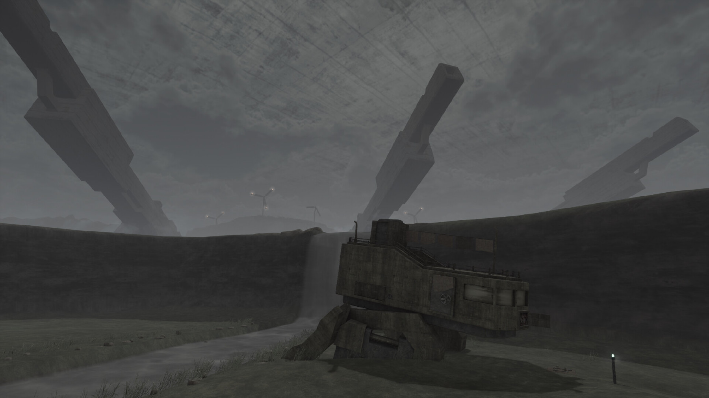

Țin minte cum prin 2004 unul din colegii mei de clasă îmi povestea în pauze de un FPS numit „Chaser”. Din poveștile lui, amestecate cu ce alte shootere jucam pe atunci (probabil _Red Faction 1_) și câteva screenshot-uri din [LEVEL](https://arhiva.candaparerevista.ro/arhiva/articole.php?editie-id=72&articol=2742), Chaser a reușit să îmi genereze o serie de asocieri și un _vaib_ pe care și azi le păstrez în cap, deși, cu nerușinare, recunosc că (încă) nu l-am jucat.

Cam așa e cu mai toate shooterele din perioada 2000–2010: jucând unul, ai impresia că te afunzi într-un întreg ecosistem estetic, nu doar într-un joc izolat. Amestecuri de păduri tropicale și science-fiction, coridoare de post-apocalipsă corporatistă, structuri pierdute în ceața specifică limitărilor 3D, orizonturi brutaliste și skybox-uri ba senine, ba apăsătoare – toate compun în imaginar lumi suspendate într-o formă de timp intermediar, mereu fertil, aflat undeva la granița dintre prototip și produs final.

Pe cât de formulaice, primele generații de shootere 3D au introdus pe piață o varietate enormă de stiluri și texturi, sunete, atmosfere și mecanici. Astfel, aproape fiecare FPS din eră — chiar și unul mediocru după standardele de azi, sau între timp ajuns _vapourware_ — poate ajunge mai târziu un părinte al unui sub-gen.



**Metal Garden** este un FPS retro lansat în 2025, vizibil influențat de estetica brutalistă și mega-structure parkour-ul unor jocuri recente precum [BABBDI](https://store.steampowered.com/app/2240530/BABBDI/) sau [Lorns' Lure](https://store.steampowered.com/app/1417930/Lorns_Lure/). Cu toate acestea, jocul este explicit tributar modalităților de construcție a shooterelor din era 2000, amestecând grafica low-poly cu animații greoaie și mici elemente de tip _immersive sim_. Dincolo de asta, jocul își asumă o estetică a „jocului neterminat”, stil ce reflectă azi atât posibilitățile limitate ale unui dezvoltator solo, cât și amintirea constrângerilor tehnice ale shooterelor din anii 2000, unde estetica se ivea adesea chiar din imperfecțiuni.

Metal Garden se petrece în interiorul unei mega-structuri ce închide lumea într-un container impenetrabil de beton de dimensiuni cosmice. În interiorul acestui terariu de tip „Truman Show brutalist”, numeroase facțiuni își dispută supremația în războaie corporatiste, jocul livrând majoritatea poveștii sale prin jurnale găsite de jucător sau mici narațiuni ambientale. Fiind un joc de mici dimensiuni (așteptați-vă să îl terminați în 1,5–2 ore), nu am să zic mai multe.



În mod normal, nu sunt fanul jocurilor așa scurte. Cu toate acestea, Metal Garden a reușit să mă atragă prin estetica și atmosfera pe care o creează. Dupa ce ți se strică mech-ul, îți lași țigara și o iei pe jos, jocul imediat te înghite senzorial: sunete de ploaie măruntă și tunete, ecouri distante și structuri misterioase în zare. Sub cerul de beton, la înălțimi simultan joase și mitologic de înalte, furtuni imense murmură, iar întinderi mari de apă brazdează dealuri înverzite, rupte de ziduri și clădiri neexplicate. Construind moment cu moment, atmosfera jocului te cuprinde, iar jocul îți deschide imaginația prin detalii intenționat puține, lăsându-și lumea să vorbească prin geografie, ruine și sunet.

Combatul este simplu și clar secundar experienței de navigare a lumii, dezvoltatorul presărând ici-colo și câteva puzzle-uri plăcute. Armele se simt bine, iar animațiile sunt destul de izbutite, reușind ca într-un joc atât de scurt să ofere fiecărui moment sau acțiune o inerție și greutate. Paleta de culori și lumea în abandon tehnologic aduc aminte de seria Armored Core a celor de la From Software, iar estetica retro-junk-futuristă a armelor și peisajul unei lumi exploatate până la colaps ne duc cu gândul la jocuri precum [Kenshi](https://store.steampowered.com/app/233860/Kenshi/) sau [E.Y.E: Divine Cybermancy](https://store.steampowered.com/app/91700/EYE_Divine_Cybermancy/) (cel din urmă fiind o influență sigură, fiind făcute câteva referințe de tip _easter egg_).

Vă recomand să parcurgeți Metal Garden ca pe o plimbare în parc: încet, cu pauze de șezut și privit, ascultat, lăsând mintea să contempleze. Luat așa, jocul nu pare ca se termină odată cu ultima zonă, cât rămâne ca o stare ce se lasă greu pusă în cuvinte. Metal Garden e mai puțin un joc și mai mult o amintire posibilă. ■
